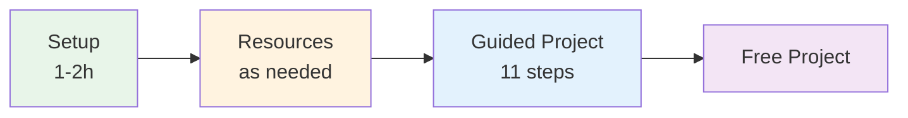

# Integration-LLM

A hands-on course on integrating Large Language Models (LLMs) with no-code tools.

---

## What You Will Build

By the end of this course, you will have built a **complete LLM Comparator** — a system that sends the same prompt to multiple AI models simultaneously, stores all responses in a database, and generates a structured report.

**Skills you will develop:**
- Setting up Docker environments (n8n, PostgreSQL, Ollama)
- Integrating local and cloud LLMs (Ollama, Gemini, Mistral, OpenAI)
- Designing REST APIs with webhooks
- Working with relational databases and SQL
- Advanced Prompt Engineering (RAG, Meta-LLM)
- Securing AI applications against prompt injection

---

## Quick Start

```bash
# 1. Clone the repository
git clone <repo-url>
cd integration-LLM

# 2. Set up environment variables
cp installation/.env.example installation/.env
# Edit .env with your own secure passwords

# 3. Start all services
cd installation && docker compose up -d
```

**Next steps:**
1. [Verify your installation](installation/VERIFICATION.md)
2. [Create your first workflow](installation/premier_workflow.md)
3. [Start the guided project](projet/README.md)

---

## Project Structure

```
integration-LLM/
├── installation/     # Docker setup: n8n, PostgreSQL, pgAdmin, Ollama
├── ressources/       # 9 theory modules + glossary
└── projet/           # 11 guided steps (0 → 10)
```

| Folder | Description | Estimated Time |
|--------|-------------|----------------|
| [installation/](installation/README.md) | Full installation guides | 1–2h |
| [ressources/](ressources/README.md) | Theory modules (Docker, SQL, API…) | 5–15h depending on level |
| [projet/](projet/README.md) | Guided project — LLM Comparator | 20–25h |

---

## Learning Path



**Details:**
- Full project roadmap: [projet/README.md](projet/README.md)
- All theory modules: [ressources/README.md](ressources/README.md)

---

## Project Steps at a Glance

| # | Step | Difficulty | Time | Key Concepts |
|---|------|------------|------|--------------|
| 0 | [Chat](projet/0.%20chat/) | Beginner | 1h | Basic workflow, local LLM, Ollama |
| 1 | [Chat Diversity](projet/1.%20chat%20diversity/) | Beginner | 2h | Multi-provider, API keys |
| 2 | [Split Workflow](projet/2.%20split%20workflow/) | Intermediate | 2h | Modularization, sub-workflows |
| 3 | [Distribute Workflow](projet/3.%20distribute%20workflow/) | Intermediate | 3h | Webhooks, HTTP, distributed architecture |
| 4 | [Forms](projet/4.%20forms/) | Beginner | 1h | User input, validation |
| 5 | [Store to DB](projet/5.%20store%20to%20db/) | Intermediate | 2h | PostgreSQL, INSERT, persistence |
| 6 | [Load from DB](projet/6.%20load%20from%20db/) | Intermediate | 2h | SELECT, history, queries |
| 7 | [Enhance Prompt](projet/7.%20enhance%20prompt/) | Advanced | 3h | RAG, embeddings, context enrichment |
| 8 | [Export to File](projet/8.%20export%20to%20file/) | Beginner | 1h | Markdown/PDF report generation |
| 9 | [Secure Prompt](projet/9.%20secure%20prompt/) | Advanced | 3h | Prompt injection prevention, guards |
| 10 | [Bonus](projet/10.%20bonus/) | Variable | Variable | Advanced features of your choice |

**Total: ~22 hours** (excluding bonus)

---

## Documentation

| Document | Description |
|----------|-------------|
| [ressources/GLOSSARY.md](ressources/GLOSSARY.md) | 65+ technical terms defined |
| [installation/ARCHITECTURE.md](installation/ARCHITECTURE.md) | Infrastructure diagrams |
| [GUIDE_MERMAID.md](GUIDE_MERMAID.md) | How to read and edit diagrams |

---

## Need Help?

| Problem | Resource |
|---------|----------|
| Installation issues | [installation/VERIFICATION.md](installation/VERIFICATION.md) |
| Unknown vocabulary | [ressources/GLOSSARY.md](ressources/GLOSSARY.md) |
| GPU / Ollama setup | [installation/ollama_gpu.md](installation/ollama_gpu.md) |
| Step-specific errors | Troubleshooting section in each step's README |

**Community:**
- [n8n Community Forum](https://community.n8n.io/)
- [n8n Discord](https://discord.gg/n8n)
- [n8n Documentation](https://docs.n8n.io/)

---

## License

Educational project. Contributions welcome.
