# Architecture du Projet - Intégration LLM avec n8n

Ce document présente l'architecture complète du système et les différents composants utilisés dans ce cours.

> 💡 **Note** : Les diagrammes sont au format Mermaid. Ils s'affichent automatiquement sur GitHub, GitLab, et dans la plupart des éditeurs Markdown modernes (VS Code, Obsidian, etc.).

---

## 🏗️ Vue d'ensemble de l'architecture

### Schéma global des services Docker

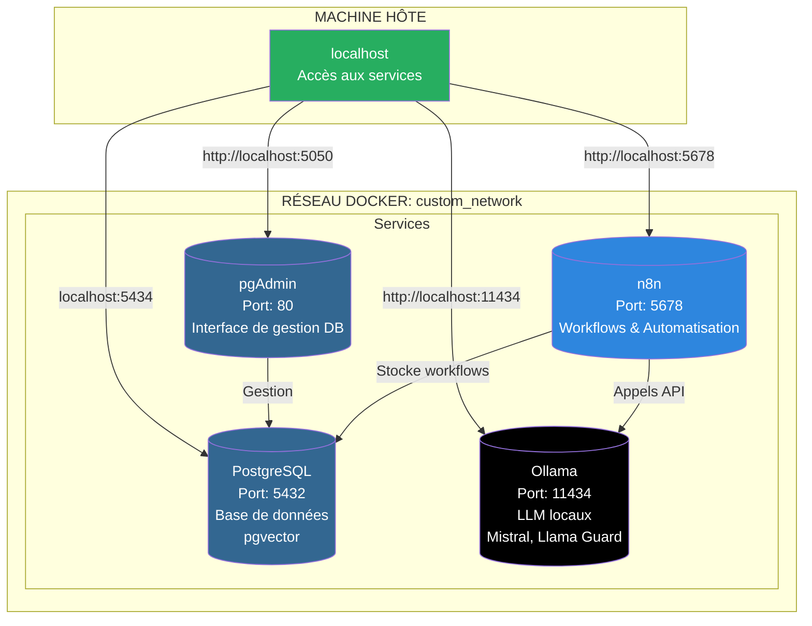

### Mapping des ports

| Service    | Port Interne | Port Externe | URL d'accès             | Description                    |
|------------|--------------|--------------|-------------------------|--------------------------------|
| n8n        | 5678         | 5678         | http://localhost:5678   | Interface web n8n              |
| PostgreSQL | 5432         | 5434         | localhost:5434          | Connexion DB (port non-standard)|
| pgAdmin    | 80           | 5050         | http://localhost:5050   | Interface de gestion DB        |
| Ollama     | 11434        | 11434        | http://localhost:11434  | API LLM locaux                 |

> ⚠️ **Note** : PostgreSQL est mappé sur le port 5434 (au lieu de 5432) pour éviter les conflits avec une installation locale de PostgreSQL.

---

## 🔄 Architecture des Workflows - Progression du Projet

### Étape 0-1 : Chat Simple et Diversity

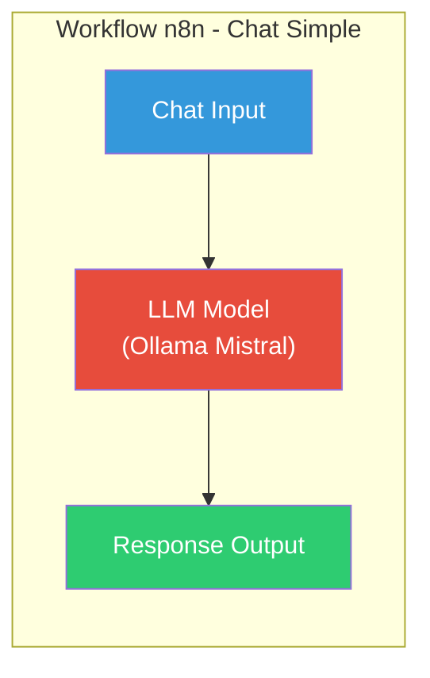

**Étape 1 - Diversity : Tester plusieurs LLM**

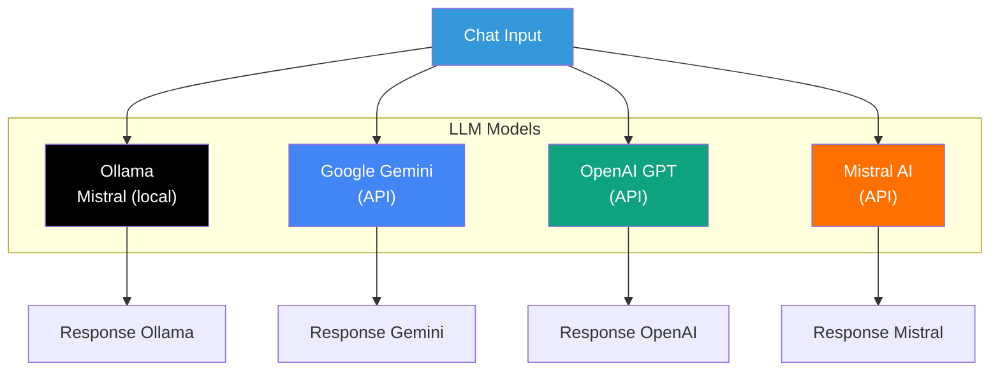

---

### Étape 2-3 : Split & Distribute Workflows

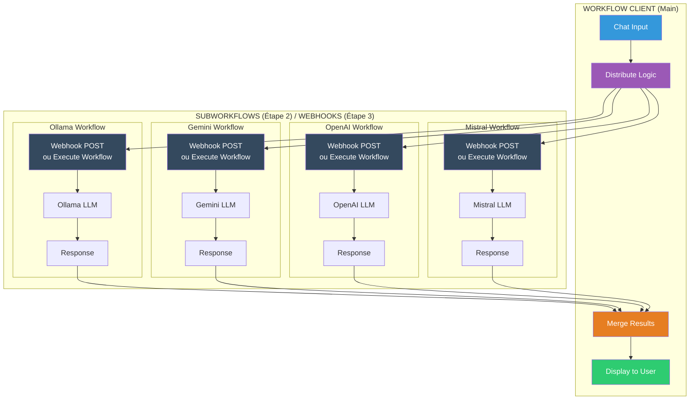

**Différence Étape 2 vs Étape 3:**
- **Étape 2** : Utilise `Execute Workflow` (subworkflows internes)
- **Étape 3** : Utilise `Webhook POST` (workflows distribués, accessibles via HTTP)

---

### Étape 4 : Forms - Interface Utilisateur

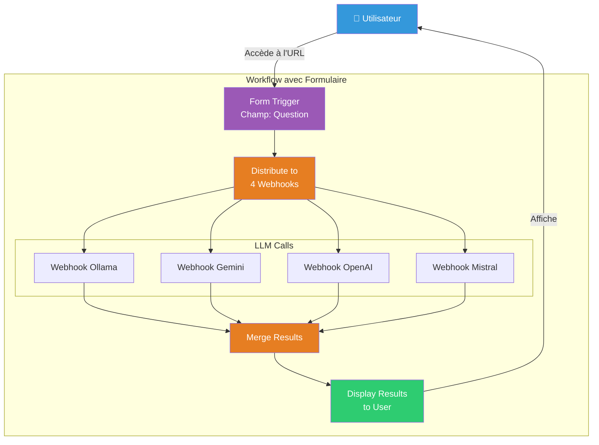

---

### Étape 5-6 : Store & Load from Database

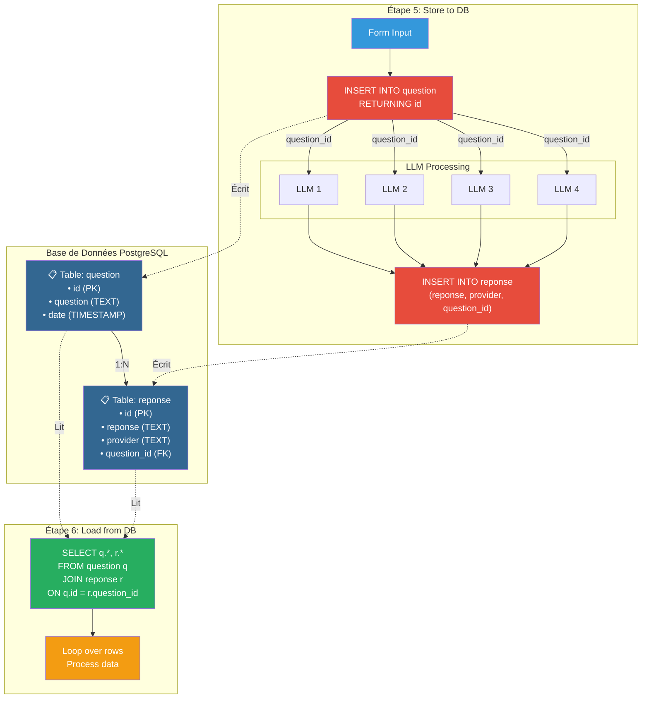

**Structure de la base de données:**

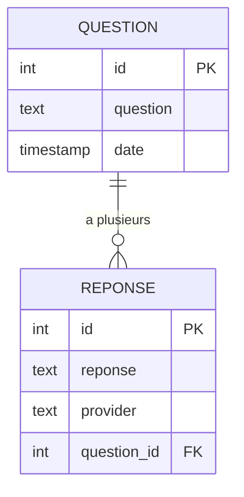

---

### Étape 7 : Enhance Prompt (RAG Simplifié)

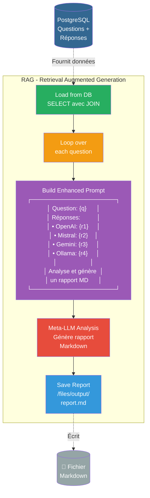

**Concept RAG expliqué:**

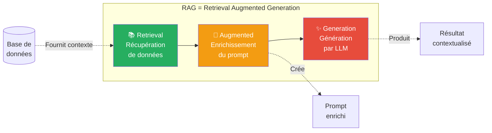

---

### Étape 9 : Secure Prompt - Protection contre les injections

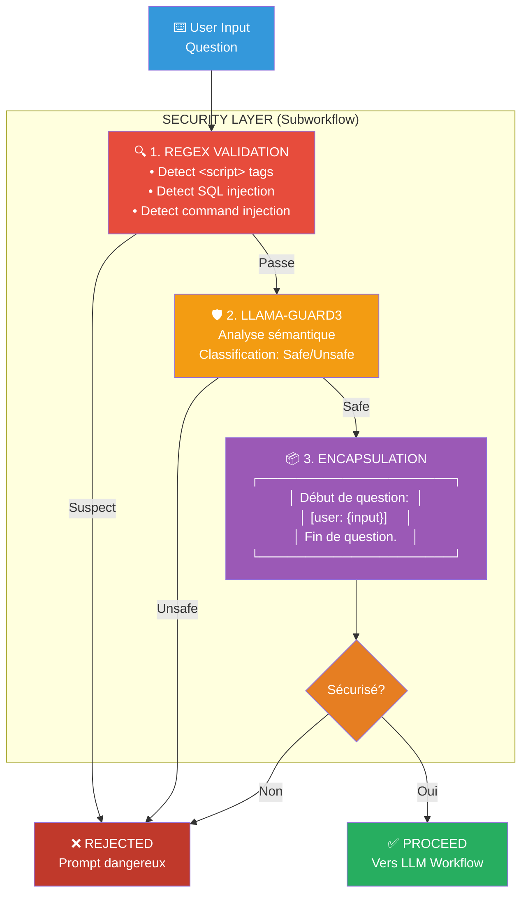

**Types d'attaques détectées:**

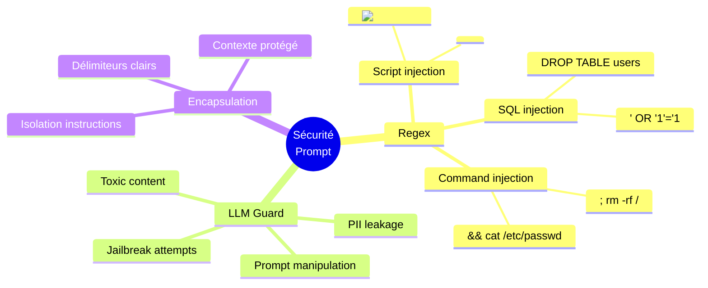

---

## 📊 Flux de données complet (Toutes étapes)

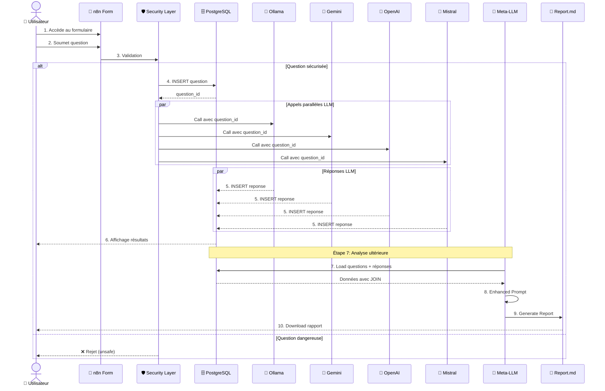

---

## 🔐 Sécurité et Architecture Réseau

### Isolation des services Docker

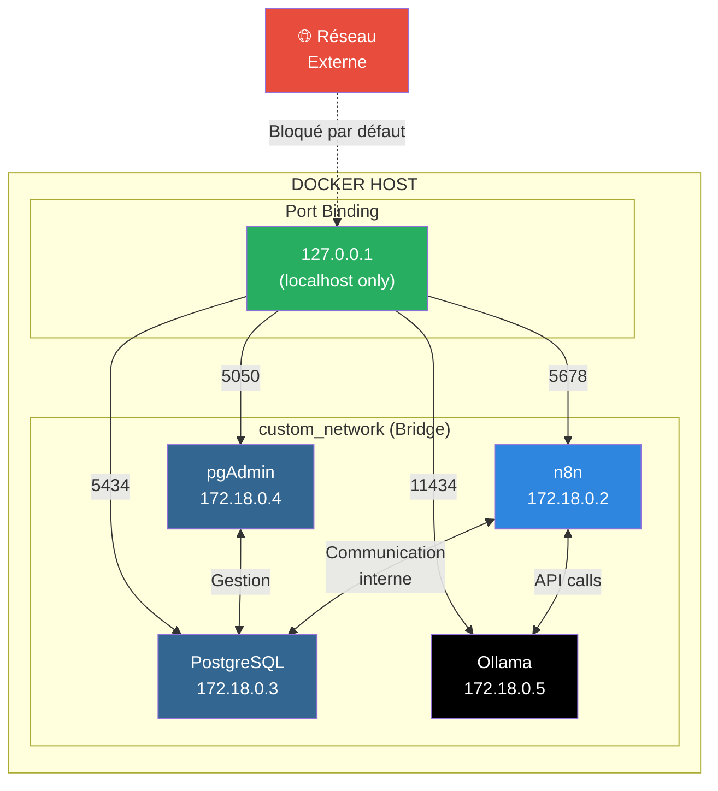

### Couches de sécurité

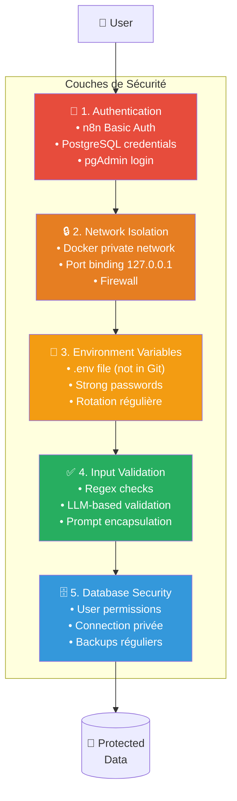

---

## 📦 Volumes Docker - Persistance des données

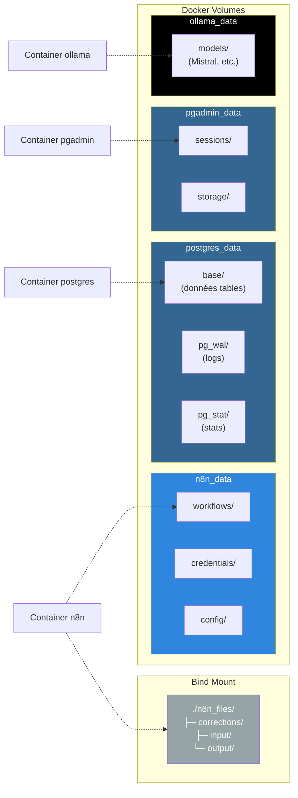

---

## 🚀 Évolution de l'Architecture

### Vue chronologique de la progression

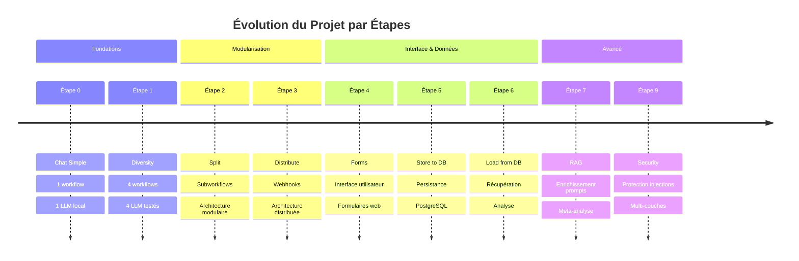

### Comparaison Architecture Simple vs Complète

```mermaid
graph TB
    subgraph "Architecture Initiale (Étape 0)"
        S1["User Input"] --> S2["LLM"] --> S3["Output"]
    end
    
    subgraph "Architecture Complète (Étape 9)"
        C1["User"] --> C2["Form"]
        C2 --> C3["Security"]
        C3 --> C4["Database"]
        C4 --> C5["4x Webhooks"]
        C5 --> C6["4x LLM"]
        C6 --> C7["Store Results"]
        C7 --> C8["RAG Analysis"]
        C8 --> C9["Report"]
        C9 --> C1
    end
    
    style S1 fill:#3498DB,color:#fff
    style S2 fill:#E74C3C,color:#fff
    style S3 fill:#2ECC71,color:#fff
    
    style C1 fill:#3498DB,color:#fff
    style C3 fill:#E74C3C,color:#fff
    style C4 fill:#336791,color:#fff
    style C5 fill:#9B59B6,color:#fff
    style C6 fill:#E67E22,color:#fff
    style C8 fill:#F39C12,color:#fff
    style C9 fill:#2ECC71,color:#fff
```

---

## 🎯 Architecture de Déploiement

### Développement Local (Actuel)

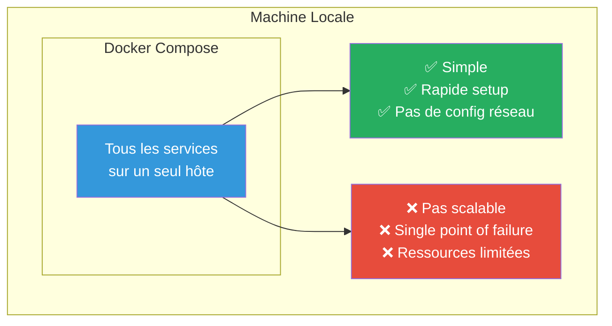

### Production (Optionnel - Hors scope)

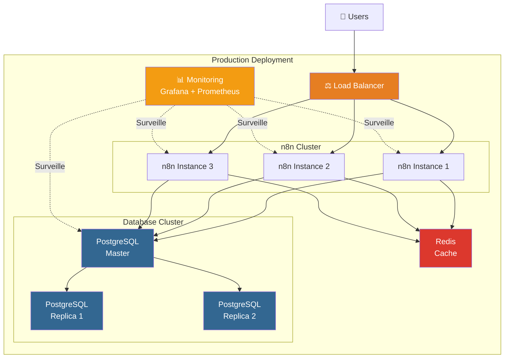

---

## 📚 Résumé par Étape

```mermaid
graph LR
    E0["📝 Étape 0<br/>Chat Simple"] --> E1["🔀 Étape 1<br/>Diversity"]
    E1 --> E2["✂️ Étape 2<br/>Split"]
    E2 --> E3["🌐 Étape 3<br/>Distribute"]
    E3 --> E4["📋 Étape 4<br/>Forms"]
    E4 --> E5["💾 Étape 5<br/>Store DB"]
    E5 --> E6["📤 Étape 6<br/>Load DB"]
    E6 --> E7["🧠 Étape 7<br/>RAG"]
    E7 --> E8["📄 Étape 8<br/>Export"]
    E8 --> E9["🔐 Étape 9<br/>Security"]
    E9 --> E10["🎁 Étape 10<br/>Bonus"]
    
    style E0 fill:#3498DB,color:#fff
    style E1 fill:#9B59B6,color:#fff
    style E2 fill:#E67E22,color:#fff
    style E3 fill:#27AE60,color:#fff
    style E4 fill:#F39C12,color:#fff
    style E5 fill:#336791,color:#fff
    style E6 fill:#336791,color:#fff
    style E7 fill:#E74C3C,color:#fff
    style E8 fill:#95A5A6,color:#fff
    style E9 fill:#C0392B,color:#fff
    style E10 fill:#16A085,color:#fff
```

---

Cette architecture évolue progressivement tout au long du cours, de simple (Étape 0) à complexe et sécurisée (Étape 9+).

> 💡 **Astuce** : Référez-vous à ce document à chaque étape pour visualiser où vous en êtes dans l'architecture globale !
