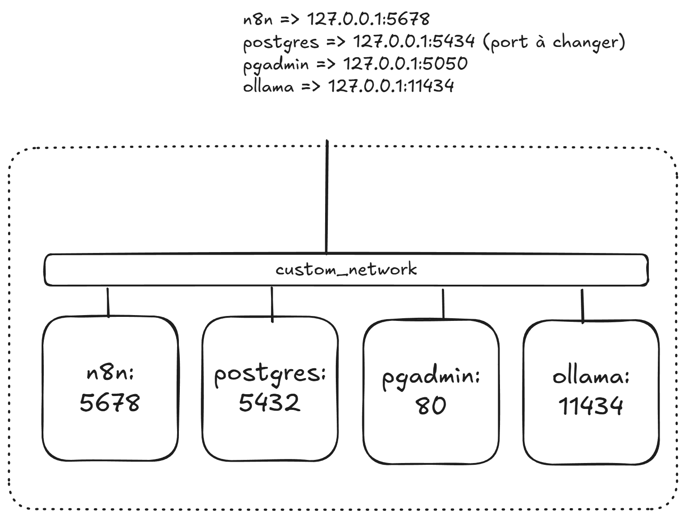

# Installation n8n

## Objectifs

L'objectif de ce guide est de vous accompagner dans l'installation et la configuration de n8n, un outil d'automatisation de flux de travail. Vous apprendrez à configurer un environnement Docker pour exécuter n8n et à explorer des exemples pratiques pour démarrer rapidement.

Au cours de cette étape vous allez installer sur votre machine les applications nécessaires à la réalisation du cours.

Le schéma ci-dessous présente les différents containers, le réseau et les numéros de port utilisés :



**📖 Pour une vue détaillée de l'architecture complète et l'évolution du projet**, consultez le fichier [ARCHITECTURE.md](./ARCHITECTURE.md).

## Prérequis

- Connaissances de base en ligne de commande.
- Compréhension des concepts de conteneurisation.
- Installation de Docker Desktop ou Docker Engine sur votre machine.
- Accès à un éditeur de texte pour modifier les fichiers de configuration.
- Droits administratifs sur votre machine pour exécuter Docker.
- Connexion Internet pour télécharger les images Docker nécessaires.

## Compétences

- Installation et configuration de Docker pour gérer des conteneurs.
- Déploiement de n8n dans un conteneur Docker.
- Installation et configuration de PostgreSQL comme base de données pour n8n.
- Utilisation de pgAdmin pour gérer et interagir avec PostgreSQL.
- Configuration de Ollama pour des fonctionnalités spécifiques à l'environnement.
- Gestion des réseaux et des ports pour permettre la communication entre les conteneurs.
- Débogage et résolution des problèmes liés à l'environnement Docker.

## 📦 Fichiers d'Installation Disponibles

Avant de commencer, familiarisez-vous avec les fichiers disponibles :

| Fichier | Description | Utilisation |
|---------|-------------|-------------|
| `docker-compose.yml` | **Configuration standard** (CPU) | Installation par défaut recommandée |
| `docker-compose-gpu.yml` | **Configuration avec GPU NVIDIA** | Pour accélération GPU (optionnel) |
| `.env.example` | **Template de configuration** | À copier en `.env` et personnaliser |
| `VERIFICATION.md` | **Guide de vérification** | Pour tester votre installation |
| `ollama_gpu.md` | **Guide GPU détaillé** | Instructions complètes pour GPU |
| `ARCHITECTURE.md` | **Documentation architecture** | Comprendre l'infrastructure |

## Installation

### Configuration Docker

Le fichier `docker-compose.yml` est fonctionnel en l'état. Cependant, il est **fortement recommandé** de personnaliser certains éléments pour améliorer la sécurité.

#### Changement de port

Si le port d'un programme est déjà utilisé sur votre machine, vous pouvez le modifier dans le fichier `docker-compose.yml`. Voici les éléments à changer :

- **Section `ports` :** Modifiez le port hôte (avant les deux-points) pour un port disponible. Par exemple :
  ```yaml
  ports:
    - "127.0.0.1:8080:5678" # Changez 8080 par un port disponible
  ```

- **Vérification de la disponibilité d'un port :**
  - **Sous Linux :** Utilisez la commande suivante pour lister les ports en écoute :
    ```bash
    sudo lsof -i -P -n | grep LISTEN
    ```
  - **Sous Windows :** Utilisez la commande suivante dans PowerShell ou l'invite de commande :
    ```cmd
    netstat -ano | findstr :8080
    ```

#### Ouverture d'un service

Pour rendre un service accessible à l'extérieur, vous pouvez modifier la configuration des ports dans le fichier `docker-compose.yml`. Par exemple, pour ouvrir le port de n8n à toutes les adresses IP externes, remplacez :
```
ports:
  - "127.0.0.1:5678:5678"
```
par :
```
ports:
  - "0.0.0.0:5678:5678"
```
Cependant, cette configuration peut exposer votre service à des risques de sécurité. Assurez-vous de mettre en place des mesures de protection comme l'authentification, les pare-feu ou les restrictions d'accès IP.

#### 🔐 Configuration du fichier .env (IMPORTANT)

> ⚠️ **ÉTAPE OBLIGATOIRE POUR LA SÉCURITÉ**

Avant de démarrer les conteneurs, vous **devez** configurer un fichier `.env` pour stocker les informations sensibles.

**Étapes :**

1. **Copier le template** :
   ```bash
   cp .env.example .env
   ```

2. **Éditer le fichier .env** :
   ```bash
   nano .env  # ou votre éditeur préféré
   ```

3. **Modifier TOUS les mots de passe** (recherchez `strong_password_here` et remplacez-les) :
   ```bash
   # Exemple de valeurs à changer
   N8N_BASIC_AUTH_PASSWORD=VotreMotDePasseSecurise123!
   POSTGRES_PASSWORD=AutreMotDePasseSecurise456!
   PGADMIN_DEFAULT_PASSWORD=EncoreUnAutre789!
   ```

4. **Générer des mots de passe forts** :
   ```bash
   # Linux/Mac
   openssl rand -base64 32
   
   # Windows PowerShell
   -join ((48..57) + (65..90) + (97..122) | Get-Random -Count 32 | % {[char]$_})
   ```

> 💡 **Astuce** : Le fichier `.env.example` contient des commentaires détaillés pour chaque variable. Consultez-le pour plus d'informations.

**⚠️ Important :**
- Le `.env` est dans `.gitignore` (ne sera jamais commité)
- Les valeurs par défaut dans `docker-compose.yml` sont utilisées si `.env` n'existe pas
- **Ne partagez JAMAIS votre fichier `.env`**

### 🚀 Lancer Docker Compose

#### Choix de la Configuration

**Option A : Configuration Standard (CPU)** - Recommandée pour débuter
```bash
docker compose up -d
```

**Option B : Configuration GPU (NVIDIA)** - Pour performances optimales
```bash
docker compose -f docker-compose-gpu.yml up -d
```
> 📖 Consultez `ollama_gpu.md` pour les instructions complètes GPU

#### Procédure Complète de Lancement

Si votre fichier est configuré et que votre `.env` est prêt, suivez ces étapes :

1. **Naviguer vers le répertoire contenant le fichier :**
   ```bash
   cd chemin/vers/votre/projet
   ```

2. **Vérifier la configuration :**
  - Avant de démarrer les services, vous pouvez vérifier que votre fichier `docker-compose.yml` est bien configuré :
    ```bash
    docker compose config
    ```
  - Cette commande permet de valider et d'afficher la configuration complète en incluant les variables d'environnement,
    si le fichier `.env` est présent.

3. **Démarrer les conteneurs :**
  - Lancer vos services en arrière-plan :
    ```bash
    docker compose up -d
    ```

4. **Consulter l’état des conteneurs :**
  - Vérifiez que vos services sont en cours d'exécution :
    ```bash
    docker ps
    ```

5. **Voir les journaux des conteneurs (facultatif) :**
  - Si besoin, vérifiez les journaux pour détecter d'éventuelles erreurs ou issues liées à vos services :
    ```bash
    docker compose logs -f
    ```

6. **Arrêter les services :**
   
   **Arrêt simple (conserve les données) :**
   ```bash
   docker compose stop
   ```
   
   **Arrêt et suppression des conteneurs (conserve les données) :**
   ```bash
   docker compose down
   ```
   
   **⚠️ Arrêt et suppression COMPLÈTE (ATTENTION : supprime les volumes/données) :**
   ```bash
   docker compose down -v
   # Utilisez cette commande UNIQUEMENT si vous voulez tout réinitialiser
   ```

7. **Redémarrer après modifications :**
   ```bash
   # Si vous avez modifié docker-compose.yml ou .env
   docker compose up -d --force-recreate
   ```

Ces étapes vous permettront de lancer et gérer votre environnement Docker Compose basé sur le fichier existant.

> 📖 **Pour vérifier votre installation**, consultez `VERIFICATION.md` qui contient une checklist complète de tests.

### Vérifications des services

Après avoir démarré vos conteneurs avec Docker Compose, vous pouvez vérifier que les services fonctionnent correctement.
Voici comment procéder pour chaque service installé :

#### n8n

1. **Accéder à l'interface web d'n8n :**
  - Ouvrez votre navigateur web et accédez à l'adresse suivante : `http://localhost:5678` (ou remplacez `5678` par le
    port configuré dans le fichier `docker-compose.yml` si vous avez modifié le port par défaut).
  - Vous devriez voir l'interface de n8n.

2. **Se connecter à l'interface :**
  - Si l'authentification de base est activée (via `N8N_BASIC_AUTH_USER` et `N8N_BASIC_AUTH_PASSWORD` configurés dans
    votre fichier `.env`), connectez-vous avec les identifiants correspondants.

3. **Demander une clé de licence :**
  - Une fois connecté, allez dans les paramètres de l'application en cliquant sur l'icône des paramètres dans
    l'interface utilisateur.
  - Localisez la section "Licence" ou "Licence Manager".
  - Suivez les instructions pour demander ou saisir une clé de licence, en fonction des besoins spécifiques de votre cas
    d'utilisation et des options affichées.

4. **Vérifier les journaux d'n8n :**
  - Si l'interface ne fonctionne pas, consultez les journaux du conteneur :
    ```bash
    docker compose logs -f n8n
    ```
  - Recherchez des erreurs ou des problèmes de configuration.

#### PostgreSQL

1. **Tester la connexion à PostgreSQL :**
  - Si vous avez configuré `pgAdmin`, utilisez-le pour tester la connexion à PostgreSQL.
  - Les informations de connexion (hôte, port, nom d'utilisateur, mot de passe) sont celles renseignées dans le fichier
    `.env` ou directement dans le fichier `docker-compose.yml`.

2. **Vérifier les journaux de PostgreSQL :**
  - Consultez les journaux pour vous assurer que le service fonctionne correctement :
    ```bash
    docker compose logs -f postgres
    ```

3. **Accéder via une ligne de commande (facultatif) :**
  - Si nécessaire, vous pouvez accéder à PostgreSQL depuis le conteneur avec la commande suivante :
    ```bash
    docker exec -it postgres_container_name psql -U postgres
    ```
   Remplacez `postgres_container_name` par le nom de votre conteneur Postgres.

#### pgAdmin

1. **Accéder à l'interface web de pgAdmin :**
  - Dans votre navigateur, rendez-vous à l'adresse suivante : `http://localhost:5050` (ou le port configuré dans votre
    fichier `docker-compose.yml`).
  - Connectez-vous avec les identifiants configurés dans le fichier `.env`.

2. **Ajouter le serveur PostgreSQL dans pgAdmin :**
  - Une fois connecté, ajoutez un nouveau serveur dans la section "Servers" avec les paramètres de PostgreSQL définis
    dans votre configuration Docker.

3. **Vérifier les journaux pgAdmin :**
  - Si l'interface ne se charge pas, vérifiez les journaux :
    ```bash
    docker compose logs -f pgadmin
    ```

#### Ollama

1. **Vérifier le fonctionnement d'Ollama via l'API ou l'interface utilisateur :**
  - Si Ollama fournit une interface sur un port spécifique (comme une API REST), accédez-y via :
    `http://localhost:<port>` (remplacez `<port>` par celui configuré dans `docker-compose.yml`).

2. **Tester l'API d'Ollama (exemple) :**
  - Si Ollama expose une API REST, vous pouvez envoyer une requête de test avec un outil tel que `curl` ou Postman. Par
    exemple :
    ```bash
    curl http://localhost:<port>
    ```
  - Remplacez `<port>` par le port approprié. La réponse devrait confirmer que le service est disponible.

3. **Vérifier les journaux d'Ollama :**
  - Si le service ne répond pas comme attendu, consultez les journaux :
    ```bash
    docker compose logs -f ollama
    ```


4. **Se connecter à Ollama et installer un modèle Mistral :**

  - Si vous utilisez Ollama pour gérer et exécuter vos modèles, vous pouvez installer un modèle `Mistral` directement à
    l'aide des commandes appropriées :

   ```bash
   ollama pull mistral
   ```

  - Cette commande téléchargera et installera le modèle `Mistral` dans votre instance Ollama.

  - Une fois téléchargé, vous pouvez vérifier que le modèle est bien disponible avec la commande suivante :

   ```bash
   ollama list
   ```

  - Cette commande affichera la liste des modèles installés. Assurez-vous que `mistral` y figure.

  - Si le modèle ne fonctionne pas comme attendu, consultez les journaux d'Ollama pour plus de détails :

   ```bash
   docker compose logs -f ollama
   ```

### Vérification générale

1. **Lister les conteneurs en cours d'exécution :**
  - Assurez-vous que tous les conteneurs démarrés sont en cours d'exécution et dans l'état attendu :
    ```bash
    docker ps
    ```
  - La sortie affichera tous les conteneurs actifs, leurs ports mappés et leur statut.

2. **Vérifier les journaux de tous les services en une seule commande :**
  - Si vous souhaitez consulter les journaux pour tous les services :
    ```bash
    docker compose logs -f
    ```

Ces étapes vous aideront à confirmer que n8n, PostgreSQL, pgAdmin et Ollama fonctionnent correctement.

### 📥 Installation des Workflows d'Exemple

Le projet contient des exercices corrigés pouvant servir d'exemple pour chaque étape du cours.

#### Importer les exemples

```bash
# Importer tous les workflows d'exemple
docker exec n8n n8n import:workflow --separate --input=/files/corrections/
```

**Résultat attendu** : Message de succès pour chaque workflow importé (~30 workflows)

#### 📁 Organisation Recommandée dans n8n

Pour garder votre espace de travail organisé :

1. **Accéder à n8n** : `http://localhost:5678`
2. **Se connecter** avec vos identifiants (définis dans `.env`)
3. **Créer des dossiers** :
   - Cliquez sur "+" à côté de "Workflows"
   - Créez un dossier "📚 Exemples"
   - Créez des sous-dossiers par étape :
     - `0. Chat`
     - `1. Chat Diversity`
     - `2. Split Workflow`
     - etc.

4. **Organiser les workflows** :
   - Glissez-déplacez chaque workflow dans le dossier correspondant
   - Renommez si nécessaire pour plus de clarté

#### 🔄 Réimporter vos propres workflows

Si vous avez sauvegardé vos workflows et souhaitez les réimporter :

```bash
# 1. Créer un dossier pour vos workflows
mkdir -p n8n_files/mes_workflows

# 2. Copier vos fichiers JSON dans ce dossier

# 3. Importer
docker exec n8n n8n import:workflow --separate --input=/files/mes_workflows/
```

> 📖 Pour plus de détails, consultez `reup_exercises.md`

## ✅ Vérification de l'Installation

Avant de continuer, **vérifiez que tout fonctionne** en consultant `VERIFICATION.md` qui contient :

- ✅ Checklist complète de tous les services
- ✅ Tests de connectivité
- ✅ Validation des credentials
- ✅ Tests de workflows
- ✅ Scripts de diagnostic

**Quick Check :**
```bash
# Tous les services doivent être "Up"
docker ps

# Accès web
# - n8n : http://localhost:5678
# - pgAdmin : http://localhost:5050

# Test Ollama
docker exec ollama ollama list
```

---

## 🎯 Prochaines Étapes

### 1. Premier Workflow
Pour découvrir n8n et créer votre premier workflow, suivez les instructions dans **`premier_workflow.md`**.

### 2. Démarrer le Projet Guidé
Une fois l'installation validée, commencez le projet :
```bash
cd ../projet/0.\ chat/
cat README.md
```

### 3. Explorer les Ressources
Consultez les ressources pédagogiques :
```bash
cd ../ressources/
cat README.md
```

---

## 📚 Récapitulatif des Fichiers d'Installation

| Fichier | Description |
|---------|-------------|
| `README.md` | 📖 Ce fichier - Guide d'installation |
| `docker-compose.yml` | 🐳 Configuration standard (CPU) |
| `docker-compose-gpu.yml` | 🚀 Configuration avec GPU NVIDIA |
| `.env.example` | 🔐 Template de configuration |
| `.env` | 🔑 Votre configuration (à créer) |
| `VERIFICATION.md` | ✅ Guide de vérification |
| `ARCHITECTURE.md` | 🏗️ Documentation architecture complète |
| `ollama_gpu.md` | 🎮 Guide GPU NVIDIA détaillé |
| `premier_workflow.md` | 👋 Tutoriel premier workflow |
| `reup_exercises.md` | 🔄 Réimporter des workflows |

---

## 🆘 Besoin d'Aide ?

### Problèmes Courants

**Les conteneurs ne démarrent pas :**
```bash
docker compose logs
```

**Port déjà utilisé :**
- Modifiez les ports dans `.env`
- Exemple : `N8N_PORT=127.0.0.1:5679`

**Mots de passe incorrects :**
- Vérifiez `.env`
- Assurez-vous que les mots de passe correspondent partout

**Ollama ne télécharge pas les modèles :**
```bash
# Vérifier l'espace disque
df -h
# Augmenter le timeout
docker exec ollama ollama pull mistral
```

### Ressources

- 📖 `VERIFICATION.md` - Diagnostic complet
- 🏗️ `ARCHITECTURE.md` - Comprendre l'infrastructure  
- 🎮 `ollama_gpu.md` - Configuration GPU
- 📚 Documentation officielle :
  - n8n : https://docs.n8n.io/
  - Ollama : https://github.com/ollama/ollama
  - Docker : https://docs.docker.com/compose/

---

**🎉 Installation terminée ! Vous êtes prêt à commencer le cours.**
