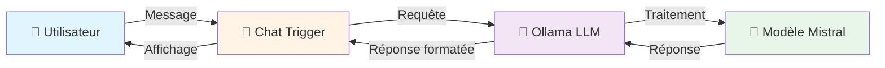
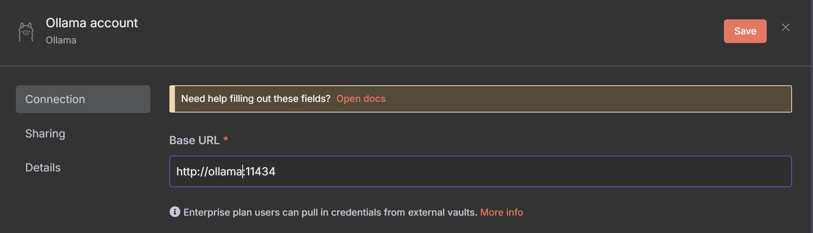
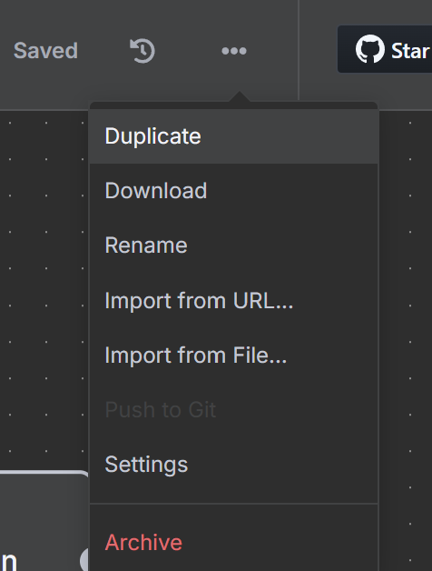

# 0. Création d'un premier workflow de type chat

> **Résumé** : Créez votre premier workflow n8n pour dialoguer avec un modèle de langage local via Ollama  
> **Temps estimé** : 45-60 minutes  
> **Difficulté** : Débutant ⭐  
> **Étape précédente** : Aucune (première étape)

---

## 🎯 Objectifs pédagogiques

À la fin de cette étape, vous serez capable de :

1. **Créer un workflow n8n** à partir d'un template existant
2. **Configurer Ollama** comme service LLM local dans n8n
3. **Utiliser l'interface Chat** pour interagir avec un modèle de langage
4. **Exporter et sauvegarder** vos workflows n8n
5. **Comprendre l'architecture** de base d'un chat avec LLM

Cette étape pose les fondations de votre projet de comparateur de LLM en vous familiarisant avec l'écosystème n8n et Ollama.

---

## 📚 Prérequis

### Installation et configuration
Avant de commencer, assurez-vous d'avoir :

- ✅ **n8n installé et fonctionnel** sur votre machine
  - 📖 Voir : [/installation/README.md](../../installation/README.md)
  - 📖 Guide Docker : [/ressources/docker/README.md](../../ressources/docker/README.md)
  
- ✅ **Ollama configuré** avec au moins un modèle téléchargé (ex: `mistral`)
  - 📖 Voir : [/installation/premier_workflow.md](../../installation/premier_workflow.md)
  - 💡 Commande pour télécharger Mistral : `ollama pull mistral`

### Connaissances requises

- 🔧 **Bases de l'automatisation no-code**
  - 📖 Voir : [/ressources/nocode_lowcode/README.md](../../ressources/nocode_lowcode/README.md)
  
- 🌐 **Compréhension basique des workflows**
  - 📖 Voir : [/ressources/workflow/README.md](../../ressources/workflow/README.md)

### Ressources externes

- [Documentation officielle n8n](https://docs.n8n.io/)
- [Template de workflow : Chat with Local LLMs](https://n8n.io/workflows/2384-chat-with-local-llms-using-n8n-and-ollama/)
- [Documentation Ollama](https://ollama.ai/docs)

---

## 📊 Architecture du workflow



### Composants du workflow

| Composant | Rôle | Configuration requise |
|-----------|------|----------------------|
| **Chat Trigger** | Point d'entrée pour l'interface chat | Mode public ou authentifié |
| **Ollama Node** | Connexion au service LLM local | Credentials + choix du modèle |
| **Mistral Model** | Modèle de langage exécuté localement | Téléchargé via Ollama CLI |

---

## 🧑‍💻 Instructions étape par étape

### Étape 1 : Préparer l'environnement n8n

1. **Démarrez n8n** (si ce n'est pas déjà fait)
   ```bash
   # Via Docker Compose (recommandé)
   docker-compose up -d
   
   # Ou via npm
   n8n start
   ```

2. **Accédez à l'interface web**
   - Ouvrez votre navigateur : `http://localhost:5678`
   - Connectez-vous avec vos identifiants

3. **Organisez votre espace de travail**
   - Dans le menu latéral, cliquez sur "Workflows"
   - Créez un dossier nommé `projet` (s'il n'existe pas)
   - À l'intérieur, créez un sous-dossier `0. chat`

### Étape 2 : Importer le template de workflow

1. **Accédez au template**
   - Ouvrez le lien : [Chat with Local LLMs using n8n and Ollama](https://n8n.io/workflows/2384-chat-with-local-llms-using-n8n-and-ollama/)
   - Cliquez sur le bouton **"Use workflow"** ou **"Copy to clipboard"**

2. **Importez dans n8n**
   - Dans n8n, cliquez sur le menu **"..."** (en haut à droite)
   - Sélectionnez **"Import from URL"** ou **"Import from Clipboard"**
   - Collez l'URL ou le contenu copié
   - Validez l'importation

3. **Renommez le workflow**
   - Cliquez sur le nom du workflow (en haut)
   - Renommez-le : `0. Chat - Premier test avec Ollama`
   - Sauvegardez (Ctrl+S ou bouton "Save")

### Étape 3 : Configurer les credentials Ollama

1. **Ouvrez le nœud Ollama**
   - Double-cliquez sur le nœud **"Ollama"** dans le canvas

2. **Créez les credentials**
   - Cliquez sur **"Select Credential"** → **"Create New"**
   - Remplissez les champs :
     - **Name** : `Ollama Local`
     - **Base URL** : `http://localhost:11434` (ou l'URL de votre instance Ollama)
   - Testez la connexion avec le bouton **"Test"**
   - Sauvegardez les credentials

   

3. **Sélectionnez le modèle**
   - Dans le menu déroulant **"Model"**, sélectionnez `mistral`
   - Si le modèle n'apparaît pas, vérifiez qu'Ollama est démarré et que Mistral est téléchargé :
     ```bash
     ollama list
     # Si Mistral n'est pas dans la liste :
     ollama pull mistral
     ```

### Étape 4 : Tester le chat

1. **Ouvrez l'interface de chat**
   - En haut à droite du nœud Chat Trigger, cliquez sur **"Open chat"**
   - Une fenêtre de chat s'ouvre sur le côté droit

2. **Envoyez votre premier message**
   - Tapez un message simple, par exemple :
     ```
     Bonjour, peux-tu te présenter en une phrase ?
     ```
   - Appuyez sur Entrée ou cliquez sur "Send"

3. **Vérifiez la réponse**
   - Le modèle Mistral devrait répondre en quelques secondes
   - Vérifiez que la réponse est cohérente et en français (si demandé)
   - Testez quelques messages supplémentaires pour valider le fonctionnement

4. **Inspectez les données**
   - Cliquez sur **"Execute Workflow"** (play button) pour voir les données transitant entre les nœuds
   - Observez les données d'entrée/sortie dans chaque nœud

### Étape 5 : Sauvegarder le workflow

1. **Enregistrez les modifications**
   - Cliquez sur **"Save"** (ou Ctrl+S) en haut à droite
   - Vérifiez que le workflow est bien sauvegardé (indicateur vert)

2. **Exportez le workflow localement**
   - Cliquez sur le menu **"..."** à côté du bouton "Save"
   - Sélectionnez **"Download"**
   - Un fichier JSON est téléchargé (ex: `0_Chat_-_Premier_test_avec_Ollama.json`)

   

3. **Organisez vos fichiers**
   - Déplacez le fichier téléchargé vers votre dossier de projet :
     ```
     integration-LLM/projet/0. chat/
     ```
   - Renommez-le si nécessaire pour plus de clarté : `chat_simple_ollama.json`

---

## ✅ Critères de validation

### Checklist de réussite

Cochez chaque élément une fois terminé :

- [ ] Le workflow est importé et visible dans n8n
- [ ] Les credentials Ollama sont configurés et testés avec succès
- [ ] Le modèle Mistral est sélectionné dans le nœud Ollama
- [ ] L'interface de chat s'ouvre correctement
- [ ] Le modèle répond de manière cohérente à vos messages
- [ ] Le workflow est sauvegardé dans n8n
- [ ] Le fichier JSON du workflow est exporté et stocké dans `projet/0. chat/`

### Quiz de compréhension

<details>
<summary><strong>Question 1 :</strong> Quel est le rôle du nœud "Chat Trigger" dans ce workflow ?</summary>

**Réponse :** Le nœud Chat Trigger sert de point d'entrée pour l'interface utilisateur du chat. Il capture les messages envoyés par l'utilisateur, les transmet au nœud Ollama pour traitement, puis affiche la réponse reçue dans l'interface de chat. C'est le composant qui gère l'interaction utilisateur.
</details>

<details>
<summary><strong>Question 2 :</strong> Pourquoi utiliser Ollama plutôt qu'un service cloud comme OpenAI ?</summary>

**Réponse :** Ollama permet d'exécuter des modèles de langage **localement** sur votre machine, ce qui offre plusieurs avantages :
- 🔒 **Confidentialité** : vos données restent sur votre machine
- 💰 **Coût** : pas de frais d'API pour les requêtes
- 🚀 **Rapidité** : pas de latence réseau
- 🔧 **Contrôle** : choix du modèle et de ses paramètres

C'est idéal pour le développement et les données sensibles.
</details>

<details>
<summary><strong>Question 3 :</strong> Que contient le fichier JSON exporté d'un workflow n8n ?</summary>

**Réponse :** Le fichier JSON contient la **définition complète** du workflow :
- La structure des nœuds (types, positions, paramètres)
- Les connexions entre les nœuds
- Les configurations (sauf les credentials sensibles, qui sont référencées par ID)
- Les métadonnées (nom, description, version)

Ce format permet de partager, versionner et restaurer des workflows facilement.
</details>

<details>
<summary><strong>Question 4 :</strong> Si le modèle met plus de 30 secondes à répondre, que devriez-vous vérifier en premier ?</summary>

**Réponse :** Vérifiez dans cet ordre :
1. **Ressources système** : Ollama nécessite suffisamment de RAM et CPU/GPU
2. **État d'Ollama** : `ollama list` pour vérifier que le modèle est bien chargé
3. **Taille du modèle** : Mistral est relativement léger (4Go), mais sur une machine avec peu de RAM, il peut être lent
4. **Logs n8n** : consultez la console pour détecter d'éventuelles erreurs de connexion

💡 Solution : utilisez un modèle plus léger comme `phi` ou `tinyllama` pour tester.
</details>

<details>
<summary><strong>Question 5 :</strong> Quelle est la différence entre "Save" et "Download" dans n8n ?</summary>

**Réponse :**
- **Save** : enregistre le workflow dans la base de données de n8n (persiste entre les sessions, visible dans l'interface)
- **Download** : exporte le workflow sous forme de fichier JSON local (pour backup, versioning Git, ou partage)

**Bonne pratique** : utilisez toujours les deux ! Save pour travailler, Download pour sauvegarder dans votre dépôt Git.
</details>

---

## 🐛 Dépannage

### Problème : Ollama n'apparaît pas dans les credentials

**Symptômes** : Impossible de créer des credentials Ollama, le nœud affiche une erreur

**Solutions** :
1. Vérifiez qu'Ollama est installé :
   ```bash
   ollama --version
   ```
2. Démarrez le service Ollama :
   ```bash
   ollama serve
   ```
3. Testez la connexion manuellement :
   ```bash
   curl http://localhost:11434/api/tags
   ```
4. Si vous utilisez Docker, vérifiez que le conteneur n8n peut accéder à `host.docker.internal:11434`

**Référence** : [/ressources/docker/README.md - Section Networking](../../ressources/docker/README.md)

---

### Problème : Le modèle Mistral ne figure pas dans la liste

**Symptômes** : Le menu déroulant "Model" est vide ou ne contient pas Mistral

**Solutions** :
1. Téléchargez le modèle :
   ```bash
   ollama pull mistral
   ```
2. Vérifiez que le téléchargement est terminé :
   ```bash
   ollama list
   ```
3. Redémarrez n8n pour rafraîchir la liste des modèles disponibles
4. Si le problème persiste, vérifiez les logs d'Ollama :
   ```bash
   ollama logs
   ```

**Alternative** : Utilisez un modèle plus léger comme `phi` (2.7Go) ou `tinyllama` (637Mo) pour tester rapidement

---

### Problème : "Connection refused" ou "timeout"

**Symptômes** : Le chat ne répond pas, erreur de connexion dans les logs n8n

**Solutions** :

1. **Vérifiez qu'Ollama est bien démarré** :
   ```bash
   ps aux | grep ollama
   # Ou sur Windows :
   tasklist | findstr ollama
   ```

2. **Testez l'URL de base** :
   ```bash
   curl http://localhost:11434/api/version
   ```

3. **Si vous utilisez Docker** :
   - Sur Linux : utilisez `http://172.17.0.1:11434`
   - Sur Mac/Windows : utilisez `http://host.docker.internal:11434`

4. **Vérifiez les pare-feu** :
   - Autorisez le port 11434 en local
   - Désactivez temporairement le pare-feu pour tester

**Référence** : [/ressources/bases_reseau/README.md - Section Ports et Services](../../ressources/bases_reseau/README.md)

---

### Problème : Réponses lentes ou machine qui freeze

**Symptômes** : Le modèle répond très lentement (>1 minute), ou l'ordinateur devient lent

**Causes possibles** :
- RAM insuffisante (Mistral nécessite ~8Go de RAM disponible)
- CPU trop faible (sans GPU, l'inférence est très lente)
- Trop de modèles chargés simultanément en mémoire

**Solutions** :

1. **Vérifiez l'utilisation des ressources** :
   ```bash
   # Linux/Mac
   htop
   # Windows
   Gestionnaire des tâches
   ```

2. **Utilisez un modèle plus léger** :
   ```bash
   ollama pull phi
   # Puis changez le modèle dans n8n
   ```

3. **Configurez Ollama pour limiter la mémoire** :
   ```bash
   # Limitez à 4Go de RAM
   export OLLAMA_MAX_LOADED_MODELS=1
   export OLLAMA_NUM_PARALLEL=1
   ollama serve
   ```

4. **Si vous avez un GPU NVIDIA** :
   - Vérifiez que les drivers CUDA sont installés
   - Ollama devrait automatiquement utiliser le GPU
   - Consultez [/installation/ollama_gpu.md](../../installation/ollama_gpu.md)

**Référence** : [/ressources/docker/README.md - Section Ressources](../../ressources/docker/README.md)

---

### Problème : Le workflow ne se sauvegarde pas

**Symptômes** : Message d'erreur lors de la sauvegarde, ou le workflow disparaît après rechargement

**Solutions** :

1. **Vérifiez les permissions** du volume Docker (si applicable) :
   ```bash
   ls -la ~/.n8n/
   ```

2. **Vérifiez l'espace disque** :
   ```bash
   df -h
   ```

3. **Consultez les logs n8n** :
   ```bash
   docker-compose logs n8n
   ```

4. **Exportez en JSON** comme backup immédiat (Download) en attendant de résoudre le problème de sauvegarde

**Référence** : [/ressources/bases_donnees/README.md - Section Persistence](../../ressources/bases_donnees/README.md)

---

## 🔗 Ressources complémentaires

### Documentation interne

- 📂 [Guide d'installation complet](../../installation/README.md)
- 📂 [Concepts no-code/low-code](../../ressources/nocode_lowcode/README.md)
- 📂 [Architecture des workflows](../../ressources/workflow/README.md)
- 📂 [Docker et conteneurisation](../../ressources/docker/README.md)
- 📂 [Glossaire des termes techniques](../../ressources/GLOSSARY.md)

### Documentation externe

- [Documentation officielle n8n](https://docs.n8n.io/)
- [Ollama - Getting Started](https://ollama.ai/docs)
- [Mistral AI Documentation](https://docs.mistral.ai/)
- [n8n Community Forum](https://community.n8n.io/)
- [Tutoriels vidéo n8n sur YouTube](https://www.youtube.com/@n8n-io)

### Templates similaires à explorer

- [Basic Chatbot with Memory](https://n8n.io/workflows/1234-chatbot-with-memory/)
- [Multi-model Chat Comparison](https://n8n.io/workflows/5678-multi-model-comparison/)
- [Document QA with Local LLMs](https://n8n.io/workflows/9012-document-qa-local-llms/)

---

## ➡️ Étape suivante

Une fois cette étape validée, vous êtes prêt à passer à :

**[Étape 1 : Diversifier les modèles LLM](../1.%20chat%20diversity/README.md)**

Dans l'étape suivante, vous apprendrez à :
- Ajouter plusieurs modèles LLM au même workflow
- Comparer les réponses de différents modèles
- Organiser les résultats de manière lisible

---

## 📝 Notes et observations

Utilisez cet espace pour noter vos observations lors de la réalisation de cette étape :

- **Temps réel passé** : _____ minutes
- **Difficultés rencontrées** : _____________________________
- **Questions non résolues** : _____________________________
- **Idées d'amélioration** : _____________________________

---

**Bon courage pour cette première étape !** 🚀
