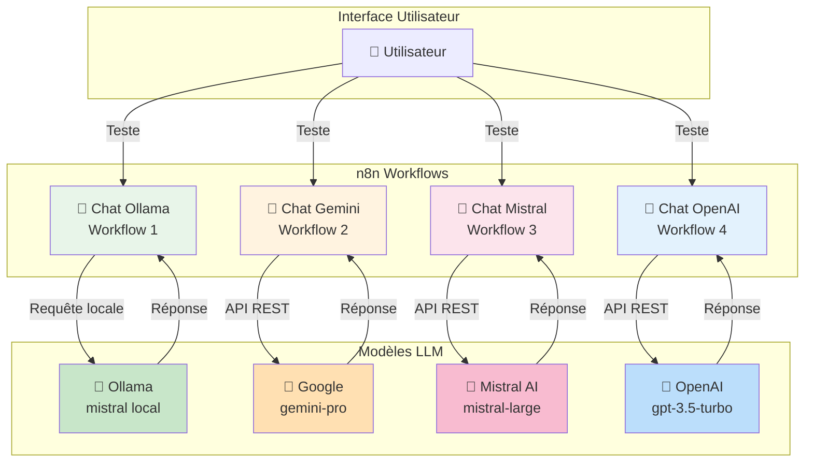
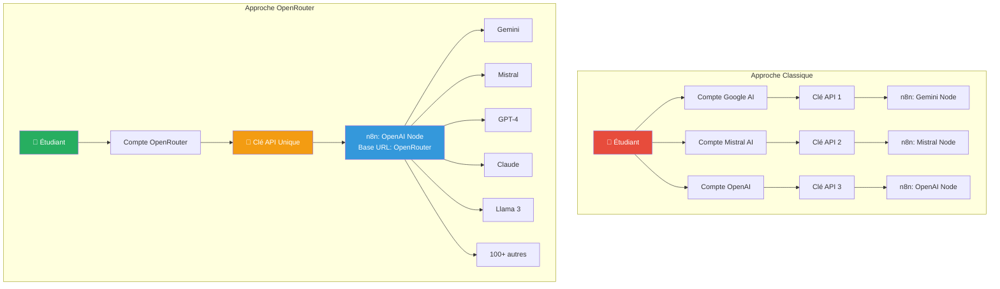

# 1. Diversifier les modèles LLM

> **Résumé** : Connectez votre workflow à plusieurs fournisseurs LLM (Gemini, Mistral, OpenAI) pour comparer leurs capacités  
> **Temps estimé** : 60-90 minutes  
> **Difficulté** : Débutant/Intermédiaire ⭐⭐  
> **Étape précédente** : [0. Chat](../0.%20chat/README.md)

---

## 🎯 Objectifs pédagogiques

À la fin de cette étape, vous serez capable de :

1. **Obtenir des clés API** auprès de différents fournisseurs LLM (Gemini, Mistral, OpenAI)
2. **Configurer des credentials** dans n8n pour accéder à des API externes
3. **Dupliquer et adapter** des workflows existants pour différents providers
4. **Comparer les réponses** de différents modèles de langage sur des prompts identiques
5. **Comprendre les différences** entre modèles locaux (Ollama) et APIs cloud
6. **Gérer plusieurs workflows** organisés dans un projet structuré

Cette étape vous prépare à créer un **comparateur de LLM**, pierre angulaire de votre projet final.

---

## 📚 Prérequis

### Étape précédente requise

- ✅ **Étape 0 complétée** : Vous devez avoir un workflow fonctionnel avec Ollama
  - 📖 Voir : [0. Chat](../0.%20chat/README.md)

### Connaissances requises

- 🔐 **Gestion des credentials et API keys**
  - 📖 Voir : [/ressources/credentials/README.md](../../ressources/credentials/README.md)
  
- 🌐 **Protocoles HTTP et APIs REST**
  - 📖 Voir : [/ressources/http&API/README.md](../../ressources/http&API/README.md)

- 🔧 **Manipulation de workflows n8n**
  - 📖 Voir : [/ressources/workflow/README.md](../../ressources/workflow/README.md)

### Comptes et accès requis

Vous aurez besoin de créer des comptes (gratuits) sur :

- **Google AI Studio** (Gemini) : [https://ai.google.dev/](https://ai.google.dev/)
  - ⚠️ **Important** : Utilisez une adresse email personnelle (pas celle du campus)
  - 💡 Quota gratuit : 15 requêtes/minute, 1500 requêtes/jour

- **Mistral AI** : [https://console.mistral.ai/](https://console.mistral.ai/)
  - 💰 Offre découverte avec crédits gratuits

- **OpenAI** : [https://platform.openai.com](https://platform.openai.com)
  - 💰 Nécessite une carte bancaire, mais dispose de crédits d'essai ($5-$18 selon les promotions)

### Ressources externes

- [Documentation n8n - Credentials](https://docs.n8n.io/credentials/)
- [Google Gemini API Documentation](https://ai.google.dev/docs)
- [Mistral AI API Documentation](https://docs.mistral.ai/)
- [OpenAI API Reference](https://platform.openai.com/docs/api-reference)

---

## 📊 Architecture du système multi-LLM



### Comparaison des fournisseurs LLM

| Fournisseur | Type | Avantages | Inconvénients | Cas d'usage idéal |
|-------------|------|-----------|---------------|-------------------|
| **Ollama** | Local | Gratuit, privé, rapide | Nécessite ressources locales | Prototypage, données sensibles |
| **Gemini** | Cloud | Gratuit (quota), multimodal | Quota limité | Tests, applications légères |
| **Mistral** | Cloud | Performance/prix optimal | Payant après crédits | Production, français |
| **OpenAI** | Cloud | Très performant, populaire | Cher, nécessite carte bancaire | Production, cas complexes |

---

## 🧑‍💻 Instructions étape par étape

### Partie 1 : Obtention des clés API

#### A) Clé API pour Google Gemini

1. **Créez un compte Google AI Studio**
   - Accédez à [https://ai.google.dev/](https://ai.google.dev/)
   - ⚠️ **Utilisez une adresse email personnelle** (pas celle du campus, qui peut avoir des restrictions)
   - Cliquez sur **"Get started"** ou **"Get API key"**

2. **Générez votre clé API**
   - Dans le menu, sélectionnez **"Get API key"**
   - Cliquez sur **"Create API key in new project"** (ou sélectionnez un projet existant)
   - La clé sera générée instantanément

3. **Copiez et sécurisez la clé**
   - Cliquez sur **"Copy"** pour copier la clé
   - ⚠️ **Important** : Cette clé donne accès à votre compte, ne la partagez jamais publiquement
   - Stockez-la temporairement dans un fichier texte local (vous la supprimerez après l'avoir ajoutée à n8n)

4. **Vérifiez les quotas**
   - Consultez les limites : **15 requêtes/minute**, **1500 requêtes/jour**
   - C'est suffisant pour le développement et les tests

**Référence** : [/ressources/credentials/README.md - Section API Keys](../../ressources/credentials/README.md)

---

#### B) Clé API pour Mistral AI

1. **Créez un compte Mistral**
   - Accédez à [https://console.mistral.ai/](https://console.mistral.ai/)
   - Cliquez sur **"Sign up"** et créez votre compte
   - Vérifiez votre email pour activer le compte

2. **Accédez à la section API Keys**
   - Une fois connecté, cliquez sur **"API Keys"** dans le menu latéral
   - Vous verrez vos crédits gratuits disponibles (généralement 5€)

3. **Générez une nouvelle clé**
   - Cliquez sur **"Create API Key"**
   - Donnez un nom descriptif : `n8n-integration-llm`
   - Sélectionnez les permissions (par défaut : toutes)
   - Cliquez sur **"Create"**

4. **Copiez et sécurisez la clé**
   - ⚠️ **La clé ne sera affichée qu'une seule fois !**
   - Copiez-la immédiatement et stockez-la en lieu sûr
   - Si vous la perdez, vous devrez en créer une nouvelle

5. **Notez vos crédits**
   - Surveillez votre consommation dans le dashboard
   - Les crédits gratuits sont suffisants pour ce projet

---

#### C) Clé API pour OpenAI

⚠️ **Note importante** : OpenAI nécessite une carte bancaire pour accéder à l'API, même avec les crédits gratuits. Si vous ne pouvez pas fournir de carte bancaire, **vous pouvez sauter cette partie** et travailler uniquement avec Ollama, Gemini et Mistral.

1. **Créez un compte OpenAI**
   - Accédez à [https://platform.openai.com](https://platform.openai.com)
   - Cliquez sur **"Sign up"** et créez votre compte
   - Vérifiez votre email

2. **Ajoutez un moyen de paiement** (requis)
   - Dans votre compte, allez dans **"Billing"** → **"Payment methods"**
   - Ajoutez une carte bancaire
   - 💡 Vous recevrez entre $5 et $18 de crédits gratuits selon les promotions en cours

3. **Générez une clé API**
   - Cliquez sur votre profil (en haut à droite) → **"API Keys"**
   - Cliquez sur **"Create new secret key"**
   - Donnez un nom : `n8n-integration-llm`
   - Copiez immédiatement la clé (elle ne sera plus affichée)

4. **Configurez les limites de dépenses** (recommandé)
   - Dans **"Billing"** → **"Usage limits"**
   - Définissez une limite mensuelle (ex: $5) pour éviter les mauvaises surprises
   - Activez les alertes email

5. **Vérifiez les tarifs**
   - GPT-3.5-turbo : ~$0.0015/1000 tokens (économique)
   - GPT-4 : ~$0.03/1000 tokens (plus cher, mais plus performant)
   - Pour ce projet, privilégiez GPT-3.5-turbo

**Référence** : [/ressources/credentials/README.md - Section Sécurité des credentials](../../ressources/credentials/README.md)

---

#### D) Alternative simplifiée : OpenRouter (Optionnel mais Recommandé)

Si vous souhaitez **simplifier** cette étape et accéder à **tous les modèles** avec une seule clé API, vous pouvez utiliser **OpenRouter**.

##### 🌟 Qu'est-ce qu'OpenRouter ?

**OpenRouter** est une **passerelle API unifiée** qui vous donne accès à plus de 100 modèles LLM via une seule clé API et une interface compatible OpenAI.

**Site officiel :** [https://openrouter.ai/](https://openrouter.ai/)

##### Avantages d'OpenRouter

- ✅ **Une seule clé API** pour accéder à Gemini, GPT-4, Claude, Mistral, Llama 3, et 100+ modèles
- ✅ **Pas besoin de créer plusieurs comptes** (Google, Mistral, OpenAI)
- ✅ **Tarification transparente** : pay-as-you-go avec prix clairs par modèle
- ✅ **Pas de carte bancaire requise** pour commencer (quota gratuit disponible)
- ✅ **Interface compatible OpenAI** : utilisez le node "OpenAI Chat Model" de n8n
- ✅ **Simplification du setup** : 10 minutes vs 60 minutes pour l'approche classique

##### Configuration d'OpenRouter dans n8n

**Étape 1 : Créez un compte OpenRouter**

1. Accédez à [https://openrouter.ai/](https://openrouter.ai/)
2. Cliquez sur **"Sign up"**
3. Connectez-vous avec Google, GitHub, ou créez un compte email
4. Aucune carte bancaire n'est requise pour commencer

**Étape 2 : Ajoutez des crédits (optionnel)**

1. Allez dans **"Credits"** dans le menu
2. OpenRouter offre un **quota gratuit** pour tester
3. Pour usage régulier, rechargez $5-10 (recommandé)
4. Tarifs transparents : consultez [https://openrouter.ai/models](https://openrouter.ai/models)

**Étape 3 : Générez votre clé API**

1. Dans le menu, cliquez sur **"Keys"**
2. Cliquez sur **"Create Key"**
3. Nommez votre clé : `n8n-integration-llm`
4. Copiez la clé (format : `sk-or-v1-...`)
5. ⚠️ **Important** : Sauvegardez-la en lieu sûr (ne sera plus affichée)

**Étape 4 : Configurez dans n8n**

1. **Créez un nouveau workflow** : `1. Chat OpenRouter - Multi-Models`

2. **Ajoutez un Chat Trigger**

3. **Ajoutez le nœud "OpenAI Chat Model"**
   - Recherchez : `OpenAI Chat Model`
   - Ajoutez-le au canvas

4. **Configurez les credentials**
   - Double-cliquez sur le nœud
   - **Credential to connect with** → **"Create New"**
   - Sélectionnez **"OpenAI API"**
   - Remplissez :
     - **Name** : `OpenRouter API`
     - **API Key** : Collez votre clé OpenRouter (`sk-or-v1-...`)
     - **Base URL** : `https://openrouter.ai/api/v1` ⭐ **IMPORTANT**
   - Cliquez sur **"Save"**

5. **Choisissez un modèle**
   
   Dans le champ **"Model"**, vous pouvez utiliser :
   
   - `google/gemini-pro` (Gemini)
   - `openai/gpt-3.5-turbo` (GPT-3.5)
   - `openai/gpt-4` (GPT-4)
   - `anthropic/claude-3.5-sonnet` (Claude 3.5)
   - `mistralai/mistral-large` (Mistral Large)
   - `meta-llama/llama-3.1-70b-instruct` (Llama 3.1)
   - `google/gemini-pro-1.5` (Gemini 1.5 Pro)
   
   **Liste complète :** [https://openrouter.ai/models](https://openrouter.ai/models)

6. **Testez le workflow**
   - Cliquez sur **"Open chat"**
   - Envoyez : `Bonjour, peux-tu te présenter ?`
   - Vérifiez la réponse

7. **Sauvegardez et exportez**
   - Sauvegardez (Ctrl+S)
   - Téléchargez le JSON dans `projet/1. chat diversity/`

##### Comparaison : Approche Classique vs OpenRouter



##### Tableau comparatif

| Critère | Approche Classique | OpenRouter |
|---------|-------------------|------------|
| **Comptes à créer** | 3-4 | 1 |
| **Clés API à gérer** | 3-4 | 1 |
| **Modèles accessibles** | 3-4 | 100+ |
| **Carte bancaire** | Oui (OpenAI) | Non (optionnel) |
| **Temps de setup** | 45-60 minutes | 10 minutes |
| **Changement de modèle** | Changer de workflow | Changer 1 ligne |
| **Gestion des crédits** | 3-4 dashboards | 1 dashboard |
| **Accès à Claude** | Non (API fermée) | Oui ✅ |
| **Accès à Llama 3** | Non | Oui ✅ |
| **Features spécifiques** | Toutes (vision, tools) | Limitées parfois |

##### Quand utiliser chaque approche ?

**✅ Utilisez OpenRouter si :**
- Vous voulez **explorer rapidement** plusieurs modèles
- Vous n'avez **pas de carte bancaire**
- Vous préférez une **gestion centralisée** des crédits
- Vous voulez tester **Claude, Llama 3, Mixtral** facilement
- Vous êtes en phase d'**apprentissage/prototypage**

**✅ Utilisez les APIs natives si :**
- Vous avez besoin de **features spécifiques** (multimodal, fine-tuning, function calling avancé)
- Vous êtes en **production à grande échelle**
- Vous voulez les **tarifs directs** des providers (parfois moins chers)
- Vous avez besoin de **quotas garantis**

##### Note Importante

**Vous pouvez utiliser soit l'approche classique (sections A, B, C), soit OpenRouter (section D).** Les deux fonctionnent parfaitement !

Pour le projet, nous recommandons :
- **Débutants sans carte bancaire** → OpenRouter (section D)
- **Apprentissage approfondi** → Approche classique (sections A, B, C)
- **Idéal** → Faites les deux pour comparer ! 🚀

**Référence complète** : [/ressources/nocode_lowcode/README.md - Section OpenRouter](../../ressources/nocode_lowcode/README.md)

---

### Partie 2 : Configuration des workflows dans n8n

#### Étape 1 : Organisation de l'espace de travail

1. **Créez un dossier pour cette étape**
   - Dans n8n, créez un dossier `1. chat diversity` (si ce n'est pas déjà fait)
   - Ouvrez le workflow de l'Étape 0 (`0. Chat - Premier test avec Ollama`)

2. **Préparez-vous à dupliquer**
   - Vous allez créer **3 nouveaux workflows** (Gemini, Mistral, OpenAI)
   - Le workflow Ollama existe déjà, vous allez le conserver

---

#### Étape 2 : Créer le workflow pour Gemini

1. **Dupliquez le workflow Ollama**
   - Ouvrez votre workflow `0. Chat - Premier test avec Ollama`
   - Cliquez sur le menu **"..."** → **"Duplicate"**
   - Un nouveau workflow est créé avec le suffixe "- Copy"

2. **Renommez le workflow**
   - Cliquez sur le nom du workflow
   - Renommez : `1. Chat Gemini - gemini-pro`
   - Sauvegardez (Ctrl+S)

3. **Supprimez le nœud Ollama**
   - Sélectionnez le nœud **"Ollama"** (clic simple)
   - Appuyez sur **Delete** ou clic droit → **"Delete"**

4. **Ajoutez le nœud Google Gemini**
   - Cliquez sur le **"+"** entre Chat Trigger et la fin
   - Recherchez : `Google Gemini Chat Model`
   - Ajoutez ce nœud au canvas
   - Connectez-le au Chat Trigger

5. **Configurez les credentials Gemini**
   - Double-cliquez sur le nœud **"Google Gemini Chat Model"**
   - Dans **"Credential to connect with"**, cliquez sur **"Create New"**
   - Sélectionnez **"Google Gemini API"**
   - Remplissez :
     - **Name** : `Gemini API - Personal`
     - **API Key** : collez votre clé API copiée précédemment
   - Cliquez sur **"Save"**

6. **Choisissez le modèle**
   - Dans le nœud, sélectionnez le modèle : `gemini-pro`
   - Vous pouvez aussi tester `gemini-1.5-flash` (plus rapide) ou `gemini-1.5-pro` (plus performant)

7. **Testez le workflow**
   - Cliquez sur **"Open chat"**
   - Envoyez un message : `Bonjour, peux-tu te présenter ?`
   - Vérifiez que vous recevez une réponse de Gemini

8. **Sauvegardez et exportez**
   - Sauvegardez le workflow (Ctrl+S)
   - Menu **"..."** → **"Download"**
   - Déplacez le fichier JSON dans `projet/1. chat diversity/`

---

#### Étape 3 : Créer le workflow pour Mistral

1. **Dupliquez à nouveau le workflow Ollama**
   - Retournez sur `0. Chat - Premier test avec Ollama`
   - Menu **"..."** → **"Duplicate"**

2. **Renommez le workflow**
   - Nom : `1. Chat Mistral - mistral-large-latest`

3. **Supprimez le nœud Ollama et ajoutez Mistral**
   - Supprimez le nœud **"Ollama"**
   - Ajoutez un nœud : recherchez `Mistral Chat Model`
   - Connectez-le au Chat Trigger

4. **Configurez les credentials Mistral**
   - Double-cliquez sur le nœud **"Mistral Chat Model"**
   - **"Credential to connect with"** → **"Create New"**
   - Sélectionnez **"Mistral Cloud API"**
   - Remplissez :
     - **Name** : `Mistral API - Personal`
     - **API Key** : collez votre clé API Mistral
   - Cliquez sur **"Save"**

5. **Choisissez le modèle**
   - Dans le menu déroulant **"Model"**, sélectionnez :
     - `mistral-large-latest` (très performant, mais consomme plus de crédits)
     - OU `mistral-small-latest` (économique, suffisant pour ce projet)

6. **Testez le workflow**
   - Ouvrez le chat et testez avec le même message qu'avec Gemini
   - Comparez la réponse avec celle de Gemini

7. **Sauvegardez et exportez**
   - Sauvegardez (Ctrl+S)
   - Téléchargez le JSON et déplacez-le dans `projet/1. chat diversity/`

---

#### Étape 4 : Créer le workflow pour OpenAI (optionnel)

⚠️ **Si vous n'avez pas de clé OpenAI**, passez directement à l'Étape 5.

1. **Dupliquez une dernière fois le workflow Ollama**
   - Menu **"..."** → **"Duplicate"**

2. **Renommez le workflow**
   - Nom : `1. Chat OpenAI - gpt-3.5-turbo`

3. **Supprimez le nœud Ollama et ajoutez OpenAI**
   - Supprimez le nœud **"Ollama"**
   - Ajoutez un nœud : recherchez `OpenAI Chat Model`
   - Connectez-le au Chat Trigger

4. **Configurez les credentials OpenAI**
   - Double-cliquez sur le nœud **"OpenAI Chat Model"**
   - **"Credential to connect with"** → **"Create New"**
   - Sélectionnez **"OpenAI API"**
   - Remplissez :
     - **Name** : `OpenAI API - Personal`
     - **API Key** : collez votre clé API OpenAI
   - Cliquez sur **"Save"**

5. **Choisissez le modèle**
   - Dans le menu déroulant **"Model"**, sélectionnez :
     - `gpt-3.5-turbo` (recommandé pour ce projet : rapide et économique)
     - `gpt-4` si vous avez accès et souhaitez tester le meilleur modèle

6. **Testez le workflow**
   - Ouvrez le chat et testez avec le même prompt
   - Notez les différences de ton, précision, et temps de réponse

7. **Sauvegardez et exportez**
   - Sauvegardez (Ctrl+S)
   - Téléchargez le JSON et déplacez-le dans `projet/1. chat diversity/`

---

#### Étape 5 : Déplacer le workflow Ollama dans le bon dossier

1. **Ouvrez le workflow original**
   - `0. Chat - Premier test avec Ollama`

2. **Dupliquez-le vers le nouveau dossier**
   - Menu **"..."** → **"Duplicate"**
   - Renommez : `1. Chat Ollama - mistral`
   - Déplacez le workflow dans le dossier `1. chat diversity` (via le menu ou glisser-déposer)

3. **Exportez-le**
   - Téléchargez le JSON et sauvegardez-le dans `projet/1. chat diversity/`

---

### Partie 3 : Comparaison des modèles

#### Test systématique

Maintenant que vous avez 3-4 workflows fonctionnels, testez-les avec les **mêmes prompts** pour comparer :

1. **Prompt de présentation**
   ```
   Bonjour, peux-tu te présenter en 2-3 phrases et m'indiquer tes spécialités ?
   ```

2. **Prompt créatif**
   ```
   Écris un court poème (4 vers) sur l'intelligence artificielle.
   ```

3. **Prompt technique**
   ```
   Explique-moi en termes simples comment fonctionne un modèle de langage.
   ```

4. **Prompt en anglais** (pour tester la polyvalence)
   ```
   What are the main differences between supervised and unsupervised learning?
   ```

#### Notez vos observations

Créez un tableau comparatif dans un fichier texte ou un tableur :

| Critère | Ollama (Mistral) | Gemini Pro | Mistral Large | GPT-3.5 Turbo |
|---------|------------------|------------|---------------|---------------|
| **Temps de réponse** | ? sec | ? sec | ? sec | ? sec |
| **Qualité de la réponse** | ?/10 | ?/10 | ?/10 | ?/10 |
| **Créativité** | ?/10 | ?/10 | ?/10 | ?/10 |
| **Précision technique** | ?/10 | ?/10 | ?/10 | ?/10 |
| **Compréhension du français** | ?/10 | ?/10 | ?/10 | ?/10 |
| **Coût estimé par requête** | Gratuit | Gratuit | ~$0.01 | ~$0.002 |

---

## ✅ Critères de validation

### Checklist de réussite

Cochez chaque élément une fois terminé :

- [ ] J'ai obtenu une clé API pour Google Gemini
- [ ] J'ai obtenu une clé API pour Mistral AI
- [ ] (Optionnel) J'ai obtenu une clé API pour OpenAI
- [ ] J'ai créé et configuré le workflow Gemini avec succès
- [ ] J'ai créé et configuré le workflow Mistral avec succès
- [ ] (Optionnel) J'ai créé et configuré le workflow OpenAI avec succès
- [ ] J'ai dupliqué le workflow Ollama dans le dossier "1. chat diversity"
- [ ] Les 3-4 workflows répondent correctement aux messages
- [ ] J'ai testé les 4 workflows avec les mêmes prompts
- [ ] J'ai exporté tous les workflows en JSON dans `projet/1. chat diversity/`
- [ ] J'ai noté mes observations dans un tableau comparatif

### Structure de dossier attendue

```
projet/
└── 1. chat diversity/
    ├── README.md (ce fichier)
    ├── chat_ollama_mistral.json
    ├── chat_gemini_pro.json
    ├── chat_mistral_large.json
    └── chat_openai_gpt35.json (optionnel)
```

---

### Quiz de compréhension

<details>
<summary><strong>Question 1 :</strong> Quelle est la principale différence entre Ollama et les APIs cloud (Gemini, Mistral, OpenAI) ?</summary>

**Réponse :**
- **Ollama** : Exécution **locale** du modèle sur votre machine
  - ✅ Avantages : gratuit, privé, pas de dépendance réseau
  - ❌ Inconvénients : nécessite des ressources matérielles (RAM, CPU/GPU), modèles limités

- **APIs cloud** : Exécution **distante** sur les serveurs du fournisseur
  - ✅ Avantages : performance élevée, pas de contrainte matérielle, accès aux derniers modèles
  - ❌ Inconvénients : payant (après crédits gratuits), nécessite Internet, données envoyées au fournisseur

**Cas d'usage idéal** :
- Ollama → prototypage, données sensibles, hors ligne
- APIs cloud → production, performance, échelle
</details>

<details>
<summary><strong>Question 2 :</strong> Pourquoi est-il important de ne jamais partager vos clés API publiquement ?</summary>

**Réponse :**
Une clé API donne **accès à votre compte** et peut être utilisée pour :
- Consommer vos crédits/quotas à votre insu
- Accéder à vos données et historiques de requêtes
- Potentiellement envoyer des requêtes malveillantes sous votre nom

**Bonnes pratiques** :
- ✅ Stockez les clés dans un gestionnaire de mots de passe
- ✅ Utilisez des variables d'environnement dans le code (ne jamais hardcoder)
- ✅ N'ajoutez JAMAIS les credentials dans Git (`.gitignore` les fichiers sensibles)
- ✅ Révoquez et régénérez les clés si elles sont compromises
- ✅ Définissez des limites de dépenses dans les dashboards des fournisseurs

**Référence** : [/ressources/credentials/README.md](../../ressources/credentials/README.md)
</details>

<details>
<summary><strong>Question 3 :</strong> Comment n8n stocke-t-il les credentials pour garantir la sécurité ?</summary>

**Réponse :**
n8n utilise plusieurs mécanismes de sécurité pour les credentials :

1. **Chiffrement** : Les credentials sont chiffrés dans la base de données avec une clé de chiffrement (définie dans la variable d'environnement `N8N_ENCRYPTION_KEY`)

2. **Séparation** : Les credentials sont stockés séparément des workflows (un workflow référence un credential par ID, pas en clair)

3. **Export sécurisé** : Lors de l'export d'un workflow en JSON, les credentials ne sont **pas inclus** (seul l'ID de référence est présent)

4. **Permissions** : Les credentials peuvent être partagés entre utilisateurs avec des niveaux d'accès contrôlés

**Important** : Si vous changez de machine, vous devrez reconfigurer les credentials même si vous importez le workflow JSON.
</details>

<details>
<summary><strong>Question 4 :</strong> Si Gemini répond plus rapidement que Mistral, qu'est-ce que cela peut indiquer ?</summary>

**Réponse :**
Plusieurs facteurs peuvent expliquer une différence de vitesse :

1. **Taille du modèle** : Un modèle plus petit (moins de paramètres) génère des réponses plus rapidement
   - Gemini Pro : ~13B paramètres (estimation)
   - Mistral Large : 123B paramètres

2. **Infrastructure** : Google dispose d'une infrastructure mondiale très optimisée (TPU, datacenters proches)

3. **Charge du serveur** : La latence peut varier selon l'utilisation du service au moment de la requête

4. **Distance géographique** : Votre proximité avec les datacenters du fournisseur affecte la latence réseau

5. **Configuration du modèle** : Certains modèles sont optimisés pour la vitesse (ex: `gemini-1.5-flash`), d'autres pour la qualité

**Test utile** : Mesurez la latence plusieurs fois et à différentes heures pour obtenir une moyenne fiable.
</details>

<details>
<summary><strong>Question 5 :</strong> Pourquoi est-il utile de tester plusieurs LLM sur le même prompt ?</summary>

**Réponse :**
Comparer plusieurs LLM sur des prompts identiques permet de :

1. **Évaluer la qualité** : Identifier quel modèle donne les réponses les plus précises/créatives/pertinentes

2. **Optimiser le coût** : Choisir le modèle offrant le meilleur rapport qualité/prix pour votre cas d'usage

3. **Détecter les biais** : Observer les différences de ton, de valeurs, ou de limitations de chaque modèle

4. **Sélectionner selon le contexte** :
   - Gemini → multimodal, gratuit pour les prototypes
   - Mistral → excellent en français, bon compromis performance/prix
   - OpenAI → très performant, populaire, écosystème riche
   - Ollama → privé, hors ligne, pas de limite de requêtes

5. **Préparer la production** : Avoir un plan de secours (fallback) si un service est indisponible ou dépasse les quotas

**C'est exactement l'objectif de votre projet final : créer un comparateur de LLM !**
</details>

<details>
<summary><strong>Question 6 :</strong> Quels sont les principaux avantages d'OpenRouter par rapport aux APIs natives ?</summary>

**Réponse :**

**Avantages d'OpenRouter** :
- ✅ **Simplicité** : Une seule clé API (vs 3-4 comptes)
- ✅ **Découverte** : Accès immédiat à 100+ modèles
- ✅ **Standardisation** : Interface OpenAI unifiée
- ✅ **Flexibilité** : Changer de modèle = changer 1 ligne
- ✅ **Transparence** : Prix clairs par modèle
- ✅ **Pas de CB** : Quota gratuit + crédits prépayés
- ✅ **Rapidité setup** : 10 min vs 60 min

**Avantages des APIs natives** :
- ✅ **Features complètes** : Vision, tools, fine-tuning
- ✅ **Performance** : Latence potentiellement plus faible
- ✅ **Production** : Quotas garantis, SLA
- ✅ **Tarifs directs** : Parfois moins chers à grande échelle

**Recommandation selon le contexte** :
- **Apprentissage/Prototypage** → OpenRouter (rapidité, découverte)
- **Production optimisée** → APIs natives (performance, features)
- **Meilleure pratique** → Tester les deux approches ! 🎓
</details>

---

## 🐛 Dépannage

### Problème : "Invalid API Key" ou "Authentication failed"

**Symptômes** : Le workflow affiche une erreur d'authentification lors de l'exécution

**Solutions** :

1. **Vérifiez que la clé API est complète et correcte**
   - Retournez sur le dashboard du fournisseur et régénérez une nouvelle clé
   - Copiez-la à nouveau (sans espaces en début/fin)
   - Remplacez-la dans n8n : ouvrez le credential → Edit → collez la nouvelle clé → Save

2. **Pour Gemini : vérifiez que vous avez activé l'API**
   - Allez sur [Google AI Studio](https://ai.google.dev/)
   - Vérifiez que l'API est bien activée pour votre projet

3. **Pour Mistral/OpenAI : vérifiez les crédits**
   - Consultez votre dashboard pour vérifier que vous avez encore des crédits disponibles
   - Si les crédits sont épuisés, vous devrez recharger votre compte

4. **Vérifiez la connexion Internet**
   - Les APIs cloud nécessitent une connexion stable
   - Testez avec `curl` pour diagnostiquer :
     ```bash
     # Test Gemini
     curl -H "Content-Type: application/json" \
          -d '{"contents":[{"parts":[{"text":"Hello"}]}]}' \
          "https://generativelanguage.googleapis.com/v1/models/gemini-pro:generateContent?key=VOTRE_CLE"
     ```

**Référence** : [/ressources/credentials/README.md - Section Troubleshooting](../../ressources/credentials/README.md)

---

### Problème : "Rate limit exceeded" ou "Quota exceeded"

**Symptômes** : Le workflow fonctionne parfois, mais retourne des erreurs de quota dépassé

**Solutions** :

1. **Pour Gemini (quota gratuit)**
   - Limite : **15 requêtes/minute**, **1500 requêtes/jour**
   - Attendez 1 minute avant de réessayer
   - Pour un usage intensif, espacez vos requêtes de 4 secondes minimum (15 req/min = 1 req/4sec)

2. **Pour Mistral/OpenAI (crédits épuisés)**
   - Consultez votre dashboard pour vérifier la consommation
   - Rechargez votre compte si nécessaire
   - Utilisez des modèles plus économiques (mistral-small, gpt-3.5-turbo)

3. **Ajoutez un délai entre les requêtes dans n8n**
   - Insérez un nœud **"Wait"** avant le nœud LLM
   - Configurez un délai de 1-2 secondes

4. **Utilisez un système de fallback**
   - Si un provider est en erreur, redirigez vers un autre (vous apprendrez cela dans les étapes suivantes)

**Référence** : [/ressources/http&API/README.md - Section Rate Limiting](../../ressources/http&API/README.md)

---

### Problème : Les réponses sont trop lentes (>30 secondes)

**Symptômes** : Le modèle prend beaucoup de temps à répondre, voire timeout

**Solutions** :

1. **Pour les APIs cloud**
   - C'est rare, mais peut arriver si le serveur est surchargé
   - Testez à une autre heure de la journée
   - Vérifiez votre connexion Internet (latence, débit)

2. **Pour Ollama (local)**
   - Vérifiez les ressources système (RAM, CPU)
   - Utilisez un modèle plus léger : `phi`, `tinyllama`
   - Si possible, utilisez un GPU pour accélérer l'inférence

3. **Configurez un timeout dans n8n**
   - Dans les paramètres du nœud LLM, cherchez "Timeout"
   - Définissez une limite (ex: 30 secondes) pour éviter que le workflow ne freeze

4. **Optimisez le prompt**
   - Des prompts trop longs ou complexes augmentent le temps de traitement
   - Demandez des réponses courtes si la vitesse est critique

---

### Problème : Impossible de dupliquer le workflow

**Symptômes** : Le bouton "Duplicate" ne fonctionne pas ou le workflow dupliqué est vide

**Solutions** :

1. **Sauvegardez le workflow avant de dupliquer**
   - Assurez-vous que le workflow est bien sauvegardé (Ctrl+S)
   - Rechargez la page si nécessaire

2. **Utilisez l'export/import comme alternative**
   - Téléchargez le workflow en JSON (Download)
   - Créez un nouveau workflow vide
   - Importez le JSON (menu "..." → Import from File)

3. **Vérifiez les permissions**
   - Si vous travaillez en mode collaboratif, vérifiez que vous avez les droits de duplication

4. **Videz le cache du navigateur**
   - Parfois, un problème de cache peut causer ce bug
   - Rechargez avec Ctrl+Shift+R (ou Cmd+Shift+R sur Mac)

---

### Problème : Les workflows ne sont pas dans le bon dossier

**Symptômes** : Les workflows dupliqués n'apparaissent pas dans le dossier "1. chat diversity"

**Solutions** :

1. **Déplacez manuellement les workflows**
   - Cliquez-droit sur le workflow → "Move"
   - Sélectionnez le dossier de destination "1. chat diversity"

2. **Créez le dossier si nécessaire**
   - Menu latéral → Workflows → clic droit sur "projet" → "New Folder"
   - Nommez-le "1. chat diversity"

3. **Organisez vos workflows avec des tags** (alternative)
   - Dans les paramètres du workflow, ajoutez un tag : "Step 1"
   - Filtrez par tag pour retrouver facilement vos workflows

---

## 🔗 Ressources complémentaires

### Documentation interne

- 📂 [Gestion des credentials et API keys](../../ressources/credentials/README.md)
- 📂 [Protocoles HTTP et APIs REST](../../ressources/http&API/README.md)
- 📂 [Architecture des workflows n8n](../../ressources/workflow/README.md)
- 📂 [Glossaire - Termes LLM et API](../../ressources/GLOSSARY.md)

### Documentation externe

- [Google Gemini API Documentation](https://ai.google.dev/docs)
- [Mistral AI API Reference](https://docs.mistral.ai/api/)
- [OpenAI API Documentation](https://platform.openai.com/docs/)
- [n8n - Using Credentials](https://docs.n8n.io/credentials/)
- [Comparison of LLM Providers (2024)](https://artificialanalysis.ai/)

### Articles et tutoriels

- [How to choose the right LLM for your project](https://www.restack.io/blog/choosing-llm)
- [API Key Security Best Practices](https://owasp.org/www-community/vulnerabilities/API_Key_Security)
- [Understanding Rate Limits in APIs](https://cloud.google.com/apis/design/rate_limits)

---

## ➡️ Étape suivante

Une fois cette étape validée, vous êtes prêt à passer à :

**[Étape 2 : Diviser le workflow en sous-workflows](../2.%20split%20workflow/README.md)**

Dans l'étape suivante, vous apprendrez à :
- Diviser un workflow complexe en plusieurs sous-workflows réutilisables
- Utiliser les nœuds "Execute Workflow" pour orchestrer des flux
- Améliorer la maintenabilité et la lisibilité de vos workflows
- Préparer l'architecture pour un comparateur de LLM à grande échelle

---

## 📝 Notes et observations

Utilisez cet espace pour noter vos observations lors de la réalisation de cette étape :

- **Temps réel passé** : _____ minutes
- **Difficultés rencontrées** : _____________________________
- **Modèle préféré et pourquoi** : _____________________________
- **Observations sur les différences entre modèles** : _____________________________
- **Questions non résolues** : _____________________________

---

**Félicitations pour avoir complété cette étape !** Vous avez maintenant accès à plusieurs LLM et pouvez commencer à comparer leurs performances. 🎉
