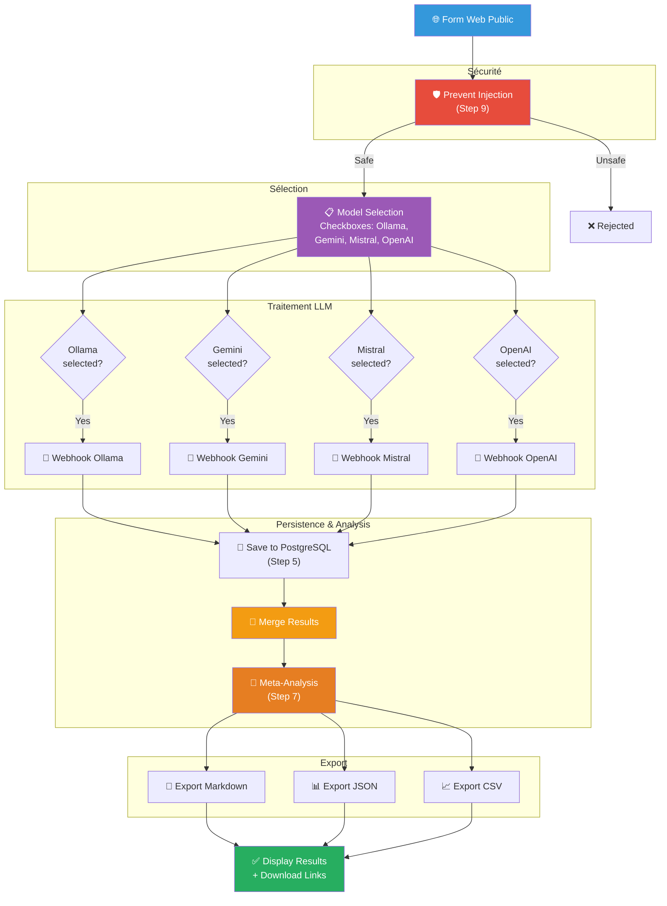

# 10. Bonus : Améliorations avancées et Publication Web

> **Résumé** : Explorez des fonctionnalités avancées et publiez votre comparateur comme une application web professionnelle  
> **Temps estimé** : Variable (2-4 heures selon les fonctionnalités choisies)  
> **Difficulté** : Avancé ⭐⭐⭐⭐  
> **Étape précédente** : [9. Secure Prompt](../9.%20secure%20prompt/README.md)

---

## 🎯 Objectifs pédagogiques

À la fin de cette étape, vous serez capable de :

1. **Créer un workflow global** intégrant toutes les étapes précédentes
2. **Publier une application web** avec interface utilisateur complète
3. **Implémenter des fonctionnalités avancées** (sélection de modèles, filtres, etc.)
4. **Déployer sur le web** avec accès public ou restreint
5. **Créer un dashboard** de visualisation et statistiques
6. **Intégrer des services tiers** (notifications, cloud storage, etc.)

Cette étape transforme votre projet en une **application production-ready** que vous pouvez partager ou déployer.

---

## 📚 Prérequis

### Toutes les étapes précédentes

- ✅ **Étapes 0-9 complétées** : Vous devez avoir tous les workflows fonctionnels
- ✅ **Compréhension globale** du projet

### Connaissances requises

- 🌐 **Développement web (HTML/CSS/JavaScript)**
- 🐳 **Docker et déploiement**
- 🔐 **Sécurité web et authentification**

---

## 🗂️ Table des matières

1. [Workflow Global Intégré](#partie-1--workflow-global-intégré)
2. [Publication Web avec n8n](#partie-2--publication-web-avec-n8n)
3. [Interface Utilisateur Avancée](#partie-3--interface-utilisateur-avancée)
4. [Déploiement et Accessibilité](#partie-4--déploiement-et-accessibilité)
5. [Fonctionnalités Avancées](#partie-5--fonctionnalités-avancées)
6. [Autres Améliorations](#partie-6--autres-améliorations)

---

## Partie 1 : Workflow Global Intégré

### Objectif
Créer un workflow "tout-en-un" qui combine toutes les fonctionnalités.

### Architecture du Workflow Global



### Étapes d'implémentation

#### Étape 1 : Créer le formulaire web avancé

1. **Créez un nouveau workflow** : `global_comparator`

2. **Ajoutez un Form Trigger** avec ces champs :
   ```
   - question (text, required)
   - temperature (number, default: 0.7)
   - max_tokens (number, default: 500)
   - models (checkbox multiple):
     ☐ Ollama (Mistral)
     ☐ Google Gemini
     ☐ Mistral AI
     ☐ OpenAI GPT-3.5
   - export_format (dropdown):
     • Markdown
     • JSON
     • CSV
     • All formats
   ```

#### Étape 2 : Appeler le sous-workflow de sécurité

1. **Ajoutez "Execute Workflow"** → `prevent_prompt_injection`
2. **Ajoutez une condition IF** :
   ```
   {{ $json.success }} === true
   ```

#### Étape 3 : Branching conditionnel par modèle

1. **Ajoutez 4 nœuds IF** (un par modèle) :
   ```javascript
   // Pour Ollama
   {{ $json.models.includes('ollama') }}
   ```

2. **Chaque branche appelle le webhook correspondant**

#### Étape 4 : Merge et sauvegarde

1. **Merge** toutes les réponses
2. **Save to PostgreSQL**
3. **Appeler le Meta-LLM** pour analyse

#### Étape 5 : Exports multiples

1. **Switch Node** basé sur `export_format`
2. **Générer les fichiers** selon le format choisi

---

## Partie 2 : Publication Web avec n8n

### Option A : Page Web Static (Simple)

#### Étape 6 : Créer une landing page HTML

1. **Créez un fichier HTML** : `index.html`
   ```html
   <!DOCTYPE html>
   <html lang="fr">
   <head>
     <meta charset="UTF-8">
     <meta name="viewport" content="width=device-width, initial-scale=1.0">
     <title>Comparateur LLM</title>
     <style>
       * { margin: 0; padding: 0; box-sizing: border-box; }
       body {
         font-family: 'Segoe UI', Tahoma, Geneva, Verdana, sans-serif;
         background: linear-gradient(135deg, #667eea 0%, #764ba2 100%);
         min-height: 100vh;
         display: flex;
         align-items: center;
         justify-content: center;
         padding: 20px;
       }
       .container {
         background: white;
         padding: 40px;
         border-radius: 20px;
         box-shadow: 0 20px 60px rgba(0,0,0,0.3);
         max-width: 800px;
         width: 100%;
       }
       h1 {
         color: #667eea;
         margin-bottom: 10px;
         font-size: 2.5em;
       }
       .subtitle {
         color: #666;
         margin-bottom: 30px;
         font-size: 1.1em;
       }
       .form-group {
         margin-bottom: 25px;
       }
       label {
         display: block;
         margin-bottom: 8px;
         color: #333;
         font-weight: 600;
       }
       input[type="text"], textarea, select, input[type="number"] {
         width: 100%;
         padding: 12px;
         border: 2px solid #e0e0e0;
         border-radius: 8px;
         font-size: 16px;
         transition: border-color 0.3s;
       }
       input:focus, textarea:focus, select:focus {
         outline: none;
         border-color: #667eea;
       }
       textarea {
         min-height: 120px;
         resize: vertical;
       }
       .checkbox-group {
         display: grid;
         grid-template-columns: repeat(2, 1fr);
         gap: 10px;
         margin-top: 10px;
       }
       .checkbox-item {
         display: flex;
         align-items: center;
         padding: 10px;
         border: 2px solid #e0e0e0;
         border-radius: 8px;
         cursor: pointer;
         transition: all 0.3s;
       }
       .checkbox-item:hover {
         border-color: #667eea;
         background: #f8f9ff;
       }
       .checkbox-item input {
         margin-right: 10px;
         width: 20px;
         height: 20px;
         cursor: pointer;
       }
       .button {
         background: linear-gradient(135deg, #667eea 0%, #764ba2 100%);
         color: white;
         padding: 15px 40px;
         border: none;
         border-radius: 8px;
         font-size: 18px;
         font-weight: 600;
         cursor: pointer;
         width: 100%;
         transition: transform 0.2s, box-shadow 0.2s;
       }
       .button:hover {
         transform: translateY(-2px);
         box-shadow: 0 10px 20px rgba(102, 126, 234, 0.4);
       }
       .button:active {
         transform: translateY(0);
       }
       .loading {
         text-align: center;
         padding: 40px;
         display: none;
       }
       .spinner {
         border: 4px solid #f3f3f3;
         border-top: 4px solid #667eea;
         border-radius: 50%;
         width: 50px;
         height: 50px;
         animation: spin 1s linear infinite;
         margin: 0 auto 20px;
       }
       @keyframes spin {
         0% { transform: rotate(0deg); }
         100% { transform: rotate(360deg); }
       }
       .results {
         display: none;
         margin-top: 30px;
       }
       .result-card {
         background: #f8f9ff;
         padding: 20px;
         border-radius: 10px;
         margin-bottom: 15px;
         border-left: 4px solid #667eea;
       }
       .model-name {
         font-weight: 700;
         color: #667eea;
         font-size: 1.2em;
         margin-bottom: 10px;
       }
       .response-text {
         color: #333;
         line-height: 1.6;
       }
       .download-links {
         margin-top: 20px;
         padding: 15px;
         background: #e8f5e9;
         border-radius: 8px;
       }
       .download-links a {
         color: #2e7d32;
         text-decoration: none;
         font-weight: 600;
         margin-right: 15px;
       }
       .download-links a:hover {
         text-decoration: underline;
       }
     </style>
   </head>
   <body>
     <div class="container">
       <h1>🤖 Comparateur LLM</h1>
       <p class="subtitle">Comparez les réponses de plusieurs modèles d'IA en temps réel</p>
       
       <form id="llmForm">
         <div class="form-group">
           <label for="question">Votre question *</label>
           <textarea id="question" name="question" placeholder="Ex: Explique-moi la théorie de la relativité en termes simples" required></textarea>
         </div>
         
         <div class="form-group">
           <label>Sélectionnez les modèles à comparer *</label>
           <div class="checkbox-group">
             <label class="checkbox-item">
               <input type="checkbox" name="models" value="ollama" checked>
               <span>🦙 Ollama (Mistral)</span>
             </label>
             <label class="checkbox-item">
               <input type="checkbox" name="models" value="gemini" checked>
               <span>✨ Google Gemini</span>
             </label>
             <label class="checkbox-item">
               <input type="checkbox" name="models" value="mistral" checked>
               <span>🌊 Mistral AI</span>
             </label>
             <label class="checkbox-item">
               <input type="checkbox" name="models" value="openai">
               <span>🤖 OpenAI GPT-3.5</span>
             </label>
           </div>
         </div>
         
         <div class="form-group">
           <label for="temperature">Température (créativité)</label>
           <input type="number" id="temperature" name="temperature" value="0.7" min="0" max="2" step="0.1">
           <small style="color: #666;">0 = déterministe, 2 = très créatif</small>
         </div>
         
         <div class="form-group">
           <label for="max_tokens">Longueur maximale (tokens)</label>
           <input type="number" id="max_tokens" name="max_tokens" value="500" min="50" max="2000" step="50">
         </div>
         
         <button type="submit" class="button">🚀 Comparer les modèles</button>
       </form>
       
       <div class="loading" id="loading">
         <div class="spinner"></div>
         <p>⏳ Analyse en cours... Cela peut prendre 10-20 secondes.</p>
       </div>
       
       <div class="results" id="results">
         <h2 style="margin-bottom: 20px;">📊 Résultats de la comparaison</h2>
         <div id="resultsContainer"></div>
         <div class="download-links" id="downloads"></div>
       </div>
     </div>
     
     <script>
       const WEBHOOK_URL = 'http://localhost:5678/webhook/global-comparator';
       
       document.getElementById('llmForm').addEventListener('submit', async (e) => {
         e.preventDefault();
         
         // Récupère les données du formulaire
         const formData = new FormData(e.target);
         const models = Array.from(formData.getAll('models'));
         
         if (models.length === 0) {
           alert('⚠️ Veuillez sélectionner au moins un modèle.');
           return;
         }
         
         const data = {
           question: formData.get('question'),
           temperature: parseFloat(formData.get('temperature')),
           max_tokens: parseInt(formData.get('max_tokens')),
           models: models
         };
         
         // Affiche le loader
         document.getElementById('llmForm').style.display = 'none';
         document.getElementById('loading').style.display = 'block';
         document.getElementById('results').style.display = 'none';
         
         try {
           // Appel au webhook n8n
           const response = await fetch(WEBHOOK_URL, {
             method: 'POST',
             headers: {
               'Content-Type': 'application/json'
             },
             body: JSON.stringify(data)
           });
           
           if (!response.ok) {
             throw new Error('Erreur lors de la requête');
           }
           
           const result = await response.json();
           
           // Affiche les résultats
           displayResults(result);
           
         } catch (error) {
           console.error('Erreur:', error);
           alert('❌ Une erreur est survenue. Vérifiez que n8n est bien démarré.');
           document.getElementById('llmForm').style.display = 'block';
         } finally {
           document.getElementById('loading').style.display = 'none';
         }
       });
       
       function displayResults(data) {
         const container = document.getElementById('resultsContainer');
         const downloads = document.getElementById('downloads');
         
         container.innerHTML = '';
         downloads.innerHTML = '';
         
         // Affiche chaque réponse
         if (data.responses) {
           data.responses.forEach(resp => {
             const card = document.createElement('div');
             card.className = 'result-card';
             card.innerHTML = `
               <div class="model-name">${resp.model}</div>
               <div class="response-text">${resp.response}</div>
             `;
             container.appendChild(card);
           });
         }
         
         // Liens de téléchargement
         if (data.exports) {
           downloads.innerHTML = '<strong>📥 Télécharger :</strong> ';
           if (data.exports.markdown) {
             downloads.innerHTML += `<a href="${data.exports.markdown}" download>Markdown</a>`;
           }
           if (data.exports.json) {
             downloads.innerHTML += `<a href="${data.exports.json}" download>JSON</a>`;
           }
           if (data.exports.csv) {
             downloads.innerHTML += `<a href="${data.exports.csv}" download>CSV</a>`;
           }
         }
         
         document.getElementById('results').style.display = 'block';
       }
     </script>
   </body>
   </html>
   ```

2. **Servez le fichier HTML** :
   - Option 1 : Placez-le dans `~/n8n-files/web/` et servez avec nginx
   - Option 2 : Utilisez un serveur HTTP simple :
     ```bash
     python3 -m http.server 8000
     ```
   - Option 3 : Hébergez sur GitHub Pages, Netlify, ou Vercel

---

### Option B : Application React/Vue (Avancé)

#### Étape 7 : Créer une SPA React

1. **Initialisez un projet React** :
   ```bash
   npx create-react-app llm-comparator-web
   cd llm-comparator-web
   ```

2. **Créez le composant principal** (`src/App.js`) :
   ```javascript
   import React, { useState } from 'react';
   import './App.css';
   
   function App() {
     const [question, setQuestion] = useState('');
     const [models, setModels] = useState(['ollama', 'gemini', 'mistral']);
     const [loading, setLoading] = useState(false);
     const [results, setResults] = useState(null);
     
     const handleSubmit = async (e) => {
       e.preventDefault();
       setLoading(true);
       
       try {
         const response = await fetch('http://localhost:5678/webhook/global-comparator', {
           method: 'POST',
           headers: { 'Content-Type': 'application/json' },
           body: JSON.stringify({ question, models })
         });
         
         const data = await response.json();
         setResults(data.responses);
       } catch (error) {
         console.error('Error:', error);
         alert('Erreur lors de la comparaison');
       } finally {
         setLoading(false);
       }
     };
     
     return (
       <div className="App">
         <header className="App-header">
           <h1>🤖 Comparateur LLM</h1>
           <form onSubmit={handleSubmit}>
             <textarea
               value={question}
               onChange={(e) => setQuestion(e.target.value)}
               placeholder="Posez votre question..."
               rows="5"
             />
             
             <div className="model-selection">
               {['ollama', 'gemini', 'mistral', 'openai'].map(model => (
                 <label key={model}>
                   <input
                     type="checkbox"
                     checked={models.includes(model)}
                     onChange={(e) => {
                       if (e.target.checked) {
                         setModels([...models, model]);
                       } else {
                         setModels(models.filter(m => m !== model));
                       }
                     }}
                   />
                   {model}
                 </label>
               ))}
             </div>
             
             <button type="submit" disabled={loading}>
               {loading ? 'Analyse...' : 'Comparer'}
             </button>
           </form>
           
           {results && (
             <div className="results">
               {results.map((r, i) => (
                 <div key={i} className="result-card">
                   <h3>{r.model}</h3>
                   <p>{r.response}</p>
                 </div>
               ))}
             </div>
           )}
         </header>
       </div>
     );
   }
   
   export default App;
   ```

3. **Lancez l'application** :
   ```bash
   npm start
   ```

---

## Partie 3 : Interface Utilisateur Avancée

### Étape 8 : Dashboard de statistiques

1. **Créez un endpoint de stats** dans n8n :
   ```sql
   SELECT 
     COUNT(*) AS total_questions,
     COUNT(DISTINCT DATE(date)) AS active_days,
     provider,
     COUNT(*) AS response_count,
     AVG(LENGTH(reponse)) AS avg_length
   FROM question q
   JOIN reponse r ON q.id = r.question_id
   GROUP BY provider;
   ```

2. **Intégrez Chart.js** dans votre HTML :
   ```html
   <script src="https://cdn.jsdelivr.net/npm/chart.js"></script>
   <canvas id="statsChart"></canvas>
   
   <script>
     fetch('http://localhost:5678/webhook/stats')
       .then(res => res.json())
       .then(data => {
         new Chart(document.getElementById('statsChart'), {
           type: 'bar',
           data: {
             labels: data.map(d => d.provider),
             datasets: [{
               label: 'Nombre de réponses',
               data: data.map(d => d.response_count)
             }]
           }
         });
       });
   </script>
   ```

---

## Partie 4 : Déploiement et Accessibilité

### Étape 9 : Déployer sur le Web

#### Option A : Tunnel avec ngrok (Rapide pour tests)

1. **Installez ngrok** :
   ```bash
   # Mac/Linux
   brew install ngrok
   # Ou téléchargez sur https://ngrok.com/download
   ```

2. **Créez un tunnel** :
   ```bash
   ngrok http 5678
   ```

3. **Obtenez l'URL publique** :
   ```
   Forwarding: https://abc123.ngrok.io -> http://localhost:5678
   ```

4. **Partagez cette URL** pour accès externe !

---

#### Option B : Déploiement VPS (Production)

1. **Louez un VPS** (DigitalOcean, Linode, AWS EC2)

2. **Installez Docker** sur le VPS

3. **Configurez nginx** comme reverse proxy :
   ```nginx
   server {
     listen 80;
     server_name comparateur-llm.example.com;
     
     location / {
       proxy_pass http://localhost:5678;
       proxy_set_header Host $host;
     }
   }
   ```

4. **Ajoutez HTTPS** avec Let's Encrypt :
   ```bash
   sudo certbot --nginx -d comparateur-llm.example.com
   ```

5. **Configurez un nom de domaine** pointant vers le VPS

---

#### Option C : Déploiement Cloud (Scalable)

**Render.com (gratuit pour débuter)** :
1. Créez un compte sur render.com
2. Connectez votre repo GitHub
3. Configurez le service avec `docker-compose.yml`
4. Déployez en un clic !

---

## Partie 5 : Fonctionnalités Avancées

### Étape 10 : Authentification utilisateur

1. **Ajoutez n8n Auth** :
   ```yaml
   environment:
     - N8N_BASIC_AUTH_ACTIVE=true
     - N8N_BASIC_AUTH_USER=admin
     - N8N_BASIC_AUTH_PASSWORD=secure_password
   ```

2. **Ou intégrez OAuth2** (Google, GitHub) pour l'app web

---

### Étape 11 : Notifications par email

1. **Ajoutez un nœud "Send Email"** après analyse :
   ```
   Subject: Votre comparaison LLM est prête !
   Body: Cliquez ici pour voir les résultats : [lien]
   ```

2. **Utilisez Gmail, SendGrid, ou Mailgun**

---

### Étape 12 : Cache et performance

1. **Ajoutez Redis** pour cache :
   ```javascript
   // Avant d'appeler les LLMs
   const cached = await redis.get(`question:${hash(question)}`);
   if (cached) return cached;
   
   // Après réponse
   await redis.set(`question:${hash(question)}`, result, 'EX', 3600);
   ```

---

## Partie 6 : Autres Améliorations

### Pistes d'amélioration supplémentaires

1. **Multi-langues** : Détectez la langue et adaptez l'UI
2. **Historique utilisateur** : Sauvegardez les questions par utilisateur
3. **Comparaison côte-à-côte** : Affichez les réponses en colonnes
4. **Mode sombre** : Ajoutez un toggle pour dark mode
5. **API publique** : Exposez un endpoint RESTful documenté
6. **Intégration Slack/Discord** : Recevez les résultats sur Slack
7. **A/B Testing** : Testez différents prompts automatiquement
8. **Fine-tuning** : Entraînez un modèle sur vos données

---

## ✅ Critères de validation

### Checklist globale

- [ ] Le workflow global intégré fonctionne
- [ ] L'interface web HTML/React est créée
- [ ] La connexion entre frontend et n8n fonctionne
- [ ] Les résultats s'affichent correctement
- [ ] Au moins une méthode de déploiement testée
- [ ] (Optionnel) Dashboard de stats intégré
- [ ] (Optionnel) Authentification configurée
- [ ] Documentation d'utilisation créée

---

### Quiz de compréhension

<details>
<summary><strong>Question 1 :</strong> Pourquoi utiliser un reverse proxy comme nginx ?</summary>

**Réponse :**

**Reverse Proxy (nginx, Traefik)** :
- ✅ **SSL/TLS** : Gère HTTPS automatiquement
- ✅ **Caching** : Accélère les réponses
- ✅ **Load Balancing** : Distribue le trafic
- ✅ **Sécurité** : Masque le serveur backend
- ✅ **Compression** : Réduit la bande passante

**Sans reverse proxy** :
- ❌ n8n expose directement le port 5678
- ❌ Pas de HTTPS (sauf configuration manuelle)
- ❌ Un seul point de défaillance

</details>

<details>
<summary><strong>Question 2 :</strong> Comment gérer le CORS pour l'API n8n ?</summary>

**Réponse :**

**CORS** (Cross-Origin Resource Sharing) permet aux navigateurs d'appeler l'API depuis un autre domaine.

**Dans n8n, configurez les headers de réponse** :
```javascript
// Dans le dernier nœud du workflow
return [{
  json: { ...result },
  headers: {
    'Access-Control-Allow-Origin': '*',  // Ou domaine spécifique
    'Access-Control-Allow-Methods': 'POST, GET, OPTIONS',
    'Access-Control-Allow-Headers': 'Content-Type'
  }
}];
```

**Ou configurez nginx** :
```nginx
add_header Access-Control-Allow-Origin *;
```

</details>

<details>
<summary><strong>Question 3 :</strong> Comment sécuriser une application web publique ?</summary>

**Réponse :**

**Checklist de sécurité** :

1. ✅ **HTTPS** : Chiffrement TLS (Let's Encrypt)
2. ✅ **Authentification** : OAuth2, JWT, ou Basic Auth
3. ✅ **Rate Limiting** : Limite de requêtes par IP
   ```nginx
   limit_req_zone $binary_remote_addr zone=api:10m rate=10r/m;
   ```
4. ✅ **Input Validation** : Sanitize toutes les entrées
5. ✅ **CORS** : Restreindre les origines autorisées
6. ✅ **Headers de sécurité** :
   ```
   X-Frame-Options: DENY
   X-Content-Type-Options: nosniff
   Content-Security-Policy: default-src 'self'
   ```
7. ✅ **Logs** : Surveiller les requêtes suspectes
8. ✅ **Firewall** : ufw ou iptables

</details>

---

## 🔗 Ressources complémentaires

### Documentation interne
- 📂 [Architecture complète](../../ressources/workflow/README.md)
- 📂 [Docker et déploiement](../../ressources/docker/README.md)
- 📂 [Sécurité](../../ressources/credentials/README.md)

### Documentation externe
- [n8n Cloud (hébergement managé)](https://n8n.io/cloud/)
- [Nginx Reverse Proxy Guide](https://docs.nginx.com/nginx/admin-guide/web-server/reverse-proxy/)
- [Let's Encrypt (SSL gratuit)](https://letsencrypt.org/)
- [React Documentation](https://react.dev/)
- [Chart.js Documentation](https://www.chartjs.org/)

---

## 🎉 Conclusion

**Félicitations !** Vous avez complété l'ensemble du projet et créé un comparateur LLM professionnel, sécurisé, et déployable.

### Ce que vous avez appris

- ✅ Intégration de multiples LLMs (locaux et cloud)
- ✅ Architecture modulaire avec sous-workflows
- ✅ Webhooks et APIs REST
- ✅ Persistence avec PostgreSQL
- ✅ Prompt Engineering avancé (RAG, Meta-LLM)
- ✅ Sécurité (injection prevention)
- ✅ Export multi-formats
- ✅ Déploiement web complet

### Prochaines étapes suggérées

1. **Ajoutez plus de modèles** : Claude, LLaMA 3, Gemini 1.5 Pro
   
   **💡 Astuce : Utilisez OpenRouter pour un accès simplifié**
   
   Si vous utilisez **OpenRouter** (voir [Étape 1 - Section D](../1.%20chat%20diversity/README.md#d-alternative-simplifiée--openrouter-optionnel-mais-recommandé)), vous pouvez facilement ajouter ces modèles sans créer de nouveaux comptes :
   
   **Modèles populaires disponibles via OpenRouter :**
   - `anthropic/claude-3.5-sonnet` - Claude 3.5 Sonnet (excellent raisonnement)
   - `meta-llama/llama-3.1-405b-instruct` - Llama 3.1 405B (open source puissant)
   - `google/gemini-pro-1.5` - Gemini 1.5 Pro (multimodal avancé)
   - `mistralai/mixtral-8x22b` - Mixtral 8x22B (performant, français)
   - `qwen/qwen-2-72b-instruct` - Qwen 2 72B (multilingue, performant)
   - `cohere/command-r-plus` - Command R+ (RAG optimisé)
   
   **Avantage** : Changez de modèle en modifiant une seule ligne dans votre workflow !
   
   **Liste complète des modèles** : [https://openrouter.ai/models](https://openrouter.ai/models)
   
   **Référence** : Consultez la [documentation OpenRouter](../../ressources/nocode_lowcode/README.md) dans les ressources.

2. **Implémentez du RAG** avec documents
3. **Créez une API publique** documentée avec Swagger
4. **Contribuez au projet** : Partagez sur GitHub !
5. **Monétisez** : Proposez comme service payant

---

**Vous êtes maintenant un expert en intégration LLM avec n8n !** 🚀🎓

---

**Projet terminé avec succès !** 🏆
