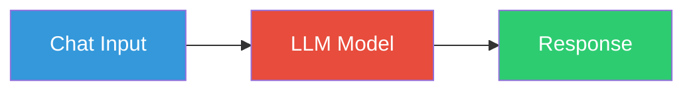
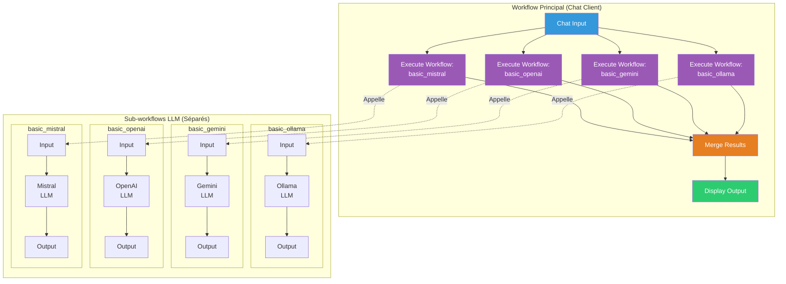

# 2. Diviser le workflow en sous-workflows modulaires

> **Résumé** : Transformez vos workflows monolithiques en une architecture modulaire avec des sous-workflows réutilisables  
> **Temps estimé** : 60-75 minutes  
> **Difficulté** : Intermédiaire ⭐⭐  
> **Étape précédente** : [1. Chat Diversity](../1.%20chat%20diversity/README.md)

---

## 🎯 Objectifs pédagogiques

À la fin de cette étape, vous serez capable de :

1. **Comprendre l'architecture modulaire** et ses avantages par rapport aux workflows monolithiques
2. **Découper un workflow** en sous-workflows distincts (chat client + sous-workflows LLM)
3. **Utiliser le nœud "Execute Workflow"** pour orchestrer plusieurs sous-workflows
4. **Passer des paramètres** entre workflow principal et sous-workflows
5. **Activer et gérer** plusieurs workflows simultanément
6. **Organiser un projet** avec une architecture évolutive et maintenable

Cette étape est **cruciale** pour construire votre comparateur de LLM : elle vous permet d'appeler plusieurs modèles en parallèle depuis un seul point d'entrée.

---

## 📚 Prérequis

### Étape précédente requise

- ✅ **Étape 1 complétée** : Vous devez avoir au moins 3 workflows fonctionnels (Ollama, Gemini, Mistral/OpenAI)
  - 📖 Voir : [1. Chat Diversity](../1.%20chat%20diversity/README.md)

### Connaissances requises

- 🔧 **Architecture et modularité des workflows**
  - 📖 Voir : [/ressources/workflow/README.md - Section Modularité](../../ressources/workflow/README.md)
  
- 🔄 **Patterns d'orchestration**
  - 📖 Voir : [/ressources/workflow/README.md - Section Orchestration](../../ressources/workflow/README.md)

- 📊 **Gestion des données entre workflows**
  - 📖 Voir : [/ressources/formats_donnees/README.md](../../ressources/formats_donnees/README.md)

### Ressources externes

- [n8n Documentation - Execute Workflow Node](https://docs.n8n.io/integrations/builtin/core-nodes/n8n-nodes-base.executeworkflow/)
- [n8n Documentation - Sub-workflows](https://docs.n8n.io/workflows/call-subworkflow/)
- [Video: Sub-workflows in n8n (YouTube)](https://www.youtube.com/watch?v=7zY6xjiNmyw)

---

## 📊 Architecture visuelle

### Avant (Étape 1) : Workflow monolithique



**Problème de cette architecture** :
- ❌ Un workflow par modèle → duplication de code
- ❌ Difficile de comparer plusieurs modèles simultanément
- ❌ Modifications à répéter dans chaque workflow

---

### Après (Étape 2) : Workflows modulaires



**Avantages de cette architecture** :
- ✅ Un seul point d'entrée (chat client)
- ✅ Sous-workflows réutilisables et maintenables
- ✅ Facile d'ajouter/retirer des modèles
- ✅ Possibilité d'appeler les modèles en parallèle (étape 3)

---

### Comparaison des architectures

| Critère | Monolithique (Étape 1) | Modulaire (Étape 2) |
|---------|------------------------|---------------------|
| **Point d'entrée** | Un par workflow (4 chats) | Un seul (chat client) |
| **Maintenance** | Difficile (4x changements) | Facile (1 changement) |
| **Réutilisabilité** | Faible | Élevée |
| **Comparaison** | Manuelle (4 chats ouverts) | Automatisée (1 chat) |
| **Évolutivité** | Limitée | Excellente |
| **Complexité initiale** | Faible | Moyenne |

---

## 🧑‍💻 Instructions étape par étape

### Partie 1 : Organisation du projet

#### Étape 1 : Créer la structure de dossiers

1. **Dans n8n, créez un nouveau dossier**
   - Menu latéral → Workflows → clic droit sur "projet"
   - **"New Folder"** → Nommez-le `2. split workflow`

2. **Planifiez votre structure**
   Vous allez créer **5 workflows** :
   - **1 workflow principal** : `chat_client` (point d'entrée unique)
   - **4 sous-workflows LLM** : `basic_ollama`, `basic_gemini`, `basic_mistral`, `basic_openai`

3. **Structure attendue**
   ```
   projet/
   ├── 0. chat/
   ├── 1. chat diversity/
   └── 2. split workflow/
       ├── chat_client.json           (workflow principal)
       ├── basic_ollama.json          (sous-workflow)
       ├── basic_gemini.json          (sous-workflow)
       ├── basic_mistral.json         (sous-workflow)
       └── basic_openai.json          (sous-workflow)
   ```

---

### Partie 2 : Créer les sous-workflows LLM

#### Étape 2 : Transformer les workflows existants en sous-workflows

Les sous-workflows doivent être **simples et focalisés** : ils reçoivent un message, l'envoient au LLM, et retournent la réponse.

##### A) Créer le sous-workflow `basic_ollama`

1. **Copiez le workflow Ollama de l'Étape 1**
   - Ouvrez `1. Chat Ollama - mistral`
   - Menu **"..."** → **"Duplicate"**
   - Renommez : `basic_ollama`

2. **Supprimez le nœud Chat Trigger**
   - Le sous-workflow ne doit **pas avoir de Chat Trigger**
   - Supprimez-le (sélectionnez-le et appuyez sur Delete)

3. **Ajoutez un nœud "Execute Workflow Trigger"**
   - Cliquez sur **"+"** pour ajouter un nœud
   - Recherchez : `Execute Workflow Trigger`
   - Ce nœud permet au workflow d'être appelé par un autre workflow

4. **Connectez Execute Workflow Trigger → Ollama**
   - Tracez une connexion depuis "Execute Workflow Trigger" vers le nœud "Ollama"

5. **Simplifiez le workflow**
   - Le workflow doit avoir exactement 2 nœuds :
     - `Execute Workflow Trigger` (entrée)
     - `Ollama` (traitement et sortie)

6. **Testez le sous-workflow manuellement**
   - Cliquez sur **"Execute Workflow Trigger"**
   - Cliquez sur **"Test step"**
   - Dans le JSON de test, ajoutez :
     ```json
     {
       "chatInput": "Bonjour, qui es-tu ?"
     }
     ```
   - Exécutez et vérifiez que le LLM répond correctement

7. **Activez le workflow**
   - **Important** : Un sous-workflow doit être **activé** pour être appelable
   - Cliquez sur le toggle en haut à droite : **"Inactive"** → **"Active"**

8. **Sauvegardez**
   - Ctrl+S ou bouton "Save"

---

##### B) Créer les sous-workflows Gemini, Mistral, OpenAI

Répétez le processus pour chaque modèle :

1. **Pour Gemini** :
   - Dupliquez `1. Chat Gemini - gemini-pro`
   - Renommez : `basic_gemini`
   - Remplacez Chat Trigger par Execute Workflow Trigger
   - Connectez : Execute Workflow Trigger → Google Gemini Chat Model
   - Testez, activez, sauvegardez

2. **Pour Mistral** :
   - Dupliquez `1. Chat Mistral - mistral-large-latest`
   - Renommez : `basic_mistral`
   - Remplacez Chat Trigger par Execute Workflow Trigger
   - Connectez : Execute Workflow Trigger → Mistral Chat Model
   - Testez, activez, sauvegardez

3. **Pour OpenAI** (si disponible) :
   - Dupliquez `1. Chat OpenAI - gpt-3.5-turbo`
   - Renommez : `basic_openai`
   - Remplacez Chat Trigger par Execute Workflow Trigger
   - Connectez : Execute Workflow Trigger → OpenAI Chat Model
   - Testez, activez, sauvegardez

**Vérification importante** : À ce stade, vous devez avoir **4 workflows actifs** (voyez les toggles verts dans la liste des workflows).

---

### Partie 3 : Créer le workflow principal (Chat Client)

#### Étape 3 : Construire l'orchestrateur

1. **Créez un nouveau workflow**
   - Cliquez sur **"Add workflow"**
   - Renommez : `chat_client`

2. **Ajoutez un nœud Chat Trigger**
   - C'est le seul workflow qui aura un Chat Trigger
   - Configurez-le comme dans l'Étape 0

---

#### Étape 4 : Ajouter les nœuds "Execute Workflow"

1. **Ajoutez un nœud "Execute Workflow"**
   - Cliquez sur **"+"** après le Chat Trigger
   - Recherchez : `Execute Workflow`
   - Ajoutez-le au canvas

2. **Configurez-le pour appeler Ollama**
   - Double-cliquez sur le nœud
   - **"Source"** : sélectionnez `Database`
   - **"Workflow"** : sélectionnez `basic_ollama` dans la liste
   - **"Fields to Send"** : sélectionnez `All`
   - Donnez un nom au nœud : `Call Ollama`

3. **Répétez pour les autres modèles**
   - Ajoutez 3 autres nœuds "Execute Workflow" (un par modèle)
   - Connectez chacun au Chat Trigger
   - Configurez :
     - `Call Gemini` → workflow `basic_gemini`
     - `Call Mistral` → workflow `basic_mistral`
     - `Call OpenAI` → workflow `basic_openai`

4. **À ce stade, votre workflow ressemble à ceci** :
   ```
   Chat Trigger → Call Ollama
                → Call Gemini
                → Call Mistral
                → Call OpenAI
   ```

---

#### Étape 5 : Fusionner les résultats

1. **Ajoutez un nœud "Merge"**
   - Cliquez sur **"+"** après les nœuds "Execute Workflow"
   - Recherchez : `Merge`
   - Configurez :
     - **Mode** : `Multiplex` (pour garder toutes les réponses séparées)

2. **Connectez tous les "Execute Workflow" au nœud Merge**
   - Tracez une connexion de chaque "Call [Model]" vers "Merge"
   - Le nœud Merge reçoit ainsi les 4 réponses

---

#### Étape 6 : Formater l'affichage des résultats

Pour l'instant, les résultats sont mélangés. Ajoutons un nœud pour mieux les structurer.

1. **Ajoutez un nœud "Code"**
   - Après le nœud Merge, ajoutez un nœud `Code`
   - Ce nœud va formater les réponses de manière lisible

2. **Ajoutez le code suivant** :
   ```javascript
   // Récupère toutes les réponses des LLM
   const responses = [];
   
   for (const item of $input.all()) {
     // Extrait le nom du modèle depuis les métadonnées
     const workflowName = item.json.workflow || 'Unknown';
     const response = item.json.output || item.json.response || item.json.text || 'No response';
     
     responses.push({
       model: workflowName,
       response: response
     });
   }
   
   // Formate un message combiné
   let combined = "📊 **Comparaison des modèles LLM**\n\n";
   
   for (const r of responses) {
     combined += `🤖 **${r.model}**:\n${r.response}\n\n---\n\n`;
   }
   
   return [{ json: { combined, responses } }];
   ```

3. **Connectez Code → Chat Trigger (sortie)**
   - Le résultat formaté sera affiché dans le chat

---

#### Étape 7 : Tester le workflow principal

1. **Sauvegardez le workflow** (Ctrl+S)

2. **Activez le workflow**
   - Toggle "Inactive" → "Active"

3. **Ouvrez le chat**
   - Cliquez sur **"Open chat"** du nœud Chat Trigger

4. **Testez avec un message**
   ```
   Bonjour, peux-tu te présenter en une phrase ?
   ```

5. **Vérifiez que vous recevez 4 réponses**
   - Une de chaque modèle (Ollama, Gemini, Mistral, OpenAI)
   - Formatées de manière lisible

---

### Partie 4 : Sauvegarde et export

#### Étape 8 : Exporter tous les workflows

1. **Exportez chaque workflow en JSON**
   - Ouvrez chaque workflow (chat_client, basic_ollama, basic_gemini, etc.)
   - Menu **"..."** → **"Download"**

2. **Organisez les fichiers**
   - Déplacez tous les JSON dans `projet/2. split workflow/`
   - Vérifiez que vous avez **5 fichiers** :
     ```
     chat_client.json
     basic_ollama.json
     basic_gemini.json
     basic_mistral.json
     basic_openai.json
     ```

---

## ✅ Critères de validation

### Checklist de réussite

Cochez chaque élément une fois terminé :

- [ ] J'ai créé 4 sous-workflows LLM (ollama, gemini, mistral, openai)
- [ ] Chaque sous-workflow utilise "Execute Workflow Trigger" (pas Chat Trigger)
- [ ] Les 4 sous-workflows sont **activés** (toggle vert)
- [ ] J'ai créé le workflow principal `chat_client` avec un Chat Trigger
- [ ] Le workflow principal appelle les 4 sous-workflows via "Execute Workflow"
- [ ] J'ai ajouté un nœud Merge pour combiner les résultats
- [ ] (Optionnel) J'ai ajouté un nœud Code pour formater les réponses
- [ ] Le chat client affiche les réponses des 4 modèles
- [ ] Tous les workflows sont exportés en JSON dans `projet/2. split workflow/`

### Structure de dossier attendue

```
projet/
└── 2. split workflow/
    ├── README.md (ce fichier)
    ├── chat_client.json
    ├── basic_ollama.json
    ├── basic_gemini.json
    ├── basic_mistral.json
    └── basic_openai.json
```

---

### Quiz de compréhension

<details>
<summary><strong>Question 1 :</strong> Pourquoi est-il préférable de diviser un workflow en sous-workflows ?</summary>

**Réponse :**

Diviser un workflow en sous-workflows apporte plusieurs avantages :

1. **Réutilisabilité** : Les sous-workflows peuvent être appelés depuis plusieurs workflows différents (évite la duplication de code)

2. **Maintenabilité** : Modifier un sous-workflow met à jour automatiquement tous les workflows qui l'utilisent

3. **Lisibilité** : Des workflows plus petits et focalisés sont plus faciles à comprendre et déboguer

4. **Testabilité** : Chaque sous-workflow peut être testé indépendamment

5. **Scalabilité** : Ajouter un nouveau modèle LLM ne nécessite que de créer un sous-workflow et l'ajouter au workflow principal

6. **Organisation** : Le projet est mieux structuré et plus facile à naviguer

**Analogie** : C'est comme diviser un programme en fonctions plutôt que d'avoir tout dans un seul bloc de code monolithique.
</details>

<details>
<summary><strong>Question 2 :</strong> Quelle est la différence entre "Chat Trigger" et "Execute Workflow Trigger" ?</summary>

**Réponse :**

| Aspect | Chat Trigger | Execute Workflow Trigger |
|--------|--------------|--------------------------|
| **Usage** | Point d'entrée pour une interface chat utilisateur | Point d'entrée pour être appelé par un autre workflow |
| **Visibilité** | Crée une interface chat accessible via URL | Invisible pour l'utilisateur final |
| **Activation** | Démarré par un message utilisateur | Démarré par un nœud "Execute Workflow" |
| **Type de workflow** | Workflow principal | Sous-workflow |
| **Paramètres** | Reçoit des messages du chat | Reçoit des données du workflow parent |

**Règle importante** : Un workflow ne peut avoir qu'un seul type de trigger. Si vous voulez qu'un workflow soit appelable par un autre, utilisez "Execute Workflow Trigger" (pas Chat Trigger).

Dans notre architecture :
- **chat_client** : Chat Trigger (point d'entrée utilisateur)
- **basic_ollama**, **basic_gemini**, etc. : Execute Workflow Trigger (appelés par chat_client)
</details>

<details>
<summary><strong>Question 3 :</strong> Que se passe-t-il si un sous-workflow n'est pas activé ?</summary>

**Réponse :**

Si un sous-workflow n'est **pas activé**, le nœud "Execute Workflow" qui tente de l'appeler retournera une **erreur** :

```
Workflow "basic_ollama" is not active
```

**Conséquences** :
- Le workflow principal s'arrête ou skip ce nœud (selon la configuration de gestion d'erreurs)
- Vous ne recevez pas de réponse de ce modèle
- Les autres sous-workflows actifs continuent de fonctionner

**Solution** :
1. Ouvrez le sous-workflow en question
2. Activez-le via le toggle "Inactive" → "Active" en haut à droite
3. Retestez le workflow principal

**Bonne pratique** : Avant de tester le workflow principal, vérifiez que tous les sous-workflows sont activés (vérifiez les toggles verts dans la liste des workflows).
</details>

<details>
<summary><strong>Question 4 :</strong> Comment passer des paramètres d'un workflow parent à un sous-workflow ?</summary>

**Réponse :**

Il existe plusieurs méthodes pour passer des paramètres :

**Méthode 1 : Fields to Send = "All"** (recommandé pour débuter)
- Dans le nœud "Execute Workflow", configurez **"Fields to Send"** → `All`
- Toutes les données du nœud parent sont transmises au sous-workflow
- Le sous-workflow accède aux données via `$json` ou `$input.first().json`

**Méthode 2 : Fields to Send = "Selected"** (plus précis)
- Configurez **"Fields to Send"** → `Selected`
- Spécifiez les champs exacts à transmettre (ex: `chatInput`, `userId`, etc.)
- Plus performant et sécurisé (évite de transmettre des données inutiles)

**Exemple de configuration "Selected"** :
```
Field 1: chatInput → {{ $json.chatInput }}
Field 2: userId → {{ $json.userId }}
```

**Dans le sous-workflow**, accédez aux paramètres :
```javascript
const chatInput = $input.first().json.chatInput;
const userId = $input.first().json.userId;
```

**Référence** : [/ressources/workflow/README.md - Section Passage de paramètres](../../ressources/workflow/README.md)
</details>

<details>
<summary><strong>Question 5 :</strong> Quel est le rôle du nœud "Merge" dans le workflow principal ?</summary>

**Réponse :**

Le nœud **Merge** combine les sorties de plusieurs nœuds en une seule liste de données. Dans notre cas :

**Fonction** :
- Collecte les réponses des 4 nœuds "Execute Workflow" (ollama, gemini, mistral, openai)
- Fusionne ces réponses en un seul flux de données
- Permet de traiter toutes les réponses ensemble (ex: formatage, comparaison, stockage)

**Modes du nœud Merge** :

| Mode | Description | Cas d'usage |
|------|-------------|-------------|
| **Append** | Concatène les items dans l'ordre d'arrivée | Simple liste séquentielle |
| **Multiplex** | Garde les items séparés mais dans le même flux | Traiter chaque réponse individuellement |
| **Merge by Key** | Fusionne les items ayant la même clé | Combiner des données complémentaires |

**Pour notre projet**, utilisez **Multiplex** pour garder les 4 réponses distinctes tout en les passant au nœud suivant (Code ou autre).

**Alternative** : Si vous ne voulez pas fusionner les réponses et préférez les afficher séparément, vous pouvez connecter chaque "Execute Workflow" directement au Chat Trigger (mais c'est moins élégant).
</details>

---

## 🐛 Dépannage

### Problème : "Workflow not found" lors de l'appel d'un sous-workflow

**Symptômes** : Le nœud "Execute Workflow" retourne une erreur indiquant que le workflow n'existe pas

**Solutions** :

1. **Vérifiez que le sous-workflow existe bien**
   - Allez dans la liste des workflows (menu latéral)
   - Cherchez le nom du workflow (ex: `basic_ollama`)

2. **Vérifiez l'orthographe du nom**
   - Les noms de workflows sont sensibles à la casse
   - `basic_ollama` ≠ `Basic_Ollama`

3. **Utilisez la sélection par ID plutôt que par nom**
   - Dans le nœud "Execute Workflow", configurez :
     - **Source** : `Database` (plutôt que `Workflow File`)
     - **Workflow** : sélectionnez dans la liste déroulante (plutôt que taper le nom)

4. **Rechargez n8n**
   - Parfois, le cache n8n ne se rafraîchit pas immédiatement
   - Rechargez la page (Ctrl+Shift+R)

---

### Problème : Le sous-workflow ne retourne aucune donnée

**Symptômes** : Le workflow principal s'exécute, mais les réponses des LLM sont vides

**Solutions** :

1. **Testez le sous-workflow indépendamment**
   - Ouvrez le sous-workflow
   - Exécutez-le manuellement avec des données de test :
     ```json
     {
       "chatInput": "Test message"
     }
     ```
   - Vérifiez qu'il retourne bien une réponse

2. **Vérifiez la structure des données**
   - Dans le workflow principal, cliquez sur "Execute Workflow"
   - Inspectez les données de sortie
   - Vérifiez que le champ `chatInput` (ou autre) est bien transmis au sous-workflow

3. **Vérifiez la configuration du LLM**
   - Le nœud LLM dans le sous-workflow doit recevoir le bon champ
   - Dans le nœud Ollama/Gemini/etc., vérifiez que le champ "Message" pointe vers la bonne variable :
     ```
     {{ $json.chatInput }}
     ```

4. **Ajoutez un nœud "Edit Fields" avant le LLM**
   - Cela peut aider à normaliser les données avant de les passer au LLM
   - Mappez explicitement : `chatInput` → `message`

---

### Problème : Les 4 modèles ne s'exécutent pas en même temps

**Symptômes** : Les réponses arrivent séquentiellement (une après l'autre), pas en parallèle

**Explication** : C'est **normal à ce stade** ! Dans cette étape (Step 2), les workflows s'exécutent **séquentiellement** (un après l'autre).

**Solution** : L'exécution **en parallèle** sera implémentée à l'**Étape 3** avec le nœud "Split In Batches" ou en configurant les "Execute Workflow" pour s'exécuter en parallèle.

**Pour l'instant** :
- Vérifiez que les 4 modèles répondent correctement (même si c'est lent)
- Acceptez le délai cumulé (ex: 4 modèles × 3 sec = ~12 sec au total)

**Référence** : [Étape 3 : Distribuer le workflow](../3.%20distribute%20workflow/README.md)

---

### Problème : Le nœud Merge ne combine pas correctement les données

**Symptômes** : Les données sont mélangées, dupliquées, ou manquantes

**Solutions** :

1. **Vérifiez le mode du nœud Merge**
   - Pour notre cas, utilisez **Multiplex** (garde les items séparés)
   - Évitez **Append** si vous voulez traiter chaque réponse individuellement

2. **Inspectez les données d'entrée**
   - Cliquez sur le nœud Merge → onglet "Input"
   - Vérifiez que les 4 connexions envoient bien des données

3. **Ajoutez un nœud "Code" après le Merge**
   - Pour mieux contrôler la fusion et le formatage
   - Exemple :
     ```javascript
     const allResponses = $input.all();
     console.log('Nombre de réponses:', allResponses.length);
     
     return allResponses.map((item, index) => ({
       json: {
         model: `Model ${index + 1}`,
         response: item.json.output || item.json
       }
     }));
     ```

---

### Problème : "Too many workflows active" ou problèmes de performance

**Symptômes** : n8n devient lent, ou affiche une erreur de limite de workflows actifs

**Solutions** :

1. **Désactivez les workflows de l'Étape 1**
   - Les workflows de l'Étape 1 (chat diversity) ne sont plus nécessaires
   - Désactivez-les pour libérer des ressources :
     - Ouvrez chaque workflow de l'Étape 1
     - Toggle "Active" → "Inactive"

2. **Optimisez les ressources Docker** (si applicable)
   - Augmentez la mémoire allouée à Docker
   - Consultez [/ressources/docker/README.md](../../ressources/docker/README.md)

3. **Utilisez une base de données externe** (pour les projets avancés)
   - Par défaut, n8n utilise SQLite (limite de performance)
   - Pour la production, migrez vers PostgreSQL
   - Consultez [/ressources/bases_donnees/README.md](../../ressources/bases_donnees/README.md)

---

## 🔗 Ressources complémentaires

### Documentation interne

- 📂 [Architecture des workflows](../../ressources/workflow/README.md)
- 📂 [Formats de données et transformations](../../ressources/formats_donnees/README.md)
- 📂 [No-code/Low-code - Patterns avancés](../../ressources/nocode_lowcode/README.md)
- 📂 [Glossaire - Termes d'orchestration](../../ressources/GLOSSARY.md)

### Documentation externe

- [n8n - Execute Workflow Node](https://docs.n8n.io/integrations/builtin/core-nodes/n8n-nodes-base.executeworkflow/)
- [n8n - Merge Node](https://docs.n8n.io/integrations/builtin/core-nodes/n8n-nodes-base.merge/)
- [n8n - Best Practices for Sub-workflows](https://docs.n8n.io/workflows/call-subworkflow/)
- [Video: Building Modular Workflows in n8n](https://www.youtube.com/watch?v=7zY6xjiNmyw)

### Articles et tutoriels

- [Microservices Architecture in n8n](https://blog.n8n.io/microservices-architecture/)
- [Design Patterns for Automation](https://www.patterns.dev/posts/automation-patterns/)

---

## ➡️ Étape suivante

Une fois cette étape validée, vous êtes prêt à passer à :

**[Étape 3 : Distribuer le workflow (exécution parallèle)](../3.%20distribute%20workflow/README.md)**

Dans l'étape suivante, vous apprendrez à :
- Exécuter les 4 sous-workflows **en parallèle** (pour gagner du temps)
- Utiliser le nœud "Split In Batches" pour orchestrer les appels
- Gérer les timeouts et erreurs de manière robuste
- Optimiser les performances du comparateur

---

## 📝 Notes et observations

Utilisez cet espace pour noter vos observations lors de la réalisation de cette étape :

- **Temps réel passé** : _____ minutes
- **Difficultés rencontrées** : _____________________________
- **Temps de réponse cumulé (4 modèles)** : _____ secondes
- **Architecture choisie** : _____________________________
- **Questions non résolues** : _____________________________

---

**Félicitations pour avoir complété cette étape !** Votre comparateur de LLM prend forme avec une architecture modulaire et maintenable. 🎉
