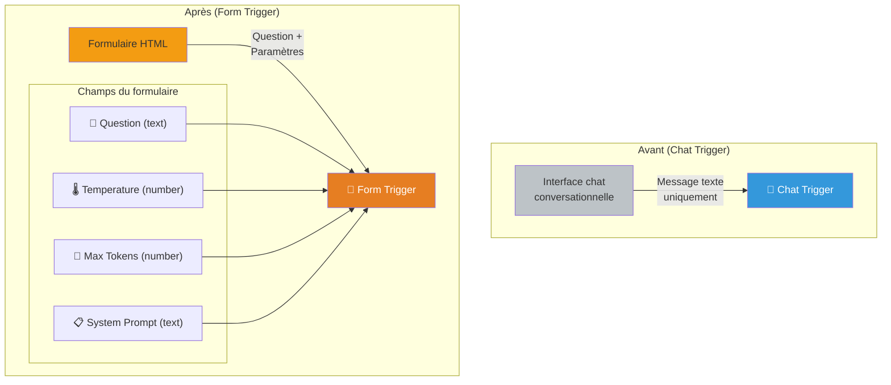
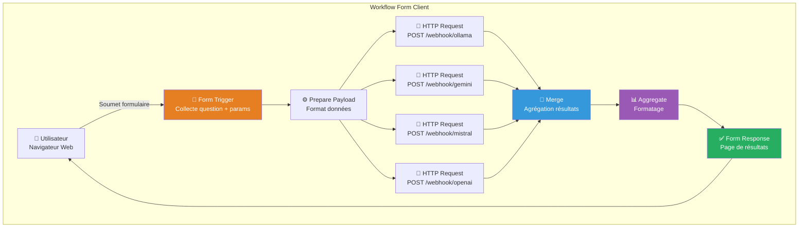

# 4. Ajouter une interface de formulaire

> **Résumé** : Remplacez le chat par un formulaire web riche pour personnaliser les paramètres des requêtes LLM  
> **Temps estimé** : 45-60 minutes  
> **Difficulté** : Intermédiaire ⭐⭐  
> **Étape précédente** : [3. Distribute Workflow](../3.%20distribute%20workflow/README.md)

---

## 🎯 Objectifs pédagogiques

À la fin de cette étape, vous serez capable de :

1. **Utiliser le nœud "Form Trigger"** pour créer une interface web de saisie
2. **Configurer des champs de formulaire** (texte, nombre, liste déroulante)
3. **Remplacer le Chat Trigger** par un formulaire plus adapté aux tests et comparaisons
4. **Transmettre les paramètres du formulaire** aux webhooks LLM
5. **Agréger et formater les résultats** de manière structurée
6. **Créer une page de résultats** affichant les réponses de tous les modèles

Cette étape transforme votre comparateur en une **application web** accessible via un simple formulaire, idéale pour des tests rapides et systématiques.

---

## 📚 Prérequis

### Étape précédente requise

- ✅ **Étape 3 complétée** : Vous devez avoir un workflow client HTTP fonctionnel avec 4 webhooks
  - 📖 Voir : [3. Distribute Workflow](../3.%20distribute%20workflow/README.md)

### Connaissances requises

- 🔧 **Manipulation de workflows n8n**
  - 📖 Voir : [/ressources/workflow/README.md](../../ressources/workflow/README.md)
  
- 📊 **Formats de données et agrégation**
  - 📖 Voir : [/ressources/formats_donnees/README.md](../../ressources/formats_donnees/README.md)

- 🌐 **Bases des formulaires HTML**
  - 📖 Voir : [/ressources/nocode_lowcode/README.md - Section Forms](../../ressources/nocode_lowcode/README.md)

### Ressources externes

- [n8n Documentation - Form Trigger Node](https://docs.n8n.io/integrations/builtin/core-nodes/n8n-nodes-base.form/)
- [n8n Documentation - Merge Node](https://docs.n8n.io/flow-logic/merging/#merge-data-from-multiple-node-executions)
- [n8n Documentation - Aggregate Node](https://docs.n8n.io/integrations/builtin/core-nodes/n8n-nodes-base.aggregate/)

---

## 📊 Architecture visuelle

### Différence entre Chat et Form



**Avantages du formulaire** :
- ✅ Paramètres configurables (température, max_tokens, etc.)
- ✅ Interface structurée et claire
- ✅ Validation des champs côté client
- ✅ Mieux adapté aux tests systématiques
- ✅ Page de résultats dédiée (pas d'interface conversationnelle)

---

### Architecture du workflow avec formulaire



---

## 🧑‍💻 Instructions étape par étape

### Partie 1 : Préparer le workflow

#### Étape 1 : Dupliquer le workflow de l'Étape 3

1. **Ouvrez le workflow `http_client` de l'Étape 3**
   - Naviguez vers le dossier `3. distribute workflow`
   - Ouvrez le workflow `http_client`

2. **Dupliquez-le**
   - Menu **"..."** → **"Duplicate"**
   - Renommez : `form_client`

3. **Créez un dossier pour l'Étape 4**
   - Menu latéral → Workflows → clic droit sur "projet"
   - **"New Folder"** → Nommez-le `4. forms`
   - Déplacez le workflow `form_client` dans ce dossier

---

### Partie 2 : Remplacer le Chat Trigger par un Form Trigger

#### Étape 2 : Configurer le Form Trigger

1. **Supprimez le nœud Chat Trigger**
   - Sélectionnez le nœud "Chat Trigger"
   - Appuyez sur Delete

2. **Ajoutez un nœud "Form Trigger"**
   - Cliquez sur **"+"** au début du workflow
   - Recherchez : `Form Trigger`
   - Ajoutez-le au canvas

3. **Configurez le formulaire de base**
   - Double-cliquez sur le nœud "Form Trigger"
   - **Form Title** : `Comparateur de LLM`
   - **Form Description** : `Comparez les réponses de différents modèles de langage`
   - **Submit Button Label** : `Comparer les modèles`

---

#### Étape 3 : Ajouter les champs du formulaire

1. **Ajoutez le champ "Question"**
   - Dans la section **Form Fields**, cliquez sur **"Add Field"**
   - Configurez :
     - **Field Type** : `Text`
     - **Field Label** : `Votre question`
     - **Field Name** : `question`
     - **Required** : activé (coché)
     - **Placeholder** : `Ex: Explique-moi l'intelligence artificielle en termes simples`
     - **Multiline** : activé (pour permettre de longues questions)

2. **Ajoutez le champ "Temperature" (optionnel mais recommandé)**
   - Cliquez sur **"Add Field"**
   - Configurez :
     - **Field Type** : `Number`
     - **Field Label** : `Température (créativité)`
     - **Field Name** : `temperature`
     - **Required** : désactivé
     - **Default Value** : `0.7`
     - **Min Value** : `0`
     - **Max Value** : `2`
     - **Step** : `0.1`
     - **Description** : `0 = déterministe, 2 = très créatif`

3. **Ajoutez le champ "Max Tokens" (optionnel)**
   - Cliquez sur **"Add Field"**
   - Configurez :
     - **Field Type** : `Number`
     - **Field Label** : `Longueur max de la réponse (tokens)`
     - **Field Name** : `max_tokens`
     - **Required** : désactivé
     - **Default Value** : `500`
     - **Min Value** : `50`
     - **Max Value** : `2000`
     - **Step** : `50`

4. **Ajoutez le champ "System Prompt" (avancé, optionnel)**
   - Cliquez sur **"Add Field"**
   - Configurez :
     - **Field Type** : `Text`
     - **Field Label** : `Instructions système (avancé)`
     - **Field Name** : `system_prompt`
     - **Required** : désactivé
     - **Placeholder** : `Ex: Tu es un expert en pédagogie...`
     - **Multiline** : activé

5. **Sauvegardez la configuration**

---

#### Étape 4 : Tester l'affichage du formulaire

1. **Activez le workflow**
   - Toggle "Inactive" → "Active"

2. **Cliquez sur "Test URL"** dans le nœud Form Trigger
   - n8n affiche une URL de test : `http://localhost:5678/form-test/...`
   - Copiez cette URL

3. **Ouvrez l'URL dans votre navigateur**
   - Vérifiez que le formulaire s'affiche correctement
   - Testez les champs (ne soumettez pas encore)

---

### Partie 3 : Adapter le workflow pour transmettre les données

#### Étape 5 : Ajouter un nœud de préparation des données

1. **Ajoutez un nœud "Code"** après le Form Trigger
   - Cliquez sur **"+"** après le Form Trigger
   - Recherchez : `Code`
   - Renommez-le : `Prepare Payload`

2. **Ajoutez le code suivant** :
   ```javascript
   // Récupère les données du formulaire
   const formData = $input.first().json;
   
   // Construit le payload pour les webhooks LLM
   const payload = {
     chatInput: formData.question,
     temperature: formData.temperature || 0.7,
     max_tokens: formData.max_tokens || 500
   };
   
   // Ajoute le system prompt s'il est fourni
   if (formData.system_prompt) {
     payload.system_prompt = formData.system_prompt;
   }
   
   return [{ json: payload }];
   ```

3. **Connectez Form Trigger → Prepare Payload**

---

#### Étape 6 : Mettre à jour les nœuds HTTP Request

1. **Ouvrez chaque nœud "HTTP Request"** (Ollama, Gemini, Mistral, OpenAI)

2. **Vérifiez la configuration du Body**
   - **Send Body** : activé, type `JSON`
   - **JSON Body** : remplacez par :
     ```json
     {
       "chatInput": "={{ $json.chatInput }}",
       "temperature": "={{ $json.temperature }}",
       "max_tokens": "={{ $json.max_tokens }}"
     }
     ```
   - Si `system_prompt` est fourni, ajoutez-le aussi (optionnel)

3. **Sauvegardez chaque nœud**

---

### Partie 4 : Agréger et formater les résultats

#### Étape 7 : Vérifier le nœud Merge

1. **Le nœud "Merge" doit déjà exister** (de l'Étape 3)
   - S'il n'existe pas, ajoutez-le après les 4 nœuds HTTP Request
   - Configurez : **Mode** = `Multiplex`

2. **Connectez les 4 HTTP Request au Merge**

---

#### Étape 8 : Ajouter un nœud Aggregate (optionnel mais recommandé)

1. **Ajoutez un nœud "Aggregate"** après le Merge
   - Cliquez sur **"+"** après le Merge
   - Recherchez : `Aggregate`

2. **Configurez l'agrégation**
   - **Aggregate** : `All Items Data`
   - **Include** : `All Fields`
   - Cela permet de combiner toutes les réponses en un seul objet JSON

**Alternative avec Code** (plus flexible) :
```javascript
const responses = $input.all();
const results = [];

for (let i = 0; i < responses.length; i++) {
  const item = responses[i].json;
  
  // Détermine le nom du modèle
  let modelName = 'Unknown';
  if (i === 0) modelName = 'Ollama (Mistral)';
  if (i === 1) modelName = 'Google Gemini';
  if (i === 2) modelName = 'Mistral AI';
  if (i === 3) modelName = 'OpenAI';
  
  results.push({
    model: modelName,
    response: item.output || item.response || item.text || 'No response',
    tokens: item.tokens_used || 'N/A'
  });
}

return [{ json: { results } }];
```

---

#### Étape 9 : Configurer la réponse du formulaire

1. **Le nœud Form Trigger gère automatiquement la réponse**
   - Une fois le workflow terminé, le Form Trigger affiche une page de résultats

2. **(Optionnel) Personnalisez la page de résultats**
   - Dans le nœud "Form Trigger", allez dans **"Options"**
   - **On Completion** : `Show Text`
   - **Completion Text** :
     ```html
     <h2>✅ Comparaison terminée !</h2>
     <p>Consultez les résultats ci-dessous :</p>
     <pre>{{ $json.results }}</pre>
     ```

**Alternative avancée avec HTML** :
```html
<style>
  .result-card {
    border: 1px solid #ccc;
    padding: 15px;
    margin: 10px 0;
    border-radius: 5px;
  }
  .model-name {
    font-weight: bold;
    color: #2c3e50;
  }
</style>

<h2>📊 Résultats de la comparaison</h2>

{{#each $json.results}}
  <div class="result-card">
    <div class="model-name">🤖 {{ this.model }}</div>
    <p>{{ this.response }}</p>
    <small>Tokens utilisés: {{ this.tokens }}</small>
  </div>
{{/each}}
```

---

### Partie 5 : Tests et optimisations

#### Étape 10 : Tester le workflow complet

1. **Sauvegardez le workflow** (Ctrl+S)

2. **Activez-le** si ce n'est pas déjà fait

3. **Ouvrez l'URL de test du formulaire**
   - Cliquez sur "Test URL" dans le Form Trigger
   - Ouvrez l'URL dans votre navigateur

4. **Remplissez le formulaire**
   - **Question** : `Explique-moi la théorie de la relativité en termes simples`
   - **Temperature** : `0.7`
   - **Max Tokens** : `300`
   - Laissez System Prompt vide pour l'instant

5. **Soumettez le formulaire**
   - Cliquez sur "Comparer les modèles"
   - Attendez quelques secondes

6. **Vérifiez les résultats**
   - Vous devriez voir les réponses des 4 modèles
   - Comparez la qualité, le style, et la longueur des réponses

---

#### Étape 11 : Tests avancés

1. **Testez avec différentes températures**
   - Temperature = `0` : Réponses déterministes et factuelles
   - Temperature = `1.5` : Réponses plus créatives et variées

2. **Testez avec un System Prompt**
   - Exemple : `Tu es un professeur de physique qui explique les concepts complexes avec des analogies simples.`
   - Observez comment le ton et le style changent

3. **Testez avec des questions en anglais**
   - Vérifiez que tous les modèles supportent le multilingue

---

### Partie 6 : Sauvegarde et export

#### Étape 12 : Exporter le workflow

1. **Enregistrez le workflow** (Ctrl+S)

2. **Exportez-le en JSON**
   - Menu **"..."** → **"Download"**
   - Déplacez le fichier dans `projet/4. forms/`

3. **Structure de dossier attendue** :
   ```
   projet/
   └── 4. forms/
       ├── README.md (ce fichier)
       └── form_client.json
   ```

---

## ✅ Critères de validation

### Checklist de réussite

Cochez chaque élément une fois terminé :

- [ ] J'ai dupliqué le workflow de l'Étape 3
- [ ] J'ai remplacé le Chat Trigger par un Form Trigger
- [ ] Le formulaire contient au minimum le champ "question"
- [ ] (Optionnel) Le formulaire contient les champs "temperature" et "max_tokens"
- [ ] J'ai ajouté un nœud "Prepare Payload" pour formater les données
- [ ] Les 4 nœuds HTTP Request transmettent les bons paramètres
- [ ] Le nœud Merge agrège correctement les 4 réponses
- [ ] (Optionnel) J'ai ajouté un nœud Aggregate ou Code pour formater les résultats
- [ ] Le formulaire affiche une page de résultats après soumission
- [ ] J'ai testé avec plusieurs questions et paramètres
- [ ] Le workflow est exporté en JSON dans `projet/4. forms/`

---

### Quiz de compréhension

<details>
<summary><strong>Question 1 :</strong> Quels sont les avantages d'un formulaire par rapport à un chat ?</summary>

**Réponse :**

| Critère | Chat Trigger | Form Trigger |
|---------|--------------|--------------|
| **Type d'interaction** | Conversationnelle (messages successifs) | Transaction unique (soumettre → résultats) |
| **Paramètres** | Difficile (nécessite parsing du texte) | Facile (champs structurés) |
| **Validation** | Manuelle (dans le code) | Automatique (HTML5 validation) |
| **UI/UX** | Interface chat (type Slack, Discord) | Formulaire classique (type Google Forms) |
| **Cas d'usage idéal** | Conversation, assistance interactive | Tests, comparaisons, configuration |
| **Résultats** | Affichés dans le chat (limité) | Page dédiée (HTML personnalisable) |

**Pour un comparateur de LLM**, le formulaire est plus adapté car :
- ✅ Permet de configurer finement les paramètres (température, tokens, etc.)
- ✅ Affiche tous les résultats simultanément (pas de messages successifs)
- ✅ Facilite les tests systématiques (remplir → comparer → recommencer)
- ✅ Plus proche d'une application web classique

</details>

<details>
<summary><strong>Question 2 :</strong> À quoi sert le paramètre "temperature" dans un LLM ?</summary>

**Réponse :**

La **température** contrôle le degré de **créativité** ou **déterminisme** du modèle :

**Temperature = 0** (déterministe) :
- Le modèle choisit toujours la réponse la plus probable
- Réponses factuelles, cohérentes, prévisibles
- Idéal pour : documentation technique, réponses précises, FAQ

**Temperature = 0.7** (équilibré, défaut) :
- Mélange de précision et de créativité
- Réponses variées mais cohérentes
- Idéal pour : usage général, conversation, assistance

**Temperature = 1.5-2** (créatif) :
- Le modèle explore des réponses moins probables
- Plus de variété, d'originalité, mais risque d'incohérence
- Idéal pour : brainstorming, écriture créative, génération d'idées

**Exemple concret** :
Prompt : `Donne-moi un nom pour mon chat`

- Temp = 0 : "Minou" (toujours la même réponse)
- Temp = 0.7 : "Felix", "Simba", "Luna" (varie selon les runs)
- Temp = 2 : "Zéphyr", "Pixel", "Quantum" (très original, parfois étrange)

**Bonne pratique** : Testez plusieurs températures dans votre comparateur pour voir comment chaque modèle se comporte !

</details>

<details>
<summary><strong>Question 3 :</strong> Quelle est la différence entre "Merge" et "Aggregate" ?</summary>

**Réponse :**

**Merge** :
- **Fonction** : Combine plusieurs flux de données en un seul flux
- **Entrées** : Plusieurs connexions de nœuds différents
- **Sortie** : Un flux contenant tous les items (dans l'ordre ou multiplex)
- **Cas d'usage** : Rassembler les sorties de plusieurs branches parallèles

**Modes du Merge** :
- `Append` : Concatène les items séquentiellement
- `Multiplex` : Garde les items séparés mais dans le même flux

**Aggregate** :
- **Fonction** : Transforme plusieurs items en un seul item agrégé
- **Entrées** : Un flux avec plusieurs items
- **Sortie** : Un seul item contenant les données combinées (ou une synthèse)
- **Cas d'usage** : Calculer des statistiques, créer un rapport combiné

**Dans notre workflow** :
1. **Merge** : Rassemble les 4 réponses (Ollama, Gemini, Mistral, OpenAI) en un seul flux
2. **Aggregate** : Combine ces 4 réponses en un seul objet JSON structuré pour l'affichage

**Analogie** :
- Merge = Mettre 4 documents dans le même dossier
- Aggregate = Créer un rapport qui synthétise ces 4 documents

</details>

<details>
<summary><strong>Question 4 :</strong> Comment valider les entrées utilisateur dans un formulaire n8n ?</summary>

**Réponse :**

**Validation côté client (Form Trigger)** :

1. **Required** : Champ obligatoire
   ```
   Required: activé → l'utilisateur doit remplir le champ
   ```

2. **Type validation** :
   - `Number` : Accepte uniquement des nombres
   - `Email` : Valide le format email
   - `URL` : Valide le format URL

3. **Min/Max pour les nombres** :
   ```
   Min Value: 0
   Max Value: 2
   Step: 0.1
   ```

4. **Pattern (regex) pour les textes** :
   ```
   Pattern: ^[a-zA-Z0-9 ]{5,100}$
   → Accepte uniquement lettres, chiffres, espaces (5-100 caractères)
   ```

**Validation côté serveur (n8n Code Node)** :

Ajoutez un nœud Code après le Form Trigger :
```javascript
const formData = $input.first().json;

// Validation de la question
if (!formData.question || formData.question.length < 5) {
  throw new Error("La question doit contenir au moins 5 caractères");
}

// Validation de la température
if (formData.temperature < 0 || formData.temperature > 2) {
  throw new Error("La température doit être entre 0 et 2");
}

// Sanitisation (retirer les balises HTML)
formData.question = formData.question.replace(/<[^>]*>/g, '');

return [{ json: formData }];
```

**Bonnes pratiques** :
- ✅ Toujours valider côté serveur (la validation client peut être contournée)
- ✅ Sanitiser les entrées pour éviter les injections
- ✅ Limiter la longueur des champs (éviter les abus)
- ✅ Fournir des messages d'erreur clairs

</details>

<details>
<summary><strong>Question 5 :</strong> Comment personnaliser l'affichage des résultats dans le Form Trigger ?</summary>

**Réponse :**

Le Form Trigger propose plusieurs options pour afficher les résultats :

**Option 1 : Show Text (simple)** :
- Dans le Form Trigger → Options → **On Completion** : `Show Text`
- **Completion Text** : Texte ou HTML simple
  ```html
  <h2>Merci !</h2>
  <p>Résultats : {{ $json }}</p>
  ```

**Option 2 : HTML personnalisé avec Handlebars** :
```html
<style>
  .card {
    border: 2px solid #3498db;
    padding: 20px;
    margin: 10px;
    border-radius: 8px;
  }
</style>

<h1>📊 Résultats de la comparaison</h1>

{{#each $json.results}}
  <div class="card">
    <h3>{{ this.model }}</h3>
    <p>{{ this.response }}</p>
  </div>
{{/each}}
```

**Option 3 : Redirect (vers une page externe)** :
- **On Completion** : `Redirect`
- **Redirect URL** : `https://mon-site.com/results?id={{ $json.id }}`

**Option 4 : Webhook de callback (avancé)** :
- Le Form Trigger peut envoyer les résultats à un autre webhook
- Ce webhook peut générer une page HTML complète ou sauvegarder les données

**Variables disponibles dans Handlebars** :
- `{{ $json }}` : Toutes les données du dernier nœud
- `{{ $json.results }}` : Tableau des résultats (si structuré ainsi)
- `{{#each}}...{{/each}}` : Boucle sur un tableau
- `{{#if}}...{{/if}}` : Condition

**Référence** : [n8n Form Trigger - Completion Options](https://docs.n8n.io/integrations/builtin/core-nodes/n8n-nodes-base.form/)

</details>

---

## 🐛 Dépannage

### Problème : Le formulaire ne s'affiche pas correctement

**Symptômes** : Page blanche, erreur 404, ou formulaire cassé

**Solutions** :

1. **Vérifiez que le workflow est activé**
   - Toggle "Inactive" → "Active"

2. **Utilisez l'URL de test, pas l'URL de production**
   - Cliquez sur "Test URL" dans le Form Trigger
   - L'URL de test fonctionne avant l'activation

3. **Vérifiez la configuration du Form Trigger**
   - Au moins un champ doit être défini
   - Le "Form Title" ne doit pas être vide

4. **Consultez les logs n8n**
   ```bash
   docker compose logs n8n
   ```

---

### Problème : Les données du formulaire ne sont pas transmises aux webhooks

**Symptômes** : Les webhooks retournent des erreurs ou des réponses vides

**Solutions** :

1. **Vérifiez le nœud "Prepare Payload"**
   - Exécutez le workflow et inspectez les données à chaque étape
   - Cliquez sur chaque nœud pour voir les données d'entrée/sortie

2. **Vérifiez le mapping dans les HTTP Request**
   - Les champs doivent correspondre :
     ```json
     {
       "chatInput": "={{ $json.chatInput }}",
       "temperature": "={{ $json.temperature }}"
     }
     ```

3. **Testez manuellement un webhook avec cURL**
   ```bash
   curl -X POST http://localhost:5678/webhook/ollama \
     -H "Content-Type: application/json" \
     -d '{"chatInput": "test", "temperature": 0.7}'
   ```

---

### Problème : Les résultats ne s'affichent pas après soumission

**Symptômes** : Le formulaire se soumet, mais aucune page de résultats n'apparaît

**Solutions** :

1. **Vérifiez la configuration "On Completion"**
   - Dans le Form Trigger → Options → **On Completion** : `Show Text`

2. **Vérifiez que le workflow se termine correctement**
   - Exécutez le workflow manuellement (bouton "Execute Workflow")
   - Vérifiez qu'il n'y a pas d'erreur dans les nœuds

3. **Simplifiez la page de résultats**
   - Testez d'abord avec un texte simple :
     ```
     Résultats : {{ $json }}
     ```
   - Une fois que ça fonctionne, ajoutez du HTML complexe

---

### Problème : Les modèles ne respectent pas les paramètres (temperature, max_tokens)

**Symptômes** : Changer les paramètres ne change pas les réponses

**Solutions** :

1. **Vérifiez que les webhooks LLM acceptent ces paramètres**
   - Ouvrez les workflows `webhook_ollama`, `webhook_gemini`, etc.
   - Vérifiez que les nœuds LLM utilisent les paramètres transmis :
     ```
     Temperature: {{ $json.temperature }}
     Max Tokens: {{ $json.max_tokens }}
     ```

2. **Si les nœuds LLM n'ont pas ces options** :
   - Certains nœuds LLM de n8n ont des options limitées
   - Vous devrez peut-être utiliser des nœuds "HTTP Request" pour appeler directement les APIs (plus de contrôle)

3. **Testez avec des valeurs extrêmes**
   - Temperature = 0 vs 2 : la différence devrait être évidente
   - Max Tokens = 50 vs 500 : les réponses courtes vs longues

---

## 🔗 Ressources complémentaires

### Documentation interne

- 📂 [Formats de données et agrégation](../../ressources/formats_donnees/README.md)
- 📂 [Architecture des workflows](../../ressources/workflow/README.md)
- 📂 [No-code/Low-code - Forms](../../ressources/nocode_lowcode/README.md)
- 📂 [Glossaire - Termes LLM](../../ressources/GLOSSARY.md)

### Documentation externe

- [n8n - Form Trigger Node](https://docs.n8n.io/integrations/builtin/core-nodes/n8n-nodes-base.form/)
- [n8n - Merge Node](https://docs.n8n.io/flow-logic/merging/)
- [n8n - Aggregate Node](https://docs.n8n.io/integrations/builtin/core-nodes/n8n-nodes-base.aggregate/)
- [Handlebars Template Engine](https://handlebarsjs.com/)
- [HTML Forms Best Practices](https://developer.mozilla.org/en-US/docs/Learn/Forms)

---

## ➡️ Étape suivante

Une fois cette étape validée, vous êtes prêt à passer à :

**[Étape 5 : Stocker les résultats en base de données](../5.%20store%20to%20db/README.md)**

Dans l'étape suivante, vous apprendrez à :
- Configurer une base de données (PostgreSQL ou SQLite)
- Créer un schéma pour stocker les questions et réponses
- Sauvegarder automatiquement chaque comparaison
- Ajouter des métadonnées (timestamp, paramètres, durée)

---

## 📝 Notes et observations

Utilisez cet espace pour noter vos observations lors de la réalisation de cette étape :

- **Temps réel passé** : _____ minutes
- **Difficultés rencontrées** : _____________________________
- **Observations sur l'impact de la température** : _____________________________
- **Modèle préféré et pourquoi** : _____________________________
- **Questions non résolues** : _____________________________

---

**Félicitations pour avoir complété cette étape !** Votre comparateur dispose maintenant d'une interface utilisateur riche et configurable. 🎉
