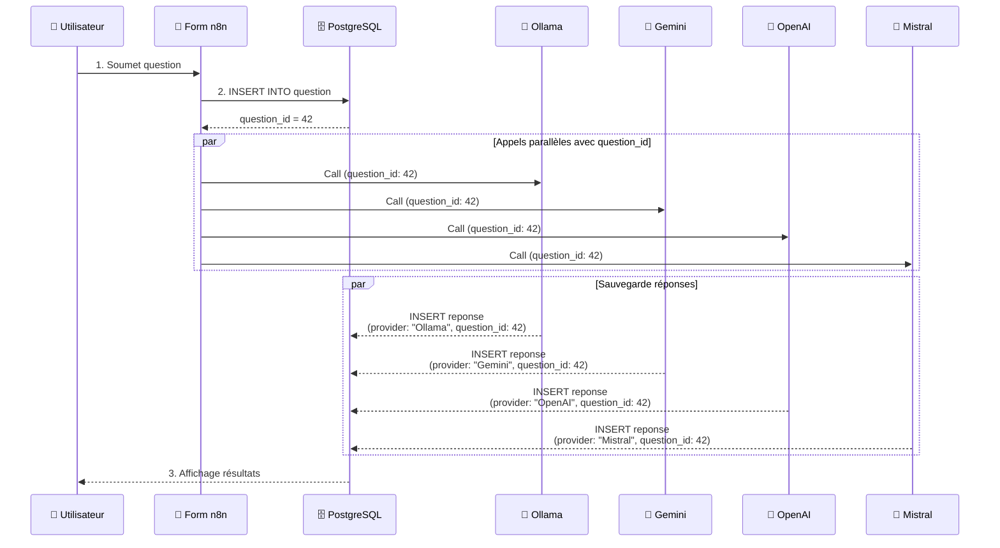
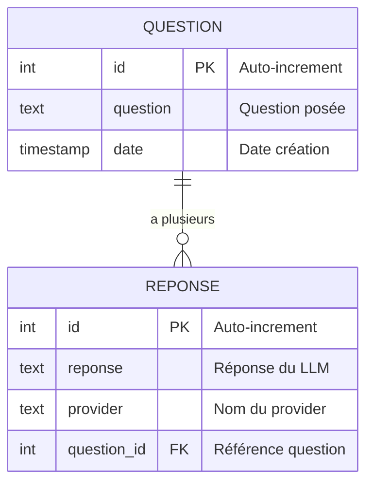
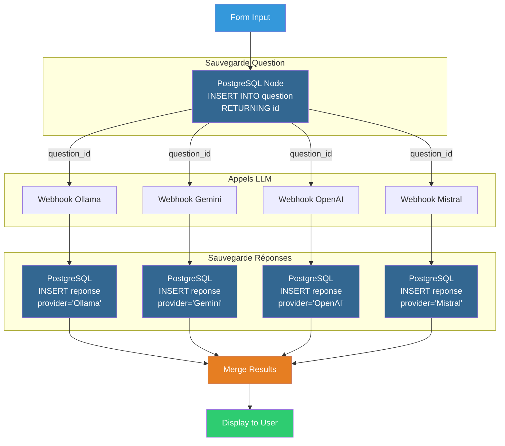

# 5. Stocker les résultats en base de données

> **Résumé** : Persistez les questions et réponses dans PostgreSQL pour historiser et analyser les comparaisons LLM  
> **Temps estimé** : 60-75 minutes  
> **Difficulté** : Intermédiaire ⭐⭐⭐  
> **Étape précédente** : [4. Forms](../4.%20forms/README.md)

---

## 🎯 Objectifs pédagogiques

À la fin de cette étape, vous serez capable de :

1. **Configurer PostgreSQL** avec n8n pour stocker des données
2. **Concevoir un schéma relationnel** (tables question/reponse avec clé étrangère)
3. **Insérer des données** dans PostgreSQL depuis n8n
4. **Récupérer l'ID auto-généré** (SERIAL/AUTO_INCREMENT) pour lier les tables
5. **Enrichir les données** avec des métadonnées (timestamp, provider, paramètres)
6. **Gérer les transactions** et garantir l'intégrité des données

Cette étape transforme votre comparateur en une application avec **persistance des données**, essentielle pour l'analyse et l'amélioration continue.

---

## 📚 Prérequis

### Étape précédente requise

- ✅ **Étape 4 complétée** : Vous devez avoir un workflow avec formulaire fonctionnel
  - 📖 Voir : [4. Forms](../4.%20forms/README.md)

### Connaissances requises

- 🗄️ **Bases de données relationnelles (SQL)**
  - 📖 Voir : [/ressources/bases_donnees/README.md](../../ressources/bases_donnees/README.md)
  
- 🔐 **Gestion des credentials pour bases de données**
  - 📖 Voir : [/ressources/credentials/README.md](../../ressources/credentials/README.md)

- 🐳 **Docker et services persistants**
  - 📖 Voir : [/ressources/docker/README.md](../../ressources/docker/README.md)

### Outils requis

- **PostgreSQL** : Installé et configuré (via Docker ou installation locale)
- **pgAdmin** (ou DBeaver, DataGrip) : Pour gérer la base de données
- **Accès à n8n** : Avec les credentials PostgreSQL configurés

### Ressources externes

- [n8n Documentation - PostgreSQL Credentials](https://docs.n8n.io/integrations/builtin/credentials/postgres/)
- [n8n Documentation - PostgreSQL Node](https://docs.n8n.io/integrations/builtin/app-nodes/n8n-nodes-base.postgres/)
- [PostgreSQL Official Documentation](https://www.postgresql.org/docs/)
- [pgAdmin Documentation](https://www.pgadmin.org/docs/)

---

## 📊 Architecture visuelle

### Flux complet avec persistance



---

### Structure de la base de données



**Explication** :
- Une **question** peut avoir plusieurs **réponses** (une par provider)
- La clé étrangère `question_id` lie les réponses à la question
- `SERIAL` (PostgreSQL) = AUTO_INCREMENT (MySQL) : génère automatiquement les IDs

---

### Workflow avec nœuds PostgreSQL



---

## 🧑‍💻 Instructions étape par étape

### Partie 1 : Configuration de PostgreSQL

#### Étape 1 : Vérifier que PostgreSQL est installé

Si PostgreSQL est déjà dans votre `docker-compose.yml` (installé), passez à l'Étape 2.

**Sinon, ajoutez PostgreSQL au docker-compose** :

1. **Éditez le fichier `docker-compose.yml`**
   ```yaml
   services:
     n8n:
       # ... configuration existante ...
     
     postgres:
       image: postgres:15-alpine
       container_name: postgres_llm
       environment:
         POSTGRES_USER: n8n_user
         POSTGRES_PASSWORD: n8n_password
         POSTGRES_DB: comparateur_llm
       ports:
         - "5432:5432"
       volumes:
         - postgres_data:/var/lib/postgresql/data
   
   volumes:
     postgres_data:
   ```

2. **Redémarrez Docker**
   ```bash
   docker compose down
   docker compose up -d
   ```

3. **Vérifiez que PostgreSQL fonctionne**
   ```bash
   docker compose ps
   # Vous devriez voir postgres_llm "running"
   ```

---

#### Étape 2 : Se connecter à PostgreSQL avec pgAdmin

1. **Ouvrez pgAdmin** (ou installez-le : [pgadmin.org](https://www.pgadmin.org/))

2. **Ajoutez un nouveau serveur**
   - Clic droit sur "Servers" → "Register" → "Server..."
   - **General Tab** :
     - Name : `n8n PostgreSQL`
   - **Connection Tab** :
     - Host : `localhost` (ou `127.0.0.1`)
     - Port : `5432`
     - Maintenance database : `comparateur_llm`
     - Username : `n8n_user`
     - Password : `n8n_password`
   - Cliquez sur "Save"

3. **Vérifiez la connexion**
   - Développez le serveur "n8n PostgreSQL"
   - Développez "Databases" → "comparateur_llm"

---

#### Étape 3 : Créer les tables

1. **Ouvrez l'éditeur SQL**
   - Clic droit sur "comparateur_llm" → "Query Tool"

2. **Créez la table `question`**
   ```sql
   CREATE TABLE question (
       id SERIAL PRIMARY KEY,
       question TEXT NOT NULL,
       date TIMESTAMP DEFAULT CURRENT_TIMESTAMP
   );
   ```
   - Cliquez sur le bouton ▶️ (Execute) ou appuyez sur F5

3. **Créez la table `reponse`**
   ```sql
   CREATE TABLE reponse (
       id SERIAL PRIMARY KEY,
       reponse TEXT NOT NULL,
       provider TEXT NOT NULL,
       question_id INTEGER NOT NULL REFERENCES question(id) ON DELETE CASCADE
   );
   ```
   - Exécutez cette requête

4. **Vérifiez les tables**
   - Développez "comparateur_llm" → "Schemas" → "public" → "Tables"
   - Vous devriez voir `question` et `reponse`

5. **(Optionnel) Ajoutez des index pour les performances**
   ```sql
   CREATE INDEX idx_reponse_question_id ON reponse(question_id);
   CREATE INDEX idx_reponse_provider ON reponse(provider);
   ```

---

### Partie 2 : Configurer n8n pour PostgreSQL

#### Étape 4 : Créer les credentials PostgreSQL dans n8n

1. **Dans n8n, allez dans les credentials**
   - Menu latéral → "Credentials"
   - Cliquez sur "Add Credential"

2. **Sélectionnez "Postgres"**

3. **Remplissez les informations**
   - **Name** : `PostgreSQL - Comparateur LLM`
   - **Host** : `postgres` (nom du service Docker) ou `localhost` (si PostgreSQL local)
   - **Database** : `comparateur_llm`
   - **User** : `n8n_user`
   - **Password** : `n8n_password`
   - **Port** : `5432`
   - **SSL** : désactivé (pour le développement local)

4. **Testez la connexion**
   - Cliquez sur "Test" en bas du formulaire
   - Vous devriez voir "Connection successful"

5. **Sauvegardez le credential**

---

### Partie 3 : Modifier le workflow pour sauvegarder les questions

#### Étape 5 : Dupliquer le workflow de l'Étape 4

1. **Ouvrez le workflow `form_client` de l'Étape 4**

2. **Dupliquez-le**
   - Menu "..." → "Duplicate"
   - Renommez : `form_db_client`

3. **Créez un dossier et déplacez le workflow**
   - Créez le dossier `5. store to db`
   - Déplacez `form_db_client` dedans

---

#### Étape 6 : Ajouter l'insertion de la question

1. **Ajoutez un nœud "Postgres"** après le Form Trigger
   - Cliquez sur "+" après le Form Trigger
   - Recherchez : `Postgres`
   - Ajoutez-le au canvas

2. **Configurez le nœud Postgres**
   - Double-cliquez dessus
   - **Credential** : Sélectionnez `PostgreSQL - Comparateur LLM`
   - **Operation** : `Insert`
   - **Schema** : `public`
   - **Table** : `question`
   - **Columns** : Cliquez sur "Add Column"
     - **Column** : `question`
     - **Value** : `={{ $json.question }}`
   - **Options** → **Return Fields** : activez et ajoutez `id`
     - ⚠️ **Très important** : Cela permet de récupérer l'ID auto-généré !

3. **Renommez le nœud** : `Save Question to DB`

4. **Connectez** : Form Trigger → Save Question to DB

---

#### Étape 7 : Transmettre le question_id aux webhooks

1. **Ajoutez un nœud "Code"** après "Save Question to DB"
   - Renommez-le : `Prepare Payload with ID`

2. **Ajoutez le code suivant** :
   ```javascript
   const formData = $input.first().json;
   const questionId = formData.id; // ID retourné par PostgreSQL
   
   // Construit le payload avec question_id
   const payload = {
     chatInput: $('Form Trigger').first().json.question,
     temperature: $('Form Trigger').first().json.temperature || 0.7,
     max_tokens: $('Form Trigger').first().json.max_tokens || 500,
     question_id: questionId  // ← Ajout de l'ID
   };
   
   if ($('Form Trigger').first().json.system_prompt) {
     payload.system_prompt = $('Form Trigger').first().json.system_prompt;
   }
   
   return [{ json: payload }];
   ```

3. **Connectez** : Save Question to DB → Prepare Payload with ID → HTTP Requests

---

### Partie 4 : Sauvegarder les réponses dans la base de données

#### Étape 8 : Modifier les workflows webhook pour sauvegarder les réponses

Maintenant, nous devons modifier **chaque workflow webhook** (ollama, gemini, mistral, openai) pour qu'il sauvegarde sa réponse dans la base de données.

##### A) Modifier webhook_ollama

1. **Ouvrez le workflow `webhook_ollama`**

2. **Ajoutez un nœud "Postgres"** après le nœud Ollama
   - Recherchez : `Postgres`
   - Ajoutez-le après le nœud Ollama LLM

3. **Configurez le nœud Postgres**
   - **Credential** : `PostgreSQL - Comparateur LLM`
   - **Operation** : `Insert`
   - **Schema** : `public`
   - **Table** : `reponse`
   - **Columns** :
     - **Column** : `reponse`, **Value** : `={{ $json.output || $json.response || $json.text }}`
     - **Column** : `provider`, **Value** : `Ollama`
     - **Column** : `question_id`, **Value** : `={{ $json.question_id }}`

4. **Renommez le nœud** : `Save Response to DB`

5. **Connectez** : Ollama → Save Response to DB

6. **Sauvegardez le workflow**

---

##### B) Répéter pour les autres webhooks

Répétez le processus pour chaque webhook :

- **webhook_gemini** : provider = `Gemini`
- **webhook_mistral** : provider = `Mistral`  
- **webhook_openai** : provider = `OpenAI`

⚠️ **Important** : Chaque webhook doit avoir son nœud PostgreSQL avec le bon `provider`.

---

### Partie 5 : Tester le workflow complet

#### Étape 9 : Tester l'insertion des données

1. **Activez tous les workflows**
   - `form_db_client`
   - `webhook_ollama`, `webhook_gemini`, `webhook_mistral`, `webhook_openai`

2. **Ouvrez le formulaire**
   - Cliquez sur "Test URL" dans le Form Trigger du workflow `form_db_client`
   - Ouvrez l'URL dans votre navigateur

3. **Soumettez une question**
   - **Question** : `Quelle est la capitale de la France ?`
   - **Temperature** : `0.7`
   - Soumettez

4. **Attendez les résultats**

---

#### Étape 10 : Vérifier les données dans PostgreSQL

1. **Ouvrez pgAdmin**

2. **Exécutez une requête pour voir les questions**
   ```sql
   SELECT * FROM question ORDER BY date DESC LIMIT 5;
   ```
   - Vous devriez voir votre question avec un `id` (ex: 1)

3. **Exécutez une requête pour voir les réponses**
   ```sql
   SELECT * FROM reponse WHERE question_id = 1;
   ```
   - Vous devriez voir **4 réponses** (une par provider)

4. **Requête jointe pour voir question + réponses**
   ```sql
   SELECT 
     q.id AS question_id,
     q.question,
     q.date,
     r.provider,
     LEFT(r.reponse, 100) AS reponse_excerpt
   FROM question q
   LEFT JOIN reponse r ON q.id = r.question_id
   ORDER BY q.date DESC, r.provider;
   ```

---

### Partie 6 : Améliorations optionnelles

#### Étape 11 : Ajouter des métadonnées supplémentaires (optionnel)

Pour enrichir les données, vous pouvez ajouter des colonnes :

1. **Modifiez la table `question`** pour ajouter des paramètres :
   ```sql
   ALTER TABLE question 
   ADD COLUMN temperature FLOAT,
   ADD COLUMN max_tokens INTEGER,
   ADD COLUMN system_prompt TEXT;
   ```

2. **Modifiez la table `reponse`** pour ajouter des statistiques :
   ```sql
   ALTER TABLE reponse
   ADD COLUMN tokens_used INTEGER,
   ADD COLUMN response_time_ms INTEGER,
   ADD COLUMN created_at TIMESTAMP DEFAULT CURRENT_TIMESTAMP;
   ```

3. **Mettez à jour les nœuds PostgreSQL** pour insérer ces nouvelles colonnes

---

#### Étape 12 : Sauvegarder et exporter

1. **Sauvegardez tous les workflows modifiés**
   - `form_db_client`
   - `webhook_ollama`, `webhook_gemini`, `webhook_mistral`, `webhook_openai`

2. **Exportez les workflows en JSON**
   - Menu "..." → "Download" pour chaque workflow
   - Déplacez les fichiers dans `projet/5. store to db/`

---

## ✅ Critères de validation

### Checklist de réussite

Cochez chaque élément une fois terminé :

- [ ] PostgreSQL est installé et fonctionne (Docker ou local)
- [ ] La base de données `comparateur_llm` est créée
- [ ] Les tables `question` et `reponse` existent avec les bonnes contraintes
- [ ] J'ai créé les credentials PostgreSQL dans n8n
- [ ] La connexion PostgreSQL dans n8n fonctionne (test réussi)
- [ ] Le workflow `form_db_client` sauvegarde les questions dans la table `question`
- [ ] Le workflow récupère l'ID auto-généré de la question (RETURNING id)
- [ ] Les 4 workflows webhook sauvegardent les réponses dans la table `reponse`
- [ ] Chaque réponse est liée à la bonne question via `question_id`
- [ ] J'ai testé en soumettant une question et vérifié les données dans pgAdmin
- [ ] Les 4 réponses apparaissent dans la table `reponse` avec les bons providers
- [ ] Tous les workflows sont exportés en JSON dans `projet/5. store to db/`

### Structure de dossier attendue

```
projet/
└── 5. store to db/
    ├── README.md (ce fichier)
    ├── form_db_client.json
    ├── webhook_ollama.json (modifié avec nœud Postgres)
    ├── webhook_gemini.json (modifié avec nœud Postgres)
    ├── webhook_mistral.json (modifié avec nœud Postgres)
    └── webhook_openai.json (modifié avec nœud Postgres)
```

---

### Quiz de compréhension

<details>
<summary><strong>Question 1 :</strong> Pourquoi utiliser une base de données relationnelle plutôt que sauvegarder dans des fichiers JSON ?</summary>

**Réponse :**

**Fichiers JSON** (ex: sauvegarder chaque question/réponse dans un `.json`) :
- ❌ Pas de structure rigide (risque d'incohérence)
- ❌ Difficile à requêter (nécessite de parser tous les fichiers)
- ❌ Pas de relations entre les données (question ↔ réponses)
- ❌ Pas de transactions (risque de corruption des données)
- ❌ Performances dégradées avec beaucoup de données

**Base de données relationnelle** (PostgreSQL, MySQL) :
- ✅ Structure stricte avec schéma (garantit l'intégrité)
- ✅ Langage SQL pour requêter facilement
- ✅ Relations avec clés étrangères (1 question → N réponses)
- ✅ Transactions ACID (atomicité, cohérence, isolation, durabilité)
- ✅ Index pour des performances optimales
- ✅ Concurrence (plusieurs utilisateurs simultanés)

**Cas d'usage idéaux** :
- Fichiers JSON → prototypage rapide, petites quantités de données
- Base de données → production, données structurées, analyses, évolutivité

**Pour votre comparateur** : La BDD permet de faire des analyses comme "quel modèle donne les réponses les plus longues ?", "quel modèle est le plus rapide ?", etc.

**Référence** : [/ressources/bases_donnees/README.md](../../ressources/bases_donnees/README.md)
</details>

<details>
<summary><strong>Question 2 :</strong> Qu'est-ce que `SERIAL` dans PostgreSQL ?</summary>

**Réponse :**

`SERIAL` est un **pseudo-type** PostgreSQL qui crée un **entier auto-incrémenté** :

```sql
CREATE TABLE question (
    id SERIAL PRIMARY KEY,  -- id commence à 1, puis 2, 3, 4...
    question TEXT
);
```

**Équivalents dans d'autres SGBD** :
- MySQL : `AUTO_INCREMENT`
- SQL Server : `IDENTITY`
- SQLite : `AUTOINCREMENT`

**Ce que fait `SERIAL` en coulisses** :
1. Crée une **séquence** : `question_id_seq`
2. Associe cette séquence à la colonne `id`
3. À chaque `INSERT`, récupère la valeur suivante de la séquence

**Pourquoi c'est utile** :
- ✅ Pas besoin de spécifier l'ID manuellement :
  ```sql
  INSERT INTO question (question) VALUES ('Bonjour ?');
  -- L'ID est généré automatiquement (1, 2, 3...)
  ```
- ✅ Garantit l'unicité des IDs
- ✅ Idéal pour les clés primaires

**Comment récupérer l'ID généré dans n8n** :
- Activez **"Return Fields"** dans le nœud Postgres
- Ajoutez le champ `id`
- L'ID sera dans `$json.id` après l'insertion

</details>

<details>
<summary><strong>Question 3 :</strong> À quoi sert la clause `ON DELETE CASCADE` dans la clé étrangère ?</summary>

**Réponse :**

La clause `ON DELETE CASCADE` définit le **comportement en cas de suppression** d'une ligne référencée :

```sql
CREATE TABLE reponse (
    id SERIAL PRIMARY KEY,
    reponse TEXT,
    question_id INTEGER REFERENCES question(id) ON DELETE CASCADE
);
```

**Comportement** :
- Si une **question** est supprimée, toutes les **réponses** liées à cette question sont **automatiquement supprimées**

**Exemple** :
```sql
-- Insérer une question
INSERT INTO question (question) VALUES ('Test ?'); -- id = 1

-- Insérer 4 réponses
INSERT INTO reponse (reponse, provider, question_id) 
VALUES ('Réponse Ollama', 'Ollama', 1);
-- ... 3 autres réponses

-- Supprimer la question
DELETE FROM question WHERE id = 1;

-- Les 4 réponses sont AUTOMATIQUEMENT supprimées !
```

**Alternatives** :
- `ON DELETE RESTRICT` : **Empêche** la suppression si des réponses existent (erreur)
- `ON DELETE SET NULL` : Met `question_id` à `NULL` dans les réponses (perd la liaison)
- `ON DELETE NO ACTION` : Comportement par défaut (équivalent à RESTRICT)

**Bonne pratique** :
- Utilisez `CASCADE` quand les données enfants n'ont **pas de sens** sans le parent (ex: réponses sans question)
- Utilisez `RESTRICT` pour **forcer la suppression manuelle** des enfants avant le parent (plus sûr)

</details>

<details>
<summary><strong>Question 4 :</strong> Comment garantir l'intégrité des données si un webhook échoue ?</summary>

**Réponse :**

Plusieurs stratégies pour gérer les échecs :

**1. Transactions (niveau base de données)** :
- Toutes les insertions (question + 4 réponses) dans une seule transaction
- Si un webhook échoue, on **rollback** toute la transaction
- **Problème** : Difficile à implémenter dans n8n avec des webhooks distants

**2. Stratégie "Insert partial results"** (recommandé pour ce projet) :
- On sauvegarde la question même si certains webhooks échouent
- On sauvegarde seulement les réponses des webhooks qui réussissent
- **Avantage** : On garde au moins les données partielles
- **Inconvénient** : Données incomplètes (seulement 2/4 réponses par exemple)

**3. Ajout d'un statut dans la table `reponse`** :
```sql
ALTER TABLE reponse ADD COLUMN status TEXT DEFAULT 'success';
-- Values: 'success', 'failed', 'timeout'
```

- Si un webhook échoue, on insère quand même une ligne avec `status='failed'`
- Permet de tracer les échecs et diagnostiquer les problèmes

**4. Retry logic avec n8n** :
- Configurez les nœuds HTTP Request pour réessayer en cas d'échec :
  - Options → **Retry On Fail** : activé
  - **Max Retries** : 3
  - **Wait Between Tries** : 1000ms

**5. Système de queue (avancé)** :
- Utilisez un système de messages (Redis, RabbitMQ)
- Si un webhook échoue, le message est remis en queue pour réessayer plus tard

**Pour ce projet (simple)** :
- Acceptez les résultats partiels
- Ajoutez un log/notification en cas d'échec d'un webhook

**Référence** : [/ressources/bases_donnees/README.md - Section Transactions](../../ressources/bases_donnees/README.md)
</details>

<details>
<summary><strong>Question 5 :</strong> Comment optimiser les performances des requêtes SQL ?</summary>

**Réponse :**

**1. Index** (le plus important) :
```sql
-- Index sur les clés étrangères (améliore les JOIN)
CREATE INDEX idx_reponse_question_id ON reponse(question_id);

-- Index sur les colonnes fréquemment filtrées
CREATE INDEX idx_reponse_provider ON reponse(provider);
CREATE INDEX idx_question_date ON question(date);
```

**Bénéfices** :
- Accélère les `WHERE`, `JOIN`, `ORDER BY` sur les colonnes indexées
- Transforme une recherche séquentielle (O(n)) en recherche binaire (O(log n))

**2. LIMIT dans les requêtes** :
```sql
-- Mauvais : Récupère toutes les lignes
SELECT * FROM question;

-- Bon : Récupère seulement les 10 dernières
SELECT * FROM question ORDER BY date DESC LIMIT 10;
```

**3. Éviter SELECT \*** :
```sql
-- Mauvais : Récupère toutes les colonnes (même inutiles)
SELECT * FROM reponse;

-- Bon : Récupère seulement les colonnes nécessaires
SELECT id, provider, LEFT(reponse, 100) FROM reponse;
```

**4. Utiliser les agrégations SQL plutôt qu'en code** :
```sql
-- Compte les réponses par provider (optimisé par PostgreSQL)
SELECT provider, COUNT(*) 
FROM reponse 
GROUP BY provider;
```

Au lieu de récupérer toutes les lignes et compter en JavaScript/Python.

**5. Nettoyer régulièrement** :
```sql
-- Supprimer les vieilles données (> 6 mois)
DELETE FROM question WHERE date < NOW() - INTERVAL '6 months';
```

**6. EXPLAIN pour analyser les requêtes** :
```sql
EXPLAIN ANALYZE
SELECT * FROM reponse WHERE question_id = 1;

-- Montre le plan d'exécution et le temps réel
```

**Référence** : [/ressources/bases_donnees/README.md - Section Optimisation](../../ressources/bases_donnees/README.md)
</details>

---

## 🐛 Dépannage

### Problème : "Connection refused" lors de la connexion à PostgreSQL depuis n8n

**Symptômes** : Test de connexion échoue dans les credentials n8n

**Solutions** :

1. **Vérifiez que PostgreSQL est démarré**
   ```bash
   docker compose ps
   # Vérifiez que postgres_llm est "running"
   ```

2. **Si n8n et PostgreSQL sont dans Docker, utilisez le nom du service**
   - **Host** : `postgres` (pas `localhost`)
   - Docker crée un réseau interne où les services se trouvent par leur nom

3. **Si PostgreSQL est local (hors Docker) et n8n dans Docker**
   - **Host** : `host.docker.internal` (Mac/Windows) ou `172.17.0.1` (Linux)

4. **Vérifiez les credentials**
   - User, password, database correspondent bien au docker-compose.yml

5. **Testez la connexion avec psql**
   ```bash
   docker exec -it postgres_llm psql -U n8n_user -d comparateur_llm
   # Si ça fonctionne, le problème vient de n8n
   ```

**Référence** : [/ressources/docker/README.md - Section Networking](../../ressources/docker/README.md)

---

### Problème : "relation does not exist" lors de l'insertion

**Symptômes** : Erreur SQL `ERROR: relation "question" does not exist`

**Solutions** :

1. **Vérifiez que vous êtes dans la bonne base de données**
   ```sql
   \c comparateur_llm  -- Connectez-vous à la bonne DB
   \dt                 -- Listez les tables
   ```

2. **Vérifiez le schéma**
   - Par défaut, PostgreSQL utilise le schéma `public`
   - Dans n8n, configurez **Schema** : `public`

3. **Si les tables sont dans un autre schéma**
   ```sql
   SET search_path TO public;
   ```

4. **Recréez les tables** si nécessaire (Étape 3)

---

### Problème : L'ID de la question n'est pas récupéré

**Symptômes** : `$json.id` est `undefined` après l'insertion

**Solutions** :

1. **Vérifiez "Return Fields"** dans le nœud Postgres
   - Options → **Return Fields** : activé
   - Ajoutez le champ `id`

2. **Utilisez `RETURNING` en SQL (si mode "Execute Query")** :
   ```sql
   INSERT INTO question (question) VALUES ('{{ $json.question }}') RETURNING id;
   ```

3. **Inspectez les données de sortie**
   - Cliquez sur le nœud Postgres après exécution
   - Vérifiez que `id` apparaît dans `$json`

---

### Problème : "duplicate key value violates unique constraint"

**Symptômes** : Erreur lors de l'insertion, l'ID existe déjà

**Causes** :
- Vous avez spécifié manuellement un `id` qui existe déjà
- La séquence SERIAL est désynchronisée

**Solutions** :

1. **Ne spécifiez jamais l'ID manuellement** pour les colonnes SERIAL

2. **Resynchronisez la séquence**
   ```sql
   SELECT setval('question_id_seq', (SELECT MAX(id) FROM question));
   ```

3. **Réinitialisez la séquence** (seulement pour le développement) :
   ```sql
   TRUNCATE TABLE question, reponse RESTART IDENTITY CASCADE;
   ```

---

### Problème : Les réponses ne sont pas liées aux bonnes questions

**Symptômes** : Les `question_id` dans `reponse` ne correspondent pas

**Solutions** :

1. **Vérifiez que `question_id` est bien transmis aux webhooks**
   - Dans le nœud "Prepare Payload with ID", vérifiez :
     ```javascript
     question_id: $input.first().json.id
     ```

2. **Vérifiez que les webhooks utilisent `question_id`**
   - Dans chaque nœud Postgres des webhooks :
     ```
     Column: question_id
     Value: ={{ $json.question_id }}
     ```

3. **Testez manuellement**
   - Envoyez une requête cURL avec `question_id` :
     ```bash
     curl -X POST http://localhost:5678/webhook/ollama \
       -H "Content-Type: application/json" \
       -d '{"chatInput": "test", "question_id": 1}'
     ```
   - Vérifiez dans pgAdmin que la réponse a bien `question_id = 1`

---

## 🔗 Ressources complémentaires

### Documentation interne

- 📂 [Bases de données relationnelles](../../ressources/bases_donnees/README.md)
- 📂 [Gestion des credentials](../../ressources/credentials/README.md)
- 📂 [Docker et persistance des données](../../ressources/docker/README.md)
- 📂 [Glossaire - Termes SQL et BDD](../../ressources/GLOSSARY.md)

### Documentation externe

- [PostgreSQL Official Tutorial](https://www.postgresql.org/docs/current/tutorial.html)
- [n8n - PostgreSQL Node](https://docs.n8n.io/integrations/builtin/app-nodes/n8n-nodes-base.postgres/)
- [pgAdmin Documentation](https://www.pgadmin.org/docs/)
- [SQL Best Practices](https://www.sqlstyle.guide/)

### Tutoriels

- [Introduction to Relational Databases](https://www.freecodecamp.org/news/learn-sql-database-management/)
- [PostgreSQL Performance Tuning](https://wiki.postgresql.org/wiki/Performance_Optimization)

---

## ➡️ Étape suivante

Une fois cette étape validée, vous êtes prêt à passer à :

**[Étape 6 : Charger les données depuis la base de données](../6.%20load%20from%20db/README.md)**

Dans l'étape suivante, vous apprendrez à :
- Créer un workflow de consultation de l'historique
- Afficher les questions passées dans une interface
- Filtrer et rechercher dans les données
- Créer des statistiques et analyses sur les comparaisons

---

## 📝 Notes et observations

Utilisez cet espace pour noter vos observations lors de la réalisation de cette étape :

- **Temps réel passé** : _____ minutes
- **Difficultés rencontrées** : _____________________________
- **Nombre de questions testées** : _____
- **Observations sur les performances** : _____________________________
- **Questions non résolues** : _____________________________

---

**Félicitations pour avoir complété cette étape !** Votre comparateur sauvegarde maintenant toutes les données pour des analyses futures. 🎉
