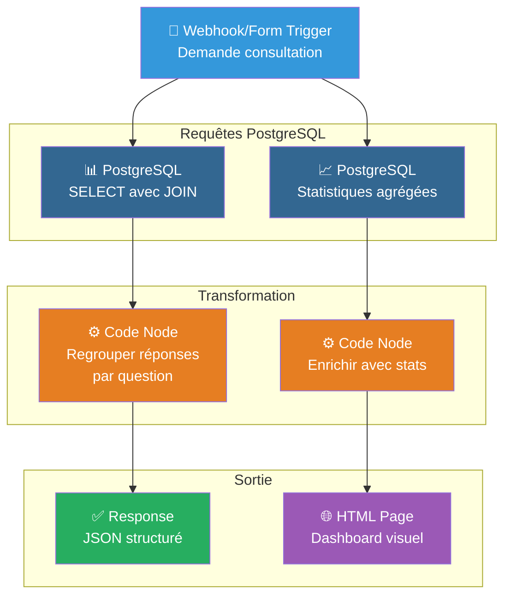
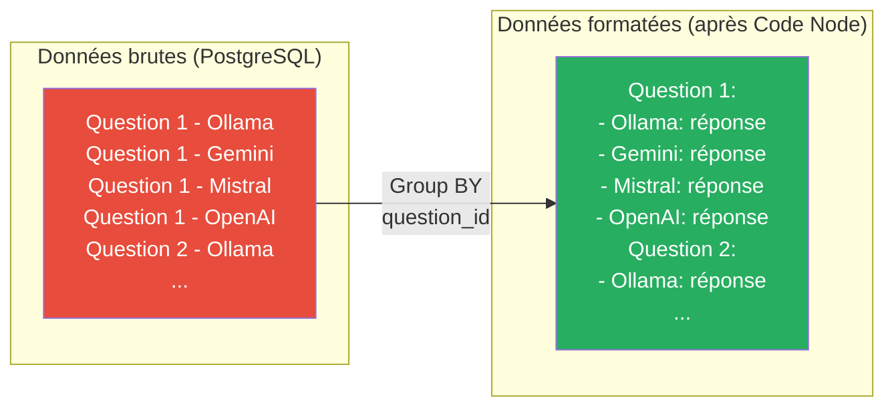

# 6. Charger et consulter les données depuis la base de données

> **Résumé** : Créez un workflow pour consulter l'historique des questions/réponses et construire un dashboard d'analyse  
> **Temps estimé** : 50-60 minutes  
> **Difficulté** : Intermédiaire ⭐⭐  
> **Étape précédente** : [5. Store to DB](../5.%20store%20to%20db/README.md)

---

## 🎯 Objectifs pédagogiques

À la fin de cette étape, vous serez capable de :

1. **Effectuer des requêtes SQL** depuis n8n pour récupérer des données
2. **Utiliser les JOINs** pour combiner les tables question et reponse
3. **Reformater les données** avec le nœud Code pour regrouper les réponses par question
4. **Créer une interface de consultation** de l'historique
5. **Construire des statistiques** (nombre de questions, providers les plus utilisés, etc.)
6. **Exposer les données** via un webhook pour créer un dashboard

Cette étape transforme votre comparateur en un **outil d'analyse** permettant de tirer des insights de l'historique.

---

## 📚 Prérequis

### Étape précédente requise

- ✅ **Étape 5 complétée** : Vous devez avoir des données dans PostgreSQL (questions + réponses)
  - 📖 Voir : [5. Store to DB](../5.%20store%20to%20db/README.md)

### Connaissances requises

- 🗄️ **Requêtes SQL (SELECT, JOIN, GROUP BY)**
  - 📖 Voir : [/ressources/bases_donnees/README.md](../../ressources/bases_donnees/README.md)
  
- 📊 **Transformation de données (agrégation)**
  - 📖 Voir : [/ressources/formats_donnees/README.md](../../ressources/formats_donnees/README.md)

- 🌐 **APIs REST et webhooks**
  - 📖 Voir : [/ressources/http&API/README.md](../../ressources/http&API/README.md)

### Ressources externes

- [n8n Documentation - PostgreSQL Node](https://docs.n8n.io/integrations/builtin/app-nodes/n8n-nodes-base.postgres/)
- [n8n Documentation - Code Node](https://docs.n8n.io/code/code-node/)
- [PostgreSQL JOIN Documentation](https://www.postgresql.org/docs/current/tutorial-join.html)

---

## 📊 Architecture visuelle

### Flux de chargement et formatage des données



---

### Structure des données avant/après transformation



---

## 🧑‍💻 Instructions étape par étape

### Partie 1 : Créer le workflow de consultation

#### Étape 1 : Créer un nouveau workflow

1. **Dans n8n, créez un nouveau workflow**
   - Cliquez sur "Add workflow"
   - Renommez : `load_from_db`

2. **Créez un dossier**
   - Menu latéral → Workflows → clic droit sur "projet"
   - **"New Folder"** → Nommez-le `6. load from db`
   - Déplacez le workflow dedans

---

#### Étape 2 : Ajouter un trigger

Vous avez plusieurs options pour déclencher ce workflow :

**Option A : Webhook (recommandé pour l'intégration)**
- Ajoutez un nœud **"Webhook"**
- Configurez :
  - **HTTP Method** : `GET`
  - **Path** : `history`
  - **Response Mode** : `When Last Node Finishes`

**Option B : Form Trigger (pour une interface)**
- Ajoutez un nœud **"Form Trigger"**
- Configurez des filtres (date, provider, etc.)

**Option C : Manual Trigger (pour les tests)**
- Ajoutez un nœud **"Manual Trigger"**
- Utile pour les tests rapides

Pour cet exercice, utilisons **Webhook** (Option A).

---

### Partie 2 : Récupérer les données avec PostgreSQL

#### Étape 3 : Charger les questions récentes

1. **Ajoutez un nœud "Postgres"**
   - Cliquez sur "+" après le Webhook
   - Recherchez : `Postgres`

2. **Configurez le nœud**
   - **Credential** : `PostgreSQL - Comparateur LLM`
   - **Operation** : `Execute Query`
   - **Query** :
     ```sql
     SELECT 
       q.id,
       q.question,
       q.date,
       q.temperature,
       q.max_tokens
     FROM question q
     ORDER BY q.date DESC
     LIMIT 10;
     ```

3. **Renommez le nœud** : `Load Recent Questions`

4. **Testez**
   - Exécutez le workflow (bouton "Test workflow")
   - Vérifiez que les 10 dernières questions apparaissent

---

#### Étape 4 : Charger les réponses associées

1. **Ajoutez un deuxième nœud "Postgres"**
   - Après "Load Recent Questions"

2. **Configurez pour récupérer les réponses**
   - **Credential** : `PostgreSQL - Comparateur LLM`
   - **Operation** : `Execute Query`
   - **Query** :
     ```sql
     SELECT 
       r.id,
       r.reponse,
       r.provider,
       r.question_id
     FROM reponse r
     WHERE r.question_id IN (
       SELECT q.id 
       FROM question q 
       ORDER BY q.date DESC 
       LIMIT 10
     )
     ORDER BY r.question_id, r.provider;
     ```

3. **Renommez le nœud** : `Load Responses`

---

#### Étape 5 : Alternative - Requête avec JOIN (plus efficace)

**Meilleure approche** : Récupérer questions + réponses en une seule requête.

1. **Remplacez les deux nœuds précédents par un seul**
2. **Ajoutez un nœud "Postgres"**
3. **Configurez avec un JOIN** :
   ```sql
   SELECT 
     q.id AS question_id,
     q.question,
     q.date,
     q.temperature,
     q.max_tokens,
     r.id AS reponse_id,
     r.reponse,
     r.provider
   FROM question q
   LEFT JOIN reponse r ON q.id = r.question_id
   ORDER BY q.date DESC, r.provider
   LIMIT 40;  -- 10 questions × ~4 providers
   ```

4. **Renommez** : `Load Questions with Responses`

---

### Partie 3 : Formater les données

#### Étape 6 : Regrouper les réponses par question

1. **Ajoutez un nœud "Code"**
   - Après le nœud PostgreSQL

2. **Ajoutez le code JavaScript suivant** :
   ```javascript
   // Récupère toutes les lignes (questions avec leurs réponses)
   const items = $input.all();
   
   // Regroupe par question_id
   const questionMap = new Map();
   
   for (const item of items) {
     const data = item.json;
     const questionId = data.question_id;
     
     // Si la question n'existe pas encore, on la crée
     if (!questionMap.has(questionId)) {
       questionMap.set(questionId, {
         id: questionId,
         question: data.question,
         date: data.date,
         temperature: data.temperature,
         max_tokens: data.max_tokens,
         responses: []
       });
     }
     
     // Ajoute la réponse si elle existe
     if (data.reponse && data.provider) {
       questionMap.get(questionId).responses.push({
         id: data.reponse_id,
         provider: data.provider,
         reponse: data.reponse
       });
     }
   }
   
   // Convertit la Map en tableau
   const questions = Array.from(questionMap.values());
   
   // Retourne le résultat
   return questions.map(q => ({ json: q }));
   ```

3. **Renommez le nœud** : `Group Responses by Question`

---

#### Étape 7 : Formater la sortie JSON

1. **Ajoutez un nœud "Edit Fields"** (optionnel mais recommandé)
   - Pour nettoyer et formater les champs

2. **Ou ajoutez un nœud "Code" pour formatter en HTML** :
   ```javascript
   const questions = $input.all();
   
   let html = `
   <!DOCTYPE html>
   <html>
   <head>
     <meta charset="UTF-8">
     <title>Historique Comparateur LLM</title>
     <style>
       body { font-family: Arial, sans-serif; margin: 20px; background: #f5f5f5; }
       .question-card { background: white; padding: 20px; margin: 20px 0; border-radius: 8px; box-shadow: 0 2px 4px rgba(0,0,0,0.1); }
       .question-text { font-size: 18px; font-weight: bold; color: #2c3e50; margin-bottom: 10px; }
       .metadata { color: #7f8c8d; font-size: 14px; margin-bottom: 15px; }
       .response { margin: 15px 0; padding: 15px; background: #ecf0f1; border-radius: 5px; }
       .provider { font-weight: bold; color: #3498db; }
       .response-text { margin-top: 8px; color: #34495e; }
     </style>
   </head>
   <body>
     <h1>📊 Historique du Comparateur LLM</h1>
     <p>Total de questions : ${questions.length}</p>
   `;
   
   for (const item of questions) {
     const q = item.json;
     const date = new Date(q.date).toLocaleString('fr-FR');
     
     html += `
       <div class="question-card">
         <div class="question-text">❓ ${q.question}</div>
         <div class="metadata">
           📅 ${date} | 🌡️ Temp: ${q.temperature || 'N/A'} | 🔢 Max tokens: ${q.max_tokens || 'N/A'}
         </div>
     `;
     
     if (q.responses && q.responses.length > 0) {
       for (const resp of q.responses) {
         html += `
           <div class="response">
             <div class="provider">🤖 ${resp.provider}</div>
             <div class="response-text">${resp.reponse.substring(0, 300)}${resp.reponse.length > 300 ? '...' : ''}</div>
           </div>
         `;
       }
     } else {
       html += `<p><em>Aucune réponse disponible</em></p>`;
     }
     
     html += `</div>`;
   }
   
   html += `
   </body>
   </html>
   `;
   
   return [{ json: { html }, binary: {} }];
   ```

3. **Renommez** : `Format HTML Dashboard`

---

### Partie 4 : Ajouter des statistiques

#### Étape 8 : Créer un workflow de statistiques

1. **Ajoutez un nœud "Postgres"** (en parallèle)
   - Depuis le Webhook, créez une branche parallèle

2. **Configurez des statistiques** :
   ```sql
   SELECT 
     COUNT(DISTINCT q.id) AS total_questions,
     COUNT(r.id) AS total_responses,
     COUNT(DISTINCT r.provider) AS unique_providers,
     MIN(q.date) AS first_question_date,
     MAX(q.date) AS last_question_date
   FROM question q
   LEFT JOIN reponse r ON q.id = r.question_id;
   ```

3. **Renommez** : `Calculate Stats`

---

#### Étape 9 : Statistiques par provider

1. **Ajoutez un autre nœud "Postgres"**
2. **Requête pour compter par provider** :
   ```sql
   SELECT 
     r.provider,
     COUNT(*) AS response_count,
     AVG(LENGTH(r.reponse)) AS avg_response_length
   FROM reponse r
   GROUP BY r.provider
   ORDER BY response_count DESC;
   ```

3. **Renommez** : `Stats by Provider`

---

### Partie 5 : Tests et finalisation

#### Étape 10 : Tester le workflow

1. **Activez le workflow**

2. **Testez avec le webhook**
   - Cliquez sur "Test URL" dans le Webhook
   - Ouvrez l'URL dans votre navigateur
   - Vérifiez que l'historique s'affiche correctement

3. **Vérifiez le formatage**
   - Questions regroupées avec leurs réponses
   - Métadonnées (date, température, etc.) affichées
   - HTML bien formaté (si applicable)

---

#### Étape 11 : Ajouter des filtres (optionnel)

Pour permettre de filtrer par date ou provider :

1. **Modifiez le Webhook pour accepter des paramètres**
   - Dans le nœud Webhook, activez les query parameters

2. **Modifiez la requête SQL** :
   ```sql
   SELECT 
     q.id AS question_id,
     q.question,
     q.date,
     r.provider,
     r.reponse
   FROM question q
   LEFT JOIN reponse r ON q.id = r.question_id
   WHERE 
     ($1::text IS NULL OR r.provider = $1)
     AND ($2::date IS NULL OR q.date >= $2)
   ORDER BY q.date DESC
   LIMIT 20;
   ```

3. **Utilisez les paramètres dans n8n** :
   ```
   Query Parameters: 
   - $1 = {{ $json.query.provider }}
   - $2 = {{ $json.query.date }}
   ```

4. **Testez avec des filtres** :
   ```
   http://localhost:5678/webhook/history?provider=Ollama
   http://localhost:5678/webhook/history?date=2024-01-01
   ```

---

### Partie 6 : Sauvegarde

#### Étape 12 : Exporter le workflow

1. **Sauvegardez le workflow** (Ctrl+S)

2. **Exportez en JSON**
   - Menu "..." → "Download"
   - Déplacez le fichier dans `projet/6. load from db/`

---

## ✅ Critères de validation

### Checklist de réussite

Cochez chaque élément une fois terminé :

- [ ] J'ai créé le workflow `load_from_db`
- [ ] Le workflow a un trigger (Webhook, Form, ou Manual)
- [ ] J'ai ajouté un nœud PostgreSQL pour charger les données
- [ ] J'utilise un JOIN pour combiner question et reponse
- [ ] J'ai ajouté un nœud Code pour regrouper les réponses par question
- [ ] Les données sont correctement formatées (1 question → N réponses)
- [ ] (Optionnel) J'ai créé une sortie HTML pour visualiser l'historique
- [ ] (Optionnel) J'ai ajouté des statistiques (total questions, providers, etc.)
- [ ] J'ai testé le workflow et vérifié les résultats
- [ ] Le workflow est exporté en JSON dans `projet/6. load from db/`

### Structure de dossier attendue

```
projet/
└── 6. load from db/
    ├── README.md (ce fichier)
    └── load_from_db.json
```

---

### Quiz de compréhension

<details>
<summary><strong>Question 1 :</strong> Quelle est la différence entre LEFT JOIN et INNER JOIN ?</summary>

**Réponse :**

**INNER JOIN** :
- Retourne seulement les lignes qui ont une correspondance dans les deux tables
- Si une question n'a **aucune réponse**, elle n'apparaît **pas** dans les résultats

**LEFT JOIN** :
- Retourne **toutes les lignes de la table de gauche** (question), même sans correspondance
- Si une question n'a aucune réponse, elle apparaît quand même avec `reponse = NULL`

**Exemple avec notre schéma** :

```sql
-- INNER JOIN
SELECT q.question, r.provider
FROM question q
INNER JOIN reponse r ON q.id = r.question_id;
-- Résultat : Seulement les questions ayant au moins 1 réponse

-- LEFT JOIN
SELECT q.question, r.provider
FROM question q
LEFT JOIN reponse r ON q.id = r.question_id;
-- Résultat : TOUTES les questions, même celles sans réponse
```

**Pour notre comparateur**, utilisez **LEFT JOIN** pour inclure les questions même si certains providers n'ont pas répondu (erreur, timeout, etc.).

**Référence** : [/ressources/bases_donnees/README.md - Section JOINs](../../ressources/bases_donnees/README.md)
</details>

<details>
<summary><strong>Question 2 :</strong> Pourquoi regrouper les données dans un nœud Code plutôt que dans SQL ?</summary>

**Réponse :**

**Option 1 : Regrouper dans SQL** (avec GROUP BY, JSON_AGG, etc.) :

```sql
SELECT 
  q.id,
  q.question,
  JSON_AGG(
    JSON_BUILD_OBJECT(
      'provider', r.provider,
      'reponse', r.reponse
    )
  ) AS responses
FROM question q
LEFT JOIN reponse r ON q.id = r.question_id
GROUP BY q.id, q.question;
```

**Avantages** :
- ✅ Plus performant (traité côté base de données)
- ✅ Moins de données transférées sur le réseau

**Inconvénients** :
- ❌ Syntaxe complexe (JSON_AGG spécifique à PostgreSQL)
- ❌ Moins flexible pour transformations complexes
- ❌ Difficile à déboguer

**Option 2 : Regrouper dans Code Node** :

**Avantages** :
- ✅ Code plus lisible et maintenable (JavaScript standard)
- ✅ Flexibilité maximale (filtres, calculs, formatage)
- ✅ Facile à déboguer (console.log, inspection des variables)
- ✅ Portable (fonctionne avec n'importe quelle DB)

**Inconvénients** :
- ❌ Plus de données transférées depuis la DB
- ❌ Légèrement moins performant

**Recommandation** :
- Pour ce projet pédagogique : **Code Node** (plus clair)
- Pour la production avec beaucoup de données : **SQL** (plus performant)

</details>

<details>
<summary><strong>Question 3 :</strong> Comment optimiser une requête qui charge 1000 questions ?</summary>

**Réponse :**

**Problème** : Charger 1000 questions × 4 réponses = 4000 lignes peut être lent.

**Solutions d'optimisation** :

**1. Pagination** (recommandé) :
```sql
SELECT q.id, q.question, r.provider, r.reponse
FROM question q
LEFT JOIN reponse r ON q.id = r.question_id
ORDER BY q.date DESC
LIMIT 20 OFFSET 0;  -- Page 1: 0-19
-- Page 2: OFFSET 20
-- Page 3: OFFSET 40
```

**Implémentation dans n8n** :
- Récupérez le paramètre `page` depuis le webhook
- Calculez `OFFSET = (page - 1) * 20`

**2. Filtrer par date** :
```sql
WHERE q.date >= NOW() - INTERVAL '7 days'
```

**3. Index sur les colonnes filtrées** :
```sql
CREATE INDEX idx_question_date ON question(date DESC);
```

**4. Limiter les colonnes** :
```sql
-- Au lieu de SELECT *
SELECT q.id, q.question, r.provider, LEFT(r.reponse, 200)
```

**5. Lazy loading (chargement différé)** :
- Chargez d'abord seulement les questions (sans réponses)
- Chargez les réponses à la demande (clic sur une question)

**Référence** : [/ressources/bases_donnees/README.md - Section Optimisation](../../ressources/bases_donnees/README.md)
</details>

<details>
<summary><strong>Question 4 :</strong> Comment créer un graphique des statistiques dans n8n ?</summary>

**Réponse :**

n8n ne génère pas directement de graphiques, mais vous avez plusieurs options :

**Option 1 : Générer du HTML avec Chart.js** :

```javascript
const stats = $input.first().json;

const html = `
<!DOCTYPE html>
<html>
<head>
  <script src="https://cdn.jsdelivr.net/npm/chart.js"></script>
</head>
<body>
  <canvas id="myChart" width="400" height="200"></canvas>
  <script>
    const ctx = document.getElementById('myChart').getContext('2d');
    new Chart(ctx, {
      type: 'bar',
      data: {
        labels: ['Ollama', 'Gemini', 'Mistral', 'OpenAI'],
        datasets: [{
          label: 'Nombre de réponses',
          data: [${stats.ollama}, ${stats.gemini}, ${stats.mistral}, ${stats.openai}]
        }]
      }
    });
  </script>
</body>
</html>
`;

return [{ json: { html } }];
```

**Option 2 : API externe (Quickchart.io)** :

```javascript
const chartUrl = `https://quickchart.io/chart?c={
  type:'bar',
  data:{
    labels:['Ollama','Gemini','Mistral','OpenAI'],
    datasets:[{data:[10,15,8,12]}]
  }
}`;

return [{ json: { chart_url: chartUrl } }];
```

**Option 3 : Envoyer vers un outil BI** (Grafana, Metabase, etc.) :
- Configurez Grafana pour se connecter à votre PostgreSQL
- Créez des dashboards avec requêtes SQL

**Option 4 : Intégration avec Google Sheets** :
- Exportez les stats vers Google Sheets via l'API
- Créez des graphiques dans Sheets

**Pour ce projet** : Option 1 (HTML + Chart.js) est la plus simple et autonome.
</details>

<details>
<summary><strong>Question 5 :</strong> Comment exposer cet historique à une application externe (React, Vue, etc.) ?</summary>

**Réponse :**

**Méthode : API REST avec Webhook**

1. **Configurez le Webhook pour retourner du JSON** :
   - Dans le nœud Webhook, configurez :
     - **Response Mode** : `When Last Node Finishes`
     - **Response Code** : `200`
     - **Response Headers** : 
       ```json
       {
         "Content-Type": "application/json",
         "Access-Control-Allow-Origin": "*"
       }
       ```

2. **Format de sortie JSON** :
   ```javascript
   // Dans le dernier nœud Code
   const questions = $input.all().map(item => item.json);
   
   return [{
     json: {
       success: true,
       count: questions.length,
       data: questions
     }
   }];
   ```

3. **Appelez l'API depuis votre app frontend** :

**React** :
```javascript
useEffect(() => {
  fetch('http://localhost:5678/webhook/history')
    .then(res => res.json())
    .then(data => setQuestions(data.data));
}, []);
```

**Vue.js** :
```javascript
mounted() {
  axios.get('http://localhost:5678/webhook/history')
    .then(response => {
      this.questions = response.data.data;
    });
}
```

**cURL (test)** :
```bash
curl http://localhost:5678/webhook/history
```

**Avantages** :
- ✅ API REST standard (interopérable)
- ✅ Fonctionne avec n'importe quel frontend
- ✅ Peut être sécurisé avec Basic Auth ou API Key

**Référence** : [/ressources/http&API/README.md - Section REST APIs](../../ressources/http&API/README.md)
</details>

---

## 🐛 Dépannage

### Problème : La requête JOIN retourne trop de résultats

**Symptômes** : Vous avez 10 questions mais 40+ résultats

**Explication** : C'est normal ! Avec LEFT JOIN, chaque question est **répétée pour chaque réponse**.

Exemple :
```
Question 1 | Ollama | Réponse 1
Question 1 | Gemini | Réponse 2
Question 1 | Mistral | Réponse 3
Question 1 | OpenAI | Réponse 4
```

**Solution** : Regroupez avec le nœud Code (Étape 6) pour transformer en :
```
Question 1:
  - Ollama: Réponse 1
  - Gemini: Réponse 2
  - Mistral: Réponse 3
  - OpenAI: Réponse 4
```

---

### Problème : Erreur "Cannot read property 'json' of undefined"

**Symptômes** : Le nœud Code affiche cette erreur

**Cause** : `$input.all()` ou `$input.first()` retourne vide

**Solutions** :

1. **Vérifiez que le nœud précédent retourne des données**
   - Cliquez sur le nœud PostgreSQL
   - Vérifiez qu'il y a des résultats

2. **Ajoutez une vérification dans le Code** :
   ```javascript
   const items = $input.all();
   
   if (!items || items.length === 0) {
     return [{ json: { error: 'No data found', questions: [] } }];
   }
   
   // ... reste du code
   ```

---

### Problème : Les statistiques affichent des valeurs incorrectes

**Symptômes** : COUNT(*) retourne 40 au lieu de 10 questions

**Cause** : Le COUNT compte les lignes du JOIN (10 questions × 4 réponses = 40 lignes)

**Solution** : Utilisez `COUNT(DISTINCT q.id)` :
```sql
SELECT 
  COUNT(DISTINCT q.id) AS total_questions,  -- ✅ Correct
  COUNT(*) AS total_rows  -- ❌ Compte toutes les lignes du JOIN
FROM question q
LEFT JOIN reponse r ON q.id = r.question_id;
```

---

### Problème : Le webhook retourne du HTML au lieu de JSON

**Symptômes** : L'application frontend reçoit du HTML

**Solution** : 

1. **Si vous voulez du JSON** :
   - Supprimez le nœud "Format HTML Dashboard"
   - Le dernier nœud doit retourner `{ json: {...} }`

2. **Si vous voulez du HTML** :
   - Configurez le Response Header :
     ```json
     { "Content-Type": "text/html" }
     ```

3. **Si vous voulez les deux** :
   - Créez deux webhooks différents :
     - `/webhook/history` → retourne JSON
     - `/webhook/history-html` → retourne HTML

---

## 🔗 Ressources complémentaires

### Documentation interne

- 📂 [Bases de données - Requêtes avancées](../../ressources/bases_donnees/README.md)
- 📂 [Formats de données et transformation](../../ressources/formats_donnees/README.md)
- 📂 [HTTP & API REST](../../ressources/http&API/README.md)
- 📂 [Glossaire - Termes SQL](../../ressources/GLOSSARY.md)

### Documentation externe

- [PostgreSQL - JOIN Documentation](https://www.postgresql.org/docs/current/tutorial-join.html)
- [n8n - Code Node Examples](https://docs.n8n.io/code/code-node-examples/)
- [Chart.js Documentation](https://www.chartjs.org/docs/latest/)

---

## ➡️ Étape suivante

Une fois cette étape validée, vous êtes prêt à passer à :

**[Étape 7 : Améliorer les prompts](../7.%20enhance%20prompt/README.md)**

Dans l'étape suivante, vous apprendrez à :
- Appliquer des techniques de prompt engineering avancées
- Créer des system prompts efficaces
- Utiliser le few-shot learning
- Optimiser la qualité des réponses LLM

---

## 📝 Notes et observations

Utilisez cet espace pour noter vos observations lors de la réalisation de cette étape :

- **Temps réel passé** : _____ minutes
- **Difficultés rencontrées** : _____________________________
- **Nombre de questions dans l'historique** : _____
- **Insights découverts** : _____________________________
- **Questions non résolues** : _____________________________

---

**Félicitations pour avoir complété cette étape !** Vous pouvez maintenant consulter et analyser tout l'historique de votre comparateur. 🎉
