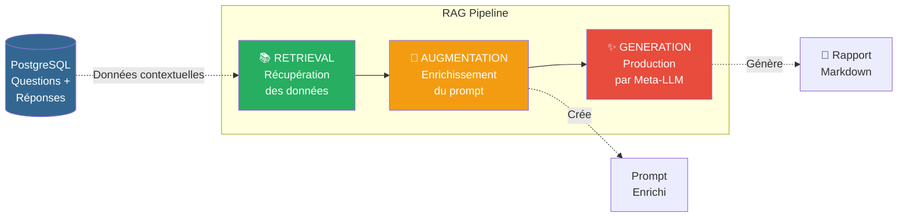
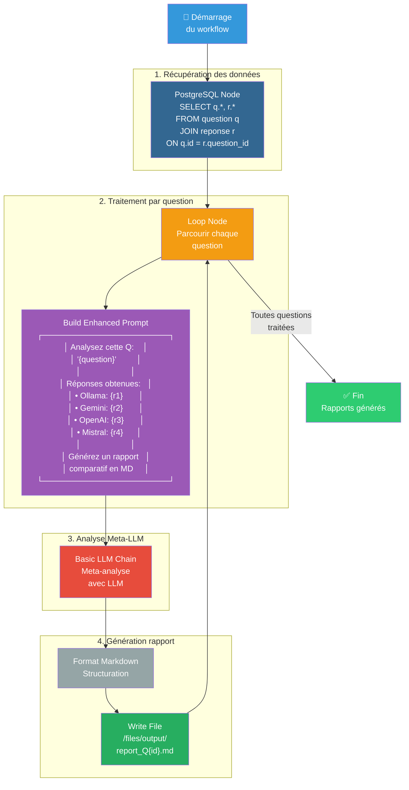

# 7. Améliorer les prompts avec le Prompt Engineering

> **Résumé** : Créez un agent d'analyse RAG pour générer des rapports comparatifs automatiques des réponses LLM  
> **Temps estimé** : 60-75 minutes  
> **Difficulté** : Avancé ⭐⭐⭐  
> **Étape précédente** : [6. Load from DB](../6.%20load%20from%20db/README.md)

---

## 🎯 Objectifs pédagogiques

À la fin de cette étape, vous serez capable de :

1. **Comprendre le concept RAG** (Retrieval Augmented Generation)
2. **Créer des prompts enrichis** avec des données contextuelles
3. **Utiliser un Meta-LLM** pour analyser les sorties d'autres LLMs
4. **Implémenter une boucle de traitement** avec le nœud Loop
5. **Générer des rapports Markdown** structurés automatiquement
6. **Optimiser les prompts** par itération (température, instructions, exemples)

Cette étape introduit le **Prompt Engineering avancé** et le concept de **Meta-analyse** pour évaluer la qualité des réponses.

---

## 📚 Prérequis

### Étape précédente requise

- ✅ **Étape 6 complétée** : Vous devez pouvoir charger les données depuis PostgreSQL
  - 📖 Voir : [6. Load from DB](../6.%20load%20from%20db/README.md)

### Connaissances requises

- 🤖 **Prompt Engineering et LLM Chain**
  - 📖 Voir : [/ressources/nocode_lowcode/README.md - Section LLM](../../ressources/nocode_lowcode/README.md)
  
- 📝 **Markdown et formatage de documents**
  - 📖 Voir : [/ressources/formats_donnees/README.md](../../ressources/formats_donnees/README.md)

- 🔄 **Boucles et itérations dans n8n**
  - 📖 Voir : [/ressources/workflow/README.md - Section Loops](../../ressources/workflow/README.md)

### Ressources externes

- [n8n Documentation - Basic LLM Chain](https://docs.n8n.io/integrations/builtin/cluster-nodes/root-nodes/n8n-nodes-langchain.lmchain/)
- [n8n Documentation - Split In Batches (Loop)](https://docs.n8n.io/integrations/builtin/core-nodes/n8n-nodes-base.splitinbatches/)
- [Prompt Engineering Guide](https://www.promptingguide.ai/)
- [Markdown Guide](https://www.markdownguide.org/)

---

## 📊 Architecture visuelle

### Concept RAG (Retrieval Augmented Generation)



**Explication du RAG** :
1. **Retrieval** : Récupérer les données pertinentes (questions + 4 réponses)
2. **Augmentation** : Injecter ces données dans un prompt structuré
3. **Generation** : Un Meta-LLM analyse et génère un rapport comparatif

---

### Workflow complet d'analyse



---

## 🧑‍💻 Instructions étape par étape

### Partie 1 : Préparer le workflow

#### Étape 1 : Dupliquer le workflow de l'Étape 6

1. **Ouvrez le workflow `load_from_db`**

2. **Dupliquez-le**
   - Menu "..." → "Duplicate"
   - Renommez : `enhance_prompt_rag`

3. **Créez le dossier et déplacez**
   - Créez le dossier `7. enhance prompt`
   - Déplacez le workflow dedans

---

#### Étape 2 : Modifier la requête pour charger moins de données

Pour cet exercice, limitons à quelques questions :

1. **Ouvrez le nœud PostgreSQL**
2. **Modifiez la requête** :
   ```sql
   SELECT 
     q.id AS question_id,
     q.question,
     q.date,
     r.provider,
     r.reponse
   FROM question q
   LEFT JOIN reponse r ON q.id = r.question_id
   ORDER BY q.date DESC
   LIMIT 20;  -- 5 questions × 4 providers = 20 lignes max
   ```

---

### Partie 2 : Regrouper les données par question

#### Étape 3 : Ajouter un nœud Code pour regrouper

1. **Ajoutez un nœud "Code"** après PostgreSQL
2. **Utilisez le code de regroupement** (similaire à l'Étape 6) :
   ```javascript
   const items = $input.all();
   const questionMap = new Map();
   
   for (const item of items) {
     const data = item.json;
     const questionId = data.question_id;
     
     if (!questionMap.has(questionId)) {
       questionMap.set(questionId, {
         id: questionId,
         question: data.question,
         date: data.date,
         responses: []
       });
     }
     
     if (data.reponse && data.provider) {
       questionMap.get(questionId).responses.push({
         provider: data.provider,
         reponse: data.reponse
       });
     }
   }
   
   return Array.from(questionMap.values()).map(q => ({ json: q }));
   ```

3. **Renommez** : `Group by Question`

---

### Partie 3 : Implémenter la boucle de traitement

#### Étape 4 : Ajouter un nœud Loop

1. **Ajoutez un nœud "Split In Batches"**
   - Après "Group by Question"
   - Recherchez : `Split In Batches`

2. **Configurez le nœud**
   - **Batch Size** : `1` (traite une question à la fois)
   - **Options** → **Reset** : désactivé

3. **Renommez** : `Loop Through Questions`

---

### Partie 4 : Construire le prompt enrichi

#### Étape 5 : Créer le template de prompt

1. **Ajoutez un nœud "Code"** après "Loop Through Questions"

2. **Créez le prompt enrichi** :
   ```javascript
   const questionData = $input.first().json;
   
   // Construction du prompt enrichi
   let prompt = `Tu es un expert en analyse comparative de modèles de langage (LLM).

Ta mission : Analyser les réponses de 4 LLMs différents à une même question et produire un rapport structuré en Markdown.

# QUESTION POSÉE
${questionData.question}

# RÉPONSES DES MODÈLES

`;

   // Ajoute chaque réponse
   for (const resp of questionData.responses) {
     prompt += `## ${resp.provider}
${resp.reponse}

`;
   }

   prompt += `
# TON TRAVAIL

Génère un rapport Markdown avec la structure suivante :

## 📊 Analyse Comparative - Question #${questionData.id}

### Question
[Répète la question]

### Résumé des Réponses
- **Ollama** : [résumé en 1 phrase]
- **Gemini** : [résumé en 1 phrase]
- **Mistral** : [résumé en 1 phrase]
- **OpenAI** : [résumé en 1 phrase]

### Comparaison Qualitative

#### 1. Précision et Exactitude
[Compare la précision factuelle de chaque réponse. Qui donne les informations les plus justes ?]

#### 2. Clarté et Pédagogie
[Quelle réponse est la plus facile à comprendre ? Laquelle utilise le meilleur style pédagogique ?]

#### 3. Complétude
[Quelle réponse couvre le mieux tous les aspects de la question ?]

#### 4. Créativité et Originalité
[Y a-t-il des approches originales ou des exemples particulièrement bons ?]

### Classement Final
1. 🥇 **[Modèle]** : [raison]
2. 🥈 **[Modèle]** : [raison]
3. 🥉 **[Modèle]** : [raison]
4. **[Modèle]** : [raison]

### Recommandation
[Pour ce type de question, quel modèle recommandes-tu et pourquoi ?]

---

Sois objectif, factuel, et structure bien ton analyse. Utilise du Markdown valide.
`;

   return [{
     json: {
       question_id: questionData.id,
       enhanced_prompt: prompt,
       original_question: questionData.question
     }
   }];
   ```

3. **Renommez** : `Build Enhanced Prompt`

---

### Partie 5 : Appeler le Meta-LLM

#### Étape 6 : Ajouter un nœud Basic LLM Chain

1. **Ajoutez un nœud "Basic LLM Chain"**
   - Après "Build Enhanced Prompt"

2. **Configurez le modèle**
   - **Chat Model** : Choisissez un provider (ex: Ollama, Gemini, OpenAI)
   - Pour Ollama :
     - **Model** : `mistral` ou `llama2`
     - **Temperature** : `0.3` (pour une analyse objective)
   - Pour Gemini :
     - **Model** : `gemini-pro`
     - **Temperature** : `0.3`

3. **Configurez le prompt**
   - **Prompt** : `={{ $json.enhanced_prompt }}`

4. **Renommez** : `Meta-LLM Analysis`

---

### Partie 6 : Sauvegarder les rapports

#### Étape 7 : Formatter et sauvegarder en Markdown

1. **Ajoutez un nœud "Code"** pour nettoyer la sortie
   ```javascript
   const analysis = $input.first().json;
   const questionId = $('Build Enhanced Prompt').first().json.question_id;
   
   // Récupère le texte généré
   let markdownContent = analysis.output || analysis.text || analysis.response || '';
   
   // Ajoute un en-tête avec métadonnées
   const header = `---
Generated: ${new Date().toISOString()}
Question ID: ${questionId}
Meta-LLM: Ollama (Mistral)
---

`;
   
   markdownContent = header + markdownContent;
   
   return [{
     json: {
       question_id: questionId,
       markdown: markdownContent,
       filename: `report_Q${questionId}.md`
     }
   }];
   ```

2. **Renommez** : `Format Markdown Report`

---

#### Étape 8 : Écrire les fichiers

1. **Ajoutez un nœud "Write Binary File"**
   - Après "Format Markdown Report"

2. **Configurez** :
   - **File Name** : `={{ $json.filename }}`
   - **Data Property Name** : `markdown`
   - **Options** → **File Path** : `/data/reports/` (ou chemin accessible)

**Note** : Le nœud "Write Binary File" nécessite que n8n ait accès au système de fichiers. Alternative : utilisez un nœud "HTTP Request" pour envoyer vers un service de stockage.

3. **Alternative : Sauvegarder dans PostgreSQL**
   ```sql
   INSERT INTO reports (question_id, markdown_content, generated_at)
   VALUES ($1, $2, NOW());
   ```

4. **Renommez** : `Save Report to File`

---

#### Étape 9 : Fermer la boucle

1. **Connectez "Save Report to File" au nœud "Loop Through Questions"**
   - Cela permet de traiter la question suivante

2. **Testez le workflow**
   - Exécutez le workflow
   - Vérifiez que tous les rapports sont générés

---

### Partie 7 : Optimisation du prompt

#### Étape 10 : Itérer sur le prompt

Testez différentes variations pour améliorer la qualité :

**Variation 1 : Few-Shot Learning**
Ajoutez un exemple dans le prompt :
```
# EXEMPLE DE RAPPORT ATTENDU

## 📊 Analyse Comparative - Question #42

### Question
Qu'est-ce que l'intelligence artificielle ?

### Résumé des Réponses
- **Ollama** : Définition technique avec focus sur algorithmes
- **Gemini** : Approche vulgarisée avec exemples concrets
...

[Exemple complet]

---

Maintenant, génère un rapport similaire pour cette question :
```

**Variation 2 : Critères d'évaluation explicites**
```
Utilise ces critères d'évaluation (note sur 5) :
- Précision factuelle : /5
- Clarté : /5
- Complétude : /5
- Utilité : /5

Score total : /20
```

**Variation 3 : Température ajustable**
- Temperature = 0 : Analyse très objective, déterministe
- Temperature = 0.5 : Équilibre objectivité/créativité
- Temperature = 1 : Analyse plus créative

---

## ✅ Critères de validation

### Checklist de réussite

- [ ] Le workflow charge les questions depuis PostgreSQL
- [ ] Les réponses sont regroupées par question
- [ ] Le nœud "Split In Batches" boucle sur chaque question
- [ ] Le prompt est enrichi avec les 4 réponses
- [ ] Le Meta-LLM génère des rapports structurés en Markdown
- [ ] Les rapports sont sauvegardés (fichiers ou DB)
- [ ] Le workflow traite toutes les questions sans erreur
- [ ] Les rapports Markdown sont bien formatés et lisibles
- [ ] J'ai testé plusieurs variations de prompt
- [ ] Le workflow est exporté en JSON dans `projet/7. enhance prompt/`

---

### Quiz de compréhension

<details>
<summary><strong>Question 1 :</strong> Qu'est-ce que le RAG (Retrieval Augmented Generation) ?</summary>

**Réponse :**

Le **RAG** est une technique qui combine :
1. **Retrieval** (récupération) : Chercher des informations pertinentes dans une base de données ou documents
2. **Augmentation** : Injecter ces informations dans le contexte du prompt
3. **Generation** : Le LLM génère une réponse basée sur ce contexte enrichi

**Avantages** :
- ✅ Réponses basées sur des données réelles (pas d'hallucination)
- ✅ Contextualisation des réponses
- ✅ Pas besoin de réentraîner le modèle

**Exemple dans ce projet** :
- Retrieval : Charger les 4 réponses depuis PostgreSQL
- Augmentation : Construire un prompt avec ces 4 réponses
- Generation : Le Meta-LLM analyse et compare

**Cas d'usage courants** :
- Chatbots avec base de connaissances
- Q&A sur des documents internes
- Analyse de données personnalisées

</details>

<details>
<summary><strong>Question 2 :</strong> Pourquoi utiliser un Meta-LLM pour analyser d'autres LLMs ?</summary>

**Réponse :**

Un **Meta-LLM** est un LLM qui analyse les sorties d'autres LLMs.

**Raisons** :
1. **Automatisation de l'évaluation** : Impossible de lire manuellement 100+ réponses
2. **Objectivité** : Critères d'évaluation constants
3. **Scalabilité** : Traiter des milliers de comparaisons
4. **Insights** : Détecter des patterns (ex: "Gemini est meilleur en créativité")

**Limites** :
- ❌ Le Meta-LLM peut avoir ses propres biais
- ❌ Nécessite un bon prompt pour être fiable
- ❌ Coûte des tokens/crédits

**Alternative** : Évaluation humaine (plus précise mais pas scalable)

**Bonnes pratiques** :
- Utilisez un modèle différent comme Meta-LLM (ex: GPT-4 pour analyser Gemini/Mistral)
- Température basse (0.2-0.3) pour l'objectivité
- Critères d'évaluation explicites dans le prompt

</details>

<details>
<summary><strong>Question 3 :</strong> Comment optimiser un prompt par itération ?</summary>

**Réponse :**

**Processus d'optimisation** :

1. **Version 1 - Baseline** : Prompt simple
   ```
   Compare ces 4 réponses et dis laquelle est la meilleure.
   ```
   → Résultat : Réponse générique, peu structurée

2. **Version 2 - Structure** : Ajouter des instructions
   ```
   Compare selon ces critères : précision, clarté, complétude.
   Génère un rapport avec ces sections : [...]
   ```
   → Résultat : Mieux structuré, mais manque de détails

3. **Version 3 - Exemples** : Few-shot learning
   ```
   Voici un exemple de rapport attendu : [exemple]
   Maintenant génère un rapport similaire pour : [...]
   ```
   → Résultat : Suit bien le format

4. **Version 4 - Affinage** : Ajuster température, critères
   ```
   Sois très objectif. Note sur 5 chaque critère.
   Temperature = 0.2
   ```
   → Résultat : Analyse objective et détaillée

**Outils pour tester** :
- Tester sur 5-10 questions représentatives
- Comparer les sorties entre versions
- Mesurer la cohérence (même prompt → résultats similaires ?)

**Référence** : [Prompt Engineering Guide](https://www.promptingguide.ai/)

</details>

<details>
<summary><strong>Question 4 :</strong> Quelle température utiliser pour un Meta-LLM d'analyse ?</summary>

**Réponse :**

**Temperature = 0 à 0.3** (recommandé pour l'analyse) :
- Réponses déterministes et objectives
- Peu de créativité, focus sur les faits
- Idéal pour : évaluation, classification, résumés factuels

**Temperature = 0.5 à 0.7** (équilibré) :
- Mélange objectivité et créativité
- Idéal pour : rédaction de rapports avec style

**Temperature = 0.8 à 2** (créatif) :
- Très variable, originalité élevée
- Risque d'incohérence
- Idéal pour : brainstorming, génération d'idées

**Pour ce projet** : Utilisez **0.3** pour garantir des analyses cohérentes et objectives.

**Test** : Exécutez le même prompt avec temp=0, 0.5, 1 et comparez les résultats.

</details>

<details>
<summary><strong>Question 5 :</strong> Comment gérer les erreurs dans une boucle n8n ?</summary>

**Réponse :**

**Problème** : Si un Meta-LLM échoue (timeout, erreur API), la boucle s'arrête.

**Solutions** :

**1. Continue On Fail (global)** :
- Settings du nœud → **Continue On Fail** : activé
- Le workflow continue même si ce nœud échoue
- Les données du nœud échoué sont marquées mais pas bloquantes

**2. Try/Catch avec IF** :
```
[Loop] → [Meta-LLM] → [IF: check if error] 
                           ↓ Yes → [Log Error] → [Continue]
                           ↓ No → [Save Report] → [Continue]
```

**3. Retry automatique** :
- Settings du nœud → **Retry On Fail** : activé
- **Max Retries** : 3
- **Wait Between Tries** : 2000ms

**4. Fallback avec Code** :
```javascript
try {
  // Appel Meta-LLM
  const result = $('Meta-LLM').first().json;
  return [{ json: result }];
} catch (error) {
  // Génère un rapport par défaut
  return [{
    json: {
      markdown: '# Analyse non disponible\n\nErreur: ' + error.message
    }
  }];
}
```

**Bonne pratique** : Loguez les erreurs dans une table `errors` pour diagnostic.

</details>

---

## 🐛 Dépannage

### Problème : Le nœud Loop ne s'arrête jamais

**Cause** : La boucle "Split In Batches" nécessite une connexion de retour pour connaître la fin.

**Solution** :
1. Connectez le dernier nœud (Save Report) **de retour** à "Split In Batches"
2. Le nœud détectera automatiquement la fin des items

---

### Problème : Le prompt est tronqué

**Cause** : Limite de tokens du modèle (ex: 4096 tokens pour certains modèles)

**Solutions** :
1. Limitez la longueur des réponses chargées :
   ```sql
   LEFT(r.reponse, 500) AS reponse
   ```
2. Utilisez un modèle avec contexte plus large (ex: `gemini-1.5-pro` → 128k tokens)

---

### Problème : Les rapports ne sont pas bien formatés

**Cause** : Le LLM ne suit pas les instructions Markdown

**Solutions** :
1. Ajoutez des exemples (few-shot) dans le prompt
2. Post-traitement avec regex pour forcer le format
3. Température plus basse (0.2) pour plus de déterminisme

---

## 🔗 Ressources complémentaires

### Documentation interne
- 📂 [Prompt Engineering avancé](../../ressources/nocode_lowcode/README.md)
- 📂 [Formats de données - Markdown](../../ressources/formats_donnees/README.md)
- 📂 [Glossaire - Termes LLM](../../ressources/GLOSSARY.md)

### Documentation externe
- [Anthropic - Prompt Engineering Guide](https://docs.anthropic.com/claude/docs/prompt-engineering)
- [OpenAI - Best Practices for Prompting](https://platform.openai.com/docs/guides/prompt-engineering)
- [n8n - LangChain Integration](https://docs.n8n.io/integrations/builtin/cluster-nodes/root-nodes/n8n-nodes-langchain.lmchain/)

---

## ➡️ Étape suivante

**[Étape 8 : Exporter les résultats](../8.%20export%20to%20file/README.md)**

Dans l'étape suivante, vous apprendrez à exporter les comparaisons dans différents formats (CSV, JSON, PDF).

---

**Félicitations !** Vous maîtrisez maintenant le Prompt Engineering avancé et le concept RAG. 🎉
