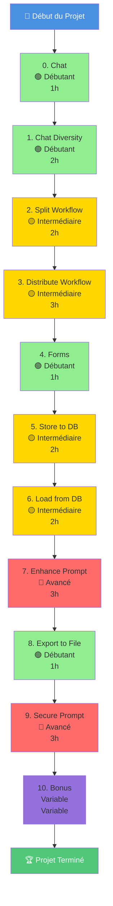
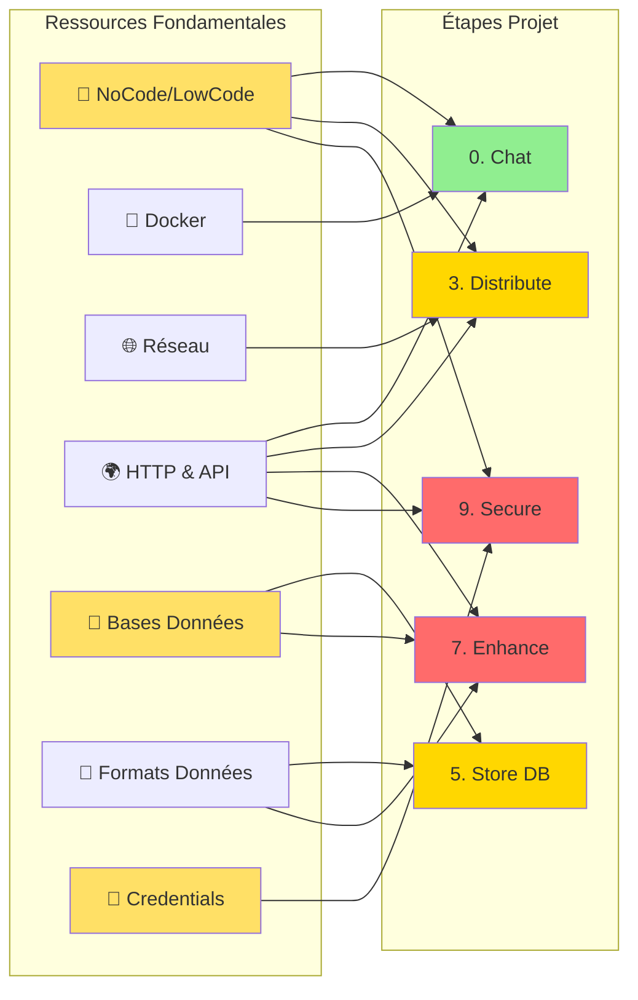

# Projet Guidé - Comparateur de LLM avec n8n

> 💡 **En bref** : Construire un système complet de comparaison de modèles de langage (LLM) avec n8n  
> ⏱️ **Temps total estimé** : 20-25 heures  
> 🎯 **Niveau** : Débutant à Intermédiaire  
> 📚 **Prérequis** : Installation n8n + PostgreSQL fonctionnelle

---

## 🎯 Objectif du Projet

Ce projet vise à **automatiser la comparaison des performances de plusieurs modèles de langage (LLM)**. L'objectif principal est de fournir une solution permettant d'évaluer et d'analyser les réponses générées par différents modèles sur un ensemble de tâches spécifiques. À la fin du processus, un rapport détaillé est produit pour résumer les résultats des comparaisons.

**À la fin de ce projet, vous aurez construit :**
- ✅ Un système de chat multi-LLM (Ollama, OpenAI, Gemini, Mistral)
- ✅ Une architecture distribuée avec webhooks
- ✅ Une base de données pour stocker questions/réponses
- ✅ Un système RAG (Retrieval Augmented Generation)
- ✅ Un module de sécurité contre les prompt injections
- ✅ Un outil d'export de rapports

---

## 🗺️ Roadmap du Projet - 11 Étapes



**Légende :**
- 🟢 **Débutant** : Concepts de base, étapes guidées
- 🟡 **Intermédiaire** : Nécessite compréhension des concepts
- 🔴 **Avancé** : Concepts complexes, nécessite autonomie

---

## 📋 Vue d'Ensemble des Étapes

| # | Étape | Difficulté | Temps | Concepts Clés |
|---|-------|------------|-------|---------------|
| 0 | **[Chat](./0.%20chat/)** | 🟢 Débutant | 1h | Workflow basique, LLM local, Ollama |
| 1 | **[Chat Diversity](./1.%20chat%20diversity/)** | 🟢 Débutant | 2h | Multi-providers, API keys, parallélisme |
| 2 | **[Split Workflow](./2.%20split%20workflow/)** | 🟡 Intermédiaire | 2h | Modularisation, sub-workflows, organisation |
| 3 | **[Distribute Workflow](./3.%20distribute%20workflow/)** | 🟡 Intermédiaire | 3h | Webhooks, HTTP requests, architecture distribuée |
| 4 | **[Forms](./4.%20forms/)** | 🟢 Débutant | 1h | Input utilisateur, validation, formulaires |
| 5 | **[Store to DB](./5.%20store%20to%20db/)** | 🟡 Intermédiaire | 2h | PostgreSQL, INSERT, relations, persistance |
| 6 | **[Load from DB](./6.%20load%20from%20db/)** | 🟡 Intermédiaire | 2h | SELECT, requêtes, historique, affichage |
| 7 | **[Enhance Prompt](./7.%20enhance%20prompt/)** | 🔴 Avancé | 3h | RAG, embeddings, contexte, enrichissement |
| 8 | **[Export to File](./8.%20export%20to%20file/)** | 🟢 Débutant | 1h | Génération Markdown/PDF, rapports |
| 9 | **[Secure Prompt](./9.%20secure%20prompt/)** | 🔴 Avancé | 3h | Sécurité, validation, prompt injection, guards |
| 10 | **[Bonus](./10.%20bonus/)** | Variable | Variable | Fonctionnalités avancées au choix |

**Total : 22 heures** (hors bonus)

---

## 📚 Matrice des Prérequis - Étapes ↔ Ressources



### Tableau Détaillé

| Étape | Ressources Essentielles | Ressources Utiles | À Consulter Avant |
|-------|-------------------------|-------------------|-------------------|
| **0. Chat** | NoCode, Docker | HTTP&API | Installation complète |
| **1. Diversity** | Credentials, HTTP&API | NoCode | Étape 0 |
| **2. Split** | NoCode (workflows) | - | Étape 1 |
| **3. Distribute** | Réseau, HTTP&API | NoCode | Étapes 1-2 |
| **4. Forms** | NoCode, Formats | - | Étape 3 |
| **5. Store DB** | Bases Données, Formats | NoCode | Étape 4 |
| **6. Load DB** | Bases Données | Formats | Étape 5 |
| **7. Enhance** | HTTP&API, Bases Données, Formats | - | Étapes 5-6 |
| **8. Export** | Formats | NoCode | Étape 6 |
| **9. Secure** | Credentials, HTTP&API | NoCode | Toutes précédentes |
| **10. Bonus** | [Selon choix] | - | Étape 9 |

---

## 🎓 Compétences Développées

En réalisant ce projet, vous développerez les compétences suivantes :

### 🔧 Techniques
1. **Automatisation No-Code/Low-Code**
   - Conception de workflows complexes avec n8n
   - Intégration de multiples APIs
   - Gestion d'erreurs et retry strategies

2. **Intégration d'APIs**
   - Connexion à OpenAI, Gemini, Mistral, Ollama
   - Authentification (API keys, OAuth)
   - Gestion des rate limits et quotas

3. **Bases de Données**
   - Modélisation relationnelle (PostgreSQL)
   - Requêtes SQL (CRUD complet)
   - Optimisation et indexation

4. **Architecture Distribuée**
   - Communication via webhooks
   - Architecture microservices
   - Gestion de la distribution des tâches

5. **Sécurité**
   - Protection contre les prompt injections
   - Validation et sanitization des inputs
   - Gestion sécurisée des credentials

### 📊 Analyse et Comparaison
1. **Évaluation de modèles IA**
   - Comparaison multi-critères
   - Métriques de performance
   - Analyse qualitative des réponses

2. **Visualisation de données**
   - Génération de rapports
   - Export dans différents formats
   - Présentation des résultats

### 💡 Méthodologie
1. **Développement itératif**
   - Construction progressive (11 étapes)
   - Tests et validation continus
   - Amélioration incrémentale

2. **Debug et troubleshooting**
   - Analyse des logs
   - Résolution de problèmes réseau/DB
   - Optimisation des workflows

---

## 🚦 Avant de Commencer

### Prérequis Techniques

✅ **Installation requise :**
- [ ] Docker et Docker Compose installés et fonctionnels
- [ ] n8n accessible sur `localhost:5678`
- [ ] PostgreSQL fonctionnel (port 5432)
- [ ] Ollama installé avec au moins le modèle Mistral

✅ **Comptes et API Keys :**
- [ ] Compte OpenAI + API key (avec crédit)
- [ ] Compte Google AI (Gemini) + API key
- [ ] Compte Mistral AI + API key

✅ **Connaissances recommandées :**
- [ ] Bases du terminal/ligne de commande
- [ ] Compréhension basique de JSON
- [ ] Notions de bases de données (utile pour étapes 5-6)

**⚠️ Si vous n'êtes pas prêt :**
1. Consultez d'abord [/installation/README.md](../installation/README.md)
2. Suivez [/installation/VERIFICATION.md](../installation/VERIFICATION.md)
3. Explorez [/ressources/README.md](../ressources/README.md)

---

## 📖 Comment Utiliser Ce Projet

### Approche Recommandée

1. **Suivez l'ordre des étapes** (0 → 10)
   - Chaque étape construit sur la précédente
   - Ne sautez pas d'étapes (sauf si très expérimenté)

2. **Consultez les ressources AVANT chaque étape**
   - Lisez les modules recommandés dans `/ressources`
   - Regardez les vidéos/articles externes

3. **Faites les exercices et validations**
   - Testez chaque workflow créé
   - Répondez aux quiz d'auto-évaluation
   - Consultez le troubleshooting si bloqué

4. **Sauvegardez systématiquement**
   - Exportez vos workflows après chaque étape
   - Nommez-les clairement (ex: `0_chat_ollama.json`)
   - Commitez dans Git si vous utilisez le versioning

5. **Documentez votre progression**
   - Utilisez [PROGRESSION.md](./PROGRESSION.md) (template fourni)
   - Notez les problèmes rencontrés et solutions
   - Prenez des screenshots de vos workflows

### Parcours Alternatifs

#### 🌱 **Parcours Débutant Complet** (25h)
Faites toutes les étapes dans l'ordre + consultez toutes les ressources

#### ⚡ **Parcours Express** (15h)
Étapes obligatoires : 0, 1, 3, 5, 6, 9 (sautez 2, 4, 7, 8)

#### 🚀 **Parcours Expert** (12h)
Consultez seulement les READMEs, implémentez directement sans tutoriel détaillé

---

## 🎯 Conseils de Réussite

### ✅ Bonnes Pratiques

1. **Planification**
   - Bloquez du temps dédié (2-3h minimum par session)
   - Ne faites pas tout d'un coup (risque de surcharge cognitive)
   - Prévoyez 20-30% de temps supplémentaire pour le debug

2. **Pendant le développement**
   - Testez CHAQUE node individuellement avant de continuer
   - Activez les workflows en mode "Manual" pendant les tests
   - Utilisez le debugger n8n (logs de chaque node)
   - Commentez vos nodes complexes avec des Sticky Notes

3. **Gestion des erreurs**
   - Lisez TOUJOURS les messages d'erreur complets
   - Consultez la section Troubleshooting de chaque étape
   - N'hésitez pas à recommencer un workflow si trop complexe
   - Utilisez le forum n8n ou Discord si vraiment bloqué

4. **Organisation**
   - Créez un dossier par étape avec workflows exportés
   - Nommez vos workflows de manière descriptive
   - Utilisez des tags/labels dans n8n pour organiser
   - Documentez vos choix (pourquoi tel provider, etc.)

### ❌ Pièges à Éviter

1. ❌ **Copier-coller sans comprendre** → Lisez et adaptez le code
2. ❌ **Sauter les validations** → Vous paierez plus tard en debug
3. ❌ **Ignorer les prérequis** → Vous serez bloqué rapidement
4. ❌ **Ne pas sauvegarder** → Risque de perdre des heures de travail
5. ❌ **Travailler 8h d'affilée** → Faites des pauses régulières
6. ❌ **Ne pas lire les messages d'erreur** → Ils contiennent souvent la solution
7. ❌ **Utiliser des API keys en production dans les tests** → Coûts inattendus !

---

## 📁 Structure des Dossiers

```
projet/
├── README.md                    ← Vous êtes ici
├── PROGRESSION.md               ← Template de suivi (à compléter)
├── TROUBLESHOOTING.md           ← Erreurs courantes consolidées
│
├── 0. chat/
│   ├── README.md                ← Instructions étape 0
│   └── [vos workflows .json]    ← Workflows sauvegardés
│
├── 1. chat diversity/
│   ├── README.md
│   └── [4 workflows .json]      ← Un par provider
│
├── 2. split workflow/
├── 3. distribute workflow/
├── 4. forms/
├── 5. store to db/
├── 6. load from db/
├── 7. enhance prompt/
├── 8. export to file/
├── 9. secure prompt/
└── 10. bonus/
```

---

## 🆘 Besoin d'Aide ?

### Ressources de Dépannage

1. **[TROUBLESHOOTING.md](./TROUBLESHOOTING.md)** - Erreurs courantes consolidées
2. **Section Troubleshooting de chaque étape** - Problèmes spécifiques
3. **[/ressources/GLOSSARY.md](../ressources/GLOSSARY.md)** - Définitions techniques
4. **[/installation/VERIFICATION.md](../installation/VERIFICATION.md)** - Vérifier l'installation

### Communautés et Support

- **n8n Community Forum** : https://community.n8n.io/
- **n8n Discord** : https://discord.gg/n8n
- **Documentation n8n** : https://docs.n8n.io/
- **Stack Overflow** : Tag `[n8n]`

### Problèmes Fréquents

| Symptôme | Étape Concernée | Solution Rapide |
|----------|-----------------|-----------------|
| "Cannot connect to Ollama" | 0, 1 | Vérifier Ollama tourne : `docker ps` |
| "Cannot connect to database" | 5, 6 | Vérifier credentials + `postgres` pas `localhost` |
| "Webhook not found" | 3, 4 | Vérifier workflow activé (pas juste testé) |
| "API rate limit exceeded" | 1, 7 | Attendre ou utiliser différent provider |
| "Out of memory" | 7, 9 | Réduire batch size, optimiser requêtes |

---

## 🏆 Après le Projet

### Vous Avez Terminé ? Félicitations ! 🎉

**Prochaines étapes suggérées :**

1. **Partagez votre travail**
   - Exportez vos workflows sur n8n.io/workflows
   - Créez un repo GitHub avec votre projet
   - Rédigez un article blog de votre expérience
   - Partagez sur LinkedIn/Twitter

2. **Améliorez le projet**
   - Ajoutez plus de LLMs (Claude, Llama 3, etc.)
   - Créez une interface web custom
   - Ajoutez des métriques avancées (coût, latence, qualité)
   - Implémentez du caching pour réduire les coûts

3. **Explorez davantage**
   - Consultez [/ressources/idees_projet/README.md](../ressources/idees_projet/README.md)
   - Participez aux projets n8n communautaires
   - Contribuez à la documentation

4. **Utilisez vos nouvelles compétences**
   - Automatisez vos tâches quotidiennes avec n8n
   - Créez des side projects avec LLMs
   - Postulez à des jobs utilisant ces technologies

---

## 📊 Template de Suivi de Progression

Copiez ce template dans [PROGRESSION.md](./PROGRESSION.md) :

```markdown
# Ma Progression - Projet Comparateur LLM

**Date de début** : __________
**Date de fin prévue** : __________

## Checklist Étapes

- [ ] 0. Chat (Début: ____ | Fin: ____)
- [ ] 1. Chat Diversity (Début: ____ | Fin: ____)
- [ ] 2. Split Workflow (Début: ____ | Fin: ____)
- [ ] 3. Distribute Workflow (Début: ____ | Fin: ____)
- [ ] 4. Forms (Début: ____ | Fin: ____)
- [ ] 5. Store to DB (Début: ____ | Fin: ____)
- [ ] 6. Load from DB (Début: ____ | Fin: ____)
- [ ] 7. Enhance Prompt (Début: ____ | Fin: ____)
- [ ] 8. Export to File (Début: ____ | Fin: ____)
- [ ] 9. Secure Prompt (Début: ____ | Fin: ____)
- [ ] 10. Bonus (Début: ____ | Fin: ____)

## Temps Passé

| Étape | Temps Estimé | Temps Réel | Notes |
|-------|--------------|------------|-------|
| 0 | 2h | | |
| 1 | 2h | | |
| ... | | | |

## Problèmes Rencontrés & Solutions

### Étape X
**Problème** : ...
**Solution** : ...
**Temps perdu** : ...

## Notes et Apprentissages

...
```

---

## ❓ FAQ du Projet

**Q : Combien coûte ce projet en API calls ?**  
Environ 2-5€ si vous utilisez principalement Ollama (gratuit) et limitez les appels à OpenAI/Gemini/Mistral pour les tests.

**Q : Puis-je faire le projet sans API keys payantes ?**  
Oui ! Utilisez uniquement Ollama (étapes 0, 2, 4, 5, 6, 8). Étapes 1, 3, 7, 9 nécessitent adaptations.

**Q : Mon PC n'est pas assez puissant pour Ollama, alternatives ?**  
Utilisez les APIs cloud uniquement (OpenAI, Gemini free tier). Étape 0 nécessite adaptation.

**Q : Combien de temps réellement pour tout finir ?**  
- Débutant total : 25-30h
- Avec bases techniques : 20-25h
- Expert : 12-15h

**Q : Puis-je faire le projet en équipe ?**  
Oui ! Divisez les étapes ou travaillez ensemble. L'étape 3 (Distribute) est parfaite pour le travail distribué.

**Q : Puis-je utiliser d'autres LLMs que ceux proposés ?**  
Absolument ! Claude (Anthropic), Llama 3, Cohere, etc. sont compatibles avec n8n.

**Q : Mon workflow ne marche pas après plusieurs heures, que faire ?**  
1. Pause de 15 minutes (vraiment !)
2. Consultez TROUBLESHOOTING.md
3. Recommencez le workflow from scratch (souvent plus rapide)
4. Demandez de l'aide sur Discord n8n

---

## 📝 Changelog du Projet

**Version 1.5.0** (Décembre 2024)
- ✅ Refonte complète de la structure pédagogique
- ✅ Ajout roadmap visuelle et matrice prérequis
- ✅ Standardisation de toutes les étapes
- ✅ Liens vers ressources internes
- ✅ Sections validation et troubleshooting

**Version 1.0.0** (Initial)
- Structure de base du projet
- 11 étapes définies

---

## 🚀 Prêt à Commencer ?

**Votre première étape** : [0. Chat - Création d'un premier workflow](./0.%20chat/README.md)

**Ce que vous allez apprendre** : Créer votre premier chat avec un LLM local (Ollama) en utilisant n8n.

**Bonne chance et bon coding ! 🎓✨**

---

_Documentation du Projet - Version 1.5.0 - Décembre 2024_
