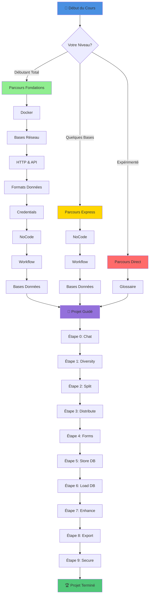
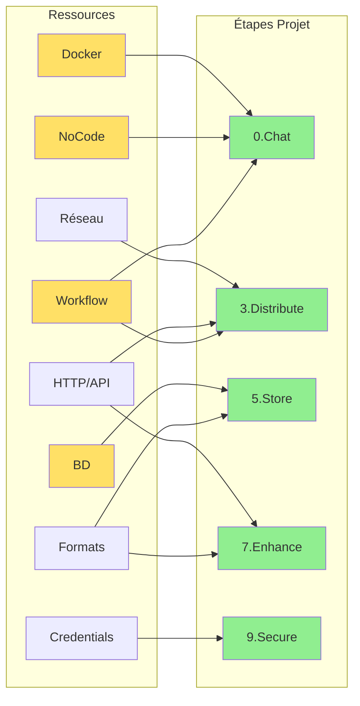

# Guide des Ressources - Intégration LLM

> 💡 **En bref** : Votre carte au trésor pour maîtriser l'intégration des LLM  
> ⏱️ **Temps total** : 10-15 heures (selon parcours)  
> 🎯 **Public** : Débutants à Intermédiaires  
> 📚 **Prérequis** : Curiosité et motivation !

---

## 📚 Bienvenue

Bienvenue dans ce dossier contenant des ressources explicatives à explorer avant de commencer le projet guidé. Ces
ressources vous permettront d'acquérir ou de renforcer les connaissances essentielles nécessaires pour avancer dans le
projet. Vous pourrez choisir quelles ressources explorer en fonction de vos connaissances préalables et de vos besoins
d'apprentissage.

**Note importante :** Il n'est pas nécessaire de tout comprendre ou d'avoir tout maîtrisé avant de commencer le projet
guidé. Cependant, il est essentiel de savoir où trouver les informations nécessaires afin de pouvoir y revenir au moment
opportun.

---

## 🗺️ Vue d'Ensemble - Roadmap d'Apprentissage



---

## 🎯 Choisissez Votre Parcours

### 🌱 Parcours 1 : Fondations (Débutant Total)

**Profil :** Vous découvrez le monde du développement et de l'automatisation  
**Temps estimé :** 12-15 heures  
**Ordre recommandé :**

1. **Docker** (1h30) - Comprendre la conteneurisation
2. **Bases Réseau** (1h30) - Comment les machines communiquent
3. **HTTP & API** (2h) - Les fondamentaux du web
4. **Formats Données** (1h) - JSON, XML, CSV
5. **Credentials** (1h) - Sécurité et bonnes pratiques
6. **NoCode/LowCode** (1h30) - Créer sans coder
7. **Workflow** (2h) - Automatisation et processus
8. **Bases Données** (2h) - PostgreSQL et SQL

**Après ce parcours :** Vous aurez toutes les bases pour réussir le projet ! 🎓

---

### ⚡ Parcours 2 : Express (Quelques Bases)

**Profil :** Vous connaissez Git, le terminal, et avez déjà codé un peu  
**Temps estimé :** 5-6 heures  
**Ordre recommandé :**

1. **NoCode/LowCode** (1h30) - Découvrir n8n
2. **Workflow** (2h) - Patterns d'automatisation
3. **Bases Données** (2h) - SQL avec PostgreSQL
4. **Glossaire** (30min) - Vocabulaire technique

**En parallèle :** Consultez les autres ressources au besoin pendant le projet

---

### 🚀 Parcours 3 : Direct au Projet (Expérimenté)

**Profil :** Dev expérimenté, vous connaissez déjà Docker, API, SQL  
**Temps estimé :** 1-2 heures  
**Ordre recommandé :**

1. **Glossaire** (30min) - Vocabulaire LLM et n8n
2. **NoCode/LowCode** (1h) - Spécificités de n8n
3. **Projet directement** - Learning by doing

**Stratégie :** Référencez les ressources uniquement si vous bloquez

---

## 📊 Matrice des Prérequis par Étape Projet



**Tableau détaillé :**

| Étape Projet | Ressources Essentielles | Ressources Utiles |
|--------------|-------------------------|-------------------|
| **0. Chat** | Docker, NoCode, Workflow | - |
| **1. Diversity** | Workflow (parallèle) | Formats Données |
| **2. Split** | Workflow (modularisation) | - |
| **3. Distribute** | Réseau, HTTP/API, Workflow | - |
| **4. Forms** | Formats Données | HTTP/API |
| **5. Store DB** | Bases Données, Formats | - |
| **6. Load DB** | Bases Données | - |
| **7. Enhance** | HTTP/API, Formats | Workflow |
| **8. Export** | Formats Données | - |
| **9. Secure** | Credentials, HTTP/API | Réseau |

---

## 📂 Catalogue des Ressources

### 1. 🐳 Docker

**Résumé :** Comprendre la conteneurisation pour déployer n8n et PostgreSQL  
**Temps :** 1h30 | **Niveau :** Débutant

**Vous apprendrez :**
- Qu'est-ce qu'un conteneur vs une VM
- Docker Compose pour orchestrer plusieurs services
- Commandes essentielles
- Debugging de conteneurs

**Contenu :**
- 📖 Théorie de la conteneurisation
- 🖼️ 2 diagrammes Mermaid (architecture, lifecycle)
- 💻 4 exercices pratiques
- ✅ Quiz 10 questions
- 📊 Cheat sheet commandes

**Quand l'utiliser :** Avant l'installation, puis référence pendant tout le projet

[→ Accéder au module Docker](./docker/)

---

### 2. 🌐 Bases Réseau

**Résumé :** Comprendre TCP/IP, ports, localhost, et communication réseau  
**Temps :** 1h30 | **Niveau :** Débutant

**Vous apprendrez :**
- Modèle OSI simplifié
- IP, ports, protocoles (TCP/UDP)
- Localhost vs 0.0.0.0
- DNS et résolution de noms
- Réseau Docker

**Contenu :**
- 📖 Concepts réseau essentiels
- 🖼️ 2 diagrammes Mermaid (OSI, Docker networking)
- 💻 3 exercices (ping, netstat, troubleshooting)
- ✅ Quiz 10 questions
- 📊 Table de ports courants

**Quand l'utiliser :** Avant étape 3 (Distribute), et si problèmes de connexion

[→ Accéder au module Réseau](./bases_reseau/)

---

### 3. 🌍 HTTP & API

**Résumé :** Protocole HTTP, REST API, méthodes, codes de statut  
**Temps :** 2h | **Niveau :** Débutant-Intermédiaire

**Vous apprendrez :**
- Requête/Réponse HTTP
- Méthodes (GET, POST, PUT, DELETE)
- Codes de statut (200, 404, 500...)
- Headers et authentification
- REST API principles

**Contenu :**
- 📖 HTTP en profondeur
- 🖼️ 2 diagrammes Mermaid (client-server, REST)
- 💻 5 exercices (curl, APIs, debugging)
- ✅ Quiz 15 questions
- 📊 Table complète codes HTTP

**Quand l'utiliser :** Avant étape 3 (webhooks), 7 (RAG), 9 (sécurité)

[→ Accéder au module HTTP & API](./http&API/)

---

### 4. 📄 Formats de Données

**Résumé :** JSON, XML, CSV, YAML - quand et comment les utiliser  
**Temps :** 1h | **Niveau :** Débutant

**Vous apprendrez :**
- Structure JSON et manipulation
- Comparaison JSON vs XML vs CSV vs YAML
- Parsing et génération
- Cas d'usage de chaque format

**Contenu :**
- 📖 Guide des formats
- 🖼️ 1 diagramme Mermaid (comparaison)
- 💻 4 exercices (conversion, parsing)
- ✅ Quiz 10 questions
- 📊 Table comparative

**Quand l'utiliser :** Dès le début (n8n utilise JSON partout)

[→ Accéder au module Formats](./formats_donnees/)

---

### 5. 🔐 Credentials & Sécurité

**Résumé :** Gérer secrets, API keys, mots de passe de manière sécurisée  
**Temps :** 1h | **Niveau :** Débutant-Intermédiaire

**Vous apprendrez :**
- Pourquoi ne JAMAIS hardcoder les secrets
- Variables d'environnement (.env)
- OAuth 2.0 flow
- Credentials dans n8n
- Bonnes pratiques sécurité

**Contenu :**
- 📖 Guide sécurité
- 🖼️ 1 diagramme Mermaid (OAuth flow)
- 💻 3 exercices
- ✅ Quiz 10 questions
- 📊 Checklist sécurité

**Quand l'utiliser :** Avant installation (.env), puis étape 9 (Secure Prompt)

[→ Accéder au module Credentials](./credentials/)

---

### 6. 🎨 NoCode / LowCode

**Résumé :** Créer sans coder avec n8n, comparaison avec autres outils  
**Temps :** 1h30 | **Niveau :** Débutant

**Vous apprendrez :**
- Différence NoCode vs LowCode vs Code
- Architecture de n8n
- Nodes, triggers, workflows
- 400+ intégrations disponibles

**Contenu :**
- 📖 Guide complet n8n
- 🖼️ 2 diagrammes Mermaid (architecture, comparaison outils)
- 💻 4 exercices pratiques
- ✅ Quiz 10 questions
- 📊 Table comparative outils
- 📊 Cheat sheet n8n

**Quand l'utiliser :** AVANT le projet (essentiel !)

[→ Accéder au module NoCode](./nocode_lowcode/)

---

### 7. 🔄 Workflow

**Résumé :** Patterns de workflows, automatisation, Git Flow, CI/CD  
**Temps :** 2h | **Niveau :** Intermédiaire

**Vous apprendrez :**
- 5 patterns essentiels (séquentiel, parallèle, conditionnel, error, event)
- Git workflow (Git Flow, GitHub Flow)
- Automatisation CI/CD
- Orchestration (Airflow, n8n)
- Bonnes pratiques

**Contenu :**
- 📖 Guide exhaustif
- 🖼️ 5 diagrammes Mermaid (tous les patterns)
- 💻 5 exercices (du simple au CI/CD)
- ✅ Quiz 10 questions
- 📊 Cheat sheet patterns
- 📊 Commandes Git

**Quand l'utiliser :** Après NoCode, avant le projet

[→ Accéder au module Workflow](./workflow/)

---

### 8. 💾 Bases de Données

**Résumé :** PostgreSQL, SQL, modélisation, requêtes  
**Temps :** 2h | **Niveau :** Débutant-Intermédiaire

**Vous apprendrez :**
- Concepts BDD relationnelles
- SQL : SELECT, INSERT, UPDATE, DELETE
- Jointures, index, transactions
- Intégration avec n8n
- Modélisation de données

**Contenu :**
- 📖 Guide SQL complet (3000+ lignes)
- 🖼️ 3 diagrammes Mermaid (ERD, architecture)
- 💻 20+ exercices progressifs
- ✅ Quiz complet
- 📊 Cheat sheet SQL

**Quand l'utiliser :** Avant étapes 5-6 (Store/Load DB)

[→ Accéder au module Bases Données](./bases_donnees/)

---

### 9. 💡 Idées de Projet

**Résumé :** Inspiration pour vos propres projets après le cours  
**Temps :** 30min | **Niveau :** Tous

**Contenu :**
- 20+ idées de projets avec LLM
- Classées par difficulté
- Ressources nécessaires pour chacune
- Extensions possibles

**Quand l'utiliser :** Après avoir terminé le projet guidé

[→ Accéder aux Idées Projet](./idees_projet/)

---

### 10. 📖 Glossaire Technique

**Résumé :** 65+ termes techniques expliqués simplement  
**Temps :** 30min | **Niveau :** Tous

**Contenu :**
- Termes IA/LLM (prompt, token, RAG...)
- Termes n8n (node, workflow, webhook...)
- Termes infrastructure (Docker, API, port...)
- Termes base de données
- Index alphabétique et thématique

**Quand l'utiliser :** Référence constante pendant tout le cours

[→ Accéder au Glossaire](./GLOSSARY.md)

---

## ⏱️ Estimation de Temps par Parcours

| Parcours | Ressources à Lire | Temps Lecture | Temps Exercices | Total |
|----------|-------------------|---------------|-----------------|-------|
| **Fondations** | 8 modules | 8h | 4-5h | 12-15h |
| **Express** | 4 modules | 3h | 2-3h | 5-6h |
| **Direct** | 2 modules | 1h | 1h | 2h |

**Note :** Ces temps sont indicatifs. Allez à votre rythme ! 🐢🐇

---

## 📋 Checklist Avant de Commencer le Projet

Cochez ce que vous avez compris/installé :

**Installation :**
- [ ] Docker installé et fonctionnel
- [ ] docker-compose fonctionne
- [ ] Fichier .env configuré
- [ ] n8n accessible sur http://localhost:5678
- [ ] PostgreSQL accessible

**Connaissances :**
- [ ] Je comprends ce qu'est un workflow
- [ ] Je sais ce qu'est JSON
- [ ] Je comprends les bases de Docker
- [ ] Je sais naviguer dans l'interface n8n
- [ ] Je comprends les triggers et nodes
- [ ] Je sais ce qu'est une API
- [ ] Je comprends les bases SQL (pour étapes 5-6)

**Si moins de 50% coché :** Parcours Fondations recommandé  
**Si 50-80% coché :** Parcours Express recommandé  
**Si 80%+ coché :** Parcours Direct recommandé

---

## 🎓 Conseils d'Apprentissage

### ✅ Bonnes Pratiques

1. **Pas de rush** : Mieux vaut bien comprendre que finir vite
2. **Pratiquez** : Faites tous les exercices, c'est crucial
3. **Expérimentez** : Cassez des choses, c'est comme ça qu'on apprend
4. **Documentez** : Prenez des notes, faites des screenshots
5. **Posez des questions** : Utilisez le forum, Discord, ou demandez au formateur

### ❌ Pièges à Éviter

1. ❌ Lire sans pratiquer
2. ❌ Copier-coller sans comprendre
3. ❌ Sauter des étapes
4. ❌ Ne pas lire les messages d'erreur
5. ❌ Travailler 8h d'affilée (faites des pauses !)

---

## 🆘 Besoin d'Aide ?

### Problème d'Installation
→ Consultez [installation/VERIFICATION.md](../installation/VERIFICATION.md)

### Erreur Docker
→ Consultez [ressources/docker/README.md](./docker/README.md) section "Erreurs Courantes"

### Erreur n8n
→ Consultez [ressources/nocode_lowcode/README.md](./nocode_lowcode/README.md) section "Erreurs Courantes"

### Problème Réseau/Connexion
→ Consultez [ressources/bases_reseau/README.md](./bases_reseau/README.md)

### Terme Technique Inconnu
→ Consultez [ressources/GLOSSARY.md](./GLOSSARY.md)

---

## 📊 Votre Progression

Notez ici vos progrès :

```
[ ] Docker
[ ] Bases Réseau
[ ] HTTP & API
[ ] Formats Données
[ ] Credentials
[ ] NoCode/LowCode
[ ] Workflow
[ ] Bases Données
[ ] Idées Projet
[ ] Glossaire

PROJET:
[ ] Étape 0 - Chat
[ ] Étape 1 - Diversity
[ ] Étape 2 - Split
[ ] Étape 3 - Distribute
[ ] Étape 4 - Forms
[ ] Étape 5 - Store DB
[ ] Étape 6 - Load DB
[ ] Étape 7 - Enhance
[ ] Étape 8 - Export
[ ] Étape 9 - Secure
[ ] Étape 10 - Bonus

Date de début : ___________
Date de fin : ___________
```

---

## 🎯 Prochaines Étapes

1. **Choisissez votre parcours** (Fondations, Express, ou Direct)
2. **Suivez l'ordre recommandé** des ressources
3. **Faites tous les exercices** de chaque module
4. **Validez avec les quiz** (objectif : 80%+ de bonnes réponses)
5. **Passez au projet guidé** dans `/projet`

---

## 📚 Ressources Externes Recommandées

**Général :**
- [freeCodeCamp](https://www.freecodecamp.org/) - Cours gratuits
- [MDN Web Docs](https://developer.mozilla.org/) - Documentation web

**Docker :**
- [Docker Documentation](https://docs.docker.com/)
- [Play with Docker](https://labs.play-with-docker.com/) - Lab en ligne

**n8n :**
- [n8n Documentation](https://docs.n8n.io/)
- [n8n Community](https://community.n8n.io/)
- [n8n YouTube](https://www.youtube.com/c/n8n-io)

**SQL :**
- [SQLBolt](https://sqlbolt.com/) - Exercices interactifs
- [PostgreSQL Tutorial](https://www.postgresqltutorial.com/)

**APIs :**
- [RESTful API Design](https://restfulapi.net/)
- [Postman Learning Center](https://learning.postman.com/)

---

Ces ressources seront complétées par des interventions du formateur lors de la première journée. N'hésitez pas à poser
des questions ou à demander des précisions si certains points ne vous semblent pas clairs.

**Bonne exploration et bon apprentissage !** 🚀

---

_Dernière mise à jour : Décembre 2024 | Version 1.4.0_
