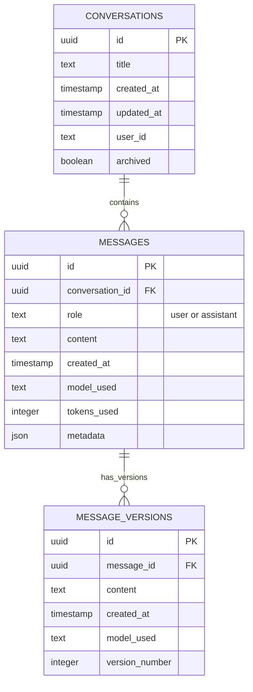

# Introduction aux Bases de Données et PostgreSQL

> 💡 **En bref** : Maîtriser PostgreSQL et SQL pour stocker/récupérer les conversations  
> ⏱️ **Temps de lecture** : 2 heures  
> 🎯 **Niveau** : Débutant à Intermédiaire  
> 📚 **Prérequis** : Bases du terminal

Ce guide vous accompagne dans la compréhension des bases de données relationnelles, avec un focus particulier sur PostgreSQL, utilisé dans ce projet pour stocker les questions et réponses des LLM.

---

## 🎯 Objectifs d'Apprentissage

À la fin de ce module, vous serez capable de :

- ✅ Comprendre les concepts des bases de données relationnelles
- ✅ Créer et modifier des tables PostgreSQL
- ✅ Écrire des requêtes SQL (SELECT, INSERT, UPDATE, DELETE)
- ✅ Utiliser les jointures pour relier des tables
- ✅ Intégrer PostgreSQL avec n8n
- ✅ Optimiser les requêtes avec des index

---

## 1. Qu'est-ce qu'une Base de Données ?

Une **base de données** est un système organisé permettant de stocker, gérer et récupérer des informations de manière structurée. Elle permet de :

- **Persister les données** : Conserver l'information même après l'arrêt de l'application
- **Structurer l'information** : Organiser les données de manière cohérente
- **Interroger efficacement** : Retrouver rapidement des informations spécifiques
- **Garantir l'intégrité** : S'assurer que les données restent cohérentes

### Types de bases de données

1. **Bases de données relationnelles (SQL)** :
   - Données organisées en tables avec des relations entre elles
   - Exemples : PostgreSQL, MySQL, SQLite, Oracle
   
2. **Bases de données NoSQL** :
   - Données stockées sous forme de documents, clé-valeur, graphes, etc.
   - Exemples : MongoDB, Redis, Cassandra

Dans ce cours, nous utilisons **PostgreSQL**, une base de données relationnelle.

---

## 2. PostgreSQL : Vue d'ensemble

### Qu'est-ce que PostgreSQL ?

PostgreSQL est un système de gestion de base de données relationnelle (SGBDR) open-source, réputé pour :

- **Robustesse** : Fiabilité et conformité aux standards SQL
- **Extensibilité** : Support de types de données personnalisés et extensions (comme pgvector pour les embeddings)
- **Performance** : Optimisations avancées pour les requêtes complexes
- **Communauté active** : Documentation complète et support important

### Pourquoi PostgreSQL pour ce projet ?

- ✅ Gratuit et open-source
- ✅ Excellent support des données JSON
- ✅ Extension **pgvector** pour stocker des embeddings (utilisé dans les étapes avancées)
- ✅ Intégration native avec n8n
- ✅ Outil de gestion visuel (pgAdmin) inclus dans notre environnement Docker

---

## 3. Concepts Fondamentaux SQL

### 3.1 Tables

Une **table** est une structure qui organise les données en lignes et colonnes, comme un tableau Excel.

**Exemple** : Table `question`

| id  | question                        | date                |
|-----|---------------------------------|---------------------|
| 1   | Qu'est-ce que l'IA ?           | 2025-01-15 10:30:00 |
| 2   | Comment fonctionne un LLM ?    | 2025-01-15 10:35:00 |

### 3.2 Colonnes et Types de Données

Chaque colonne a un **type de données** qui définit ce qu'elle peut contenir :

| Type       | Description                          | Exemple                    |
|------------|--------------------------------------|----------------------------|
| `INTEGER`  | Nombre entier                        | 42, -10, 0                 |
| `SERIAL`   | Entier auto-incrémenté (pour les ID) | 1, 2, 3...                 |
| `TEXT`     | Chaîne de caractères                 | "Bonjour"                  |
| `VARCHAR(n)` | Chaîne limitée à n caractères       | VARCHAR(255)               |
| `BOOLEAN`  | Vrai ou faux                         | true, false                |
| `TIMESTAMP` | Date et heure                       | 2025-01-15 10:30:00        |
| `JSON`     | Données au format JSON               | {"key": "value"}           |

### 3.3 Clés Primaires et Clés Étrangères

- **Clé primaire (PRIMARY KEY)** : Identifiant unique pour chaque ligne
- **Clé étrangère (FOREIGN KEY)** : Référence à une clé primaire d'une autre table

**Exemple de relation** :

```
Table "question"               Table "reponse"
+----+----------+              +----+----------+-------------+
| id | question |              | id | reponse  | question_id |
+----+----------+              +----+----------+-------------+
| 1  | Q1       | <----------- | 1  | R1       | 1           |
| 2  | Q2       |              | 2  | R2       | 1           |
+----+----------+              | 3  | R3       | 2           |
                               +----+----------+-------------+
```

---

## 🖼️ Schéma de Base de Données du Projet

Voici le modèle de données utilisé dans le projet (Étapes 5-6) :



**Explications du schéma :**

**Table CONVERSATIONS :**
- `id` : Identifiant unique (UUID)
- `title` : Titre de la conversation (ex: "Discussion sur l'IA")
- `created_at` / `updated_at` : Dates de création/modification
- `user_id` : Identifiant de l'utilisateur (pour multi-utilisateurs)
- `archived` : Conversation archivée ou non

**Table MESSAGES :**
- `id` : Identifiant unique du message
- `conversation_id` : Référence à la conversation (FOREIGN KEY)
- `role` : "user" (question) ou "assistant" (réponse LLM)
- `content` : Contenu du message
- `model_used` : Quel LLM a été utilisé (GPT-4, GPT-3.5, Mistral...)
- `tokens_used` : Nombre de tokens consommés
- `metadata` : Données additionnelles en JSON (température, prompt system...)

**Table MESSAGE_VERSIONS :**
- Permet de stocker plusieurs versions d'une même réponse
- Utile pour l'étape 1 (Chat Diversity) : comparer plusieurs modèles
- `version_number` : 1, 2, 3... pour ordonner les versions

**Relations :**
- Une conversation contient N messages (1:N)
- Un message peut avoir N versions (1:N)

**Utilisation dans le projet :**
- **Étape 5 (Store to DB)** : INSERT messages après chaque interaction
- **Étape 6 (Load from DB)** : SELECT pour afficher l'historique
- **Étape 7 (Enhance Prompt)** : SELECT pour contexte RAG
- **Étape 8 (Export to File)** : SELECT + formatage en Markdown/PDF

---

## 4. Les Commandes SQL Essentielles

### 4.1 CREATE - Créer une table

```sql
CREATE TABLE question (
    id SERIAL PRIMARY KEY,
    question TEXT NOT NULL,
    date TIMESTAMP DEFAULT CURRENT_TIMESTAMP
);
```

**Explication** :
- `SERIAL PRIMARY KEY` : Identifiant auto-incrémenté
- `NOT NULL` : La valeur ne peut pas être vide
- `DEFAULT CURRENT_TIMESTAMP` : Date actuelle par défaut

### 4.2 INSERT - Insérer des données

```sql
INSERT INTO question (question) 
VALUES ('Qu''est-ce que PostgreSQL ?');
```

**Note** : Pour inclure une apostrophe dans une chaîne, doublez-la (`''`)

### 4.3 SELECT - Récupérer des données

```sql
-- Récupérer toutes les questions
SELECT * FROM question;

-- Récupérer uniquement certaines colonnes
SELECT id, question FROM question;

-- Filtrer avec WHERE
SELECT * FROM question WHERE id = 1;

-- Trier les résultats
SELECT * FROM question ORDER BY date DESC;

-- Limiter le nombre de résultats
SELECT * FROM question LIMIT 10;
```

### 4.4 UPDATE - Modifier des données

```sql
UPDATE question 
SET question = 'Nouvelle question' 
WHERE id = 1;
```

### 4.5 DELETE - Supprimer des données

```sql
-- Supprimer une ligne spécifique
DELETE FROM question WHERE id = 1;

-- Supprimer toutes les lignes (attention !)
DELETE FROM question;
```

### 4.6 JOIN - Combiner des tables

```sql
-- Récupérer les questions avec leurs réponses
SELECT 
    q.id,
    q.question,
    r.reponse,
    r.provider
FROM question q
LEFT JOIN reponse r ON q.id = r.question_id;
```

**Types de JOIN** :
- `INNER JOIN` : Seulement les lignes avec correspondance dans les deux tables
- `LEFT JOIN` : Toutes les lignes de la table de gauche, même sans correspondance
- `RIGHT JOIN` : Toutes les lignes de la table de droite
- `FULL OUTER JOIN` : Toutes les lignes des deux tables

---

## 5. Utilisation dans le Projet

### Structure utilisée dans le projet

```sql
-- Table principale pour les questions
CREATE TABLE question (
    id SERIAL PRIMARY KEY,
    question TEXT NOT NULL,
    date TIMESTAMP DEFAULT CURRENT_TIMESTAMP
);

-- Table pour les réponses des différents LLM
CREATE TABLE reponse (
    id SERIAL PRIMARY KEY,
    reponse TEXT NOT NULL,
    provider TEXT NOT NULL,
    question_id INTEGER NOT NULL REFERENCES question(id)
);
```

### Exemple de requête complète

```sql
-- Récupérer toutes les questions avec leurs réponses groupées
SELECT 
    q.id,
    q.question,
    q.date,
    json_agg(
        json_build_object(
            'provider', r.provider,
            'reponse', r.reponse
        )
    ) as reponses
FROM question q
LEFT JOIN reponse r ON q.id = r.question_id
GROUP BY q.id, q.question, q.date
ORDER BY q.date DESC;
```

Cette requête retourne un résultat au format :
```json
{
  "id": 1,
  "question": "Qu'est-ce que l'IA ?",
  "date": "2025-01-15T10:30:00",
  "reponses": [
    {"provider": "OpenAI", "reponse": "L'IA est..."},
    {"provider": "Mistral", "reponse": "L'intelligence artificielle..."}
  ]
}
```

---

## 6. Bonnes Pratiques

### 6.1 Nommage

- **Tables** : Noms au singulier (`question`, pas `questions`)
- **Colonnes** : Noms descriptifs en minuscules (`question_id`, pas `qId`)
- **Conventions** : Utilisez snake_case (`created_at`) plutôt que camelCase

### 6.2 Sécurité

- ⚠️ **JAMAIS** de mot de passe en dur dans le code
- ✅ Utilisez des variables d'environnement (fichier `.env`)
- ✅ Limitez les permissions des utilisateurs de la base de données
- ✅ Validez les entrées côté application avant insertion

### 6.3 Performance

- ✅ Créez des **index** sur les colonnes fréquemment recherchées :
  ```sql
  CREATE INDEX idx_question_date ON question(date);
  ```
- ✅ Utilisez `EXPLAIN ANALYZE` pour comprendre les performances :
  ```sql
  EXPLAIN ANALYZE SELECT * FROM question WHERE date > NOW() - INTERVAL '1 day';
  ```

### 6.4 Sauvegarde

Toujours sauvegarder régulièrement :
```bash
# Backup
docker exec postgres pg_dump -U n8n_user n8n > backup.sql

# Restore
docker exec -i postgres psql -U n8n_user n8n < backup.sql
```

---

## 7. Outils de Gestion : pgAdmin

### Accès à pgAdmin

Dans notre environnement Docker :
- URL : http://localhost:5050
- Email : admin@admin.com
- Password : admin (configuré dans docker-compose.yml)

### Connexion à PostgreSQL dans pgAdmin

1. Clic droit sur "Servers" → "Register" → "Server"
2. Onglet "General" : Nom = "n8n_postgres"
3. Onglet "Connection" :
   - Host : `postgres` (nom du service Docker)
   - Port : `5432`
   - Database : `n8n`
   - Username : `n8n_user`
   - Password : `n8n_password`

### Fonctionnalités utiles de pgAdmin

- 📊 **Query Tool** : Exécuter des requêtes SQL
- 📈 **Visualisation** : Explorer les tables et leurs données
- 🔧 **Modification** : Créer/modifier des tables visuellement
- 📥 **Import/Export** : Importer des CSV ou exporter des données

---

## 8. Ressources Complémentaires

### Tutoriels interactifs

- [PostgreSQL Tutorial](https://www.postgresqltutorial.com/) - Tutoriel complet et progressif
- [SQL Teaching](https://www.sqlteaching.com/) - Apprendre SQL de manière interactive
- [Mode Analytics SQL Tutorial](https://mode.com/sql-tutorial/) - SQL pour l'analyse de données

### Documentation officielle

- [PostgreSQL Official Documentation](https://www.postgresql.org/docs/)
- [PostgreSQL sur Wikipedia](https://fr.wikipedia.org/wiki/PostgreSQL)

### Vidéos

- [Comprendre les bases de données relationnelles (YouTube)](https://www.youtube.com/watch?v=FR4QIeZaPeM)
- [PostgreSQL Tutorial for Beginners (YouTube)](https://www.youtube.com/watch?v=qw--VYLpxG4)
- [SQL en 10 minutes (Grafikart)](https://grafikart.fr/tutoriels/sql-select-1070)

### Outils en ligne

- [SQL Fiddle](http://sqlfiddle.com/) - Tester des requêtes SQL en ligne
- [DB Diagram](https://dbdiagram.io/) - Créer des schémas de base de données visuellement

---

## 9. Exercices Pratiques

### Exercice 1 : Création de table

Créez une table `utilisateur` avec les colonnes suivantes :
- `id` : Identifiant auto-incrémenté
- `nom` : Texte, obligatoire
- `email` : Texte, obligatoire et unique
- `date_inscription` : Timestamp par défaut à maintenant

<details>
<summary>Solution</summary>

```sql
CREATE TABLE utilisateur (
    id SERIAL PRIMARY KEY,
    nom TEXT NOT NULL,
    email TEXT NOT NULL UNIQUE,
    date_inscription TIMESTAMP DEFAULT CURRENT_TIMESTAMP
);
```
</details>

### Exercice 2 : Requêtes simples

1. Insérez 3 questions dans la table `question`
2. Récupérez toutes les questions ajoutées aujourd'hui
3. Comptez le nombre total de questions

<details>
<summary>Solution</summary>

```sql
-- 1. Insertion
INSERT INTO question (question) VALUES 
    ('Première question'),
    ('Deuxième question'),
    ('Troisième question');

-- 2. Questions du jour
SELECT * FROM question 
WHERE DATE(date) = CURRENT_DATE;

-- 3. Comptage
SELECT COUNT(*) as total FROM question;
```
</details>

### Exercice 3 : Relations

Ajoutez 2 réponses pour la première question avec des providers différents, puis récupérez la question avec toutes ses réponses.

<details>
<summary>Solution</summary>

```sql
-- Insertion des réponses
INSERT INTO reponse (reponse, provider, question_id) VALUES
    ('Réponse de OpenAI', 'OpenAI', 1),
    ('Réponse de Mistral', 'Mistral', 1);

-- Récupération
SELECT 
    q.question,
    r.provider,
    r.reponse
FROM question q
LEFT JOIN reponse r ON q.id = r.question_id
WHERE q.id = 1;
```
</details>

---

## Conclusion

PostgreSQL est un outil puissant pour gérer vos données de manière structurée. Dans ce projet, vous l'utiliserez pour :

1. **Étape 5** : Sauvegarder les questions et réponses des LLM
2. **Étape 6** : Charger ces données pour analyse
3. **Étape 7** : Enrichir les prompts avec les données stockées (RAG)
4. **Étapes avancées** : Utiliser pgvector pour stocker des embeddings

Prenez le temps de vous familiariser avec ces concepts avant de commencer l'étape 5 du projet !
