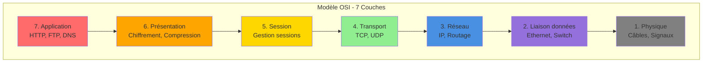
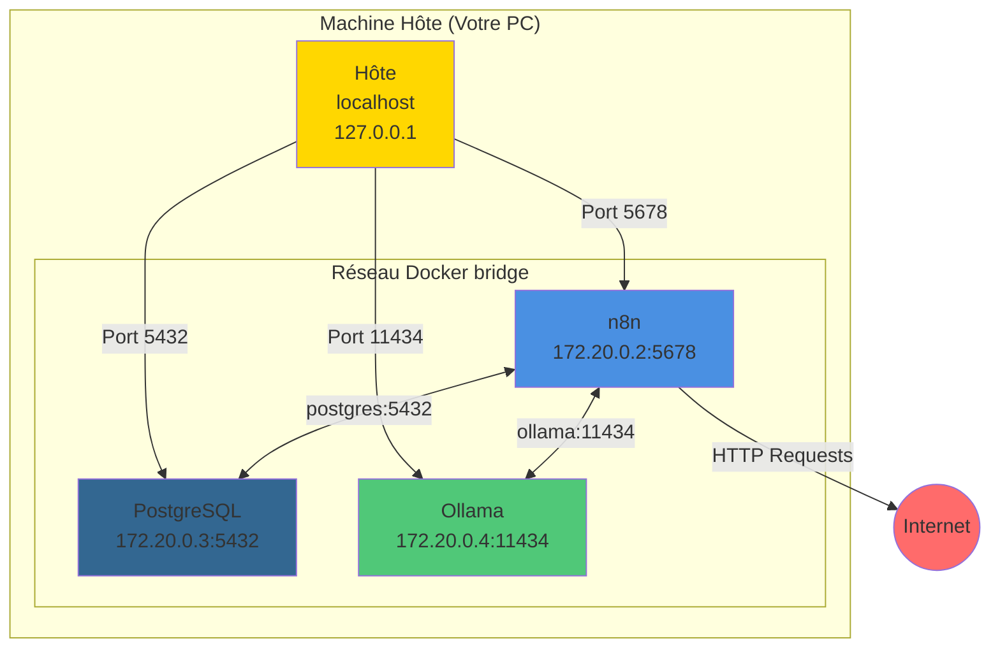

# Introduction aux Bases du Réseau : Focus sur IP et IPv4

> 💡 **En bref** : Comprendre les réseaux pour faire communiquer les services (n8n, PostgreSQL, APIs)  
> ⏱️ **Temps de lecture** : 1h30  
> 🎯 **Niveau** : Débutant  
> 📚 **Prérequis** : Aucun

---

## 🎯 Objectifs du Cours

Dans ce cours, vous allez :

- Comprendre les concepts fondamentaux des réseaux informatiques.
- Découvrir le rôle et le fonctionnement du protocole IP (Internet Protocol).
- Explorer plus spécifiquement IPv4 et ses fonctionnalités principales.
- Accéder à des ressources en ligne utiles pour approfondir vos connaissances.

---

## 1. Qu'est-ce qu'un réseau informatique ?

Un réseau informatique est un ensemble de dispositifs connectés ensemble pour échanger des données. Parmi les éléments
de base qui constituent un réseau, on trouve :

- **Les hôtes** : Les ordinateurs, serveurs ou tout autre appareil capable d'envoyer ou de recevoir des données dans un
  réseau. Ce sont souvent ces appareils qui hébergent des applications ou des services que vous utilisez au quotidien.
- **Les équipements réseau** : Ces dispositifs, comme les routeurs, commutateurs et points d'accès, assurent la
  connectivité et gèrent le trafic réseau entre les hôtes.
- **Les protocoles** : Ce sont des règles ou des normes qui encadrent la façon dont les appareils communiquent. TCP/IP
  est l'ensemble de protocoles utilisé pour Internet et la majorité des réseaux locaux.

Un protocole, tel que **IP**, agit comme un "langage commun" permettant aux machines d'échanger des informations
efficacement quelles que soient leurs différences.

### Ressources pour approfondir

- [Vidéo : Les bases des réseaux informatiques (YouTube - FR)](https://www.youtube.com/watch?v=J12m5mIAF2k)
- [Article détaillé sur les réseaux informatiques (Wikipedia)](https://fr.wikipedia.org/wiki/R%C3%A9seau_informatique)
- [Tutoriel interactif sur les concepts de base en réseau (Cisco)](https://www.cisco.com)

### Modèle OSI (Open Systems Interconnection)

Le modèle OSI est un cadre théorique qui décrit comment les différents composants d'un réseau informatique communiquent
entre eux. Il est divisé en **sept couches**, chacune ayant un rôle spécifique dans le traitement et le transfert des
données. Ce modèle aide à standardiser la communication réseau et à faciliter l'interopérabilité entre différents
systèmes et technologies.



#### Les sept couches du modèle OSI :

1. **Couche Physique** : S'occupe des aspects matériels et électriques pour la transmission des données sous forme de
   bits (câbles, signaux, etc.).
2. **Couche Liaison de données** : Assure la communication entre deux appareils directement connectés (commutateurs,
   détection des erreurs, etc.).
3. **Couche Réseau** : Gère le routage des données d'un réseau à un autre (ex. : protocole IP).
4. **Couche Transport** : Assure un transfert fiable des données entre deux hôtes (ex. : TCP, UDP).
5. **Couche Session** : Gère les sessions de communication entre les applications.
6. **Couche Présentation** : Traduction des données pour les rendre compréhensibles entre systèmes (ex. : compression,
   chiffrement).
7. **Couche Application** : Fournit des services réseau aux applications utilisateur (ex. : HTTP, FTP, DNS).

**Dans notre projet :**
- **Couche 7 (Application)** : n8n, webhooks, API HTTP
- **Couche 4 (Transport)** : TCP pour connexions fiables
- **Couche 3 (Réseau)** : IP pour adressage (localhost, 0.0.0.0)

Ce modèle théorique est souvent utilisé comme outil pédagogique pour comprendre le fonctionnement des réseaux
informatiques. Bien que le modèle TCP/IP soit plus largement utilisé en pratique, le modèle OSI reste une référence pour
analyser et concevoir des architectures réseau.

#### Ressources pour approfondir

- [Vidéo : Comprendre le modèle OSI (YouTube - FR)](https://www.youtube.com/watch?v=ewrBalT_eBM)
- [Article détaillé sur le modèle OSI (Wikipedia)](https://fr.wikipedia.org/wiki/Mod%C3%A8le_OSI)
- [Comparaison OSI vs TCP/IP (Cisco Blog)](https://www.cisco.com)
---

## 2. Comprendre l'adresse IP

L'*Internet Protocol* (IP) est utilisé pour identifier et localiser les machines sur un réseau. Il joue un rôle
fondamental dans le transfert de données d'un appareil source à une destination sur Internet.

### Qu'est-ce qu'une adresse IP ?

Une **adresse IP** est une adresse unique attribuée à chaque appareil connecté à un réseau. Elle permet de les
identifier et de s'assurer que les données atteignent le bon destinataire.

Une adresse IPv4 (version 4) est composée de quatre nombres (appelés octets), séparés par des points.  
Par exemple : **192.168.0.1**

Chaque octet varie entre 0 et 255. Cela donne un total possible de **4,3 milliards d'adresses uniques** disponibles dans
IPv4. Cependant, certaines de ces adresses sont réservées à des usages spécifiques :

- **Adresses privées** : Utilisées uniquement au sein des réseaux locaux. Par exemple : `192.168.x.x` ou `10.x.x.x`.
- **Adresses de boucle locale** : Par exemple, `127.0.0.1`, utilisée pour tester votre propre machine.

---

### Classes et CIDR

Historiquement, IPv4 était divisé en **classes** prédéfinies pour les adresses. Même si cette méthode est dépassée au
profit du **CIDR (Classless Inter-Domain Routing)**, voici un aperçu des anciennes classes :

- **Classe A** : De 0.0.0.0 à 127.255.255.255 – Convient aux très grands réseaux comme les multinationales.
- **Classe B** : De 128.0.0.0 à 191.255.255.255 – Pour les réseaux de taille moyenne.
- **Classe C** : De 192.0.0.0 à 223.255.255.255 – Destinée aux petits réseaux.

Aujourd'hui, avec le modèle CIDR, les adresses sont utilisées de manière plus flexible en fonction des besoins grâce à
des masques.

---

### Ressources pour approfondir

- [Vidéo : Comprendre l'adresse IP (YouTube - FR)](https://www.youtube.com/watch?v=k3w_LNFmgpU)
- [Tutoriel sur les adresses privées et publiques IPv4 (Edureka - EN)](https://www.edureka.co/blog/understanding-ip-address)
- [Article sur IPv4 et IPv6 (Cloudflare Blog - EN)](https://www.cloudflare.com/en/learning/network-layer/what-is-ip/)

---

## 3. Notion de Port

Un **port** est un concept clé dans les communications réseau, utilisé pour différencier les services ou applications
fonctionnant sur une machine donnée. Il s'agit d'une valeur numérique associée à une adresse IP, permettant de diriger
les données aux bons processus sur un appareil.

### Fonctionnement des ports

Lorsqu'une machine reçoit des données via le réseau, les ports jouent un rôle essentiel pour les acheminer au bon
service ou programme. Chaque port correspond à une application ou un service spécifique. Par exemple :

- **HTTP** (web) utilise généralement le **port 80**.
- **HTTPS** (web sécurisé) utilise généralement le **port 443**.
- **FTP** (transfert de fichiers) utilise les **ports 20 et 21**.
- **SSH** (connexion sécurisée) utilise le **port 22**.

Un port est toujours utilisé en combinaison avec une adresse IP, ce qui donne un couple unique appelé **socket**. Par
exemple : `192.168.1.10:80`.

### Types de Ports

Les ports sont numérotés de 0 à 65535 et sont divisés en plusieurs catégories :

1. **Ports bien connus (de 0 à 1023)** :
   Réservés à des protocoles standardisés ou bien connus (ex. : HTTP, FTP, SSH).

2. **Ports enregistrés (de 1024 à 49151)** :
   Généralement utilisés par des applications spécifiques ou des services (par exemple, des jeux ou des logiciels).

3. **Ports dynamiques ou privés (de 49152 à 65535)** :
   Souvent utilisés temporairement pour des connexions éphémères, par exemple lors d'une session navigateur.

### Exemple de communication via un port

Prenons l'exemple d'une requête HTTP classique depuis un navigateur :

1. L'utilisateur saisit `http://example.com` dans son navigateur.
2. Le navigateur génère une requête vers le serveur à l'adresse IP correspondante (par exemple, `93.184.216.34`) sur le
   **port 80**.
3. Le serveur reçoit cette requête sur son port 80 et la transmet au service HTTP pour traitement.
4. Une réponse est renvoyée au navigateur sur le port utilisé pour initier la requête.

### Ressources pour approfondir

- [Vidéo : Introduction aux ports réseau (YouTube - FR)](https://www.youtube.com/watch?v=ryb1QU7mcCA)
- [Article détaillé sur le rôle des ports dans les réseaux (Cisco - EN)](https://www.cisco.com)
- [Documentation des ports TCP/UDP (IANA)](https://www.iana.org/assignments/service-names-port-numbers/service-names-port-numbers.xhtml)

## 4. Système de Noms de Domaine (DNS)

Le **DNS (Domain Name System)** est un composant essentiel d'Internet. Il agit comme un annuaire numérique, traduisant
des noms de domaine compréhensibles par les humains (tels que `www.example.com`) en adresses IP numériques
compréhensibles par les machines (par exemple, `192.168.1.1`).

### Fonctionnement du DNS

Lorsque vous saisissez une URL dans votre navigateur, voici les étapes principales qui se déroulent pour qu'elle soit
traduite en adresse IP :

1. **Requête DNS** : Le navigateur envoie une demande pour résoudre le nom de domaine via le réseau.
2. **Serveur DNS Local** : Cette requête est envoyée au serveur DNS configuré (souvent celui de votre fournisseur
   d'accès à Internet).
3. **Résolution hiérarchique** :
    - Si le serveur DNS local ne connaît pas l'adresse IP correspondante, il contacte d'autres serveurs DNS dans une
      structure en couches (serveurs racine, serveurs TLD, etc.).
    - Ce processus se poursuit jusqu'à ce que l'adresse IP soit trouvée.
4. **Retour de l'IP** : L'adresse IP correspondante est renvoyée au navigateur.
5. **Accès au site Web** : Le navigateur utilise l'adresse IP pour se connecter au serveur Web souhaité.

### Types d'Enregistrements DNS

Le DNS peut contenir différents types d'enregistrements pour gérer divers services. Voici les plus courants :

- **A (Address)** : Traduit un nom de domaine en une adresse IPv4.
- **AAAA (IPv6 Address)** : Traduit un nom de domaine en une adresse IPv6.
- **CNAME (Canonical Name)** : Redirige un nom de domaine vers un autre.
- **MX (Mail Exchange)** : Indique les serveurs de messagerie pour un domaine.
- **TXT (Text)** : Contient des informations textuelles, souvent utilisées pour vérifier un domaine ou configurer des
  politiques de sécurité (comme SPF, DKIM).

### Exemples d'enregistrements DNS

Voici quelques exemples d'enregistrements DNS typiques :

```plaintext
example.com.     IN A     93.184.216.34
www.example.com. IN CNAME example.com.
example.com.     IN MX    10 mail.example.com.
example.com.     IN TXT   "v=spf1 include:_spf.google.com ~all"
```

### Ressources pour approfondir

- [Vidéo : Comprendre le fonctionnement du DNS (YouTube - FR)](https://www.youtube.com/watch?v=72snZctFFtA)
- [Tutoriel sur la configuration DNS (DigitalOcean - EN)](https://www.digitalocean.com/community/tutorials/an-introduction-to-dns-terminology-components-and-concepts)
- [Article sur le DNS (Wikipedia)](https://fr.wikipedia.org/wiki/Système_de_noms_de_domaine)

## 5. Masques de Sous-Réseau (avancé)

Lors de la configuration d'une adresse IP, un **masque de sous-réseau** est souvent utilisé. Ce masque détermine quelles
parties d'une adresse IP désignent le réseau et quelles parties désignent les hôtes au sein de ce réseau.

### Exemple avec une adresse IPv4 et un masque :

Adresse IP : **192.168.1.10**  
Masque : **/24** ou **255.255.255.0**

- Le masque **/24** signifie que les 24 premiers bits de l'adresse sont réservés à l'identification du **réseau**.
- Les bits restants (ici 8) identifient les **hôtes** dans ce réseau.

Cela décompose ainsi l'adresse IP en deux parties :  
**Réseau** : Ce qui identifie le réseau auquel appartient l'adresse.  
**Hôte** : L'identification unique d'un appareil dans ce réseau.

---

## 6. 🖼️ Réseau Docker (Pour le Projet)

Docker crée son propre réseau virtuel pour connecter les conteneurs. Comprendre ce mécanisme est crucial pour le projet.



**Points clés :**

1. **Réseau interne Docker** : Les conteneurs communiquent entre eux via leurs noms (ex: `postgres`, `ollama`)
2. **Port mapping** : `5678:5678` signifie "port 5678 de l'hôte → port 5678 du conteneur"
3. **Localhost** : Depuis votre navigateur, vous accédez via `localhost:5678`
4. **Noms de service** : Dans n8n, pour se connecter à PostgreSQL, utilisez `postgres` (pas `localhost`)

**Erreurs courantes :**

❌ **Mauvais** : Se connecter à `localhost:5432` depuis n8n  
✅ **Bon** : Se connecter à `postgres:5432` depuis n8n

---

## 💻 Exercices Pratiques

### Exercice 1 : Tester la Connectivité Réseau

**Objectif** : Vérifier que vos services sont accessibles

<details>
<summary>📝 Instructions</summary>

**Étape 1 : Depuis votre PC (hôte)**

```bash
# Tester n8n
curl http://localhost:5678

# Tester PostgreSQL (nécessite psql)
psql -h localhost -p 5432 -U n8n_user -d n8n_db

# Vérifier les ports ouverts (Linux/Mac)
netstat -tuln | grep -E '5678|5432|11434'

# Windows
netstat -an | findstr "5678 5432 11434"
```

**Étape 2 : Depuis un conteneur Docker**

```bash
# Entrer dans le conteneur n8n
docker exec -it n8n sh

# Tester la connexion à PostgreSQL (par nom de service)
nc -zv postgres 5432

# OU avec curl (si disponible)
curl http://postgres:5432
```

</details>

<details>
<summary>✅ Solutions et explications</summary>

**Résultats attendus :**

```bash
# curl localhost:5678
<!DOCTYPE html>... (page HTML n8n)

# psql -h localhost...
n8n_db=>  (prompt PostgreSQL - connexion réussie)

# netstat
tcp    0.0.0.0:5678     LISTEN
tcp    0.0.0.0:5432     LISTEN
tcp    0.0.0.0:11434    LISTEN
```

**Depuis le conteneur n8n :**
```bash
# nc -zv postgres 5432
Connection to postgres 5432 port [tcp/postgresql] succeeded!
```

**Concepts clés :**
- `localhost` fonctionne depuis l'hôte
- Les noms de service (ex: `postgres`) fonctionnent entre conteneurs
- Port mapping permet d'accéder depuis l'extérieur

**Lien projet :** Étapes 3 (webhooks), 5-6 (connexion DB)

</details>

---

### Exercice 2 : Diagnostiquer un Problème de Connexion

**Objectif** : Apprendre à résoudre les erreurs réseau courantes

<details>
<summary>📝 Scénario de problème</summary>

Vous essayez d'accéder à n8n depuis votre navigateur mais ça ne fonctionne pas.

**Symptômes :**
- `localhost:5678` ne répond pas
- Message : "Site inaccessible" ou "Connection refused"

**Votre mission :** Diagnostiquer et résoudre le problème

**Outils à votre disposition :**
```bash
docker ps                    # Vérifier conteneurs actifs
docker logs n8n             # Voir logs n8n
curl localhost:5678         # Tester depuis terminal
netstat -tuln | grep 5678   # Vérifier port ouvert
```

</details>

<details>
<summary>✅ Checklist de dépannage</summary>

**1. Le conteneur tourne-t-il ?**

```bash
docker ps | grep n8n
```

❌ Si absent : `docker-compose up -d n8n`  
✅ Si présent : Passer à l'étape 2

**2. Le port est-il mappé correctement ?**

```bash
docker ps
```

Cherchez : `0.0.0.0:5678->5678/tcp`

❌ Si absent : Vérifier `docker-compose.yml` (section `ports:`)  
✅ Si présent : Passer à l'étape 3

**3. n8n démarre-t-il sans erreurs ?**

```bash
docker logs n8n
```

Cherchez des erreurs. Messages normaux :
- "Server is running on port 5678"
- "Editor is now accessible via: http://localhost:5678"

❌ Si erreurs : Lire l'erreur spécifique (souvent .env incorrect)  
✅ Si OK : Passer à l'étape 4

**4. Pare-feu bloque-t-il le port ?**

```bash
# Linux
sudo ufw status

# Windows
Panneau de configuration → Pare-feu Windows → Paramètres avancés
```

Autoriser le port 5678 si bloqué.

**5. Bonne URL ?**

- ✅ `http://localhost:5678` (pas `https`)
- ✅ Pas de slash final : `localhost:5678/` peut causer des soucis
- ✅ Essayer `127.0.0.1:5678` si `localhost` ne marche pas

**Causes fréquentes :**
1. Docker pas démarré (`docker-compose up -d`)
2. Port déjà utilisé par autre app
3. Erreur dans .env (WEBHOOK_URL incorrect)
4. WSL2 (Windows) : Réseau mal configuré

**Lien projet :** Toutes les étapes (debugging)

</details>

---

### Exercice 3 : Configurer un Webhook Accessible

**Objectif** : Comprendre les adresses IP pour webhooks

<details>
<summary>📝 Instructions</summary>

Vous devez créer un webhook n8n accessible depuis :
1. Votre navigateur local
2. Un autre conteneur Docker
3. (Bonus) Un autre ordinateur sur votre réseau local

Quelle URL utiliser dans chaque cas ?

</details>

<details>
<summary>✅ Solutions</summary>

**Cas 1 : Depuis votre navigateur (même PC)**

```
http://localhost:5678/webhook/mon-endpoint
```

**Cas 2 : Depuis un autre conteneur Docker**

```
http://n8n:5678/webhook/mon-endpoint
```

**Cas 3 : Depuis un autre PC sur réseau local**

Trouver l'IP locale de votre machine :

```bash
# Linux/Mac
ip addr show | grep "inet "
# ou
ifconfig | grep "inet "

# Windows
ipconfig
```

Cherchez l'IP privée (ex: `192.168.1.50`)

```
http://192.168.1.50:5678/webhook/mon-endpoint
```

**⚠️ Important :**
- Docker doit écouter sur `0.0.0.0:5678` (pas `127.0.0.1`)
- Pare-feu doit autoriser connexions entrantes sur 5678

**Configuration n8n (.env) :**
```env
# Pour accès externe
N8N_HOST=0.0.0.0
WEBHOOK_URL=http://192.168.1.50:5678/
```

**Tableau récapitulatif :**

| Depuis | Utiliser | Exemple |
|--------|----------|---------|
| Navigateur local | `localhost` | `localhost:5678` |
| Conteneur Docker | Nom du service | `n8n:5678` |
| Autre PC (LAN) | IP privée hôte | `192.168.1.50:5678` |
| Internet | IP publique / nom de domaine | `exemple.com:5678` |

**Lien projet :** Étape 3 (Distribute Workflow), 4 (Forms)

</details>

---

## ✅ Quiz d'Auto-Évaluation

**1. Quelle est la différence entre localhost et 0.0.0.0 ?**

<details><summary>Réponse</summary>
✅ **localhost (127.0.0.1)** = accessible uniquement depuis la machine locale  
✅ **0.0.0.0** = écoute sur toutes les interfaces réseau (accessible depuis LAN aussi)

Dans Docker, utiliser `0.0.0.0` permet l'accès externe au conteneur.
</details>

**2. Combien de couches contient le modèle OSI ?**

<details><summary>Réponse</summary>
✅ **7 couches** : Physique, Liaison, Réseau, Transport, Session, Présentation, Application
</details>

**3. Quel protocole utilise TCP pour garantir la fiabilité ?**

<details><summary>Réponse</summary>
✅ **TCP** garantit la fiabilité via :
- Acquittements (ACK)
- Retransmission en cas de perte
- Ordre des paquets préservé
- Contrôle de flux

HTTP, HTTPS, PostgreSQL utilisent TCP.
</details>

**4. Dans Docker, comment un conteneur n8n se connecte-t-il à PostgreSQL ?**

<details><summary>Réponse</summary>
✅ Via le **nom du service** : `postgres:5432`

❌ Pas `localhost:5432` (ça pointe vers le conteneur lui-même)  
❌ Pas l'IP interne (elle change à chaque redémarrage)
</details>

**5. Que signifie le port mapping 5678:5678 ?**

<details><summary>Réponse</summary>
✅ **Format** : `PORT_HOTE:PORT_CONTENEUR`

`5678:5678` = Le port 5678 de l'hôte redirige vers le port 5678 du conteneur

Exemple : `8080:5678` = Accéder via `localhost:8080` pour atteindre le port 5678 du conteneur
</details>

**6. Quelle classe d'adresse est 192.168.1.1 ?**

<details><summary>Réponse</summary>
✅ **Classe C** (192.0.0.0 à 223.255.255.255)

Mais surtout, c'est une **adresse privée** (192.168.x.x), utilisée dans les réseaux locaux uniquement.
</details>

**7. À quoi sert le DNS ?**

<details><summary>Réponse</summary>
✅ **Traduire les noms de domaine en adresses IP**

Exemple : `google.com` → `142.250.185.46`

Sans DNS, il faudrait mémoriser les IP de tous les sites !
</details>

**8. Quel est le port par défaut de PostgreSQL ?**

<details><summary>Réponse</summary>
✅ **5432**

Autres ports courants :
- MySQL : 3306
- MongoDB : 27017
- Redis : 6379
</details>

**9. Quelle commande pour voir les ports ouverts sur Linux ?**

<details><summary>Réponse</summary>
✅ Plusieurs options :

```bash
netstat -tuln         # Classique
ss -tuln              # Moderne
lsof -i -P -n         # Détaillé
```

Sur Windows : `netstat -an`
</details>

**10. Que se passe-t-il si deux services essayent d'utiliser le même port ?**

<details><summary>Réponse</summary>
✅ **Erreur** : "Address already in use" ou "Port already allocated"

**Solutions :**
1. Arrêter le premier service
2. Changer le port du second service
3. Utiliser port mapping différent (`8080:5678` au lieu de `5678:5678`)
</details>

**Score :** _/10  
- 8-10 : Expert réseau ! 🌐  
- 5-7 : Bon niveau, pratiquez les exercices  
- 0-4 : Relisez le cours et refaites le quiz

---

## 📊 Mémento Réseau - Cheat Sheet

### Ports Courants du Projet

| Service | Port | URL Locale |
|---------|------|------------|
| n8n | 5678 | `localhost:5678` |
| PostgreSQL | 5432 | `localhost:5432` |
| Ollama | 11434 | `localhost:11434` |
| HTTP | 80 | - |
| HTTPS | 443 | - |

### Adresses Spéciales

| Adresse | Signification |
|---------|---------------|
| `127.0.0.1` / `localhost` | Votre machine |
| `0.0.0.0` | Toutes les interfaces |
| `192.168.x.x` | Réseau local privé |
| `10.x.x.x` | Réseau local privé (large) |
| `172.16-31.x.x` | Réseau local privé (Docker) |

### Commandes de Debug Réseau

```bash
# Vérifier connectivité
ping 8.8.8.8              # Test Internet
ping localhost            # Test local

# Ports ouverts
netstat -tuln             # Linux/Mac
netstat -an              # Windows

# DNS lookup
nslookup google.com      # Résolution DNS
dig google.com           # Plus détaillé (Linux/Mac)

# Test connexion TCP
telnet localhost 5678    # Test port
nc -zv localhost 5678    # Netcat (Linux/Mac)

# Docker networking
docker network ls                  # Liste réseaux
docker network inspect bridge      # Détails réseau
docker exec n8n ping postgres      # Test depuis conteneur
```

### Résolution de Problèmes

| Symptôme | Cause Probable | Solution |
|----------|----------------|----------|
| "Connection refused" | Service pas démarré | `docker-compose up -d` |
| "Cannot connect to postgres" | Mauvais hostname | Utiliser `postgres` pas `localhost` |
| "Port already in use" | Port déjà pris | Changer port mapping ou arrêter autre service |
| "Network timeout" | Pare-feu | Autoriser port dans firewall |
| Webhook 404 | Workflow inactif | Activer workflow dans n8n |

---

## 🔗 Liens avec le Projet

| Étape | Concepts Réseau |
|-------|-----------------|
| **Installation** | Docker networking, port mapping |
| **0. Chat** | localhost, ports |
| **3. Distribute** | Webhooks, communication inter-services |
| **5. Store DB** | Connexion PostgreSQL (postgres:5432) |
| **6. Load DB** | Même que 5 |
| **7. Enhance** | Requêtes HTTP externes (APIs) |

---

## ❓ FAQ

**Q : Pourquoi `localhost` ne marche pas depuis un conteneur Docker ?**  
`localhost` dans un conteneur pointe vers le conteneur lui-même, pas vers l'hôte. Utilisez les noms de service.

**Q : Comment accéder à n8n depuis un autre ordinateur ?**  
Utilisez l'IP locale de votre PC (ex: `192.168.1.50:5678`) et configurez `N8N_HOST=0.0.0.0` dans .env.

**Q : Que faire si le port 5678 est déjà utilisé ?**  
Changez le mapping dans docker-compose.yml : `ports: - "8080:5678"` puis accédez via `localhost:8080`.

**Q : Quelle différence entre bridge et host network dans Docker ?**  
- **bridge** : Réseau isolé, nécessite port mapping (recommandé)
- **host** : Partage réseau hôte, pas d'isolation (moins sécurisé)

---

## 🐛 Erreurs Courantes

### "Cannot resolve hostname 'postgres'"

**Cause :** Les conteneurs ne sont pas sur le même réseau Docker

**Solution :**
```yaml
# Vérifier docker-compose.yml
services:
  n8n:
    networks:
      - n8n-network
  postgres:
    networks:
      - n8n-network

networks:
  n8n-network:
```

### "Connection timeout" vers API externe

**Cause :** Problème DNS ou firewall

**Solution :**
```bash
# Depuis conteneur, tester DNS
docker exec n8n nslookup google.com

# Si échec, ajouter DNS public
# docker-compose.yml
services:
  n8n:
    dns:
      - 8.8.8.8
      - 8.8.4.4
```

---

**Conclusion :** Comprendre les bases du réseau est essentiel pour faire fonctionner Docker, n8n et PostgreSQL ensemble. Ces concepts vous serviront tout au long du projet ! 🌐
