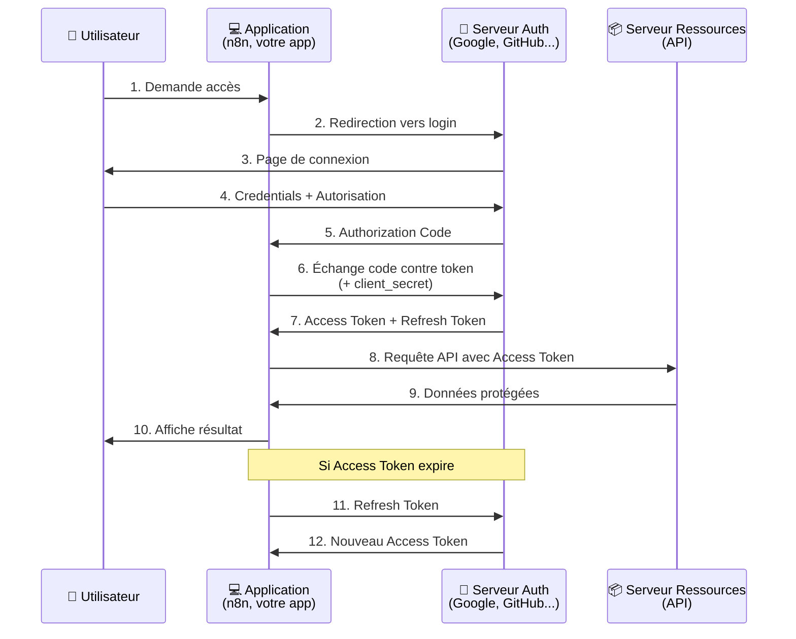

# Sécurité informatique : Les Credentials et la sécurisation des systèmes

> 💡 **En bref** : Protéger vos secrets (API keys, mots de passe, tokens)  
> ⏱️ **Temps de lecture** : 1 heure  
> 🎯 **Niveau** : Débutant à Intermédiaire  
> 📚 **Prérequis** : Bases du développement web

La gestion des credentials (ou informations d'identification) est l'une des bases de la sécurité informatique. Elle
englobe des pratiques visant à protéger les mots de passe, les clés API, les certificats, et tout autre moyen
d'authentification nécessaire pour accéder aux systèmes et ressources.

---

## 🎯 Objectifs d'Apprentissage

À la fin de ce module, vous serez capable de :

- ✅ Comprendre les différents types d'authentification
- ✅ Gérer les credentials de manière sécurisée (.env, vaults...)
- ✅ Implémenter OAuth 2.0 dans vos projets
- ✅ Utiliser JWT correctement
- ✅ Éviter les erreurs de sécurité courantes
- ✅ Sécuriser les APIs et applications web

---

## I. Les Credentials : Définition et Meilleures Pratiques

Les credentials sont des informations utilisées pour prouver l'identité d'une entité, telle qu'un utilisateur ou une
application. Une mauvaise gestion de ces informations peut exposer vos systèmes à des attaques.

### Différents Types d'Authentification

L'authentification est un processus clé dans la sécurisation des systèmes et des applications. Voici un aperçu des
différents types d'authentification couramment utilisés :

1. **Authentification Basique (Basic Authentication)** :
    - Envoie un identifiant et un mot de passe encodés en Base64 dans l'en-tête HTTP.
    - **Avantages** :
        - Simple à implémenter.
    - **Inconvénients** :
        - Non sécurisé si utilisé sans connexion HTTPS.
    - **Exemple** :
      ```http
      Authorization: Basic base64(username:password)
      ```

2. **Authentification basée sur des Tokens** :
    - Utilise un token (généralement temporaire) pour prouver l'identité de l'utilisateur ou de l'application.
    - **Avantages** :
        - Ne nécessite pas l'envoi du mot de passe après l'authentification initiale.
    - **Inconvénients** :
        - Les tokens doivent être sécurisés pour éviter les fuites.
    - **Exemple** :
      ```http
      Authorization: Bearer your-access-token
      ```

3. **OAuth 2.0** :
    - Un protocole standard pour l'autorisation sécurisée, souvent utilisé avec les tokens d'accès (Access Tokens).
    - **Avantages** :
        - Très sécurisé et polyvalent.
    - **Utilisations courantes** :
        - Connecter des applications à des services tiers (ex. : se connecter avec Google ou Facebook).

### 🖼️ OAuth 2.0 Flow Diagram



**Explications des étapes :**

1. **User → Client** : L'utilisateur clique "Se connecter avec Google"
2. **Client → AuthServer** : Redirection vers Google avec `client_id` et `redirect_uri`
3. **AuthServer → User** : Google affiche sa page de connexion
4. **User → AuthServer** : L'utilisateur entre ses credentials et autorise l'app
5. **AuthServer → Client** : Google redirige vers `redirect_uri` avec un `code`
6. **Client → AuthServer** : L'app échange le code contre un token (avec `client_secret`)
7. **AuthServer → Client** : Google retourne `access_token` et `refresh_token`
8. **Client → ResourceServer** : L'app utilise le token pour appeler l'API Google
9. **ResourceServer → Client** : L'API retourne les données (ex: profil utilisateur)
10. **Client → User** : L'app affiche les infos

**Tokens :**
- **Access Token** : Court terme (1h), pour accéder aux ressources
- **Refresh Token** : Long terme (90 jours), pour obtenir un nouveau access token

**Sécurité :**
- ✅ L'utilisateur ne partage JAMAIS son mot de passe avec votre app
- ✅ Votre app n'a accès qu'aux ressources autorisées (scopes)
- ✅ Les tokens peuvent être révoqués par l'utilisateur

**Utilisation dans n8n :**
- Gmail, Google Sheets, Slack, GitHub... utilisent tous OAuth 2.0
- n8n gère le flow automatiquement via les "Credentials"

4. **Authentification à clé API (API Key)** :
    - L'utilisateur ou l'application fournit une clé unique pour accéder à l'API.
    - **Avantages** :
        - Facile à mettre en œuvre.
    - **Inconvénients** :
        - Moins sécurisé comparé à des approches comme OAuth.
    - **Exemple** :
      ```http
      GET /endpoint?api_key=your_api_key
      ```

5. **Authentification Multi-Facteurs (MFA)** :
    - Combine plusieurs facteurs pour vérifier l'identité (ex. : mot de passe + OTP ou empreinte digitale).
    - **Avantages** :
        - Renforce considérablement la sécurité.
    - **Exemples de deuxième facteur** :
        - SMS, Email, Authenticator App (comme Google Authenticator), biométrie.

6. **Authentification basée sur des certificats** :
    - Utilise des certificats numériques pour identifier une entité.
    - **Avantages** :
        - Très sécurisé, adapté à des environnements critiques.
    - **Exemple d'utilisation** :
        - Mutuelle TLS (mTLS) pour sécuriser les connexions entre services dans un environnement distribué.

7. **Authentification sans mot de passe (Passwordless Authentication)** :
    - Utilise des méthodes alternatives comme des liens magiques envoyés par email ou un deuxième facteur comme la
      biométrie.
    - **Avantages** :
        - Élimine le risque de compromission de mots de passe.
    - **Exemples courants** :
        - Liens de connexion envoyés par email, clés de sécurité FIDO2/U2F.

8. **Authentification Sociale** :
    - Permet aux utilisateurs de se connecter à une application en utilisant leurs identifiants d'autres plateformes (
      ex. : Facebook, Google).
    - **Avantages** :
        - Simplifie l'expérience utilisateur.
    - **Exemple avec OAuth/OpenID Connect** :
        - Facebook Login, Google Sign-In.

Chaque solution possède des cas d'utilisation spécifiques, et le choix dépend souvent du niveau de sécurité requis, de
la simplicité d'implémentation et de l'expérience utilisateur attendue.

### Bonnes pratiques :

1. **Ne jamais stocker des mots de passe en clair** : utilisez des algorithmes de hachage sécurisés comme `bcrypt`,
   `argon2` ou `PBKDF2` pour sécuriser vos mots de passe.
    - [Vidéo explicative : Hashing & Password Security](https://www.youtube.com/watch?v=8ZtInClXe1Q)
    - [Documentation détaillée sur bcrypt](https://en.wikipedia.org/wiki/Bcrypt)

2. **Utiliser un gestionnaire de secrets** : Stockez vos credentials dans des systèmes sécurisés comme HashiCorp Vault,
   AWS Secrets Manager ou Azure Key Vault.
    - [Tutoriel sur HashiCorp Vault](https://learn.hashicorp.com/tutorials/vault/getting-started)

3. **Changer régulièrement les credentials** : Appliquez des politiques exigeant des changements fréquents et
   l'invalidation des anciennes informations si nécessaire.

4. **Mise en œuvre de MFA (Multi-Factor Authentication)** : Ajoutez une couche de sécurité supplémentaire permettant aux
   utilisateurs de s'authentifier via un deuxième canal comme des SMS ou des tokens physiques.
    - [Tutoriel : Configurer la MFA avec Google Authenticator](https://www.youtube.com/watch?v=7nP3HhZ4lV0)

---

## II. Sécuriser un site web

Protéger un site web vous permet de préserver les données des utilisateurs et d'éviter que le site devienne une cible
facile pour les attaques.

### Mesures fondamentales pour protéger un site :

1. **Utilisation de HTTPS** via des certificats SSL/TLS :
   Assurez-vous que les communications entre votre site et les utilisateurs sont chiffrées.
    - [Introduction au protocole HTTPS](https://fr.wikipedia.org/wiki/HTTPS)
    - [Tutoriel vidéo sur SSL/TLS avec Let's Encrypt](https://www.youtube.com/watch?v=KX_E7Zkr1fE)

2. **Protection contre les attaques XSS (Cross-Site Scripting)** :
   Échappez toujours les entrées utilisateur et appliquez des Content Security Policies (CSP).
    - [Guide sur les CSP](https://developer.mozilla.org/fr/docs/Web/HTTP/CSP)

3. **Mettre à jour régulièrement vos dépendances** :
   Les bibliothèques obsolètes peuvent contenir des vulnérabilités. Utilisez des outils comme `npm audit` ou `pip-audit`
   pour vérifier régulièrement les dépendances.

4. **Limiter les tentatives de connexion (Rate Limiting)** :
   Implémentez un système pour limiter le nombre de tentatives de connexion, réduisant ainsi les risques de brute force.
    - Exemple d'implémentation Flask (Python) :
      ```python
      from flask_limiter import Limiter
      from flask import Flask
 
      app = Flask(__name__)
      limiter = Limiter(app, key_func=lambda: "user_ip")
 
      @app.route("/login")
      @limiter.limit("5 per minute")  # Limite à 5 tentatives par minute
      def login():
          return "Page de connexion"
      ```

---

## III. Sécuriser une API (partie coeur)

Le rôle principal de la sécurisation d'une API est de garantir que seules les applications et utilisateurs autorisés
peuvent accéder aux données qu'elle expose.

### Différents types de tokens pour les API

Lors de la sécurisation des API, plusieurs types de tokens peuvent être utilisés pour l'authentification et l'
autorisation. Chaque type de token a ses propres cas d'utilisation et avantages. Voici un aperçu des principaux types :

1. **Token d'accès (Access Tokens)** :
    - Ce sont des tokens temporaires qui permettent d'accéder aux ressources protégées.
    - Exemples :
        - Les tokens fournis par des systèmes comme OAuth 2.0 ou OpenID Connect.
        - OAuth Access Tokens (par exemple, JWT).
    - **Caractéristiques** :
        - Généralement de courte durée (minutes à heures).
        - Contiennent les informations sur les permissions (scopes).
        - Doivent être utilisés uniquement pour les requêtes vers les API.

2. **Token d'actualisation (Refresh Tokens)** :
    - Ces tokens permettent d'obtenir un nouveau token d'accès sans nécessiter de reconnecter l'utilisateur.
    - Principalement utilisés avec OAuth 2.0.
    - **Caractéristiques** :
        - De longue durée (jours à semaines).
        - Doivent être conservés de manière sécurisée, car leur fuite peut permettre à un attaquant d'obtenir de
          nouveaux tokens d'accès.

3. **API Keys** :
    - Ce sont des chaînes uniques fournies par l'API pour identifier et authentifier les requêtes des applications ou
      utilisateurs.
    - **Caractéristiques** :
        - Peuvent être envoyées dans le header ou les paramètres de la requête.
        - Simples à utiliser mais moins sécurisées par rapport aux autres méthodes.
    - **Conseils** :
        - Assurez-vous de limiter les permissions des API Keys via des politiques (ex. : restriction d'adresse IP, de
          domaine, etc.).

4. **JWT (JSON Web Tokens)** :
    - Standard ouvert basé sur JSON permettant d'envoyer des informations entre parties de manière sécurisée.
    - **Caractéristiques** :
        - Contient trois parties : Header, Payload, et Signature (encodées en base64).
        - Sert souvent de token d'accès dans OAuth 2.0.
        - Peut inclure des informations comme le rôle de l'utilisateur ou la durée de validité.

5. **Session Tokens** :
    - Stockés après qu'un utilisateur s'est authentifié avec succès.
    - **Caractéristiques** :
        - Souvent utilisés dans les applications web où le serveur conserve l'état de session via des mécanismes comme
          des cookies.
        - Peut inclure un identifiant de session utilisé pour retrouver les données de session côté serveur.

6. **Personal Access Tokens (PAT)** :
    - Utilisés pour accéder à des services au nom d'un utilisateur, par exemple pour GitHub ou GitLab.
    - **Caractéristiques** :
        - Remplacent souvent les mots de passe pour des interactions API programmatiques.
        - Peuvent être configurés avec des permissions spécifiques ou scopes adaptés au cas d'utilisation.

7. **HMAC Tokens** :
    - Ce sont des tokens calculés à l'aide d'une fonction de hachage cryptographique (Hash-based Message Authentication
      Code).
    - **Caractéristiques** :
        - Souvent utilisés pour vérifier l'intégrité et l'authenticité des messages.
        - Couramment trouvés dans des systèmes comme AWS Signature Version 4.

**Comparaison des tokens :**

| Type de token          | Durée de vie | Sécurité         | Cas d'usage principal                   |
|------------------------|--------------|------------------|-----------------------------------------|
| Access Tokens          | Courte       | Élevée           | Accès aux API sécurisées                |
| Refresh Tokens         | Longue       | Modérée          | Renouvellement des tokens d'accès       |
| API Keys               | Longue       | Faible à modérée | Identification d’application basique    |
| JWT                    | Courte       | Élevée           | Transmission d'informations sécurisées  |
| Session Tokens         | Variable     | Modérée à élevée | Applications web (sessions utilisateur) |
| Personal Access Tokens | Variable     | Modérée à élevée | Automatisation et accès utilisateur API |
| HMAC Tokens            | Variable     | Élevée           | Vérification d'intégrité des données    |

En suivant les bonnes pratiques pour chaque type de token (chiffrement, rotation des tokens, utilisation de scopes,
etc.), vous pouvez sécuriser efficacement vos APIs.

### Meilleures pratiques pour les API :

1. **Authentification et Autorisation avec OAuth 2.0** :
   OAuth 2.0 est un standard pour sécuriser les API via des protocoles de gestion des tokens comme JWT (JSON Web
   Tokens).
    - [Tutoriel vidéo sur OAuth 2.0](https://www.youtube.com/watch?v=h2HAkapLBEU)
    - [Documentation sur JWT](https://jwt.io/)

2. **Chiffrement des données avec HTTPS** :
   Toutes les demandes et réponses API doivent être transmises via HTTPS uniquement.

3. **Validation des entrées** :
   Ne faites jamais confiance aux données fournies par les clients. Utilisez des bibliothèques de validation comme
   `express-validator` (JavaScript) ou `pydantic` (Python).
    - Exemple avec Python et `pydantic` :
      ```python
      from pydantic import BaseModel, ValidationError
 
      class UserRequest(BaseModel):
          username: str
          password: str
 
      try:
          user_data = UserRequest(username="example", password="12345")
      except ValidationError as e:
          print(e)
      ```

4. **Imposer des politiques CORS strictes** (avancé) :
   Limitez les domaines qui sont autorisés à accéder à votre API avec des configurations de CORS (Cross-Origin Resource
   Sharing).
    - [Introduction aux CORS](https://developer.mozilla.org/fr/docs/Web/HTTP/CORS)

---

## IV. Sécuriser les services cloud (avancé)

Les services cloud, tels que Google Cloud Platform (GCP), Amazon Web Services (AWS) et Discord (via ses APIs), adoptent
de nombreuses mesures de sécurité pour protéger les données et les ressources des utilisateurs. Voici un aperçu des
principales techniques et concepts de sécurisation utilisés :

### 1. **Authentification et Autorisation**

- **Utilisation de systèmes Single Sign-On (SSO)** :
    - Les services comme Google et AWS utilisent des protocoles sécurisés tels que OAuth 2.0 et OpenID Connect pour
      authentifier les utilisateurs.
    - Ils prennent en charge l'authentification multi-facteurs (MFA) pour ajouter une couche de sécurité supplémentaire.
- **Gestion des utilisateurs et des permissions** :
    - GCP et AWS utilisent respectivement IAM (Identity and Access Management) pour définir précisément les rôles et
      permissions des utilisateurs et applications.
    - Principe de moindre privilège : chaque rôle ou utilisateur n'accède qu'aux ressources minimales nécessaires.

### 2. **Chiffrement des données**

- **En Transit** :
    - Toutes les communications entre les clients et les serveurs sont sécurisées via HTTPS et/ou TLS (Transport Layer
      Security).
- **Au Repos** :
    - Sur GCP et AWS, les données sont généralement chiffrées par défaut à l'aide de clés de chiffrement fortes (AES-256
      par exemple).
    - Les utilisateurs peuvent gérer leurs propres clés de chiffrement via AWS KMS (Key Management Service) ou GCP Cloud
      KMS.

### 3. **Surveillance et Audit**

- Les services cloud intègrent des outils de surveillance comme CloudWatch (AWS), Analytics (Discord pour l'activité sur
  l'API), ou Stackdriver (GCP) pour :
    - Suivre l'activité des ressources.
    - Détecter toute activité suspecte.
    - Fournir des logs pour analyse (audit trails).
- Détection de vulnérabilités en temps réel avec des services comme AWS GuardDuty ou GCP Security Command Center.

### 4. **Gestion des API**

- **Clés API et Scopes** :
    - Les services comme Discord limitent l'accès aux API via des clés spécifiques qui définissent les permissions (
      scopes) autorisées. Les clés expirent ou peuvent être révoquées si nécessaire.
- **Throttling et Rate Limiting** :
    - Les requêtes aux APIs sont limitées en fréquence pour empêcher les abus (par exemple, attaques par déni de
      service).
- **OAuth 2.0 pour les accès sécurisés** :
    - L'accès programmatique aux services utilise des tokens OAuth 2.0 pour assurer une autorisation sécurisée.

### 5. **Firewall et Protection réseau**

- GCP et AWS offrent des pare-feux configurables pour restreindre l'accès aux ressources en fonction d'adresses IP ou de
  ports spécifiques.
- Services natifs comme AWS Shield ou Cloud Armor de GCP protègent contre les attaques DDoS.

### 6. **Conformité et Certifications**

- Les grands fournisseurs cloud comme Google et Amazon maintiennent des niveaux de conformité élevés avec des standards
  industriels :
    - RGPD (Règlement Général sur la Protection des Données)
    - ISO/IEC 27001
    - SOC 2 Type II
    - PCI-DSS (pour les paiements).
      En combinant ces techniques et en mettant à disposition des outils puissants pour la gestion de la sécurité, ces
      ressources permettent aux utilisateurs de construire des systèmes robustes et sécurisés tout en réduisant les
      risques
      potentiels.

---

### Ressources pour aller plus loin :

1. **Google Cloud Platform (GCP)** :
    - [Best Practices for Google Cloud Security](https://cloud.google.com/security/best-practices)
    - [Google Cloud Security Whitepapers](https://cloud.google.com/security/overview/whitepapers)
2. **Amazon Web Services (AWS)** :
    - [AWS Security Documentation](https://aws.amazon.com/security/)
    - [AWS Best Practices for Security](https://aws.amazon.com/architecture/security/)
    - [AWS Well-Architected Framework – Security Pillar](https://docs.aws.amazon.com/wellarchitected/latest/security-pillar/)
3. **Discord API** :
    - [Discord Developer Portal – API Security](https://discord.com/developers/docs/policies-and-agreements)
    - [Best Practices for Using Discord Tokens & OAuth](https://discord.com/developers/docs/topics/oauth2)
4. **Concepts généraux de sécurité dans le cloud** :
    - [OWASP Cloud Security Guidelines](https://owasp.org/www-project-cloud-security/)
    - [NIST Cybersecurity Framework](https://www.nist.gov/cyberframework)
5. **Autres ressources utiles** :
    - [Understanding OAuth 2.0](https://www.digitalocean.com/community/tutorials/an-introduction-to-oauth-2)
    - [JWT.io – Learn About JSON Web Tokens](https://jwt.io/)

## V. Ressources supplémentaires

- **OWASP (Open Web Application Security Project)** :
  Un projet de référence comprenant les 10 principales vulnérabilités de la sécurité applicative et des ressources pour
  les corriger.
    - [OWASP Top 10](https://owasp.org/www-project-top-ten/)
- **Cours YouTube gratuit sur la cybersécurité** :
    - [Udemy : Cyber Security Beginner's Course](https://www.udemy.com/) (Recherchez "Cyber Security")

---

## 💻 Exercices Pratiques

### Exercice 1 : Sécuriser le fichier .env

**Objectif** : Créer un fichier .env sécurisé pour le projet

<details>
<summary>📝 Instructions</summary>

1. Créez un fichier `.env` à la racine du projet
2. Ajoutez vos credentials
3. Ajoutez `.env` au `.gitignore`
4. Créez `.env.example` comme template

</details>

<details>
<summary>✅ Solution</summary>

**Fichier `.env` :**
```env
# Database
POSTGRES_USER=n8n_user
POSTGRES_PASSWORD=SuperSecretPassword123!
POSTGRES_DB=n8n_db

# n8n
N8N_ENCRYPTION_KEY=a-very-long-random-string-32-chars
WEBHOOK_URL=http://localhost:5678/

# APIs (NE JAMAIS COMMITTER CES VALEURS!)
OPENAI_API_KEY=sk-proj-abc123...
ANTHROPIC_API_KEY=sk-ant-api03-...
```

**Fichier `.gitignore` :**
```gitignore
.env
*.log
node_modules/
__pycache__/
```

**Fichier `.env.example` (à committer) :**
```env
# Database
POSTGRES_USER=your_username
POSTGRES_PASSWORD=your_secure_password
POSTGRES_DB=your_database_name

# n8n
N8N_ENCRYPTION_KEY=generate-with-openssl-rand-hex-32
WEBHOOK_URL=http://localhost:5678/

# APIs
OPENAI_API_KEY=sk-proj-your-key-here
ANTHROPIC_API_KEY=sk-ant-your-key-here
```

**Vérifier que .env n'est pas committé :**
```bash
git status
# .env ne doit PAS apparaître dans les fichiers à committer
```

**Lien projet :** Installation, Étape 9 (Secure Prompt)

</details>

---

### Exercice 2 : Tester OAuth avec n8n

**Objectif** : Configurer un credential OAuth dans n8n

<details>
<summary>📝 Instructions</summary>

1. Dans n8n, allez dans Credentials
2. Créez un nouveau credential "Google OAuth2 API"
3. Suivez le flow OAuth
4. Utilisez-le dans un node Gmail

</details>

<details>
<summary>✅ Solution</summary>

**Étapes détaillées :**

1. **Créer projet Google Cloud :**
   - Allez sur https://console.cloud.google.com/
   - Créez un nouveau projet
   - Activez Gmail API

2. **Créer OAuth credentials :**
   - APIs & Services → Credentials
   - Create Credentials → OAuth client ID
   - Type: Web application
   - Authorized redirect URIs: `http://localhost:5678/rest/oauth2-credential/callback`

3. **Dans n8n :**
   - Credentials → Add Credential
   - Recherchez "Google"
   - Choisissez "Google OAuth2 API"
   - Entrez Client ID et Client Secret
   - Cliquez "Connect my account"
   - Autorisez dans la popup Google

4. **Tester :**
   - Créez un workflow avec node Gmail
   - Sélectionnez votre credential OAuth
   - Le node peut maintenant accéder à votre Gmail !

**Avantages :**
- ✅ Pas besoin de partager votre mot de passe Gmail
- ✅ Vous pouvez révoquer l'accès à tout moment
- ✅ n8n n'a accès qu'aux emails (scope limité)

</details>

---

## ✅ Quiz d'Auto-Évaluation

**1. Quelle est la meilleure méthode pour stocker un mot de passe ?**

<details><summary>Réponse</summary>
✅ **Hachage avec sel** (bcrypt, argon2, PBKDF2)

❌ Pas en clair  
❌ Pas encodé en base64 (réversible)  
❌ Pas chiffré simple (clé peut être volée)

Le hachage + sel est irréversible et résiste au bruteforce.
</details>

**2. Où NE JAMAIS stocker des API keys ?**

<details><summary>Réponse</summary>
❌ Dans le code source (commits Git)  
❌ Dans le frontend JavaScript (visible par utilisateurs)  
❌ En clair dans la base de données

✅ Utilisez .env, secrets managers, ou n8n Credentials
</details>

**3. Quelle est la différence entre authentification et autorisation ?**

<details><summary>Réponse</summary>
✅ **Authentification** = Qui es-tu ? (login)  
✅ **Autorisation** = Qu'as-tu le droit de faire ? (permissions)

Exemple : Tu t'authentifies avec ton badge (qui), mais tu ne peux accéder qu'aux salles autorisées (quoi).
</details>

**4. Que contient un JWT ?**

<details><summary>Réponse</summary>
✅ **3 parties** : Header . Payload . Signature

- **Header** : Type (JWT) + algorithme (HS256, RS256...)
- **Payload** : Claims (user_id, exp, roles...)
- **Signature** : Vérification intégrité

Le tout encodé en base64 et séparé par des points.
</details>

**5. OAuth 2.0 : Que fait le refresh token ?**

<details><summary>Réponse</summary>
✅ **Obtenir un nouveau access token sans re-login**

- Access token : court terme (1h)
- Refresh token : long terme (90 jours)

Quand l'access token expire, utilisez le refresh token pour en obtenir un nouveau.
</details>

**6. Qu'est-ce que le rate limiting ?**

<details><summary>Réponse</summary>
✅ **Limiter le nombre de requêtes** par IP/utilisateur/période

Exemple : Max 100 requêtes/minute

Protège contre :
- Bruteforce (tentatives login)
- DDoS
- Abus de ressources
</details>

**7. Pourquoi utiliser HTTPS au lieu de HTTP ?**

<details><summary>Réponse</summary>
✅ **Chiffrement des communications**

HTTP = en clair (n'importe qui peut lire)  
HTTPS = chiffré avec TLS/SSL

Sans HTTPS, les passwords et tokens sont visibles en clair sur le réseau !
</details>

**8. Qu'est-ce que MFA/2FA ?**

<details><summary>Réponse</summary>
✅ **Multi-Factor Authentication** = Authentification à plusieurs facteurs

Facteurs :
1. **Quelque chose que vous savez** : mot de passe
2. **Quelque chose que vous avez** : téléphone (SMS, authenticator app)
3. **Quelque chose que vous êtes** : biométrie (empreinte, visage)

2FA = 2 facteurs minimum (ex: password + SMS code)
</details>

**9. Quelle est la meilleure pratique pour les API keys dans n8n ?**

<details><summary>Réponse</summary>
✅ **Utiliser les Credentials n8n** (chiffrés dans la base)

❌ Pas en dur dans les nodes  
❌ Pas dans les expressions `{{ "sk-abc123" }}`

n8n chiffre automatiquement les credentials avec N8N_ENCRYPTION_KEY.
</details>

**10. Comment révoquer l'accès OAuth d'une app ?**

<details><summary>Réponse</summary>
✅ Dans les paramètres du service (Google, GitHub...)

Exemple Google :
1. myaccount.google.com/permissions
2. Trouver l'app
3. Cliquer "Révoquer l'accès"

L'app ne pourra plus utiliser vos données, même si elle a encore le refresh token.
</details>

**Score :** _/10  
- 8-10 : Expert sécurité ! 🔐  
- 5-7 : Bien, relisez les sections concernées  
- 0-4 : Relisez attentivement et refaites le quiz

---

## 📊 Cheat Sheet Sécurité

### Checklist Projet

| ✅ | Action | Priorité |
|----|--------|----------|
| ☐ | .env créé et dans .gitignore | 🔴 Critique |
| ☐ | .env.example créé et committé | 🟡 Important |
| ☐ | Pas de secrets hardcodés dans code | 🔴 Critique |
| ☐ | HTTPS activé (si production) | 🔴 Critique |
| ☐ | Rate limiting sur APIs | 🟡 Important |
| ☐ | Validation des inputs | 🔴 Critique |
| ☐ | Logs ne contiennent pas de secrets | 🟡 Important |
| ☐ | Credentials n8n utilisées | 🟡 Important |
| ☐ | Backup de N8N_ENCRYPTION_KEY | 🔴 Critique |
| ☐ | MFA activée sur comptes critiques | 🟢 Recommandé |

### Types d'Authentification - Quand les utiliser

| Type | Utilisation | Sécurité | Complexité |
|------|-------------|----------|------------|
| **Basic Auth** | Dev/test uniquement | ⭐ Faible | ⭐ Simple |
| **API Key** | APIs simples, M2M | ⭐⭐ Moyenne | ⭐ Simple |
| **JWT** | APIs stateless, microservices | ⭐⭐⭐ Bonne | ⭐⭐ Moyenne |
| **OAuth 2.0** | Apps tierces, SSO | ⭐⭐⭐⭐ Excellente | ⭐⭐⭐ Complexe |
| **mTLS** | Services critiques | ⭐⭐⭐⭐⭐ Maximale | ⭐⭐⭐⭐ Très complexe |

### Commandes Utiles

```bash
# Générer clé aléatoire sécurisée
openssl rand -hex 32

# Générer mot de passe fort
openssl rand -base64 24

# Tester si .env est dans Git
git ls-files | grep .env
# Si résultat → DANGER ! Supprimez-le immédiatement :
git rm --cached .env
git commit -m "Remove .env from version control"

# Hacher un mot de passe (Python)
python3 -c "import bcrypt; print(bcrypt.hashpw(b'password123', bcrypt.gensalt()))"

# Vérifier certificat SSL
openssl s_client -connect example.com:443 -showcerts
```

---

## 🔗 Liens avec le Projet

| Étape | Utilisation Sécurité |
|-------|----------------------|
| **Installation** | .env pour tous les credentials |
| **0-9 (Toutes)** | API keys LLM dans n8n Credentials |
| **3. Distribute** | Webhook security (validation) |
| **5. Store DB** | Credentials PostgreSQL |
| **7. Enhance** | API keys pour services externes |
| **9. Secure Prompt** | Validation inputs, sanitization, rate limiting |

---

## ❓ FAQ

**Q : J'ai accidentellement committé mon .env, que faire ?**  
1. Révoquezimmédiatement toutes les clés exposées
2. Supprimez le fichier de l'historique Git :
```bash
git filter-branch --force --index-filter \
"git rm --cached --ignore-unmatch .env" \
--prune-empty --tag-name-filter cat -- --all
```
3. Force push : `git push origin --force --all`
4. Générez de nouvelles clés

**Q : Comment choisir entre OAuth et API Key ?**  
- **OAuth** : Accès à données utilisateur tierces (Google, GitHub...)
- **API Key** : Accès M2M ou à vos propres APIs

**Q : Combien de temps garder un JWT ?**  
- **Access token** : 15 min à 1h (court)
- **Refresh token** : 7-90 jours (long)
- Plus c'est court, plus c'est sécurisé !

**Q : Les credentials n8n sont-elles vraiment sécurisées ?**  
Oui, SI vous :
- ✅ Avez défini un N8N_ENCRYPTION_KEY fort
- ✅ Backupez ce key de manière sécurisée
- ✅ Ne partagez pas la base de données n8n

---

En suivant ces pratiques ainsi qu'en consultant les ressources proposées, vous réduirez considérablement les risques
pour vos systèmes et vos données sécurisées. 🔐