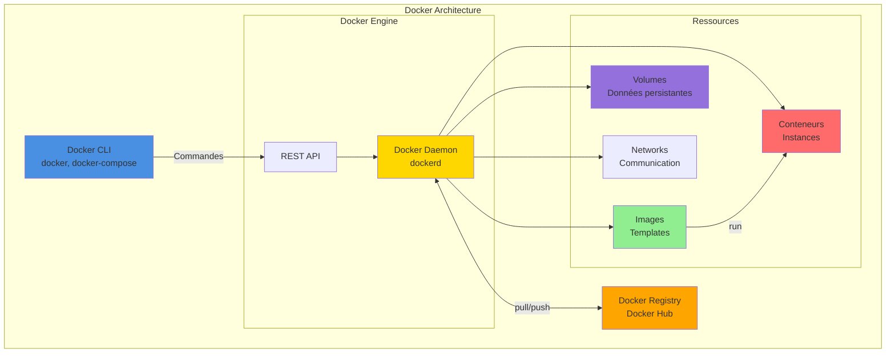
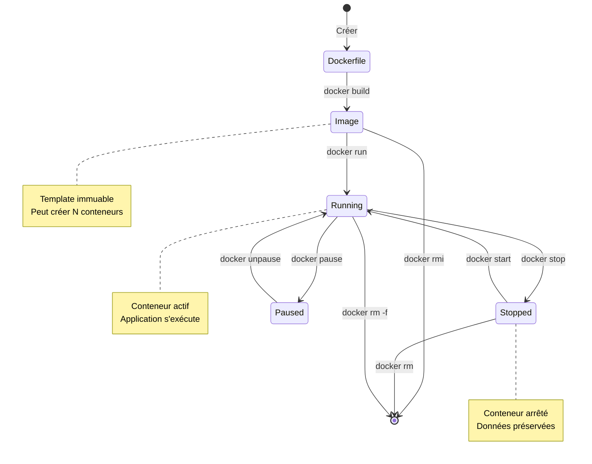

# Introduction à Docker

> 💡 **En bref** : Conteneuriser les applications pour les exécuter partout de manière identique  
> ⏱️ **Temps de lecture** : 1h30  
> 🎯 **Niveau** : Débutant  
> 📚 **Prérequis** : Bases du terminal

Docker est une plateforme open-source qui permet de créer, de distribuer et d'exécuter des applications dans des
conteneurs. Un conteneur est une unité standardisée qui regroupe l'application et toutes ses dépendances afin qu'elle
puisse fonctionner de manière identique sur tous les systèmes d'exploitation. L'objectif principal de Docker est de
simplifier le processus de développement, d'exécution et de déploiement d'applications.

---

## 🎯 Objectifs d'Apprentissage

À la fin de ce module, vous serez capable de :

- ✅ Comprendre conteneurs vs machines virtuelles
- ✅ Créer et gérer des images Docker
- ✅ Lancer et arrêter des conteneurs
- ✅ Utiliser Docker Compose pour orchestrer plusieurs services
- ✅ Comprendre les volumes et la persistance des données
- ✅ Débugger les problèmes Docker courants
- ✅ Gérer le réseau entre conteneurs

---

## Concepts de base Docker

Voici une description des principaux concepts liés à Docker :

1. **Image** : Une image Docker est un modèle léger contenant tous les fichiers nécessaires pour exécuter une
   application. Elle est immuable et construite à l'aide d'un Dockerfile.

2. **Conteneur** : Un conteneur est une instance d'une image en cours d'exécution. Il est isolé du système hôte, ce qui
   permet d'assurer la cohérence lors de l'exécution de l'application.

3. **Dockerfile** : Un fichier texte contenant un ensemble d'instructions qui définissent comment construire une image
   Docker. Il décrit tout ce dont l'image a besoin : le système d'exploitation de base, les fichiers de l'application,
   les dépendances, etc.

4. **Docker Compose** : Un outil qui permet de gérer des applications multi-conteneurs. Il utilise un fichier
   `docker-compose.yml` pour définir la configuration de tous les conteneurs nécessaires à l'application.

5. **Registry** : C'est une plateforme où les images Docker peuvent être stockées, partagées et distribuées. Docker Hub
   est l'une des registries publiques les plus populaires.

---

## 🖼️ Visualiser Docker

### Architecture Docker



### Cycle de Vie d'un Conteneur



**Analogie :** 
- **Image** = Recette de cuisine (template)
- **Conteneur** = Plat préparé (instance)
- **Volume** = Garde-manger (stockage persistent)
- **Network** = Table commune (communication)

---

## Installer Docker

### Sous Linux

1. Mettez à jour les paquets :
   ```bash
   sudo apt update
   sudo apt upgrade
   ```
2. Installez les dépendances :
   ```bash
   sudo apt install apt-transport-https ca-certificates curl software-properties-common
   ```
3. Ajoutez la clé GPG officielle :
   ```bash
   curl -fsSL https://download.docker.com/linux/ubuntu/gpg | sudo gpg --dearmor -o /usr/share/keyrings/docker-archive-keyring.gpg
   ```
4. Ajoutez le dépôt Docker :
   ```bash
   echo "deb [arch=amd64 signed-by=/usr/share/keyrings/docker-archive-keyring.gpg] https://download.docker.com/linux/ubuntu $(lsb_release -cs) stable" | sudo tee /etc/apt/sources.list.d/docker.list
   ```
5. Installez Docker :
   ```bash
   sudo apt update
   sudo apt install docker-ce docker-ce-cli containerd.io
   ```

### Sous Windows

1. Téléchargez Docker Desktop depuis [Docker Official](https://www.docker.com/products/docker-desktop/).
2. Exécutez l'installateur et suivez les instructions.
3. Configurez WSL 2 (Windows Subsystem for Linux) si nécessaire (Docker Desktop le réclamera).

### Sous macOS

1. Téléchargez Docker Desktop depuis [Docker Official](https://www.docker.com/products/docker-desktop/).
2. Déplacez l'application Docker vers le dossier Applications.
3. Exécutez Docker Desktop et connectez-vous si nécessaire.

---

## Les fichiers Docker : Dockerfile et docker-compose.yml

### Dockerfile

Un Dockerfile permet de créer et configurer une image. Voici un exemple simple d'un Dockerfile :

```dockerfile
# Utiliser une image de base
FROM python:3.10-slim

# Définir le répertoire de travail
WORKDIR /app

# Copier les fichiers nécessaires dans l'image
COPY requirements.txt requirements.txt
RUN pip install -r requirements.txt

COPY . .

# Définir la commande par défaut de l'image
CMD ["python", "app.py"]
```

- **`FROM`** : Définit l'image de base.
- **`WORKDIR`** : Définit le répertoire dans lequel les commandes suivantes seront exécutées.
- **`COPY`** : Copie les fichiers ou répertoires du système hôte vers l'image.
- **`RUN`** : Exécute une commande pendant la création de l'image.
- **`CMD`** : Spécifie la commande par défaut à exécuter lorsque le conteneur démarre.

Pour modifier un Dockerfile :

- Ajoutez ou changez des instructions en fonction de vos besoins (par exemple, installer une nouvelle dépendance via
  RUN).

### docker-compose.yml

Le fichier `docker-compose.yml` permet de définir plusieurs conteneurs et leur configuration. Voici un exemple :

```yaml
version: '3.9'
services:
  web:
    build: .
    ports:
      - "5000:5000"
    volumes:
      - .:/app
  database:
    image: postgres:15
    environment:
      POSTGRES_USER: user
      POSTGRES_PASSWORD: password
```

- **`services`** : Définit les conteneurs nécessaires. Dans cet exemple, deux conteneurs sont définis : `web` et
  `database`.
- **`build`** : Prend les instructions d'un Dockerfile pour construire une image.
- **`ports`** : Définit le mappage des ports entre le conteneur et l'hôte.
- **`volumes`** : Monte les fichiers du système hôte à l'intérieur du conteneur.
- **`environment`** : Définit des variables d'environnement pour le conteneur.

Pour modifier un fichier Compose, ajoutez ou modifiez les services, les volumes ou les configurations.

## Fonctionnement du réseau Docker

Docker utilise un système réseau pour permettre aux conteneurs de communiquer entre eux ou avec l'extérieur (hôte,
Internet). Voici les concepts clés liés au réseau Docker :

1. **Bridge (par défaut)** :
    - Lorsque vous créez un conteneur sans spécifier de réseau, Docker l'attache par défaut au réseau `bridge` (pont).
    - Les conteneurs connectés au réseau `bridge` peuvent communiquer en utilisant leurs adresses IP internes, mais ce
      réseau n'est pas accessible directement depuis l'extérieur sans mappage de ports.

2. **Host** :
    - Dans ce mode, le conteneur partage directement l'interface réseau de l'hôte (machine sur laquelle Docker
      fonctionne).
    - Il n'y a pas d'isolation réseau entre le conteneur et l'hôte.

3. **Overlay** :
    - Utilisé principalement dans des environnements multi-hôtes (comme avec Docker Swarm).
    - Permet aux conteneurs fonctionnant sur différents hôtes Docker de communiquer, comme s'ils étaient sur le même
      réseau.

4. **Macvlan** :
    - Donne au conteneur une adresse MAC propre, se comportant comme un appareil physique sur le réseau local.
    - Permet une meilleure interaction avec les réseaux physiques.

5. **None** :
    - Désactive le réseau pour le conteneur (aucune connectivité).

### Communication entre conteneurs

Pour que deux conteneurs communiquent, voici les approches les plus communes :

1. **Utiliser le réseau `bridge` avec des alias** :
    - Si deux conteneurs sont connectés au même réseau (par exemple `bridge`), ils peuvent communiquer via leurs *noms
      de service* ou leurs adresses IP attribuées par Docker.
    - Exemple avec `docker-compose.yml` :
      ```yaml
      version: '3.9'
 
      services:
        app:
          build: .
          networks:
            - mynetwork
        database:
          image: postgres:15
          networks:
            - mynetwork
      networks:
        mynetwork:
      ```
      Dans cet exemple, le conteneur `app` peut communiquer avec le conteneur `database` en utilisant le nom `database`.

2. **Lien explicite entre les conteneurs** :
    - Avec l'ancienne méthode des liens (aujourd'hui moins utilisée) :
      ```bash
      docker run --name database -d postgres:15
      docker run --name app --link database:db application-image
      ```
    - Le lien permet au conteneur `app` d'accéder au conteneur `database` via l'alias `db`.

3. **Configurer un réseau personnalisé** :
    - Vous pouvez créer un réseau Docker personnalisé pour une meilleure isolation.
      ```bash
      docker network create my_custom_network
      docker run --name container1 --network my_custom_network app1-image
      docker run --name container2 --network my_custom_network app2-image
      ```
    - Les deux conteneurs dans le même réseau peuvent communiquer via leurs noms respectifs (`container1` et
      `container2`).

4. **Utiliser des variables d'environnement pour la connexion au réseau** :
    - Dans des cas comme une base de données, vous pouvez utiliser les variables d'environnement pour spécifier des
      informations de connexion (nom d'hôte, port, utilisateur, mot de passe).

### Exemple pratique

Supposons que vous avez une application web et une base de données. Vous pouvez faire en sorte qu'ils communiquent via
un réseau commun :

```yaml
version: '3.9'
services:
  web:
    build: .
    ports:
      - "8080:8080"
    networks:
      - app-network

  database:
    image: postgres:15
    environment:
      POSTGRES_USER: admin
      POSTGRES_PASSWORD: secret
    networks:
      - app-network

networks:
  app-network:
```

Dans ce cas, le service `web` peut se connecter à la base de données en spécifiant `database` comme nom d'hôte.

### Outils pour observer les réseaux Docker

- Liste des réseaux existants :
  ```bash
  docker network ls
  ```
- Inspection d'un réseau pour voir les conteneurs connectés et leurs informations :
  ```bash
  docker network inspect <nom-du-reseau>
  ```
- Connecter manuellement un conteneur à un réseau existant :
  ```bash
  docker network connect <nom-du-reseau> <nom-du-conteneur>
  ```
- Déconnecter un conteneur d'un réseau :
  ```bash
  docker network disconnect <nom-du-reseau> <nom-du-conteneur>
  ```

Avec ces outils et configurations, vous pouvez gérer et optimiser les interactions entre vos conteneurs Docker efficacement.

---

## 💻 Exercices Pratiques

### Exercice 1 : Premier Conteneur

**Objectif** : Lancer votre premier conteneur Docker

<details>
<summary>📝 Instructions</summary>

1. Vérifier que Docker est installé :
```bash
docker --version
docker-compose --version
```

2. Lancer un conteneur Hello World :
```bash
docker run hello-world
```

3. Lancer un serveur web nginx :
```bash
docker run -d -p 8080:80 --name my-nginx nginx
```

4. Vérifier qu'il tourne :
```bash
docker ps
curl localhost:8080
```

5. Voir les logs :
```bash
docker logs my-nginx
```

6. Arrêter et supprimer :
```bash
docker stop my-nginx
docker rm my-nginx
```

</details>

<details>
<summary>✅ Solutions et explications</summary>

**Résultats attendus :**

```bash
# docker run hello-world
Hello from Docker!
This message shows that your installation appears to be working correctly.
...

# docker run -d -p 8080:80 --name my-nginx nginx
a1b2c3d4e5f6... (ID du conteneur)

# docker ps
CONTAINER ID   IMAGE   ...   PORTS                  NAMES
a1b2c3d4e5f6   nginx   ...   0.0.0.0:8080->80/tcp   my-nginx

# curl localhost:8080
<!DOCTYPE html>
<html>
<head>
<title>Welcome to nginx!</title>
...
```

**Explications des options :**
- `-d` : Détaché (background)
- `-p 8080:80` : Map port 8080 de l'hôte vers port 80 du conteneur
- `--name` : Donne un nom au conteneur (sinon nom aléatoire)
- `nginx` : Image à utiliser

**Concepts clés :**
- Image téléchargée automatiquement depuis Docker Hub
- Conteneur = instance de l'image
- Port mapping permet l'accès depuis l'hôte

</details>

---

### Exercice 2 : Créer une Image Personnalisée

**Objectif** : Créer une image Docker avec votre propre application

<details>
<summary>📝 Instructions</summary>

1. Créer un dossier et fichiers :
```bash
mkdir my-app && cd my-app
```

2. Créer `app.py` :
```python
from http.server import HTTPServer, BaseHTTPRequestHandler

class Handler(BaseHTTPRequestHandler):
    def do_GET(self):
        self.send_response(200)
        self.send_header('Content-type', 'text/html')
        self.end_headers()
        self.wfile.write(b'<h1>Hello from Docker!</h1>')

server = HTTPServer(('0.0.0.0', 8000), Handler)
print('Server running on port 8000')
server.serve_forever()
```

3. Créer `Dockerfile` :
```dockerfile
FROM python:3.11-slim
WORKDIR /app
COPY app.py .
EXPOSE 8000
CMD ["python", "app.py"]
```

4. Build l'image :
```bash
docker build -t my-python-app .
```

5. Lancer le conteneur :
```bash
docker run -d -p 8000:8000 --name py-app my-python-app
```

6. Tester :
```bash
curl localhost:8000
```

</details>

<details>
<summary>✅ Solutions et explications</summary>

**Résultat attendu :**
```bash
# docker build -t my-python-app .
[+] Building 5.2s (8/8) FINISHED
 => [internal] load build definition from Dockerfile
 => => transferring dockerfile: 142B
 => ...
 => => naming to docker.io/library/my-python-app

# docker run -d -p 8000:8000 --name py-app my-python-app
abc123...

# curl localhost:8000
<h1>Hello from Docker!</h1>
```

**Explications Dockerfile :**
```dockerfile
FROM python:3.11-slim         # Image de base
WORKDIR /app                  # Dossier de travail
COPY app.py .                 # Copier fichier dans image
EXPOSE 8000                   # Documenter le port (info seulement)
CMD ["python", "app.py"]      # Commande au démarrage
```

**Concepts clés :**
- Dockerfile = instructions pour construire l'image
- Chaque instruction = une couche (layer)
- Les couches sont cachées (build plus rapide)
- `-t` = tag (nom) de l'image

**Lien projet :** Comprendre comment n8n, PostgreSQL sont construits

</details>

---

### Exercice 3 : Docker Compose Multi-Conteneurs

**Objectif** : Orchestrer plusieurs services avec Docker Compose

<details>
<summary>📝 Instructions</summary>

1. Créer `docker-compose.yml` :
```yaml
version: '3.9'

services:
  web:
    image: nginx
    ports:
      - "8080:80"
    volumes:
      - ./html:/usr/share/nginx/html
    depends_on:
      - api

  api:
    image: python:3.11-slim
    command: python -m http.server 8000
    working_dir: /app
    volumes:
      - ./api:/app

  database:
    image: postgres:16
    environment:
      POSTGRES_PASSWORD: secret
      POSTGRES_USER: admin
      POSTGRES_DB: mydb
    volumes:
      - db_data:/var/lib/postgresql/data

volumes:
  db_data:
```

2. Créer les dossiers :
```bash
mkdir html api
echo "<h1>Frontend</h1>" > html/index.html
echo "print('API')" > api/main.py
```

3. Lancer tout :
```bash
docker-compose up -d
```

4. Vérifier :
```bash
docker-compose ps
docker-compose logs
```

5. Arrêter :
```bash
docker-compose down
```

</details>

<details>
<summary>✅ Solutions et explications</summary>

**Résultats attendus :**
```bash
# docker-compose up -d
Creating network "my-app_default" with the default driver
Creating volume "my-app_db_data" with default driver
Creating my-app_database_1 ... done
Creating my-app_api_1      ... done
Creating my-app_web_1      ... done

# docker-compose ps
NAME                STATUS    PORTS
my-app_web_1       running   0.0.0.0:8080->80/tcp
my-app_api_1       running   
my-app_database_1  running   5432/tcp
```

**Explications docker-compose.yml :**
- `services:` : Liste des conteneurs à créer
- `depends_on:` : web attendra que api démarre
- `volumes:` : Monter dossiers locaux OU volumes nommés
- `environment:` : Variables d'environnement
- `ports:` : Mapping de ports

**Avantages Docker Compose :**
- ✅ Tout défini dans un fichier
- ✅ Réseau automatique entre services
- ✅ Commandes simples (`up`, `down`)
- ✅ Reproductible (version control du YAML)

**Lien projet :** C'est exactement comment le projet est configuré !

</details>

---

### Exercice 4 : Volumes et Persistance

**Objectif** : Comprendre comment persister les données

<details>
<summary>📝 Instructions</summary>

1. Lancer PostgreSQL avec volume :
```bash
docker run -d \
  --name test-postgres \
  -e POSTGRES_PASSWORD=secret \
  -v pg_data:/var/lib/postgresql/data \
  postgres:16
```

2. Se connecter et créer des données :
```bash
docker exec -it test-postgres psql -U postgres
```
```sql
CREATE TABLE users (id SERIAL, name TEXT);
INSERT INTO users (name) VALUES ('Alice'), ('Bob');
SELECT * FROM users;
\q
```

3. Arrêter et supprimer le conteneur :
```bash
docker stop test-postgres
docker rm test-postgres
```

4. Recréer avec le MÊME volume :
```bash
docker run -d \
  --name test-postgres2 \
  -e POSTGRES_PASSWORD=secret \
  -v pg_data:/var/lib/postgresql/data \
  postgres:16
```

5. Vérifier que les données sont toujours là :
```bash
docker exec -it test-postgres2 psql -U postgres -c "SELECT * FROM users;"
```

</details>

<details>
<summary>✅ Solutions et explications</summary>

**Résultat attendu :**
```bash
# Après avoir recréé le conteneur
 id | name  
----+-------
  1 | Alice
  2 | Bob
(2 rows)
```

**Magic ! Les données ont survécu 🎉**

**Explications :**
- `-v pg_data:/var/lib/postgresql/data` crée un volume nommé
- Le volume est stocké par Docker (pas dans le conteneur)
- Supprimer le conteneur NE supprime PAS le volume
- Recréer avec le même volume = récupérer les données

**Types de volumes :**

1. **Named volumes** (recommandé) :
```bash
-v pg_data:/var/lib/postgresql/data
```
Géré par Docker, portable

2. **Bind mounts** :
```bash
-v /home/user/data:/var/lib/postgresql/data
```
Chemin absolu, moins portable

3. **Anonymous volumes** :
```bash
-v /var/lib/postgresql/data
```
Docker génère un nom aléatoire

**Commandes utiles :**
```bash
docker volume ls                  # Lister volumes
docker volume inspect pg_data     # Détails
docker volume rm pg_data          # Supprimer
docker volume prune               # Nettoyer inutilisés
```

**⚠️ Important :**
- `docker-compose down` NE supprime PAS les volumes
- `docker-compose down -v` SUPPRIME les volumes
- Toujours backuper avant `down -v` !

**Lien projet :** Les workflows n8n et données PostgreSQL sont dans des volumes

</details>

---

## ✅ Quiz d'Auto-Évaluation

**1. Quelle est la différence entre une image et un conteneur ?**

<details><summary>Réponse</summary>
✅ **Image** = Template immuable (recette)  
✅ **Conteneur** = Instance en cours d'exécution (plat préparé)

Une image peut créer plusieurs conteneurs. Supprimer un conteneur ne supprime pas l'image.
</details>

**2. Que fait la commande `docker run -d` ?**

<details><summary>Réponse</summary>
✅ **`-d`** = Detached mode (arrière-plan)

Le conteneur tourne en background, le terminal est libéré. Sans `-d`, les logs s'affichent et bloquent le terminal.
</details>

**3. Comment voir les logs d'un conteneur ?**

<details><summary>Réponse</summary>
✅ **`docker logs <nom-ou-id>`**

Options utiles :
- `-f` : Follow (temps réel)
- `--tail 100` : Dernières 100 lignes
- `--since 5m` : Dernières 5 minutes

Exemple : `docker logs -f --tail 50 n8n`
</details>

**4. Que signifie `-p 5678:5678` ?**

<details><summary>Réponse</summary>
✅ **Port mapping** : `PORT_HOTE:PORT_CONTENEUR`

`-p 5678:5678` = Le port 5678 de votre PC redirige vers le port 5678 du conteneur

Permet d'accéder au service via `localhost:5678`
</details>

**5. Qu'est-ce qu'un volume Docker ?**

<details><summary>Réponse</summary>
✅ **Stockage persistant** pour les données de conteneurs

Sans volume, les données sont perdues quand le conteneur est supprimé. Le volume survit au conteneur.

Types : named volumes (recommandé), bind mounts, anonymous volumes
</details>

**6. Comment arrêter TOUS les conteneurs actifs ?**

<details><summary>Réponse</summary>
✅ **`docker stop $(docker ps -q)`**

Explications :
- `docker ps -q` : Liste les IDs des conteneurs actifs
- `docker stop` : Arrête chaque conteneur
- `$()` : Substitution de commande (bash)

Alternative : `docker-compose down` (pour ceux gérés par compose)
</details>

**7. Que fait `docker-compose up -d` ?**

<details><summary>Réponse</summary>
✅ **Lance tous les services** définis dans `docker-compose.yml` en arrière-plan

- Crée réseau si nécessaire
- Crée volumes si nécessaire
- Lance conteneurs dans le bon ordre (`depends_on`)
- Mode détaché (`-d`)
</details>

**8. Comment accéder à un shell dans un conteneur en cours d'exécution ?**

<details><summary>Réponse</summary>
✅ **`docker exec -it <nom> sh`** ou **`bash`**

Explications :
- `exec` : Exécute une commande dans un conteneur actif
- `-it` : Interactif + TTY (terminal)
- `sh` ou `bash` : Shell (dépend de l'image)

Exemple : `docker exec -it n8n sh`
</details>

**9. Quelle différence entre `docker-compose stop` et `docker-compose down` ?**

<details><summary>Réponse</summary>
✅ **`stop`** = Arrête les conteneurs (conserve tout)  
✅ **`down`** = Arrête ET supprime conteneurs + réseau (garde volumes)

`down -v` = Supprime aussi les volumes (⚠️ perte de données)

Utilisez `stop` pour pause temporaire, `down` pour cleanup complet
</details>

**10. Comment voir l'espace disque utilisé par Docker ?**

<details><summary>Réponse</summary>
✅ **`docker system df`**

Affiche :
- Images
- Conteneurs
- Volumes
- Build cache

**Nettoyer :**
```bash
docker system prune        # Supprimer inutilisés
docker system prune -a     # Agressif (tout)
docker volume prune        # Volumes inutilisés seulement
```
</details>

**Score :** _/10  
- 8-10 : Docker master ! 🐳  
- 5-7 : Bien, pratiquez les exercices  
- 0-4 : Relisez et refaites le quiz

---

## Commandes utiles pour Docker

- **`docker build`** : Crée une image Docker à partir d'un Dockerfile.
  ```bash
  docker build -t nom-de-l-image .
  ```
- **`docker run`** : Lance un conteneur à partir d'une image.
  ```bash
  docker run -dp 8080:80 nom-de-l-image
  ```
- **`docker ps`** : Liste tous les conteneurs en cours d'exécution.
- **`docker stop`** : Arrête un conteneur.
  ```bash
  docker stop nom-du-conteneur
  ```
- **`docker exec`** : Exécute une commande dans un conteneur en cours d'exécution.
  ```bash
  docker exec -it nom-du-conteneur bash
  ```
- **`docker compose up -d`** : Lance les conteneurs définis dans `docker-compose.yml` ou charge les modifications apportées au fichier docker-compose.yml.
- **`docker compose down`** : Arrête et supprime les conteneurs gérés par Compose.
- /!\ la commande docker compose down supprime des choses, à utiliser avec précaution...

---

## 📊 Cheat Sheet Docker

### Gestion des Conteneurs

| Commande | Description |
|----------|-------------|
| `docker run <image>` | Créer et lancer conteneur |
| `docker run -d` | Mode détaché (background) |
| `docker run -it` | Mode interactif avec terminal |
| `docker run --name <nom>` | Donner un nom |
| `docker run -p 8080:80` | Map port |
| `docker run -v vol:/data` | Monter volume |
| `docker ps` | Lister conteneurs actifs |
| `docker ps -a` | Lister tous (+ arrêtés) |
| `docker start <nom>` | Démarrer conteneur arrêté |
| `docker stop <nom>` | Arrêter conteneur |
| `docker restart <nom>` | Redémarrer |
| `docker rm <nom>` | Supprimer conteneur |
| `docker rm -f <nom>` | Force supprimer (même actif) |
| `docker logs <nom>` | Voir logs |
| `docker logs -f <nom>` | Follow logs (temps réel) |
| `docker exec -it <nom> sh` | Accéder au shell |
| `docker inspect <nom>` | Détails complets |

### Gestion des Images

| Commande | Description |
|----------|-------------|
| `docker images` | Lister images |
| `docker pull <image>` | Télécharger image |
| `docker build -t <nom> .` | Construire image |
| `docker rmi <image>` | Supprimer image |
| `docker image prune` | Nettoyer images inutilisées |
| `docker tag <src> <dest>` | Renommer/tagger image |

### Docker Compose

| Commande | Description |
|----------|-------------|
| `docker-compose up` | Lancer tous les services |
| `docker-compose up -d` | Mode détaché |
| `docker-compose up --build` | Rebuild avant lancer |
| `docker-compose down` | Arrêter + supprimer conteneurs |
| `docker-compose down -v` | + supprimer volumes (⚠️) |
| `docker-compose ps` | Lister services |
| `docker-compose logs` | Logs de tous |
| `docker-compose logs -f <service>` | Logs d'un service |
| `docker-compose restart <service>` | Redémarrer service |
| `docker-compose exec <service> sh` | Shell dans service |
| `docker-compose pull` | Update images |

### Volumes

| Commande | Description |
|----------|-------------|
| `docker volume ls` | Lister volumes |
| `docker volume create <nom>` | Créer volume |
| `docker volume inspect <nom>` | Détails |
| `docker volume rm <nom>` | Supprimer |
| `docker volume prune` | Nettoyer inutilisés |

### Réseau

| Commande | Description |
|----------|-------------|
| `docker network ls` | Lister réseaux |
| `docker network inspect <nom>` | Détails réseau |
| `docker network create <nom>` | Créer réseau |
| `docker network connect <net> <cont>` | Connecter conteneur |

### Maintenance

| Commande | Description |
|----------|-------------|
| `docker system df` | Espace disque utilisé |
| `docker system prune` | Nettoyer tout inutilisé |
| `docker system prune -a` | Nettoyage agressif |
| `docker stats` | Utilisation ressources temps réel |
| `docker info` | Info système Docker |

---

## 🔗 Liens avec le Projet

| Étape | Utilisation Docker |
|-------|-------------------|
| **Installation** | `docker-compose up -d` lance tout |
| **Toutes étapes** | n8n, PostgreSQL, Ollama tournent dans conteneurs |
| **Debugging** | `docker logs`, `docker exec` |
| **Backup** | Volumes pour workflows et DB |
| **Updates** | `docker-compose pull && docker-compose up -d` |

**Fichiers clés du projet :**
- `docker-compose.yml` : Orchestration services
- `.env` : Configuration (credentials, ports)
- Volumes : `n8n_data`, `postgres_data`, `ollama_data`

---

## ❓ FAQ

**Q : Docker vs Machine Virtuelle ?**  
Docker = Partage kernel OS (léger, rapide). VM = OS complet (lourd, lent).

**Q : Mes données sont perdues quand je fais `docker-compose down` ?**  
Non, les volumes persistent. MAIS `docker-compose down -v` supprime les volumes !

**Q : Comment mettre à jour n8n/PostgreSQL ?**  
```bash
docker-compose pull
docker-compose up -d
```

**Q : Le conteneur redémarre sans cesse ?**  
Vérifiez les logs : `docker logs <nom>`. Souvent problème config (.env).

**Q : Comment faire un backup ?**  
```bash
# Backup volume
docker run --rm -v n8n_data:/data -v $(pwd):/backup busybox tar czf /backup/n8n_backup.tar.gz /data

# Restore
docker run --rm -v n8n_data:/data -v $(pwd):/backup busybox tar xzf /backup/n8n_backup.tar.gz -C /
```

**Q : Docker prend trop de place disque ?**  
```bash
docker system df              # Voir l'usage
docker system prune           # Nettoyer
docker image prune -a         # Supprimer images inutilisées
```

---

## 🐛 Erreurs Courantes

### "Cannot connect to Docker daemon"

**Cause :** Docker pas démarré

**Solution :**
```bash
# Linux
sudo systemctl start docker

# Windows/Mac
Lancer Docker Desktop
```

### "Port is already allocated"

**Cause :** Le port est déjà utilisé par un autre service

**Solution :**
```bash
# Trouver qui utilise le port (Linux/Mac)
sudo lsof -i :5678

# Windows
netstat -ano | findstr :5678

# Changer port dans docker-compose.yml
ports:
  - "8080:5678"  # Accéder via localhost:8080
```

### "No space left on device"

**Cause :** Docker a rempli le disque

**Solution :**
```bash
docker system prune -a --volumes
```

### "driver failed programming external connectivity"

**Cause :** Firewall ou réseau Docker corrompu

**Solution :**
```bash
# Linux
sudo systemctl restart docker

# Windows/Mac
Restart Docker Desktop
```

---

## 📚 Ressources Complémentaires

**Documentation officielle :**
- [Docker Docs](https://docs.docker.com/)
- [Docker Compose Docs](https://docs.docker.com/compose/)
- [Dockerfile Reference](https://docs.docker.com/engine/reference/builder/)

**Tutoriels :**
- [Docker Getting Started](https://docs.docker.com/get-started/)
- [Grafikart Docker (FR)](https://grafikart.fr/tutoriels/docker-921)
- [Play with Docker](https://labs.play-with-docker.com/) - Lab en ligne gratuit

**Vidéos :**
- [Docker in 100 Seconds](https://www.youtube.com/watch?v=Gjnup-PuquQ)
- [Docker Tutorial for Beginners](https://www.youtube.com/watch?v=fqMOX6JJhGo)

**Best Practices :**
- [Docker Best Practices](https://docs.docker.com/develop/dev-best-practices/)
- [Dockerfile Best Practices](https://docs.docker.com/develop/develop-images/dockerfile_best-practices/)

---

**Conclusion :** Docker est l'outil qui permet à ce projet de fonctionner de manière identique sur n'importe quelle machine. C'est la magie de la conteneurisation ! 🐳

**Prochaines étapes :**
1. ✅ Installez Docker sur votre machine
2. ✅ Faites les 4 exercices pratiques
3. ✅ Testez le quiz
4. ✅ Lancez le projet avec `docker-compose up -d`

Avec cette introduction à Docker, vous disposez des bases pour créer et gérer des applications conteneurisées. Bon
courage dans vos explorations ! 🚀