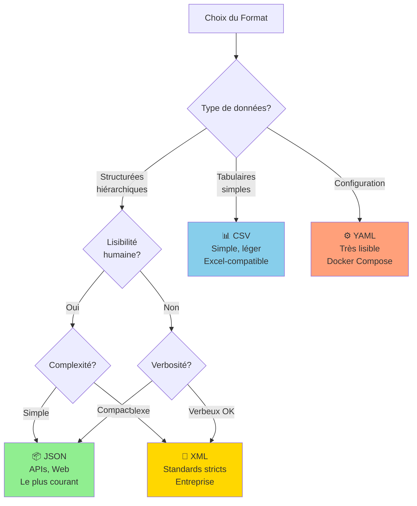

# Les différents formats de données : JSON, XML, CSV et YAML

> 💡 **En bref** : Comprendre et manipuler les formats de données utilisés par les APIs  
> ⏱️ **Temps de lecture** : 1 heure  
> 🎯 **Niveau** : Débutant  
> 📚 **Prérequis** : Aucun

Lorsqu'il s'agit d'échanger des données entre différentes applications ou de stocker des informations, plusieurs formats
de données peuvent être utilisés. Les quatre formats les plus courants sont JSON, XML, CSV et YAML. Dans ce cours, nous allons
explorer leur structure, leur usage et présenter des exemples pour mieux les comprendre. Enfin, nous inclurons des
ressources complémentaires pour approfondir vos connaissances.

---

## 🎯 Objectifs d'Apprentissage

À la fin de ce module, vous serez capable de :

- ✅ Identifier les différents formats de données
- ✅ Choisir le bon format selon le cas d'usage
- ✅ Lire et écrire du JSON en Python/JavaScript
- ✅ Comprendre la structure XML
- ✅ Manipuler des fichiers CSV
- ✅ Utiliser YAML pour la configuration

---

## 🖼️ Comparaison des Formats



### Tableau Comparatif Détaillé

| Critère | JSON | XML | CSV | YAML |
|---------|------|-----|-----|------|
| **Lisibilité** | ⭐⭐⭐⭐ | ⭐⭐⭐ | ⭐⭐⭐⭐⭐ | ⭐⭐⭐⭐⭐ |
| **Compacité** | ⭐⭐⭐⭐ | ⭐⭐ | ⭐⭐⭐⭐⭐ | ⭐⭐⭐⭐ |
| **Structure hiérarchique** | ✅ Oui | ✅ Oui | ❌ Non | ✅ Oui |
| **Types de données** | Oui (string, number, bool, null, array, object) | Non (tout est string) | Non (tout est string) | Oui (+ date, binary) |
| **Commentaires** | ❌ Non | ✅ Oui | ❌ Non | ✅ Oui |
| **Validation** | JSON Schema | XSD, DTD | ❌ Non | ❌ Non |
| **Usage principal** | APIs, Web | Enterprise, Legacy | Tabular data, Excel | Config files |
| **Parsing speed** | ⭐⭐⭐⭐ | ⭐⭐ | ⭐⭐⭐⭐⭐ | ⭐⭐⭐ |
| **Popularity (2024)** | 🔥🔥🔥🔥🔥 | 🔥🔥 | 🔥🔥🔥🔥 | 🔥🔥🔥 |

**Utilisation dans le projet :**
- **JSON** : n8n, APIs LLM, PostgreSQL (colonnes JSONB)
- **CSV** : Export de données (Étape 8)
- **YAML** : docker-compose.yml
- **XML** : Rarement (certaines APIs legacy)

---

## 1. **JSON (JavaScript Object Notation)**

### Structure

JSON est un format de données léger qui repose sur une structure clé-valeur, similaire aux objets en JavaScript. Les
données sont organisées dans des paires clé-valeur et des structures imbriquées (objets, tableaux).

Exemple de données JSON:

```json
{
  "nom": "Jean Dupont",
  "age": 28,
  "skills": [
    "Python",
    "JavaScript",
    "SQL"
  ],
  "employe": true,
  "adresse": {
    "rue": "10, rue des Lilas",
    "ville": "Paris",
    "pays": "France"
  }
}
```

### Usage

- **Web APIs** : JSON est souvent utilisé pour transmettre des données entre un serveur et une application frontale.
- **Configuration** : De nombreux outils ou frameworks utilisent JSON pour les fichiers de configuration.
- **Stockage léger des données** : JSON est plus compact qu'XML, ce qui en fait un choix idéal pour des applications
  performantes.

### Exemple d'utilisation en Python

Lire et écrire des données JSON:

```python
import json

# Lecture d'un fichier JSON
with open('data.json', 'r') as file:
    donnees = json.load(file)
    print(donnees)

# Écriture dans un fichier JSON
nouvelle_donnee = {
    "nom": "Alice",
    "age": 30,
    "employe": False
}

with open('output.json', 'w') as file:
    json.dump(nouvelle_donnee, file, indent=4)
```

### Exemple d'utilisation en JavaScript

Lire et écrire des données JSON:

```javascript
// Lecture d'un fichier JSON
fetch('data.json')
  .then(response => response.json())
  .then(data => {
    console.log(data);
  })
  .catch(error => {
    console.error('Erreur lors de la lecture du fichier JSON:', error);
  });

// Écriture dans un fichier JSON (simulation dans le navigateur)
const nouvelleDonnee = {
  nom: "Alice",
  age: 30,
  employe: false
};

// Conversion de l'objet en chaîne JSON
const jsonString = JSON.stringify(nouvelleDonnee, null, 2);
console.log('Données JSON générées :', jsonString);
```
### Ressources

- [Tutoriel JSON (W3Schools)](https://www.w3schools.com/js/js_json_intro.asp)
- [Qu'est-ce que JSON ? (Wikipedia)](https://fr.wikipedia.org/wiki/JavaScript_Object_Notation)
- [Vidéo : JSON expliqué simplement (YouTube)](https://www.youtube.com/watch?v=iiADhChRriM)

---

## 2. **XML (Extensible Markup Language)**

### Structure

XML est un format basé sur une structure hiérarchique avec des balises pour définir et organiser les données.
Contrairement à JSON, XML permet de définir sa propre structure et ses propres balises.

Exemple de données XML:

```xml

<personne>
    <nom>Jean Dupont</nom>
    <age>28</age>
    <skills>
        <skill>Python</skill>
        <skill>JavaScript</skill>
        <skill>SQL</skill>
    </skills>
    <employe>yes</employe>
</personne>
```

### Usage

- **Interopérabilité** : XML est couramment utilisé dans des systèmes où des applications écrites dans différents
  langages doivent échanger des données.
- **Standards complexes** : Des formats comme SOAP ou des fichiers de configuration (par exemple, des fichiers de
  déploiement) utilisent XML.
- **Documents** : Les formats comme DOCX (Microsoft Word) ou SVG s'appuient sur XML.

### Exemple d'utilisation en Python

Lecture et écriture avec une bibliothèque comme `xml.etree.ElementTree`:

```python
import xml.etree.ElementTree as ET

# Lecture d'un fichier XML
tree = ET.parse('data.xml')
root = tree.getroot()

for enfant in root:
    print(enfant.tag, enfant.text)

# Création d'un fichier XML
racine = ET.Element('personne')
nom = ET.SubElement(racine, 'nom')
nom.text = 'Alice'

tree = ET.ElementTree(racine)
tree.write('output.xml', encoding='utf-8', xml_declaration=True)
```

### Exemple d'utilisation en Java

Lecture et écriture dans un fichier XML:

```java
import javax.xml.parsers.DocumentBuilder;
import javax.xml.parsers.DocumentBuilderFactory;
import javax.xml.transform.OutputKeys;
import javax.xml.transform.Transformer;
import javax.xml.transform.TransformerFactory;
import javax.xml.transform.dom.DOMSource;
import javax.xml.transform.stream.StreamResult;
import org.w3c.dom.*;

import java.io.File;

public class ExempleXML {
    public static void main(String[] args) {
        try {
            // Lecture d'un fichier XML
            File inputFile = new File("data.xml");
            DocumentBuilderFactory factory = DocumentBuilderFactory.newInstance();
            DocumentBuilder builder = factory.newDocumentBuilder();
            Document document = builder.parse(inputFile);
            document.getDocumentElement().normalize();

            // Afficher les données XML
            System.out.println("Racine: " + document.getDocumentElement().getNodeName());
            NodeList nodeList = document.getElementsByTagName("personne");

            for (int i = 0; i < nodeList.getLength(); i++) {
                Node node = nodeList.item(i);
                if (node.getNodeType() == Node.ELEMENT_NODE) {
                    Element element = (Element) node;
                    System.out.println("Nom: " + element.getElementsByTagName("nom").item(0).getTextContent());
                    System.out.println("Âge: " + element.getElementsByTagName("age").item(0).getTextContent());
                }
            }

            // Création d'un fichier XML
            Document newDocument = builder.newDocument();
            Element root = newDocument.createElement("personnes");
            newDocument.appendChild(root);

            Element personne = newDocument.createElement("personne");
            root.appendChild(personne);

            Element nom = newDocument.createElement("nom");
            nom.appendChild(newDocument.createTextNode("Alice"));
            personne.appendChild(nom);

            Element age = newDocument.createElement("age");
            age.appendChild(newDocument.createTextNode("30"));
            personne.appendChild(age);

            // Écriture dans un fichier
            TransformerFactory transformerFactory = TransformerFactory.newInstance();
            Transformer transformer = transformerFactory.newTransformer();
            transformer.setOutputProperty(OutputKeys.INDENT, "yes");
            DOMSource source = new DOMSource(newDocument);
            StreamResult result = new StreamResult(new File("output.xml"));
            transformer.transform(source, result);

            System.out.println("Fichier XML créé: output.xml");

        } catch (Exception e) {
            e.printStackTrace();
        }
    }
}
```
### Ressources

- [Tutoriel XML (W3Schools)](https://www.w3schools.com/xml/)
- [XML sur Wikipedia](https://fr.wikipedia.org/wiki/Extensible_Markup_Language)
- [Vidéo : Comprendre XML (YouTube)](https://www.youtube.com/watch?v=Ke8x2TuKiZM)

---

## 3. **CSV (Comma-Separated Values)**

### Structure

Le format CSV se compose de lignes de texte où chaque ligne correspond à un enregistrement, et les champs de ces lignes
sont séparés par une virgule (ou un autre délimiteur comme le point-virgule `;`).

Exemple de données CSV:

```csv
nom,age,employe
Jean Dupont,28,true
Alice,30,false
```

### Usage

- **Gestion des données tabulaires** : CSV est idéal pour représenter des données sous forme de table, comme celles des
  feuilles de calcul Excel.
- **Interopérabilité simple** : Ce format est compréhensible par de nombreux outils, dont Excel et les bases de données.
- **Performance** : Cache léger comparé à des formats comme XML.

### Exemple d'utilisation en Python

Lire et écrire des fichiers CSV:

```python
import csv

# Lecture d'un fichier CSV
with open('data.csv', 'r') as file:
    reader = csv.reader(file)
    for ligne in reader:
        print(ligne)

# Écriture dans un fichier CSV
donnees = [
    ['nom', 'age', 'employe'],
    ['Jean Dupont', '28', 'true'],
    ['Alice', '30', 'false']
]

with open('output.csv', 'w', newline='') as file:
    writer = csv.writer(file)
    writer.writerows(donnees)
```

### Ressources

- [Tutoriel CSV (W3Schools)](https://www.w3schools.com/python/pandas/pandas_csv.asp)
- [Format CSV (Wikipedia)](https://fr.wikipedia.org/wiki/Comma-separated_values)
- [Vidéo : Qu'est-ce que le CSV ? (YouTube)](https://www.youtube.com/watch?v=ETl_t3qlDiA)

---

## 4. **YAML (YAML Ain't Markup Language)**

### Structure

YAML est un format de sérialisation de données lisible par l'humain, souvent utilisé pour les fichiers de configuration.

Exemple de données YAML:

```yaml
nom: Jean Dupont
age: 28
skills:
  - Python
  - JavaScript
  - SQL
employe: true
adresse:
  rue: "10, rue des Lilas"
  ville: Paris
  pays: France
```

### Usage

- **Fichiers de configuration** : Docker Compose, Kubernetes, GitHub Actions
- **CI/CD** : GitLab CI, Azure Pipelines
- **Infrastructure as Code** : Ansible, Terraform

### Exemple d'utilisation - Docker Compose

```yaml
version: '3.9'

services:
  n8n:
    image: n8nio/n8n:latest
    ports:
      - "5678:5678"
    environment:
      - N8N_ENCRYPTION_KEY=${N8N_ENCRYPTION_KEY}
    volumes:
      - n8n_data:/home/node/.n8n
    networks:
      - n8n-network

  postgres:
    image: postgres:16
    environment:
      POSTGRES_USER: ${POSTGRES_USER}
      POSTGRES_PASSWORD: ${POSTGRES_PASSWORD}
      POSTGRES_DB: ${POSTGRES_DB}
    volumes:
      - postgres_data:/var/lib/postgresql/data
    networks:
      - n8n-network

volumes:
  n8n_data:
  postgres_data:

networks:
  n8n-network:
```

### Ressources

- [Tutoriel YAML (W3Schools)](https://www.w3schools.io/file/yaml-introduction/)
- [YAML sur Wikipedia](https://fr.wikipedia.org/wiki/YAML)
- [YAML Lint - Validateur en ligne](https://www.yamllint.com/)

---

## 💻 Exercices Pratiques

### Exercice 1 : Conversion JSON ↔ Python

**Objectif** : Manipuler JSON en Python

<details>
<summary>📝 Instructions</summary>

Écrivez un script Python qui :
1. Crée un dictionnaire représentant un utilisateur
2. Le convertit en JSON
3. L'écrit dans un fichier
4. Le lit depuis le fichier
5. Le reconvertit en dictionnaire Python

</details>

<details>
<summary>✅ Solution</summary>

```python
import json

# 1. Créer dictionnaire
user = {
    "name": "Alice",
    "age": 30,
    "skills": ["Python", "n8n", "SQL"],
    "active": True,
    "metadata": {
        "created": "2024-01-15",
        "role": "developer"
    }
}

# 2 & 3. Convertir et écrire
with open('user.json', 'w') as f:
    json.dump(user, f, indent=2)
print("✅ Fichier créé")

# 4 & 5. Lire et reconvertir
with open('user.json', 'r') as f:
    loaded_user = json.load(f)

print("📖 Données lues:")
print(f"Nom: {loaded_user['name']}")
print(f"Compétences: {', '.join(loaded_user['skills'])}")
print(f"Rôle: {loaded_user['metadata']['role']}")
```

**Résultat :**
```
✅ Fichier créé
📖 Données lues:
Nom: Alice
Compétences: Python, n8n, SQL
Rôle: developer
```

**Concepts clés :**
- `json.dump()` : Dict → JSON file
- `json.dumps()` : Dict → JSON string
- `json.load()` : JSON file → Dict
- `json.loads()` : JSON string → Dict

</details>

---

### Exercice 2 : Parser XML en Python

**Objectif** : Extraire données d'un fichier XML

<details>
<summary>📝 Instructions</summary>

Parsez ce XML et affichez tous les noms et âges :

```xml
<users>
    <user>
        <name>Alice</name>
        <age>30</age>
    </user>
    <user>
        <name>Bob</name>
        <age>25</age>
    </user>
</users>
```

</details>

<details>
<summary>✅ Solution</summary>

```python
import xml.etree.ElementTree as ET

xml_data = '''
<users>
    <user>
        <name>Alice</name>
        <age>30</age>
    </user>
    <user>
        <name>Bob</name>
        <age>25</age>
    </user>
</users>
'''

# Parser XML
root = ET.fromstring(xml_data)

# Parcourir et afficher
for user in root.findall('user'):
    name = user.find('name').text
    age = user.find('age').text
    print(f"👤 {name} - {age} ans")
```

**Résultat :**
```
👤 Alice - 30 ans
👤 Bob - 25 ans
```

</details>

---

### Exercice 3 : Convertir CSV → JSON

**Objectif** : Transformer un fichier CSV en JSON

<details>
<summary>📝 Instructions</summary>

Fichier `users.csv` :
```csv
name,age,city
Alice,30,Paris
Bob,25,Lyon
Charlie,35,Marseille
```

Convertissez-le en JSON avec un script Python.

</details>

<details>
<summary>✅ Solution</summary>

```python
import csv
import json

# Lire CSV
users = []
with open('users.csv', 'r') as f:
    reader = csv.DictReader(f)
    for row in reader:
        # Convertir age en entier
        row['age'] = int(row['age'])
        users.append(row)

# Écrire JSON
with open('users.json', 'w') as f:
    json.dump(users, f, indent=2)

print(f"✅ Converti {len(users)} utilisateurs")
print(json.dumps(users, indent=2))
```

**Résultat `users.json` :**
```json
[
  {
    "name": "Alice",
    "age": 30,
    "city": "Paris"
  },
  {
    "name": "Bob",
    "age": 25,
    "city": "Lyon"
  },
  {
    "name": "Charlie",
    "age": 35,
    "city": "Marseille"
  }
]
```

**Lien projet :** Étape 8 (Export to File)

</details>

---

## ✅ Quiz d'Auto-Évaluation

**1. Quel format est le plus compact ?**

<details><summary>Réponse</summary>
✅ **CSV** (pour données tabulaires)  
✅ **JSON** (pour données structurées)

CSV : `name,age\nAlice,30` (16 bytes)  
JSON : `{"name":"Alice","age":30}` (28 bytes)  
XML : `<user><name>Alice</name><age>30</age></user>` (45 bytes)
</details>

**2. Lequel supporte les commentaires ?**

<details><summary>Réponse</summary>
✅ **XML** : `<!-- commentaire -->`  
✅ **YAML** : `# commentaire`

❌ JSON ne supporte PAS les commentaires
</details>

**3. Quel format utilise n8n pour échanger données entre nodes ?**

<details><summary>Réponse</summary>
✅ **JSON**

Tous les nodes n8n produisent et consomment du JSON.
</details>

**4. Quel format pour docker-compose.yml ?**

<details><summary>Réponse</summary>
✅ **YAML**

Docker Compose utilise YAML pour sa lisibilité et support des commentaires.
</details>

**5. Comment accéder à une valeur JSON en JavaScript ?**

<details><summary>Réponse</summary>
```javascript
const data = {"user": {"name": "Alice"}};

// Notation point
data.user.name  // "Alice"

// Notation bracket
data["user"]["name"]  // "Alice"
```
</details>

**6. CSV peut-il représenter des données hiérarchiques ?**

<details><summary>Réponse</summary>
❌ **Non**

CSV est plat (2D - lignes et colonnes uniquement).

Pour hiérarchie → JSON ou XML
</details>

**7. Que signifie JSON ?**

<details><summary>Réponse</summary>
✅ **JavaScript Object Notation**

Basé sur la syntaxe des objets JavaScript, mais utilisable dans tous les langages.
</details>

**8. Quel format pour un fichier .env ?**

<details><summary>Réponse</summary>
✅ **Format clé=valeur simple**

```env
DATABASE_URL=postgresql://...
API_KEY=sk-abc123
```

Pas JSON, pas YAML, juste `KEY=VALUE`
</details>

**9. Comment valider un JSON ?**

<details><summary>Réponse</summary>
✅ **JSON Schema**

Définit structure, types, contraintes :

```json
{
  "type": "object",
  "properties": {
    "name": {"type": "string"},
    "age": {"type": "number", "minimum": 0}
  },
  "required": ["name"]
}
```

Ou utilisez https://jsonlint.com/
</details>

**10. XML vs JSON : quand choisir XML ?**

<details><summary>Réponse</summary>
✅ **Choisir XML si :**
- Standards stricts requis (SOAP, SVG, DOCX...)
- Validation XSD nécessaire
- Attributs ET contenu textuel
- Système legacy

✅ **Choisir JSON si :**
- APIs web/REST
- Performance importante
- Simplicité prioritaire
- Écosystème JavaScript
</details>

**Score :** _/10  
- 8-10 : Expert formats ! 📊  
- 5-7 : Bien, pratiquez les conversions  
- 0-4 : Relisez et refaites les exercices

---

## 📊 Cheat Sheet Formats

### Syntaxe Rapide

**JSON :**
```json
{
  "string": "text",
  "number": 42,
  "boolean": true,
  "null": null,
  "array": [1, 2, 3],
  "object": {"nested": "value"}
}
```

**XML :**
```xml
<root>
  <element attribute="value">Content</element>
  <empty />
</root>
```

**CSV :**
```csv
header1,header2,header3
value1,value2,value3
"quoted,value",value2,value3
```

**YAML :**
```yaml
string: text
number: 42
boolean: true
null_value: null
array:
  - item1
  - item2
object:
  nested: value
```

### Conversions Python

```python
# JSON
import json
json.dumps(dict)  # dict → JSON string
json.loads(str)   # JSON string → dict
json.dump(dict, file)   # dict → JSON file
json.load(file)         # JSON file → dict

# CSV
import csv
csv.reader(file)        # Lire CSV
csv.DictReader(file)    # CSV → list of dicts
csv.writer(file)        # Écrire CSV

# XML
import xml.etree.ElementTree as ET
ET.parse(file)          # Parser XML file
ET.fromstring(str)      # Parser XML string

# YAML (nécessite PyYAML)
import yaml
yaml.safe_load(str)     # YAML string → dict
yaml.dump(dict)         # dict → YAML string
```

---

## Conclusion

Chaque format de données a ses avantages et ses usages spécifiques:

- **JSON** : Le standard pour APIs et web (le plus utilisé)
- **XML** : Systèmes complexes, standards stricts, entreprise
- **CSV** : Données tabulaires, Excel, simple et léger
- **YAML** : Configuration, très lisible, commentaires

**Dans ce projet :**
- n8n utilise JSON partout
- docker-compose.yml en YAML
- Export possibles en JSON/CSV/Markdown

Apprenez à choisir le format le plus adapté à vos besoins en fonction du contexte et de l'application ! 📦

---

_Dernière mise à jour : Décembre 2024 | Version 1.4.0_