# Idées de Projets Utilisant n8n avec Intégration d'un LLM

> 💡 **En bref** : 18 idées de projets concrètes pour aller plus loin après le cours  
> ⏱️ **Temps de lecture** : 30 minutes  
> 🎯 **Niveau** : Tous (débutant à avancé)  
> 📚 **Prérequis** : Avoir terminé le projet guidé (étapes 0-9)

---

## 🎯 Introduction

Après avoir terminé le projet guidé, vous êtes maintenant capable de créer vos propres workflows n8n intégrant des LLM ! 

Cette page présente **18 idées de projets** organisées par catégorie et niveau de difficulté. Chaque projet inclut :
- Le besoin business/utilisateur
- L'implémentation technique avec n8n
- Le niveau de difficulté
- Les ressources nécessaires

**Utilisez ces idées pour :**
- ✅ Pratiquer vos compétences n8n
- ✅ Créer un portfolio de projets
- ✅ Résoudre de vrais problèmes
- ✅ Automatiser votre quotidien

---

## 🖼️ Carte des Projets par Catégorie

```mermaid
graph TB
    ROOT[Projets n8n + LLM]
    
    ROOT --> CAT1[📧 Communication<br/>& Contenu]
    ROOT --> CAT2[💼 Support<br/>& Service Client]
    ROOT --> CAT3[📊 Data Science<br/>& Analytics]
    ROOT --> CAT4[💻 Développement<br/>& DevOps]
    
    CAT1 --> P1[1. Résumés Emails]
    CAT1 --> P5[5. Publication Auto]
    CAT1 --> P6[6. Traduction]
    
    CAT2 --> P2[2. Support Client]
    CAT2 --> P3[3. Analyse Avis]
    CAT2 --> P7[7. Détection Fraude]
    
    CAT3 --> P8[8. Préparation Données]
    CAT3 --> P9[9. Analyse Exploratoire]
    CAT3 --> P10[10. Détection Anomalies]
    CAT3 --> P11[11. Modèles Prédictifs]
    CAT3 --> P12[12. Rapports KPIs]
    
    CAT4 --> P13[13. Documentation Auto]
    CAT4 --> P14[14. Surveillance Déploiements]
    CAT4 --> P15[15. Revue Code]
    CAT4 --> P16[16. Optimisation SQL]
    CAT4 --> P17[17. Suivi Bugs]
    CAT4 --> P18[18. MAJ Dépendances]
    
    ROOT --> P4[4. Recherche Documents]
    
    style ROOT fill:#4A90E2
    style CAT1 fill:#FF6B6B
    style CAT2 fill:#50C878
    style CAT3 fill:#FFD700
    style CAT4 fill:#9370DB
    style P4 fill:#FFA500
```



---

## 📧 Projets Communication & Contenu (Débutant)

Voici quelques exemples de projets qui peuvent être implémentés en utilisant n8n et qui incluent un passage par un
modèle de langage (LLM) pour ajouter des capacités d'IA :

---

## 1. **Création Automatique de Résumés d'Emails**

**🎯 Niveau :** Débutant  
**⏱️ Temps estimé :** 2-3 heures  
**💰 Coût :** Gratuit (avec Gmail + Ollama) ou ~$5/mois (OpenAI)

### Besoin :

Gérer un grand volume de courriels peut être chronophage. L'utilisateur souhaite obtenir un résumé automatique des
emails entrants pour se concentrer sur les plus importants.

### Implémentation :

1. Utiliser un déclencheur dans n8n pour surveiller une boîte email (par exemple, Gmail).
2. Intégrer un LLM (ex : OpenAI GPT) pour analyser automatiquement le contenu des emails et générer un résumé concis.
3. Stocker les résumés dans une base de données ou les envoyer dans un canal Slack ou Teams.
4. Optionnel : Taguer les emails selon leur niveau de priorité.

**Workflow n8n :**
```
Gmail Trigger → Extract Email Body → LLM (Summarize) → IF (Important?) → Notify Slack
                                                     → Store in DB
```

**Ressources nécessaires :**
- Node Gmail (auth OAuth2)
- Node OpenAI / Ollama
- Node PostgreSQL OU Node Slack
- Étapes projet utilisées : 0, 1, 5, 9

**Extensions possibles :**
- Classifier par catégorie (work, personal, promotions...)
- Générer réponse automatique pour emails simples
- Alertes SMS pour emails urgents

---

## 2. **Assistant Automatisé pour Support Client**

**🎯 Niveau :** Intermédiaire  
**⏱️ Temps estimé :** 4-6 heures  
**💰 Coût :** ~$10-20/mois (LLM + Zendesk/Intercom)

### Besoin :

Fournir des réponses rapides et contextuelles aux messages clients pour réduire le délai de réponse.

### Implémentation :

1. Utiliser un service de messagerie ou une plateforme de ticketing supportée par n8n (Typeform, Zendesk).
2. Passer les messages des clients à un LLM pour classer les demandes (support technique, facturation, etc.) et générer
   une première réponse automatique.
3. Envoyer la réponse au client tout en alertant un agent humain pour les cas complexes.

**Workflow n8n :**
```
Webhook/Zendesk → Extract Question → RAG (Search KB) → LLM (Generate Answer) → IF (Confidence > 80%)
                                                                              → Send to Customer
                                                                              → Alert Human Agent
```

**Ressources nécessaires :**
- Node Webhook / Zendesk / Intercom
- Node OpenAI / Ollama
- RAG avec base de connaissances (étape 7)
- Node Email / Slack pour notifications
- Étapes projet utilisées : 0, 4, 7, 9

**Extensions possibles :**
- Analyse sentiment client (frustré, satisfait...)
- Priorisation automatique des tickets
- Suggestion de résolutions basées sur historique
- Multi-langue avec traduction automatique

---

## 3. **Analyse d'Opinions dans les Avis**

### Besoin :

Analyser les commentaires laissés par des utilisateurs sur des plateformes en ligne (Google Reviews, Trustpilot, etc.)
pour repérer les tendances positives ou négatives.

### Implémentation :

1. Collecter régulièrement les nouveaux avis via des connecteurs n8n.
2. Transmettre les textes au LLM pour détecter le ton général (positif, négatif, neutre) et extraire les points clés (
   forces, faiblesses, suggestions).
3. Générer un rapport hebdomadaire ou mensuel exporté en PDF ou rempli dans un CRM.

---

## 4. **Recherche Intelligent de Documents**

### Besoin :

Permettre à des utilisateurs d'effectuer des recherches contextuelles dans une base de documents ou fichiers volumineux.

### Implémentation :

1. Intégrer un déclencheur n8n (par exemple, un formulaire ou une interface web) pour recevoir les questions des
   utilisateurs.
2. Transmettre les requêtes à un LLM qui récupère et analyse le contenu le plus pertinent dans une base de données.
3. Retourner des extraits bien structurés comme résultat.

---

## 5. **Automatisation de Publication de Contenu**

### Besoin :

Créer des publications sur les réseaux sociaux ou newsletters basées sur des données récupérées automatiquement.

### Implémentation :

1. Collecter des données via des API ou bases externes (ex : tendances Twitter, Google News).
2. Générer un texte cohérent (tweet, publication LinkedIn, etc.) grâce au LLM, basé sur ces données collectées.
3. Publier automatiquement le contenu via des connecteurs n8n comme Twitter ou Facebook.

---

## 6. **Traduction et Reformulation Automatisée**

### Besoin :

Permettre la traduction automatisée de textes avec une reformulation fluide et précise.

### Implémentation :

1. Passer le texte ou document en entrée via un flux n8n (téléchargement depuis un formulaire ou email).
2. Alimenter ce texte dans un LLM capable de traduire et reformuler dans la langue cible.
3. Renvoyer le contenu final au client via email ou sauvegarder dans un système accessible.

---

## 7. **Détection de Fraudes sur Documents**

### Besoin :

Identifier des comportements ou données suspects sur des documents textuels (contrats, reçus).

### Implémentation :

1. Charger les fichiers via une source dans n8n (Dropbox, upload manuel, etc.).
2. Utiliser un LLM pour analyser le document et identifier des anomalies ou incohérences dans le texte.
3. Générer une alerte pour un suivi manuel en cas de suspicion de fraude.

---


---

## 8. **Pipeline Automatisé pour Préparation des Données**

### Besoin :

Accélérer et automatiser les étapes de nettoyage, transformation et préparation des données pour les projets d'analyse
et de data science.

### Implémentation :

1. Utiliser un déclencheur n8n pour recevoir un fichier de données (par exemple, via un upload, une API ou une
   intégration avec un système comme Google Drive).
2. Passer les données par un LLM pour identifier les valeurs manquantes, les anomalies ou proposer des transformations (
   normalisation, suppression de doublons, etc.).
3. Générer une version nettoyée et formatée du fichier, puis l'envoyer vers une base de données ou un outil comme
   Tableau, Power BI ou Jupyter Notebook.
4. Optionnel : Automatiser la création de rapports exploratoires basés sur les données pour donner une vue d'ensemble
   rapide.

---

## 9. **Analyse Exploratoire Automatisée**

### Besoin :

Faciliter l'exploration initiale des données pour identifier des tendances, anomalies, et statistiques clés.

### Implémentation :

1. Importer les données via n8n depuis une source (SQL, Google Sheets, etc.).
2. Utiliser un LLM pour générer un rapport incluant les statistiques descriptives, corrélations principales et outliers.
3. Générer une visualisation automatisée (histogrammes, boîtes à moustaches, etc.) à l'aide d'outils comme Plotly ou
   Matplotlib via une étape connectée au workflow.
4. Envoyer le rapport au data analyst ou à l'équipe concernée via Slack ou email.

---

## 10. **Détection Automatisée des Anomalies**

### Besoin :

Surveiller des flux de données en temps réel pour détecter des anomalies ou comportements inhabituels.

### Implémentation :

1. Intégrer un flux de données en temps réel via des connecteurs n8n supportant des sources comme Kafka, MQTT ou bases
   de données.
2. Faire appel à un LLM ou un modèle de détection spécialisé (entraîné à l'avance) pour identifier les points de données
   anormaux.
3. Générer une alerte instantanée (email, Slack, webhook) lorsque des anomalies sont détectées.
4. Stocker les analyses dans une base de données pour des retours d'expérience ultérieurs.

---

## 11. **Automatisation de Modèles Prédictifs**

### Besoin :

Simplifier la préparation et l'intégration de prédictions issues de modèles dans des workflows quotidiens.

### Implémentation :

1. Collecter les données nécessaires via une API ou base de données connectée à n8n.
2. Pré-traiter et formater les données via des étapes de transformation dans n8n.
3. Envoyer les données au modèle prédictif (hébergé sur un service cloud comme AWS SageMaker ou utilisé via un
   connecteur d'IA).
4. Réinjecter les prévisions sous forme de fichier ou directement dans un tableau de bord (Power BI, Tableau) ou CRM.

---

## 12. **Rapports Automatisés Basés sur des KPIs**

### Besoin :

Générer des rapports périodiques ou sur demande qui incluent des analyses de performances et KPIs clés pour des projets
de data science.

### Implémentation :

1. Accéder régulièrement aux données brutes via des intégrations (base de données, services cloud, APIs).
2. Utiliser un LLM pour extraire les métriques les plus pertinentes et reformuler ces derniers sous une forme claire et
   concise.
3. Générer un document ou tableau regroupant les rapports (PDF, Sheets, etc.) avec des visualisations spécifiquement
   adaptées.
4. Envoyer automatiquement le rapport aux parties prenantes via un email automatisé.

---


---

## 13. **Génération Automatisée de Documentation Technique**

### Besoin :

Faciliter la création et la maintenance de documentation technique pour les développeurs lors des projets logiciels.

### Implémentation :

1. Connecter un outil comme GitHub ou GitLab via n8n pour surveiller les changements de code ou de fichiers de projet.
2. Utiliser un LLM pour analyser les modifications et générer une documentation formatée (Markdown, HTML, etc.)
   décrivant les nouvelles fonctionnalités.
3. Publier automatiquement la documentation générée sur un outil comme Confluence, GitBook ou un dépôt dédié.

---

## 14. **Surveillance et Gestion de Déploiements**

### Besoin :

Automatiser le suivi des déploiements logiciels et notifier les équipes en cas de problème.

### Implémentation :

1. Intégrer des outils de CI/CD (GitHub Actions, GitLab CI/CD, Jenkins) via des connecteurs n8n.
2. Configurer un workflow pour surveiller les déploiements en temps réel (logs, métriques système).
3. Générer des alertes automatiques (Slack, email, webhook) en cas de dépassement de seuils d'erreur ou d'anomalies
   détectées.
4. Enregistrer les logs ou rapports dans un système centralisé pour une analyse ultérieure.

---

## 15. **Automatisation de Revues de Code**

### Besoin :

Accélérer les processus de revue de code en automatisant l'analyse des branches actives dans un dépôt.

### Implémentation :

1. Configurer un déclencheur n8n pour réagir aux pull requests ou fusions via l’API GitHub ou GitLab.
2. Utiliser un LLM pour analyser les modifications dans le code source et détecter des problèmes potentiels (mauvaises
   pratiques, duplication de code, non-conformité à des standards).
3. Ajouter des commentaires automatisés dans la revue de code ou notifier les développeurs concernés.

---

## 16. **Optimisation Automatique de Requêtes SQL**

### Besoin :

Améliorer la performance et la lisibilité de requêtes SQL complexes utilisées dans des projets de développement.

### Implémentation :

1. Intégrer une base de données (PostgreSQL, MySQL, etc.) à n8n pour surveiller les requêtes reçues ou effectuer un
   audit périodique.
2. Passer les requêtes lentes ou complexes par un LLM capable de proposer des optimisations (ajout d'index,
   reformulation).
3. Renvoyer les versions améliorées pour un examen manuel ou une intégration automatisée.

---

## 17. **Suivi Automatisé des Bugs ou Incidents**

### Besoin :

Faciliter la gestion des bugs en automatisant leur suivi et triage.

### Implémentation :

1. Connecter des outils de suivi des bugs (Jira, Trello, GitHub Issues) via des connecteurs n8n.
2. Utiliser un LLM pour classer automatiquement les nouveaux tickets par priorité et identifier les problèmes similaires
   existants.
3. Notifier l’équipe de développement via un canal de communication (Slack, email) et assigner les tickets aux personnes
   concernées.

---

## 18. **Mise à jour Automatisée des Dépendances**

### Besoin :

Garder les projets logiciels à jour en matière de dépendances et de sécurité.

### Implémentation :

1. Intégrer un service comme Dependabot ou npm audit via des workflows n8n.
2. Créer un processus automatisé pour surveiller les mises à jour des dépendances et détecter des vulnérabilités.
3. Ouvrir des pull requests ou générer directement des mises à jour dans le projet en s’assurant d’une compatibilité
   avec l'existant.

---

## 📊 Tableau Récapitulatif des Projets

| # | Projet | Catégorie | Niveau | Temps | Étapes Utilisées | Ressources Clés |
|---|--------|-----------|--------|-------|------------------|-----------------|
| 1 | Résumés Emails | Communication | 🟢 Débutant | 2-3h | 0,1,5,9 | Gmail, LLM, DB |
| 2 | Support Client | Service Client | 🟡 Intermédiaire | 4-6h | 0,4,7,9 | Webhook, LLM, RAG |
| 3 | Analyse Avis | Analytics | 🟡 Intermédiaire | 3-4h | 0,5,6,8 | API Reviews, LLM, PDF |
| 4 | Recherche Documents | Productivité | 🔴 Avancé | 6-8h | 0,5,6,7 | RAG, Embeddings, Vector DB |
| 5 | Publication Auto | Marketing | 🟢 Débutant | 2-3h | 0,1,8 | APIs Social, LLM |
| 6 | Traduction | Communication | 🟢 Débutant | 1-2h | 0,8 | LLM, File handling |
| 7 | Détection Fraudes | Sécurité | 🔴 Avancé | 8-10h | 0,5,6,7,9 | OCR, LLM, ML models |
| 8 | Préparation Données | Data Science | 🟡 Intermédiaire | 4-5h | 0,5,8 | Pandas node, LLM |
| 9 | Analyse Exploratoire | Data Science | 🟡 Intermédiaire | 3-4h | 0,5,8 | Charts, LLM, Python |
| 10 | Détection Anomalies | Data Science | 🔴 Avancé | 6-8h | 0,5,6 | Streaming, ML, LLM |
| 11 | Modèles Prédictifs | Data Science | 🔴 Avancé | 10-15h | 0,5,6,8 | ML APIs, Training |
| 12 | Rapports KPIs | Analytics | 🟡 Intermédiaire | 3-4h | 0,5,6,8 | BI tools, LLM, Scheduling |
| 13 | Documentation Auto | DevOps | 🟡 Intermédiaire | 4-5h | 0,2,8 | GitHub API, LLM, Markdown |
| 14 | Surveillance Déploiements | DevOps | 🔴 Avancé | 6-8h | 0,3,5,6 | CI/CD webhooks, Monitoring |
| 15 | Revue Code | DevOps | 🔴 Avancé | 8-10h | 0,9 | GitHub API, LLM, Security |
| 16 | Optimisation SQL | DevOps | 🟡 Intermédiaire | 3-4h | 0,5,6 | DB profiling, LLM |
| 17 | Suivi Bugs | DevOps | 🟢 Débutant | 2-3h | 0,1,5 | Jira/GitHub API, LLM |
| 18 | MAJ Dépendances | DevOps | 🟡 Intermédiaire | 4-5h | 0,3 | Dependabot, LLM, Git API |

**Légende :**
- 🟢 **Débutant** : Après avoir terminé le projet guidé
- 🟡 **Intermédiaire** : Nécessite exploration de nouveaux concepts
- 🔴 **Avancé** : Complexe, nécessite intégrations multiples

---

## 🎯 Par Où Commencer ?

### Recommandation selon votre objectif :

**🎓 Apprentissage (consolider les bases) :**
1. Projet #1 (Emails)
2. Projet #5 (Publication)
3. Projet #17 (Bugs)

**💼 Portfolio professionnel :**
1. Projet #2 (Support Client)
2. Projet #13 (Documentation)
3. Projet #4 (Recherche Documents)

**📊 Data Science :**
1. Projet #9 (Analyse Exploratoire)
2. Projet #12 (Rapports KPIs)
3. Projet #10 (Anomalies)

**💻 DevOps / Développement :**
1. Projet #13 (Documentation)
2. Projet #14 (Surveillance)
3. Projet #16 (SQL)

---

## 💡 Conseils pour Réussir Votre Projet

### Avant de commencer :

1. **Choisissez un projet qui vous motive** : Vous allez passer du temps dessus, autant que ce soit utile !
2. **Définissez un scope limité** : Commencez simple, ajoutez des features progressivement
3. **Documentez votre processus** : Prenez des screenshots, notez les problèmes rencontrés
4. **Créez un repo Git** : Versionnez votre `docker-compose.yml` et notes

### Pendant le développement :

1. **Testez avec des données réelles** : Les cas limites apparaissent vite !
2. **Gérez les erreurs dès le début** : Error Triggers partout
3. **Loggez les étapes importantes** : Vous vous remercierez en debug
4. **Utilisez des variables** : Pas de hardcoding (credentials, URLs...)
5. **Commencez par un MVP** : Version minimale fonctionnelle d'abord

### Pour aller plus loin :

1. **Optimisez les coûts** : Utilisez Ollama quand possible, cachez les résultats
2. **Ajoutez du monitoring** : Healthchecks, alertes sur erreurs
3. **Créez une doc utilisateur** : README avec screenshots et exemples
4. **Partagez votre workflow** : n8n.io/workflows, GitHub, blog post
5. **Demandez du feedback** : Communauté n8n, forums, Discord

---

## 🛠️ Ressources Complémentaires

**Templates n8n :**
- [n8n.io/workflows](https://n8n.io/workflows) - 1000+ workflows partagés
- Cherchez par catégorie ou service

**APIs utiles :**
- **LLM :** OpenAI, Anthropic, Cohere, Hugging Face
- **Communication :** Gmail, Slack, Discord, Telegram
- **Tickets :** Zendesk, Jira, Linear, GitHub Issues
- **Data :** Airtable, Google Sheets, PostgreSQL
- **File :** Dropbox, Google Drive, S3
- **Social :** Twitter, LinkedIn, Facebook

**Communautés :**
- [n8n Community Forum](https://community.n8n.io/)
- [n8n Discord](https://discord.gg/n8n)
- [Reddit r/n8n](https://www.reddit.com/r/n8n/)

**Inspiration :**
- [n8n Blog](https://blog.n8n.io/)
- [n8n Use Cases](https://n8n.io/use-cases/)
- [n8n YouTube](https://www.youtube.com/c/n8n-io)

---

## 📝 Template de Projet

Utilisez ce template pour planifier votre projet :

```markdown
# Nom du Projet

## Objectif
[Problème à résoudre]

## Fonctionnalités
- [ ] Feature 1
- [ ] Feature 2
- [ ] Feature 3

## Architecture
[Schéma ou description du workflow]

## Technologies
- n8n
- LLM: [OpenAI/Ollama/...]
- DB: [PostgreSQL/MongoDB/...]
- APIs: [Slack/Gmail/...]

## Étapes du Projet Guidé Utilisées
- Étape X: [concept]
- Étape Y: [concept]

## Challenges Techniques
- Challenge 1
- Challenge 2

## Timeline
- Semaine 1: Setup et MVP
- Semaine 2: Features avancées
- Semaine 3: Testing et doc

## Métriques de Succès
- [Comment mesurer le succès]

## Ressources
- [Liens documentation]
- [Tutoriels]
```

---

## ❓ FAQ

**Q : Dois-je terminer le projet guidé avant de commencer un projet perso ?**  
✅ Oui ! Le projet guidé vous donne toutes les bases. Ces idées sont pour aller plus loin.

**Q : Combien coûte un projet avec LLM ?**  
Ça dépend :
- **Ollama (local)** : Gratuit, mais nécessite GPU (ou très lent)
- **OpenAI GPT-3.5** : ~$0.002/1K tokens (~$1-5/mois pour usage personnel)
- **OpenAI GPT-4** : ~$0.03/1K tokens (~$10-30/mois)

**Q : Puis-je combiner plusieurs idées ?**  
✅ Absolument ! Par exemple : Emails + RAG + Publication auto

**Q : Comment partager mon projet ?**  
1. Exportez votre workflow n8n (JSON)
2. Créez un repo GitHub avec docker-compose.yml et README
3. Publiez sur n8n.io/workflows
4. Partagez sur LinkedIn, Reddit, Twitter

**Q : J'ai une autre idée de projet, comment la valider ?**  
Posez-vous ces questions :
1. Est-ce que ça résout un vrai problème ?
2. Puis-je créer un MVP en < 1 semaine ?
3. Les APIs/services nécessaires existent-ils ?
4. Est-ce que je vais l'utiliser/maintenir ?

Si 4/4 oui → Foncez ! 🚀

---

**Conclusion :** Ces 18 idées ne sont qu'un point de départ. La vraie magie commence quand vous identifiez VOS propres problèmes et créez VOS propres solutions ! 

**Le meilleur projet est celui qui vous passionne et que vous utiliserez vraiment.** 💡

Bon courage et n'hésitez pas à partager vos créations avec la communauté ! 🎉

---

Ces projets peuvent être réalisés en utilisant les différents connecteurs d'API disponibles dans n8n pour intégrer des
services tiers, et en s'appuyant sur des capacités avancées des modèles de langage pour exécuter des tâches d'IA. n8n
permet également d'orchestrer et d'automatiser facilement ces workflows en appuyant sur des interfaces sans code.

---

_Dernière mise à jour : Décembre 2024 | Version 1.4.0_