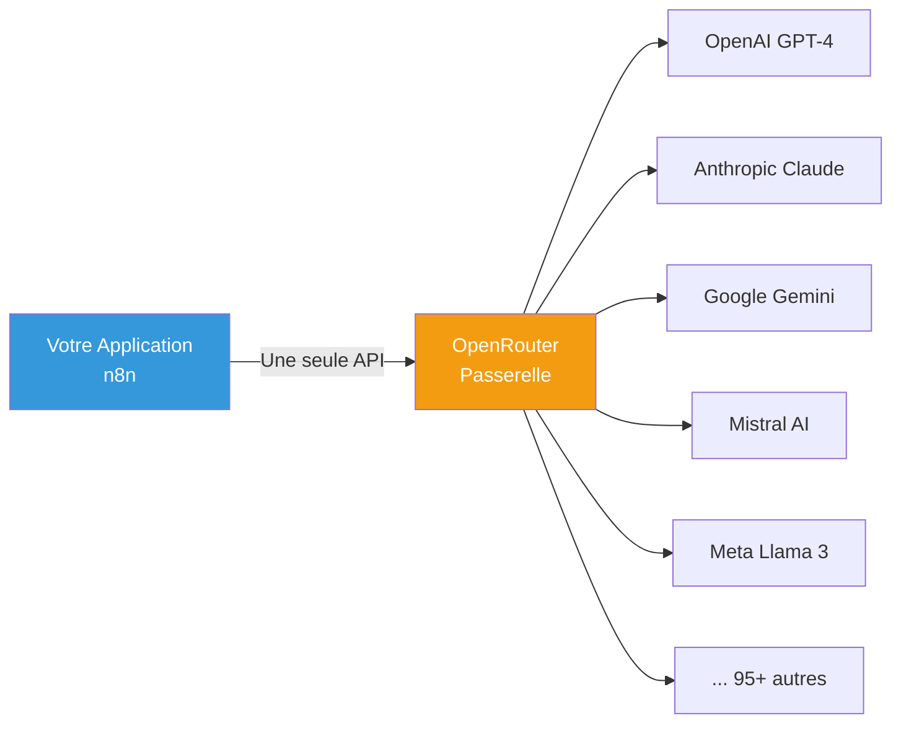
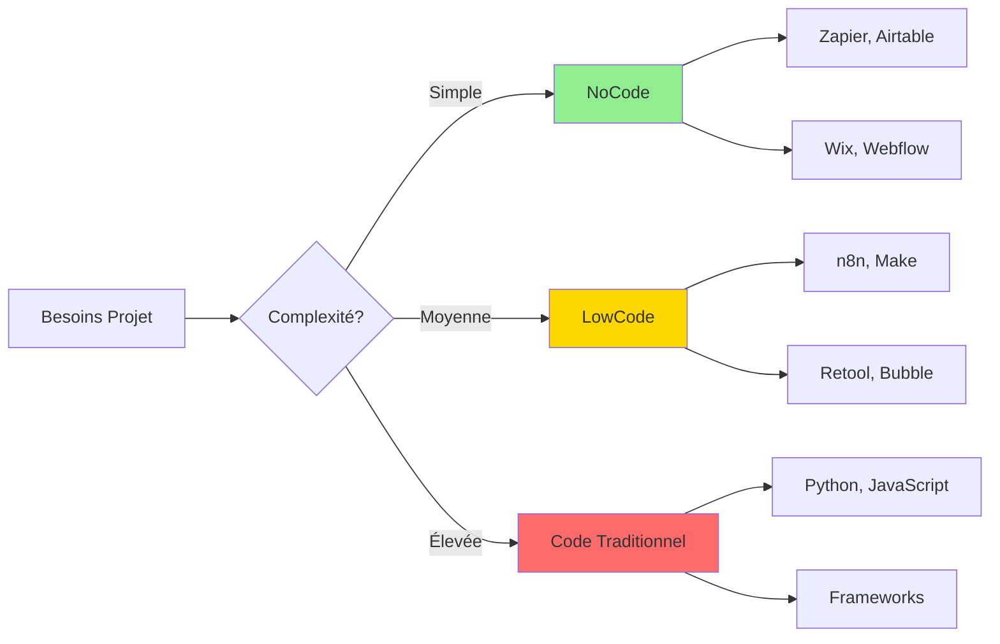
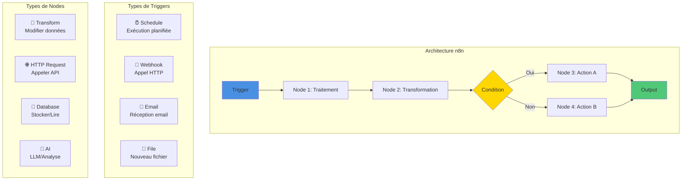

# Découverte du NoCode et LowCode

> 💡 **En bref** : Créer des applications sans coder grâce à des interfaces visuelles  
> ⏱️ **Temps de lecture** : 25 minutes  
> 🎯 **Niveau** : Débutant  
> 📚 **Prérequis** : Aucun

Le **NoCode** est une approche révolutionnaire du développement d'applications qui permet aux utilisateurs de créer des
outils, des sites web, des applications mobiles et des systèmes automatisés **sans écrire de code**. Il repose sur des
interfaces visuelles intuitives et des composants prêts à l'emploi, destinés à démocratiser la création d'outils
numériques.

Le **LowCode**, quant à lui, combine interfaces visuelles et possibilité d'ajouter du code personnalisé pour plus de flexibilité.

---

## 🎯 Objectifs d'Apprentissage

À la fin de ce module, vous serez capable de :

- ✅ Distinguer NoCode, LowCode et développement traditionnel
- ✅ Identifier les cas d'usage appropriés pour le NoCode
- ✅ Choisir l'outil adapté selon vos besoins
- ✅ Créer vos premiers workflows automatisés avec n8n
- ✅ Comprendre les avantages et limites de cette approche

## 📖 Contenu

### Qu'est-ce que le NoCode ?

Le NoCode est la possibilité de créer des solutions technologiques **sans avoir besoin de programmer**. Il se concentre
principalement sur la simplicité, la rapidité et l'accessibilité.

**Principes clés :**

- Permettre à toute personne, même sans compétences techniques, de créer des projets numériques.
- Simplifier le développement grâce à des interfaces glisser-déposer.
- Réduire le temps et les coûts associés aux projets techniques.

### Ressources utiles :

- [Introduction au NoCode (Wiki)](https://fr.wikipedia.org/wiki/No-code)
- [Qu'est-ce que le NoCode ? (Article détaillé)](https://www.capital.fr/votre-carriere/le-nocode-cest-quoi-definition-et-enjeux-1442310)
- [Vidéo : Le NoCode expliqué en 10 minutes (YouTube)](https://www.youtube.com/watch?v=jFFpgBPTpaA)

---

## À quoi sert le NoCode ?

Le NoCode peut être utilisé pour diverses tâches et projets grâce à sa flexibilité. Voici quelques exemples concrets où
le NoCode excelle :

### Cas d'usage :

1. **Création de sites web**  
   Idéal pour créer des sites personnels, des portfolios ou des vitrines professionnelles.
    - Exemples : Wix, Webflow, Carrd

2. **Développement d'applications mobiles**  
   Permet de prototyper ou de créer des applications natives.
    - Exemples : Adalo, Glide, Thunkable

3. **Automatisation de tâches**  
   Simplifie la gestion des flux de travail (workflows), comme la connexion entre différents services.
    - Exemples : Zapier, Make (ex Integromat)

4. **E-commerce**  
   Met en place facilement des boutiques en ligne sans compétences avancées.
    - Exemples : Shopify, BigCommerce

5. **Bases de données et outils internes**  
   Développe des solutions sur mesure pour la gestion d'entreprise.
    - Exemples : Airtable, Notion, Softr

### Ressources utiles :

- [Comment utiliser le NoCode pour votre entreprise (Tutoriel)](https://www.nocode-family.fr/cas-dusage/)
- [5 Utilisations communes du NoCode (Vidéo)](https://www.youtube.com/watch?v=EYd5rf7FxlE)
- [Exemples concrets d'automatisation avec Zapier (Blog)](https://zapier.com/blog/examples/)

---

## Types d'outils NoCode

Le NoCode regroupe une large variété d’outils adaptés à des besoins spécifiques. Voici les principales catégories et les
solutions les plus populaires :

### 1. **Créateurs de site web**

Ces outils permettent à quiconque de créer un site web grâce à des modèles.

- **Wix** : [Lien officiel](https://www.wix.com/) – Plateforme intuitive et grand public.
- **Webflow** : [Lien officiel](https://webflow.com/) – Adapté aux sites complexes avec une gestion poussée du design.
- **Carrd** : [Lien officiel](https://carrd.co/) – Idéal pour des sites simples et rapides à réaliser.

### 2. **Constructeurs d'applications mobiles**

Ces outils permettent de créer des applications mobiles sans écrire une seule ligne de code.

- **Adalo** : [Lien officiel](https://www.adalo.com/) – Création rapide d'applications interactives.
- **Thunkable** : [Lien officiel](https://thunkable.com/) – Dédié aux applications fonctionnelles avec des intégrations.
- **Glide** : [Lien officiel](https://www.glideapps.com/) – Transforme des feuilles de calcul en applications mobiles.

### 3. **Automatisation de workflows**

Automatisez les tâches répétitives en connectant vos outils préférés.

- **n8n** : [Lien officiel](https://n8n.io/) – Outil flexible et open source pour l'automatisation avancée des
  workflows.
- **Zapier** : [Lien officiel](https://zapier.com/) – Leader dans l'automatisation des services en ligne.
- **Make** : [Lien officiel](https://www.make.com/) – Plateforme avancée pour les workflows complexes.
- **Automate.io** : [Lien officiel](https://automate.io/) – Alternative simple et abordable.
- **Node-RED** : [Lien officiel](https://nodered.org/) – Outil open source basé sur les flux pour connecter des
  appareils, services et API.

### 4. **OpenRouter : Accès Unifié aux LLMs**

Simplifiez l'intégration de multiples modèles LLM avec une seule API.

- **OpenRouter** : [Lien officiel](https://openrouter.ai/) – Passerelle unifiée pour 100+ modèles LLM (Gemini, GPT-4, Claude, Mistral, Llama, etc.)

#### 🌐 Qu'est-ce qu'OpenRouter ?

**OpenRouter** est une **passerelle API** qui agrège l'accès à plus de 100 modèles de langage différents via une interface unifiée compatible OpenAI.

**Analogie :** Au lieu de prendre 4 cartes de transport différentes (métro, bus, train, tram), vous avez **une carte universelle** qui fonctionne partout.

#### Comment ça marche ?



**Processus :**
1. Vous créez un compte OpenRouter
2. Vous générez une clé API unique
3. Vous configurez votre application (n8n) avec cette clé
4. Vous choisissez le modèle souhaité dans votre requête
5. OpenRouter route vers le bon fournisseur

#### Intégration avec n8n

**Configuration simple :**

1. **Node à utiliser** : `OpenAI Chat Model` (dans n8n)

2. **Configuration du Credential** :
   - API Key : `sk-or-v1-...` (votre clé OpenRouter)
   - **Base URL** : `https://openrouter.ai/api/v1` ⭐ **Important !**

3. **Choix du modèle** :
   ```
   google/gemini-pro
   anthropic/claude-3.5-sonnet
   openai/gpt-4
   meta-llama/llama-3.1-70b-instruct
   mistralai/mistral-large
   ```

4. **C'est tout !** Vous pouvez maintenant utiliser 100+ modèles avec une seule configuration.

#### Avantages pour l'Apprentissage et le Prototypage

**✅ Découverte rapide**
- Testez 10 modèles différents en 10 minutes
- Comparez Claude vs GPT-4 vs Gemini facilement
- Explorez des modèles open source (Llama 3, Mixtral)

**✅ Simplicité**
- Une seule clé API à gérer
- Pas besoin de créer 5 comptes différents
- Interface standardisée (OpenAI-compatible)

**✅ Flexibilité**
- Changez de modèle en 1 ligne de code
- Testez différents modèles selon le contexte
- Implémentez un fallback facilement

**✅ Transparence**
- Prix clairs par modèle
- Pas de frais cachés
- Dashboard de consommation unifié

**✅ Pas de carte bancaire**
- Quota gratuit pour débuter
- Recharge par crédits prépayés
- Pas d'engagement

#### Cas d'Usage

**1. Comparateur LLM (votre projet actuel)**
```javascript
// Testez 5 modèles avec la même config
const models = [
  'google/gemini-pro',
  'anthropic/claude-3.5-sonnet',
  'openai/gpt-3.5-turbo',
  'mistralai/mistral-large',
  'meta-llama/llama-3.1-70b-instruct'
];

// Changez juste le nom du modèle, le reste est identique !
```

**2. Fallback automatique**
```
Si GPT-4 est surchargé → Basculer vers Claude
Si Claude rate → Essayer Gemini
```

**3. Optimisation coût/performance**
```
Tâche simple → Modèle économique (Gemini Flash)
Tâche complexe → Modèle puissant (GPT-4, Claude 3.5)
```

**4. Accès à des modèles exclusifs**
- Claude 3.5 (API Anthropic difficile d'accès)
- Llama 3.1 405B (nécessite infrastructure lourde en local)
- Modèles expérimentaux

#### Différence avec n8n Natif

| Critère | n8n Natif | n8n + OpenRouter |
|---------|-----------|------------------|
| **Setup** | 1 compte par provider | 1 compte unique |
| **Credentials** | 1 par provider | 1 credential global |
| **Modèles accessibles** | Dépend des nodes installés | 100+ immédiatement |
| **Changement de modèle** | Changer de node | Changer 1 paramètre |
| **Accès Claude** | Nécessite API Anthropic | Inclus ✅ |
| **Accès Llama 3** | Ollama local uniquement | Via API ✅ |
| **Gestion crédits** | Dashboard par provider | Dashboard unique |

#### Limites à Connaître

**❌ Features spécifiques parfois indisponibles**
- Certains modèles ne supportent pas toutes les features (function calling, vision)
- Vérifiez la documentation par modèle

**❌ Latence légèrement supérieure**
- Ajout d'une couche intermédiaire (proxy)
- Généralement négligeable (<100ms)

**❌ Dépendance à un service tiers**
- Si OpenRouter a un problème, tous vos modèles sont affectés
- Solution : Avoir un fallback direct vers une API native

**❌ Coûts potentiellement supérieurs**
- OpenRouter ajoute une marge (variable selon modèle)
- Pour production à grande échelle, APIs natives peuvent être moins chères

#### Documentation et Ressources

- **Site officiel** : [https://openrouter.ai/](https://openrouter.ai/)
- **Documentation API** : [https://openrouter.ai/docs](https://openrouter.ai/docs)
- **Liste des modèles** : [https://openrouter.ai/models](https://openrouter.ai/models)
- **Pricing** : [https://openrouter.ai/models](https://openrouter.ai/models) (détaillé par modèle)
- **GitHub** : [https://github.com/OpenRouterTeam](https://github.com/OpenRouterTeam)

#### Utilisation dans le Projet du Cours

OpenRouter est introduit comme **alternative optionnelle** dans :
- **Étape 1 - Chat Diversity** : Section D (après APIs natives)
- **Étape 10 - Bonus** : Suggestions d'amélioration

**Recommandation pédagogique** :
1. **Commencez par l'approche classique** (Étape 1, sections A-B-C) pour comprendre les APIs natives
2. **Découvrez ensuite OpenRouter** (Étape 1, section D) pour la simplicité
3. **Comparez les deux approches** pour comprendre les trade-offs

#### Conclusion

OpenRouter est **idéal pour** :
- ✅ Apprentissage et expérimentation
- ✅ Prototypage rapide
- ✅ Comparaison de modèles
- ✅ Projets personnels/étudiants

APIs natives sont **meilleures pour** :
- ✅ Production optimisée
- ✅ Features spécifiques avancées
- ✅ Contrôle total et SLA
- ✅ Coûts optimisés à grande échelle

**Pour ce cours** : Les deux approches sont complémentaires ! 🎓

---

### 5. **Outils de base de données et gestion interne**

Concevez des bases de données, des tableaux de bord ou des outils internes.

- **Airtable** : [Lien officiel](https://www.airtable.com/) – Base de données relationnelle facile à manipuler.
- **Notion** : [Lien officiel](https://www.notion.so/) – Solution pour organiser des projets.
- **Softr** : [Lien officiel](https://www.softr.io/) – Transforme les données Airtable en outils et applications.

### NoCode vs LowCode vs Code Traditionnel



**Comparaison détaillée :**

| Critère | NoCode | LowCode | Code Traditionnel |
|---------|--------|---------|-------------------|
| 🎯 **Cible** | Non-développeurs | Développeurs & tech-savvy | Développeurs experts |
| ⚡ **Vitesse** | Très rapide (heures/jours) | Rapide (jours/semaines) | Lent (semaines/mois) |
| 🔧 **Personnalisation** | Limitée | Moyenne-Élevée | Totale |
| 💰 **Coût initial** | Faible | Moyen | Élevé |
| 📈 **Scalabilité** | Limitée | Bonne | Excellente |
| 🔒 **Contrôle** | Faible | Moyen | Total |
| 🎓 **Courbe apprentissage** | Douce | Moyenne | Raide |
| 🛠️ **Maintenance** | Gérée par plateforme | Partagée | À votre charge |

---

## Pourquoi adopter le NoCode ?

Voici quelques avantages clés du NoCode :

1. **Accessibilité** : Accessible aux non-programmeurs.
2. **Prototypage rapide** : Idéal pour tester vos idées sans attendre.
3. **Réduction des coûts** : Pas besoin d’une équipe de développeurs dédiée.
4. **Fiabilité** : Les outils NoCode bénéficient souvent d’un haut niveau de support et de maintenance.

Cependant, le NoCode peut avoir des limites, notamment pour les projets nécessitant une personnalisation avancée ou un
contrôle complet. Dans ces cas, on peut opter pour des solutions **LowCode**, qui combinent interface visuelle et
programmation.

---

## 🖼️ Architecture n8n (Focus du Cours)

n8n est l'outil que nous utiliserons dans ce cours. Voici comment il fonctionne :



**Avantages de n8n :**

- ✅ **Open Source** : Code accessible et modifiable
- ✅ **Self-hosted** : Vos données restent chez vous
- ✅ **400+ intégrations** : API, bases de données, services cloud
- ✅ **Programmable** : Ajouter du JavaScript si nécessaire (LowCode)
- ✅ **Interface visuelle** : Drag & drop intuitif
- ✅ **Gratuit** : Version communautaire complète

---

## 💻 Exercices Pratiques

### Exercice 1 : Premier Workflow Simple

**Objectif** : Créer un workflow qui s'exécute toutes les heures et affiche "Hello World"

<details>
<summary>📝 Instructions détaillées</summary>

1. Ouvrez n8n (http://localhost:5678)
2. Créez un nouveau workflow
3. Ajoutez un node **Schedule Trigger**
   - Mode : `Every hour`
4. Ajoutez un node **Code**
   - Code : `return [{ json: { message: "Hello World", timestamp: new Date() } }];`
5. Connectez les nodes
6. Testez avec "Execute Workflow"

</details>

<details>
<summary>✅ Solution et explications</summary>

```javascript
// Node Code
return [{
  json: {
    message: "Hello World",
    timestamp: new Date(),
    executionCount: $execution.id
  }
}];
```

**Points clés :**
- Le Schedule Trigger déclenche automatiquement
- Le node Code retourne un objet JSON
- Chaque exécution a un ID unique

**Lien avec le projet :** Étape 0 - Chat (trigger manuel vs automatique)

</details>

---

### Exercice 2 : Webhook et HTTP Request

**Objectif** : Créer un workflow qui reçoit un nom via webhook et retourne une salutation

<details>
<summary>📝 Instructions détaillées</summary>

1. Ajoutez un node **Webhook**
   - HTTP Method : `POST`
   - Path : `hello`
2. Ajoutez un node **Code**
   - Code : Extraire `name` du body et créer message
3. Ajoutez un node **Respond to Webhook**
   - Response : Retourner le message
4. Testez avec curl ou Postman

</details>

<details>
<summary>✅ Solution et explications</summary>

```javascript
// Node Code
const name = $input.item.json.body.name || "Anonyme";

return [{
  json: {
    greeting: `Bonjour ${name}!`,
    timestamp: new Date(),
    language: "fr"
  }
}];
```

**Test avec curl :**
```bash
curl -X POST http://localhost:5678/webhook/hello \
  -H "Content-Type: application/json" \
  -d '{"name":"Jean"}'
```

**Résultat attendu :**
```json
{
  "greeting": "Bonjour Jean!",
  "timestamp": "2024-01-15T10:30:00.000Z",
  "language": "fr"
}
```

**Lien avec le projet :** Étape 3 - Distribute Workflow (webhooks entre workflows)

</details>

---

### Exercice 3 : Gestion d'Erreurs

**Objectif** : Créer un workflow robuste qui gère les erreurs gracieusement

<details>
<summary>📝 Instructions détaillées</summary>

1. Créez un workflow avec un HTTP Request vers une API
2. Ajoutez un node **Error Trigger**
3. Connectez-le pour capturer les erreurs
4. Ajoutez un node de notification (email ou log)
5. Testez avec une URL invalide

</details>

<details>
<summary>✅ Solution et explications</summary>

**Workflow principal :**
```
Webhook → HTTP Request (peut échouer) → Success Response
           ↓ (en cas d'erreur)
        Error Trigger → Log Error → Error Response
```

**Code du Error Handler :**
```javascript
// Node Error Trigger - Code
const error = $input.item.json.error;

return [{
  json: {
    error: true,
    message: error.message,
    timestamp: new Date(),
    suggestion: "Vérifiez l'URL de l'API"
  }
}];
```

**Bonnes pratiques :**
- ✅ Toujours prévoir un Error Trigger
- ✅ Logger les erreurs pour debug
- ✅ Retourner des messages clairs à l'utilisateur
- ✅ Mettre en place des retry strategies

**Lien avec le projet :** Toutes les étapes (robustesse)

</details>

---

### Exercice 4 : Intégration Base de Données

**Objectif** : Stocker et récupérer des données dans PostgreSQL

<details>
<summary>📝 Instructions détaillées</summary>

1. Configurez les credentials PostgreSQL dans n8n
2. Créez un workflow avec webhook POST
3. Ajoutez un node **Postgres** en mode INSERT
4. Créez un second workflow avec webhook GET
5. Ajoutez un node **Postgres** en mode SELECT
6. Testez les deux workflows

</details>

<details>
<summary>✅ Solution et explications</summary>

**Workflow 1 - INSERT :**
```sql
-- Node Postgres
INSERT INTO users (name, email, created_at)
VALUES (
  '{{ $json.name }}',
  '{{ $json.email }}',
  NOW()
)
RETURNING *;
```

**Workflow 2 - SELECT :**
```sql
-- Node Postgres
SELECT * FROM users
WHERE email = '{{ $json.email }}'
ORDER BY created_at DESC
LIMIT 1;
```

**Test :**
```bash
# Insérer
curl -X POST http://localhost:5678/webhook/user/create \
  -H "Content-Type: application/json" \
  -d '{"name":"Alice","email":"alice@example.com"}'

# Récupérer
curl http://localhost:5678/webhook/user/get?email=alice@example.com
```

**Lien avec le projet :** Étapes 5-6 (Store/Load from DB)

</details>

---

## ✅ Quiz d'Auto-Évaluation

Testez vos connaissances :

1. **Quelle est la principale différence entre NoCode et LowCode ?**
   - a) Le prix
   - b) La possibilité d'ajouter du code personnalisé
   - c) Le nombre d'utilisateurs
   - d) La vitesse d'exécution

<details><summary>Réponse</summary>
✅ **b) La possibilité d'ajouter du code personnalisé**  
Le LowCode permet d'insérer du JavaScript ou autre code pour personnaliser, contrairement au NoCode pur.
</details>

2. **Quel type de trigger utiliser pour un workflow qui s'exécute chaque jour à 8h ?**
   - a) Webhook
   - b) Schedule Trigger
   - c) Manual Trigger
   - d) Error Trigger

<details><summary>Réponse</summary>
✅ **b) Schedule Trigger**  
Le Schedule Trigger permet d'exécuter à intervalles réguliers ou à des heures précises.
</details>

3. **Dans n8n, à quoi sert un node "Code" ?**
   - a) Compiler le workflow
   - b) Transformer les données avec JavaScript
   - c) Créer des variables CSS
   - d) Gérer les erreurs uniquement

<details><summary>Réponse</summary>
✅ **b) Transformer les données avec JavaScript**  
Le node Code permet d'exécuter du JavaScript pour manipuler les données entre nodes.
</details>

4. **Quel format de données n8n utilise-t-il principalement ?**
   - a) XML
   - b) CSV
   - c) JSON
   - d) YAML

<details><summary>Réponse</summary>
✅ **c) JSON**  
Tous les nodes échangent des données au format JSON.
</details>

5. **Que se passe-t-il si un node échoue dans n8n ?**
   - a) Le workflow continue normalement
   - b) Le workflow s'arrête (sauf si Error Trigger configuré)
   - c) L'ordinateur redémarre
   - d) Les données sont perdues définitivement

<details><summary>Réponse</summary>
✅ **b) Le workflow s'arrête (sauf si Error Trigger configuré)**  
Sans Error Trigger, une erreur arrête l'exécution. Avec Error Trigger, on peut gérer l'erreur gracieusement.
</details>

6. **Quel est l'avantage principal de self-hosting n8n ?**
   - a) C'est plus joli
   - b) Contrôle total des données et sécurité
   - c) Ça coûte plus cher
   - d) Ça ne nécessite pas Internet

<details><summary>Réponse</summary>
✅ **b) Contrôle total des données et sécurité**  
Self-hosting signifie que vos données restent sur votre infrastructure, pas sur des serveurs tiers.
</details>

7. **Quelle différence entre Webhook et Schedule Trigger ?**
   - a) Le webhook attend un appel externe, le schedule s'exécute automatiquement
   - b) Ils font la même chose
   - c) Le webhook est plus lent
   - d) Le schedule ne fonctionne que la nuit

<details><summary>Réponse</summary>
✅ **a) Le webhook attend un appel externe, le schedule s'exécute automatiquement**  
Webhook = déclenché par appel HTTP. Schedule = déclenché par horloge interne.
</details>

8. **Dans quel cas privilégier le code traditionnel au NoCode ?**
   - a) Pour prototyper rapidement
   - b) Pour un projet très complexe nécessitant contrôle total
   - c) Quand on n'a pas de développeur
   - d) Jamais, le NoCode est toujours meilleur

<details><summary>Réponse</summary>
✅ **b) Pour un projet très complexe nécessitant contrôle total**  
Le code traditionnel offre flexibilité et performance maximales pour les cas complexes.
</details>

9. **Combien coûte la version self-hosted de n8n ?**
   - a) 99€/mois
   - b) 1000€/an
   - c) Gratuit (open source)
   - d) Selon le nombre de workflows

<details><summary>Réponse</summary>
✅ **c) Gratuit (open source)**  
n8n est open source et gratuit en self-hosted. Seule la version cloud est payante.
</details>

10. **Quel node utiliser pour retourner une réponse à un webhook ?**
    - a) HTTP Request
    - b) Respond to Webhook
    - c) Code
    - d) Set

<details><summary>Réponse</summary>
✅ **b) Respond to Webhook**  
Ce node est spécifiquement conçu pour répondre aux webhooks entrants.
</details>

**Score :** _/10  
- 8-10 : Excellent ! Vous maîtrisez les concepts  
- 5-7 : Bien, relisez les sections où vous avez eu faux  
- 0-4 : Relisez le document et refaites les exercices

---

## 📊 Mémento NoCode/LowCode

### Cheat Sheet n8n

| Action | Comment faire |
|--------|---------------|
| ⏰ Exécution planifiée | Schedule Trigger → Every X minutes/hours |
| 🔗 Recevoir requête HTTP | Webhook → POST/GET |
| 🌐 Appeler API externe | HTTP Request → URL + Method |
| 💾 Lire base de données | Postgres/MySQL → SELECT |
| 💾 Écrire base de données | Postgres/MySQL → INSERT/UPDATE |
| 🔄 Transformer données | Code → JavaScript |
| ❌ Gérer erreurs | Error Trigger + On Error workflow |
| 📤 Retourner réponse | Respond to Webhook |
| 🔀 Condition | IF → Expression |
| 🔁 Boucle | Loop Over Items + Split in Batches |

### Commandes Docker n8n Utiles

```bash
# Démarrer n8n
docker-compose up -d

# Voir les logs
docker-compose logs -f n8n

# Arrêter n8n
docker-compose down

# Redémarrer
docker-compose restart n8n

# Accéder au conteneur
docker exec -it n8n sh

# Backup workflows
docker exec n8n n8n export:workflow --all --output=/data/backup.json
```

---

## Ressources générales pour apprendre le NoCode

1. [Nocode.dev - Communauté et tutoriels](https://nocode.dev/)
2. [NoCode.tech - Apprendre à créer sans coder](https://nocode.tech/)
3. [Vidéo : Les 10 meilleurs outils NoCode pour débutants (YouTube)](https://www.youtube.com/watch?v=pEepgNIJyl0)

---

## 🔗 Ressources Complémentaires

**Documentation officielle :**
- [n8n Documentation](https://docs.n8n.io/) - Guide complet
- [n8n Community](https://community.n8n.io/) - Forum et entraide
- [n8n YouTube](https://www.youtube.com/c/n8n-io) - Tutoriels vidéo

**Alternatives à explorer :**
- [Make (Integromat)](https://www.make.com/) - Interface très visuelle
- [Zapier](https://zapier.com/) - Le pionnier (cloud only)
- [Node-RED](https://nodered.org/) - Pour l'IoT
- [Temporal](https://temporal.io/) - Orchestration avancée (plus technique)

---

## 🔄 Liens avec le Projet

Ce module vous prépare directement aux étapes suivantes :

| Étape Projet | Concepts NoCode Utilisés |
|--------------|--------------------------|
| **0. Chat** | Workflow simple, trigger manuel, LLM node |
| **1. Chat Diversity** | Boucles, transformations, modèles multiples |
| **2. Split Workflow** | Modularisation, sous-workflows |
| **3. Distribute Workflow** | Webhooks, communication inter-workflows |
| **4. Forms** | Collecte de données, validation |
| **5. Store to DB** | Intégration PostgreSQL, INSERT |
| **6. Load from DB** | Requêtes SELECT, historique |
| **7. Enhance Prompt** | RAG, enrichissement de contexte |
| **8. Export to File** | Génération fichiers, stockage |
| **9. Secure Prompt** | Validation, sanitization, credentials |

**Conseil :** Faites les exercices 1-4 avant de commencer le projet pour bien maîtriser les bases !

---

## ❓ FAQ - Questions Fréquentes

**Q1 : Dois-je savoir programmer pour utiliser n8n ?**  
Non, mais connaître les bases de JavaScript aide pour les nodes Code et expressions avancées.

**Q2 : n8n peut-il remplacer Zapier ?**  
Oui, pour la plupart des cas d'usage. n8n est même plus flexible car self-hosted et programmable.

**Q3 : Combien de workflows puis-je créer ?**  
Illimité ! En self-hosted, vous n'avez aucune restriction de quota.

**Q4 : Les workflows s'exécutent-ils si Docker est arrêté ?**  
Non, n8n doit être en cours d'exécution. Utilisez `docker-compose up -d` pour le laisser tourner en arrière-plan.

**Q5 : Comment sauvegarder mes workflows ?**  
Ils sont stockés dans `/data` (volume Docker). Faites des backups réguliers avec `docker cp` ou via l'export n8n.

**Q6 : Puis-je utiliser n8n en production ?**  
Oui ! Beaucoup d'entreprises l'utilisent. Prévoyez monitoring, backups et sécurité (HTTPS, authentification).

**Q7 : Comment debugger un workflow qui ne marche pas ?**  
1. Vérifiez les logs de chaque node (cliquer sur le node)
2. Utilisez le node "Stop and Error" pour inspecter les données
3. Consultez les logs Docker : `docker-compose logs -f n8n`

**Q8 : n8n consomme-t-il beaucoup de ressources ?**  
Non, ~200MB RAM pour l'instance de base. Augmente avec le nombre de workflows actifs simultanés.

---

## 🐛 Erreurs Courantes et Solutions

### Erreur 1 : "Cannot connect to database"

**Symptômes :** Le workflow avec Postgres échoue

**Causes possibles :**
- Credentials mal configurés
- Base de données non démarrée
- Mauvais host (utiliser `postgres` pas `localhost` dans Docker)

**Solution :**
```bash
# Vérifier que PostgreSQL tourne
docker-compose ps

# Tester la connexion
docker exec -it postgres psql -U n8n_user -d n8n_db

# Vérifier les credentials dans n8n
Host: postgres (pas localhost)
Port: 5432
User: n8n_user
Password: (celui du .env)
Database: n8n_db
```

---

### Erreur 2 : "Webhook not found"

**Symptômes :** Erreur 404 lors de l'appel du webhook

**Causes possibles :**
- Workflow non activé (mode "Inactive")
- Mauvais path
- Workflow supprimé

**Solution :**
1. Vérifiez que le workflow est **Activé** (toggle en haut à droite)
2. Le path complet est : `http://localhost:5678/webhook/VOTRE_PATH`
3. Relancez le workflow en mode production (pas juste test)

---

### Erreur 3 : "Expression error"

**Symptômes :** Erreur dans un node Code ou expression `{{ }}`

**Causes possibles :**
- Syntaxe JavaScript incorrecte
- Variable inexistante
- Mauvais accès aux données

**Solution :**
```javascript
// ❌ Mauvais
{{ $node.Webhook.data.name }}

// ✅ Bon
{{ $json.name }}

// Pour accéder à un node spécifique
{{ $node["Node Name"].json.field }}

// Vérifier si existe avant d'accéder
{{ $json.name || "Default" }}
```

---

### Erreur 4 : "Workflow timeout"

**Symptômes :** Le workflow s'arrête après quelques minutes

**Causes possibles :**
- Timeout par défaut dépassé (2 min)
- Boucle infinie
- Trop de données à traiter

**Solution :**
1. Dans Settings → Timeout → Augmenter (max 300s par défaut)
2. Optimiser les boucles (Split in Batches)
3. Traiter les données par petits lots

---

### Erreur 5 : "Out of memory"

**Symptômes :** n8n crash, conteneur redémarre

**Causes possibles :**
- Trop de workflows actifs
- Gros fichiers en mémoire
- Pas assez de RAM allouée

**Solution :**
```yaml
# docker-compose.yml
services:
  n8n:
    environment:
      - N8N_PAYLOAD_SIZE_MAX=16  # MB
    deploy:
      resources:
        limits:
          memory: 1G  # Augmenter si nécessaire
```

---

### Conclusion

Le **NoCode** et le **LowCode** (comme n8n) sont des outils puissants pour automatiser et créer rapidement. Ils démocratisent la tech tout en gardant de la flexibilité.

**Prochaines étapes :**
1. ✅ Faites les 4 exercices pratiques
2. ✅ Testez le quiz
3. ✅ Passez à l'étape 0 du projet (Chat simple)
4. ✅ Explorez la documentation n8n

**N'oubliez pas :** Vous n'avez pas besoin de tout maîtriser immédiatement. L'apprentissage se fait par la pratique ! 🚀