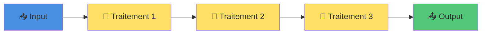
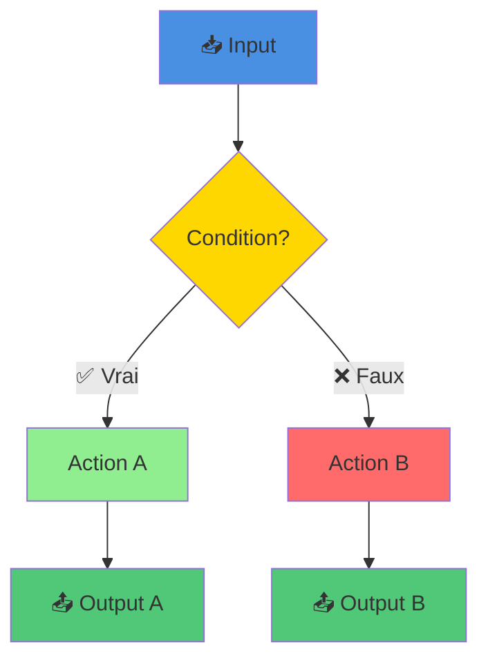
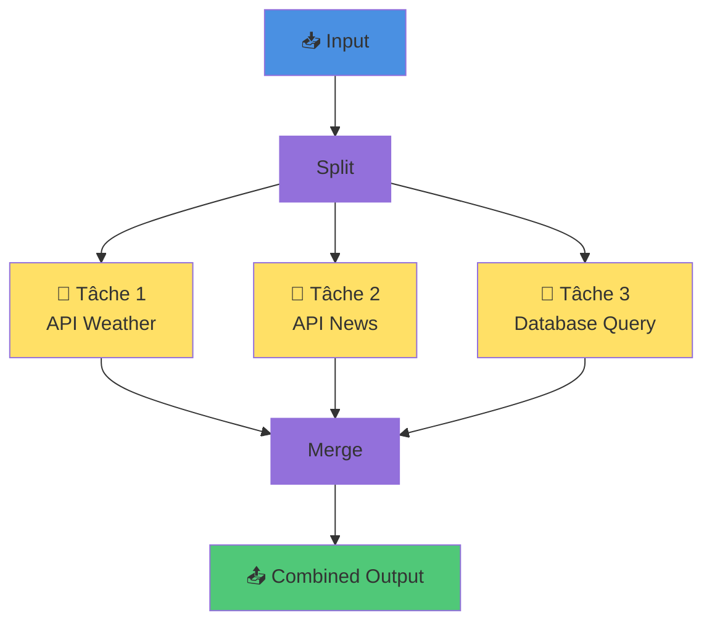
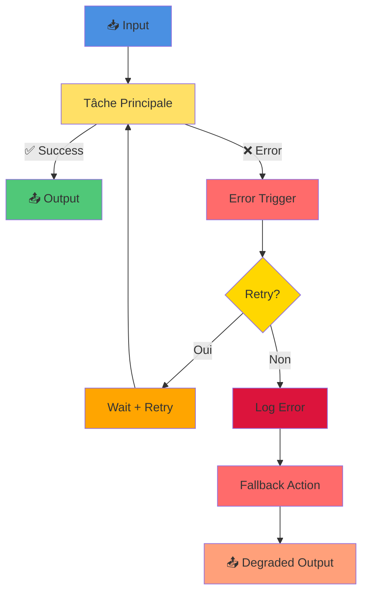
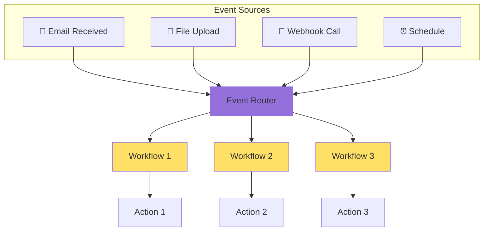
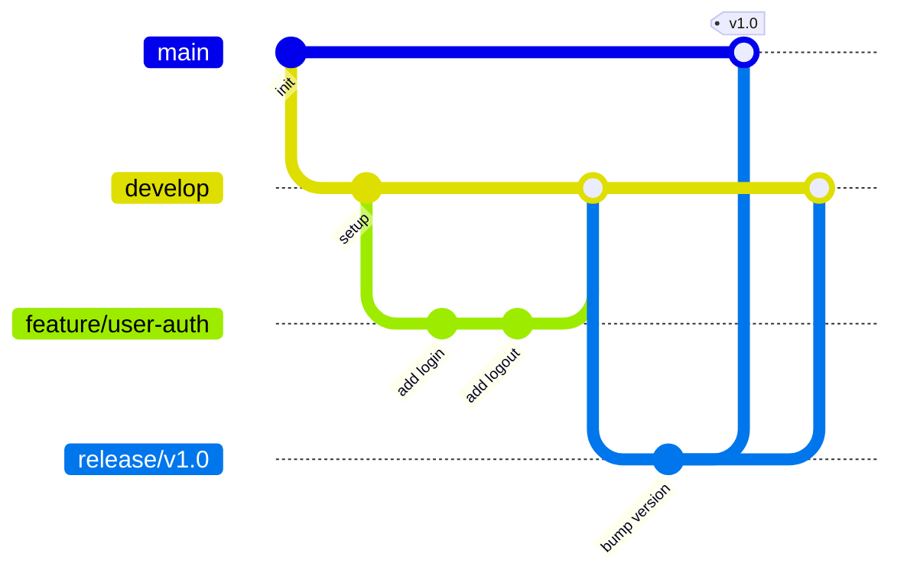

# Les Différents Types de Workflow et Les Stratégies pour les Mettre en Œuvre

> 💡 **En bref** : Comprendre et implémenter des workflows efficaces pour automatiser vos processus  
> ⏱️ **Temps de lecture** : 30 minutes  
> 🎯 **Niveau** : Débutant à Intermédiaire  
> 📚 **Prérequis** : Bases de programmation recommandées (mais pas obligatoires)

---

## 🎯 Objectifs d'Apprentissage

À la fin de ce module, vous serez capable de :

- ✅ Définir ce qu'est un workflow et ses composants
- ✅ Identifier les différents types de workflows (séquentiel, parallèle, conditionnel, événementiel)
- ✅ Choisir la stratégie appropriée selon le cas d'usage
- ✅ Implémenter des workflows robustes avec gestion d'erreurs
- ✅ Appliquer les bonnes pratiques d'orchestration
- ✅ Utiliser n8n pour créer des workflows complexes

---

## 📖 Contenu

### Qu'est-ce qu'un Workflow ?

Un **workflow** désigne une série de tâches ou d'étapes interconnectées permettant de produire un résultat final
spécifique. Ces étapes peuvent être exécutées de manière automatique, semi-automatique ou manuelle, en fonction des
besoins et des outils utilisés.

Dans un contexte technique, et plus précisément dans la gestion de projet logiciel, les workflows permettent de
structurer et d'optimiser le processus de développement : qu'il s'agisse de gérer du code source, d'automatiser des
tâches régulières ou d'orchestrer des systèmes complexes.

**Ressources utiles :**

- [Comprendre les workflows en gestion de projet](https://www.atlassian.com/agile/software-development/workflow) (
  Atlassian)
- [Tutoriel vidéo : Introduction aux workflows](https://www.youtube.com/watch?v=2K4Fpq8InY8) (YouTube)

---

## 🖼️ Les 5 Patterns de Workflow Essentiels

### Pattern 1 : Workflow Séquentiel Simple

Le pattern le plus basique : une tâche après l'autre.



**Cas d'usage :**
- Import de fichier → Validation → Transformation → Sauvegarde
- Réception webhook → Appel API → Formatage → Envoi email

**Exemple n8n :** Étape 0 du projet (Chat simple)

---

### Pattern 2 : Workflow avec Conditions (IF/ELSE)

Exécution différente selon les données.



**Cas d'usage :**
- Si utilisateur premium → Réponse détaillée | Sinon → Réponse basique
- Si erreur API → Retry | Sinon → Continue
- Si fichier > 10MB → Compression | Sinon → Direct upload

**Exemple n8n :** Étape 1 du projet (Chat Diversity - choix du modèle)

---

### Pattern 3 : Workflow Parallèle

Plusieurs tâches en même temps pour gagner du temps.



**Cas d'usage :**
- Appeler 3 APIs en même temps puis combiner les résultats
- Traiter plusieurs fichiers simultanément
- Multi-model AI (plusieurs LLMs en parallèle)

**Exemple n8n :** Étape 1 du projet (Chat Diversity - appels parallèles)

---

### Pattern 4 : Workflow avec Gestion d'Erreurs

Robustesse et résilience.



**Cas d'usage :**
- API externe down → Retry 3 fois → Fallback sur cache
- Database timeout → Queue pour later
- LLM rate limit → Wait and retry

**Exemple n8n :** Toutes les étapes du projet (production readiness)

---

### Pattern 5 : Workflow Événementiel (Event-Driven)

Réaction aux événements en temps réel.



**Cas d'usage :**
- Nouveau fichier détecté → Process automatique
- Webhook reçu → Trigger workflow
- Email avec pièce jointe → Extract + Store

**Exemple n8n :** Étape 3 du projet (Distribute Workflow - webhooks)

---

## Domaines d'utilisation des Workflows

Passons en revue différents domaines dans lesquels les workflows jouent un rôle essentiel :

### 1. Gestion du Code Source

Un des principaux usages des workflows est la **gestion collaborative du code**. Cela inclut la manière dont les
développeurs travaillent ensemble sur un projet.

#### Stratégies courantes :

- **Git Workflow** :
    - **Git Flow** : Séparer les branches pour chaque étape (feature branches, release branches, master, etc.).
    - **GitHub Flow** : Travailler directement à partir de `main`, privilégier les Pull Requests pour valider les
      modifications.
    - **GitLab Flow** : Inclure des branches associées aux environnements de déploiement (développement, staging,
      production).
- **Stratégies de fusion** :
    - Les workflows peuvent inclure la validation des modifications par des processus de revue de code et des tests
      automatiques.
    - Exemple d'outil : Plateformes comme **GitHub**, **GitLab** ou **Bitbucket**.

#### Technologies impliquées :

- **Systèmes de contrôle de version** : Git, Subversion (SVN).
- **Outils d'intégration continue** : Jenkins, CircleCI, Travis CI, GitHub Actions.

**Ressources utiles :**

- [Guide complet sur Git Flow](https://nvie.com/posts/a-successful-git-branching-model/)
- [Tutoriel GitHub Flow](https://docs.github.com/en/get-started/quickstart/github-flow)
- Vidéos
  explicatives : [Git Flow simplifié](https://www.youtube.com/watch?v=1SXpE08hvGs), [GitLab Flow](https://www.youtube.com/watch?v=cnVdQ1Gk2ko)

### 2. Automatisation de Tâches

Un autre volet important concerne l'automatisation des tâches répétitives pour gagner du temps et minimiser les erreurs
humaines.

#### Exemples :

1. Génération automatique de documentation à partir de votre code.
2. Déploiement automatique de packages ou applications après un processus de test.
3. Programmation de sauvegardes ou nettoyage régulier de fichiers inutiles.

#### Technologies utilisées :

- **Systèmes d'intégration continue (CI/CD)** :
    - Jenkins, GitHub Actions, GitLab CI.
- **Outils d'automatisation spécifiques** :
    - Makefiles, Task runners (comme npm pour JavaScript).
    - Automatisation avec des scripts Python (par exemple : avec `fabric`, `invoke`).
- **Outils no-code pour l’automatisation** :
    - Zapier, Make (anciennement Integromat), n8n.
    - Plateformes comme Airtable (avec des automatisations intégrées) ou Notion (actions automatisées).

#### Stratégies :

- **Infrastructure as Code** : Configurez une infrastructure comme du code (exemple : Terraform, Ansible).
- **Automatisation événementielle** : Triggers pour exécuter des étapes après une action spécifique.

**Ressources utiles :**

- Article : [Pourquoi et comment automatiser vos tâches](https://blog.hubspot.com/marketing/automated-tasks)
-
Vidéos : [Introduction à Jenkins](https://www.youtube.com/watch?v=2KnZac176Hs), [First steps avec GitHub Actions](https://www.youtube.com/watch?v=R8_veQiYBjI)
-
Articles : [Terraform pour débutants](https://www.terraform.io/intro), [Guide Zapier](https://zapier.com/learn/getting-started-guide/)

### 3. Orchestration Logicielle

Lorsque vous devez coordonner plusieurs services, processus ou applications pour atteindre un objectif, l'orchestration
intervient.

#### Cas typiques :

- Interaction entre microservices dans une architecture cloud.
- Gestion de workflows de machine learning (exemple : entraîner un modèle après la collecte de nouvelles données).
- Chaînage de fonctions dans un environnement serverless (comme sur AWS Lambda ou Google Cloud Functions).

#### Technologies et outils :

- **Outils d'orchestration** : Apache Airflow, Luigi, Cadence, Prefect.
- **Conteneurs et orchestration cloud** : Docker, Kubernetes.
- **Approches événementielles (Event-driven)** : Kafka, RabbitMQ, AWS Step Functions.

**Ressources utiles :**

- Tutoriel vidéo : [Introduction à Apache Airflow](https://www.youtube.com/watch?v=JOzxOtCJIwc)
- Article : [Les bases de Kubernetes](https://kubernetes.io/docs/tutorials/kubernetes-basics/)
- Vidéo : [Comprendre le serverless et AWS Lambda](https://www.youtube.com/watch?v=eOBq__h4OJ4)

### 4. Gestion de Projet et Collaboration

Un workflow appliqué à la gestion de projet vise à structurer et planifier de manière optimale les étapes nécessaires
pour atteindre les objectifs.

#### Exemples et outils :

- **Méthodes Agiles** :
    - Scrum, Kanban pour visualiser et organiser les flux de travail.
    - Outils associés : Jira, Trello, Monday.com.
- **Gestion documentaire** :
    - Partage et validation des documents à l'aide d'outils comme Confluence ou Notion.

**Ressources utiles :**

- Article : [Introduction à Scrum](https://www.scrum.org/resources/what-is-scrum)
- Tutoriel vidéo : [Kanban expliqué](https://www.youtube.com/watch?v=iVaFVa7HYj4)
- Guide : [Utiliser Trello pour votre projet Agile](https://blog.trello.com/fr/guide-methodologie-agile-trello)

### 5. Tests Automatisés et Gestion de la Qualité

Les workflows dédiés aux tests garantissent la qualité du logiciel à chaque itération.

#### Stratégies :

- Déclencher l'exécution automatique de tests unitaires, d'intégration ou de performance.
- Utiliser des outils comme Selenium pour les tests end-to-end.

#### Niveaux d'automatisation :

- **CI/CD pipelines** : Les tests sont intégrés dans un pipeline et s'exécutent avant chaque déploiement.

**Ressources utiles :**

- Article : [Pourquoi automatiser les tests ?](https://www.browserstack.com/guide/test-automation)
- Vidéo : [Guide des tests Selenium](https://www.youtube.com/watch?v=dzXX2hJhuCY)
-
Tutoriel : [Créer un pipeline CI/CD avec des tests](https://docs.microsoft.com/en-us/azure/devops/pipelines/get-started-yaml?view=azure-devops)

---

## 💻 Exercices Pratiques

### Exercice 1 : Workflow Séquentiel avec Transformation

**Objectif** : Créer un workflow qui transforme des données étape par étape

<details>
<summary>📝 Instructions détaillées</summary>

Créez un workflow qui :
1. Reçoit une liste de produits (webhook POST)
2. Filtre les produits en stock (stock > 0)
3. Calcule le prix TTC (prix HT × 1.20)
4. Trie par prix décroissant
5. Retourne le top 5

**Données test :**
```json
{
  "products": [
    {"name": "Laptop", "price": 1000, "stock": 5},
    {"name": "Mouse", "price": 20, "stock": 0},
    {"name": "Keyboard", "price": 80, "stock": 10},
    {"name": "Monitor", "price": 300, "stock": 3}
  ]
}
```

</details>

<details>
<summary>✅ Solution et explications</summary>

**Workflow n8n :**
```
Webhook → Filter (stock>0) → Code (calc TTC) → Sort → Limit → Respond
```

**Node Filter :**
```
Keep Items If:
  stock > 0
```

**Node Code (Calcul TTC) :**
```javascript
return $input.all().map(item => ({
  json: {
    ...item.json,
    priceTTC: item.json.price * 1.20
  }
}));
```

**Node Sort :**
```
Sort by: priceTTC
Direction: Descending
```

**Node Limit :**
```
Max Items: 5
```

**Résultat attendu :**
```json
[
  {"name": "Laptop", "price": 1000, "stock": 5, "priceTTC": 1200},
  {"name": "Monitor", "price": 300, "stock": 3, "priceTTC": 360},
  {"name": "Keyboard", "price": 80, "stock": 10, "priceTTC": 96}
]
```

**Concepts clés :**
- Pipeline de transformation
- Filter pour conditions
- Code pour calculs
- Sort et Limit pour ranking

**Lien projet :** Base pour toutes les étapes de traitement de données

</details>

---

### Exercice 2 : Workflow Conditionnel (IF/ELSE)

**Objectif** : Router les requêtes selon des critères

<details>
<summary>📝 Instructions détaillées</summary>

Créez un workflow qui :
1. Reçoit une requête utilisateur (webhook)
2. Vérifie si l'utilisateur est "premium" (champ `tier`)
3. Si premium → Appelle GPT-4 (simulé)
4. Si free → Appelle GPT-3.5 (simulé)
5. Retourne la réponse avec le modèle utilisé

**Données test :**
```json
// User premium
{"tier": "premium", "question": "Explain quantum computing"}

// User free
{"tier": "free", "question": "What is AI?"}
```

</details>

<details>
<summary>✅ Solution et explications</summary>

**Workflow n8n :**
```
Webhook → IF (tier check) → [GPT-4 Branch] → Merge → Respond
                         → [GPT-3.5 Branch] →
```

**Node IF :**
```
Condition:
  {{ $json.tier }} equals "premium"
```

**Node Code (GPT-4 Branch) :**
```javascript
return [{
  json: {
    model: "gpt-4",
    response: `[GPT-4] Detailed answer to: ${$json.question}`,
    tokens: 1500
  }
}];
```

**Node Code (GPT-3.5 Branch) :**
```javascript
return [{
  json: {
    model: "gpt-3.5-turbo",
    response: `[GPT-3.5] Basic answer to: ${$json.question}`,
    tokens: 500
  }
}];
```

**Résultat attendu (premium) :**
```json
{
  "model": "gpt-4",
  "response": "[GPT-4] Detailed answer to: Explain quantum computing",
  "tokens": 1500
}
```

**Concepts clés :**
- Routing conditionnel
- Branches parallèles
- Merge des résultats

**Lien projet :** Étape 1 - Chat Diversity (choix du modèle)

</details>

---

### Exercice 3 : Workflow Parallèle (Multi-API)

**Objectif** : Appeler plusieurs APIs en parallèle et combiner les résultats

<details>
<summary>📝 Instructions détaillées</summary>

Créez un workflow qui :
1. Reçoit une ville (webhook GET)
2. Appelle en parallèle 3 APIs (simulées) :
   - API Météo
   - API Actualités
   - API Événements
3. Combine les 3 résultats
4. Retourne un JSON unifié

**Données test :**
```
GET /webhook/city-info?city=Paris
```

</details>

<details>
<summary>✅ Solution et explications</summary>

**Workflow n8n :**
```
Webhook → Split in Batches → [API Weather]  → Merge → Code (combine) → Respond
                           → [API News]     →
                           → [API Events]   →
```

**Alternative (plus simple) :**
```
Webhook → [HTTP Request 1 - Weather] → Wait for All
        → [HTTP Request 2 - News]    → 
        → [HTTP Request 3 - Events]  → Code (combine) → Respond
```

**Node Code (Simulation APIs) :**
```javascript
// Weather API
return [{
  json: {
    source: "weather",
    city: $json.query.city,
    temp: 22,
    condition: "Sunny"
  }
}];

// News API
return [{
  json: {
    source: "news",
    city: $json.query.city,
    headlines: ["News 1", "News 2", "News 3"]
  }
}];

// Events API
return [{
  json: {
    source: "events",
    city: $json.query.city,
    events: [
      {name: "Concert", date: "2024-12-15"},
      {name: "Expo", date: "2024-12-20"}
    ]
  }
}];
```

**Node Merge (Combine) :**
```javascript
const items = $input.all();
const weather = items.find(i => i.json.source === "weather")?.json;
const news = items.find(i => i.json.source === "news")?.json;
const events = items.find(i => i.json.source === "events")?.json;

return [{
  json: {
    city: weather?.city,
    weather: { temp: weather?.temp, condition: weather?.condition },
    news: news?.headlines,
    events: events?.events
  }
}];
```

**Résultat attendu :**
```json
{
  "city": "Paris",
  "weather": {"temp": 22, "condition": "Sunny"},
  "news": ["News 1", "News 2", "News 3"],
  "events": [
    {"name": "Concert", "date": "2024-12-15"},
    {"name": "Expo", "date": "2024-12-20"}
  ]
}
```

**Concepts clés :**
- Exécution parallèle (gain de temps)
- Wait for All (synchronisation)
- Merge de données hétérogènes

**Lien projet :** Étape 1 - Chat Diversity (multi-model parallèle)

</details>

---

### Exercice 4 : Workflow avec Retry et Gestion d'Erreurs

**Objectif** : Créer un workflow robuste qui gère les échecs

<details>
<summary>📝 Instructions détaillées</summary>

Créez un workflow qui :
1. Appelle une API externe (peut échouer)
2. Si échec → Retry 3 fois avec délai progressif (1s, 2s, 4s)
3. Si toujours échec après 3 retries → Fallback sur données en cache
4. Log toutes les tentatives
5. Retourne le résultat (success ou fallback)

</details>

<details>
<summary>✅ Solution et explications</summary>

**Workflow n8n :**
```
Webhook → Try (HTTP Request) → Success Response
           ↓ (error)
        Error Trigger → Increment Counter → Check Retry Count
                                            ↓ (< 3)
                                         Wait → Retry
                                            ↓ (>= 3)
                                         Fallback → Log → Response
```

**Node HTTP Request :**
```
Settings → 
  Continue On Fail: false
  Retry On Fail: true
  Max Tries: 3
  Wait Between Tries: 1000 (ms)
```

**Node Error Trigger - Code :**
```javascript
const error = $input.first().json.error;
const retryCount = $execution.customData.get('retryCount') || 0;

$execution.customData.set('retryCount', retryCount + 1);

return [{
  json: {
    error: error.message,
    attempt: retryCount + 1,
    timestamp: new Date()
  }
}];
```

**Node Fallback (Cache) :**
```javascript
return [{
  json: {
    source: "cache",
    data: {
      // Données en cache
      result: "Cached result from yesterday",
      cached: true
    },
    message: "API unavailable, using cached data"
  }
}];
```

**Résultat attendu (en cas de fallback) :**
```json
{
  "source": "cache",
  "data": {
    "result": "Cached result from yesterday",
    "cached": true
  },
  "message": "API unavailable, using cached data",
  "attempts": 3
}
```

**Concepts clés :**
- Error handling gracieux
- Retry avec backoff exponentiel
- Fallback strategy
- Logging pour debugging

**Bonnes pratiques :**
- ✅ Toujours prévoir un Error Trigger
- ✅ Limiter le nombre de retries (éviter boucles infinies)
- ✅ Augmenter progressivement le délai (exponential backoff)
- ✅ Avoir un plan B (cache, données par défaut)
- ✅ Logger pour tracer les problèmes

**Lien projet :** Production readiness pour toutes les étapes

</details>

---

### Exercice 5 : Workflow CI/CD Automatisé

**Objectif** : Simuler un pipeline CI/CD complet

<details>
<summary>📝 Instructions détaillées</summary>

Créez un workflow qui simule un pipeline CI/CD :
1. Trigger : Push sur Git (simulé par webhook)
2. Étape 1 : Run tests (simulé)
3. Étape 2 : Build (simulé)
4. Si tests OK → Deploy to staging
5. Attendre validation manuelle (webhook)
6. Si validé → Deploy to production
7. Notifier équipe (simulation email)

</details>

<details>
<summary>✅ Solution et explications</summary>

**Workflow n8n :**
```
Webhook (push) → Run Tests → IF (tests pass?)
                               ↓ YES
                            Build → Deploy Staging → Wait for Approval
                               ↓                           ↓
                            NO                     Webhook (approve)
                               ↓                           ↓
                          Notify Failure          Deploy Production → Notify Success
```

**Node Run Tests (Code) :**
```javascript
// Simulation tests
const testsPass = Math.random() > 0.2; // 80% success rate

return [{
  json: {
    step: "tests",
    passed: testsPass,
    duration: "45s",
    tests: {
      total: 120,
      passed: testsPass ? 120 : 115,
      failed: testsPass ? 0 : 5
    }
  }
}];
```

**Node Build (Code) :**
```javascript
return [{
  json: {
    step: "build",
    success: true,
    artifact: "app-v1.2.3.tar.gz",
    size: "45MB",
    duration: "2m 15s"
  }
}];
```

**Node Deploy Staging (Code) :**
```javascript
return [{
  json: {
    step: "deploy-staging",
    environment: "staging",
    url: "https://staging.example.com",
    deployed_at: new Date(),
    status: "ready for approval"
  }
}];
```

**Node Deploy Production (Code) :**
```javascript
return [{
  json: {
    step: "deploy-production",
    environment: "production",
    url: "https://example.com",
    deployed_at: new Date(),
    version: "v1.2.3",
    status: "live"
  }
}];
```

**Workflow approval (séparé) :**
```
Webhook (GET /approve?build_id=XXX) → Code (validate) → Trigger Main Workflow
```

**Résultat attendu (success complet) :**
```json
{
  "pipeline": "completed",
  "steps": [
    {"step": "tests", "status": "passed", "duration": "45s"},
    {"step": "build", "status": "success", "duration": "2m 15s"},
    {"step": "deploy-staging", "status": "deployed"},
    {"step": "approval", "status": "approved"},
    {"step": "deploy-production", "status": "live"}
  ],
  "total_duration": "8m 30s",
  "version": "v1.2.3"
}
```

**Concepts clés :**
- Pipeline multi-étapes
- Conditional deployment
- Manual approval gate
- Notifications
- Rollback capability (bonus)

**Lien projet :** Étape 2 - Split Workflow (modularisation)

</details>

---

## ✅ Quiz d'Auto-Évaluation

1. **Quelle est la différence entre un workflow séquentiel et parallèle ?**
   - a) Aucune différence
   - b) Séquentiel = une après l'autre, Parallèle = en même temps
   - c) Parallèle est toujours plus lent
   - d) Séquentiel ne peut pas gérer d'erreurs

<details><summary>Réponse</summary>
✅ **b) Séquentiel = une après l'autre, Parallèle = en même temps**  
Le parallèle permet d'exécuter plusieurs tâches simultanément pour gagner du temps.
</details>

2. **Que signifie "Event-Driven Workflow" ?**
   - a) Un workflow qui tourne en boucle
   - b) Un workflow déclenché par un événement externe
   - c) Un workflow très rapide
   - d) Un workflow qui gère les erreurs

<details><summary>Réponse</summary>
✅ **b) Un workflow déclenché par un événement externe**  
Exemples : webhook, nouveau fichier, email reçu, etc.
</details>

3. **Dans un retry strategy, qu'est-ce que le "exponential backoff" ?**
   - a) Retry immédiatement
   - b) Augmenter progressivement le délai entre retries
   - c) Diminuer le délai
   - d) Ne jamais retry

<details><summary>Réponse</summary>
✅ **b) Augmenter progressivement le délai entre retries**  
Exemple : 1s, 2s, 4s, 8s... pour ne pas surcharger le service.
</details>

4. **Quel pattern utiliser pour traiter 1000 items efficacement ?**
   - a) Tout en une fois
   - b) Split in Batches (par lots)
   - c) Un par un séquentiellement
   - d) Ignorer la question

<details><summary>Réponse</summary>
✅ **b) Split in Batches (par lots)**  
Traiter par lots de 50-100 items évite les timeouts et problèmes mémoire.
</details>

5. **Que faire si un workflow timeout régulièrement ?**
   - a) Abandonner
   - b) Optimiser (batches, parallel, index DB)
   - c) Augmenter timeout à l'infini
   - d) Redémarrer le serveur

<details><summary>Réponse</summary>
✅ **b) Optimiser (batches, parallel, index DB)**  
Identifier le bottleneck et optimiser. Augmenter timeout est une solution temporaire.
</details>

6. **Dans Git Flow, quelle branche est utilisée pour le développement ?**
   - a) main
   - b) develop
   - c) feature
   - d) hotfix

<details><summary>Réponse</summary>
✅ **b) develop**  
develop = branche d'intégration. feature branches partent de develop.
</details>

7. **Quel outil pour orchestrer des workflows complexes de data science ?**
   - a) Git
   - b) Docker
   - c) Apache Airflow
   - d) Nginx

<details><summary>Réponse</summary>
✅ **c) Apache Airflow**  
Airflow est spécialisé dans l'orchestration de data pipelines.
</details>

8. **Que signifie "Idempotent" pour un workflow ?**
   - a) Très rapide
   - b) Exécuter plusieurs fois = même résultat
   - c) Ne peut s'exécuter qu'une fois
   - d) Nécessite beaucoup de mémoire

<details><summary>Réponse</summary>
✅ **b) Exécuter plusieurs fois = même résultat**  
Important pour les retries : re-exécuter ne doit pas créer de duplicatas.
</details>

9. **Dans un workflow n8n, comment passer des données entre nodes ?**
   - a) Via fichiers
   - b) Via JSON automatiquement
   - c) Via base de données obligatoire
   - d) Impossible

<details><summary>Réponse</summary>
✅ **b) Via JSON automatiquement**  
Chaque node produit du JSON consommé par le suivant.
</details>

10. **Quelle est la meilleure pratique pour un workflow en production ?**
    - a) Pas de logging (trop lent)
    - b) Pas de gestion d'erreurs (trop complexe)
    - c) Monitoring + Error handling + Retry + Logging
    - d) Workflow le plus long possible

<details><summary>Réponse</summary>
✅ **c) Monitoring + Error handling + Retry + Logging**  
Production = robustesse, observabilité, résilience.
</details>

**Score :** _/10  
- 8-10 : Expert workflow ! 🏆  
- 5-7 : Bon niveau, pratiquez les exercices  
- 0-4 : Relisez les patterns et refaites le quiz

---

## 📊 Mémento Workflow - Cheat Sheet

### Choisir le Bon Pattern

| Besoin | Pattern | n8n Nodes |
|--------|---------|-----------|
| Étapes successives | Séquentiel | → → → |
| Choix selon données | Conditionnel | IF, Switch |
| Gagner du temps | Parallèle | Split, Wait for All |
| Robustesse | Error handling | Error Trigger |
| Événements | Event-driven | Webhook, Schedule |
| Gros volumes | Batches | Split in Batches |

### Bonnes Pratiques Universelles

✅ **DO**
- Nommer clairement les nodes (pas "HTTP Request 1", mais "Fetch User Data")
- Ajouter des Error Triggers partout
- Logger les étapes critiques
- Tester avec données réelles
- Documenter les workflows complexes
- Utiliser des retry strategies
- Limiter la taille des batches (50-100 items)
- Valider les inputs

❌ **DON'T**
- Workflows de 50+ nodes (splitter en sous-workflows)
- Tout traiter en une fois (batcher)
- Ignorer les erreurs
- Hardcoder des valeurs (utiliser variables)
- Oublier les timeouts
- Pas de monitoring
- Credentials en clair

### Workflow Git (Rappel)



**Commandes Git essentielles :**
```bash
# Créer feature branch
git checkout -b feature/nouvelle-fonctionnalite

# Commit
git add .
git commit -m "feat: add user authentication"

# Push et créer PR
git push -u origin feature/nouvelle-fonctionnalite

# Merger (après review)
git checkout develop
git merge feature/nouvelle-fonctionnalite

# Hotfix en urgence
git checkout -b hotfix/critical-bug main
git commit -m "fix: critical security issue"
git checkout main
git merge hotfix/critical-bug
git tag -a v1.0.1 -m "Security hotfix"
```

---

## Comprendre et Choisir les Bonnes Stratégies

Pour choisir le workflow adapté, il convient d'analyser les besoins spécifiques de votre projet. Voici quelques
conseils :

1. **Simplifiez autant que possible** : Préférez des workflows qui restent compréhensibles à tout moment.
2. **Automatisez les tâches répétitives** : Investissez du temps pour gagner en efficacité.
3. **Évaluez régulièrement vos processus** : Assurez-vous qu'ils évoluent avec le projet.
4. **Pensez production dès le début** : Error handling, logging, monitoring.
5. **Documentez** : Vous (et votre équipe) vous remercierez dans 6 mois.

En combinant les bonnes pratiques, technologies et stratégies adaptées, vos workflows peuvent considérablement améliorer
la productivité et la collaboration dans vos équipes.

---

## 🔗 Liens avec le Projet

| Étape Projet | Patterns Utilisés | Compétences Workflow |
|--------------|-------------------|----------------------|
| **0. Chat** | Séquentiel simple | Trigger → LLM → Response |
| **1. Chat Diversity** | Parallèle + Conditionnel | Multi-model, choix dynamique |
| **2. Split Workflow** | Modularisation | Sub-workflows, réutilisabilité |
| **3. Distribute Workflow** | Event-driven | Webhooks inter-workflows |
| **4. Forms** | Validation | Input validation, error handling |
| **5. Store to DB** | Séquentiel + Error | DB insert avec retry |
| **6. Load from DB** | Query + Transform | SELECT + formatting |
| **7. Enhance Prompt** | Pipeline complexe | RAG = fetch + enrich + generate |
| **8. Export to File** | Batch processing | Generate + save par lots |
| **9. Secure Prompt** | Validation + Sanitization | Input filtering, security |

---

## ❓ FAQ - Questions Fréquentes

**Q1 : Quelle est la différence entre n8n et Apache Airflow ?**  
n8n = NoCode/LowCode, interface visuelle, facile. Airflow = Python, data pipelines, plus technique et puissant.

**Q2 : Peut-on appeler un workflow n8n depuis un autre ?**  
Oui ! Via webhook ou "Execute Workflow" node. C'est la base de l'étape 3 du projet.

**Q3 : Comment debugger un workflow qui ne marche pas ?**  
1. Mode test (exécution manuelle) 2. Vérifier chaque node individuellement 3. Logs Docker 4. Add "Stop and Error" nodes

**Q4 : Les workflows continuent de s'exécuter si je ferme le navigateur ?**  
Oui, n8n tourne côté serveur (Docker). Le navigateur est juste l'interface.

**Q5 : Combien de workflows actifs puis-je avoir ?**  
Illimité en self-hosted ! Limité par les ressources serveur (CPU/RAM).

**Q6 : Comment planifier un workflow tous les jours à 8h ?**  
Schedule Trigger → Cron: `0 8 * * *` (format cron classique)

**Q7 : Peut-on faire du CI/CD avec n8n ?**  
Oui, en appelant les APIs GitHub/GitLab, déploiements, notifications. Moins puissant que Jenkins/GitHub Actions mais possible.

**Q8 : Comment gérer les secrets (API keys) ?**  
Via Credentials dans n8n. Jamais hardcodé dans le code !

---

## 🐛 Erreurs Courantes

### Erreur : "Workflow timeout après 2 minutes"

**Solution :**
```javascript
// Utiliser Split in Batches pour gros volumes
// Settings → Execution Timeout → Augmenter (max 5 min par défaut)

// Ou découper en sous-workflows via webhooks
```

### Erreur : "Cannot read property 'json' of undefined"

**Cause :** Le node précédent n'a retourné aucune donnée

**Solution :**
```javascript
// Toujours vérifier existence
const data = $input.first()?.json || {};

// Ou ajouter un IF avant
if ($input.all().length === 0) {
  return [{ json: { error: "No data" } }];
}
```

### Erreur : "Too many executions"

**Cause :** Boucle infinie (workflow qui se déclenche lui-même)

**Solution :**
- Vérifier les triggers
- Ajouter des conditions de sortie
- Limiter avec un compteur

---

## 🔗 Ressources Complémentaires

**Workflow Theory:**
- [Workflow Patterns (Academic)](http://www.workflowpatterns.com/)
- [Martin Fowler - Workflow](https://martinfowler.com/articles/workflow-state-machines.html)

**n8n Specific:**
- [n8n Workflow Templates](https://n8n.io/workflows)
- [n8n Advanced Courses](https://docs.n8n.io/courses/)

**Git Workflows:**
- [Git Flow Cheatsheet](https://danielkummer.github.io/git-flow-cheatsheet/)
- [GitHub Flow Guide](https://guides.github.com/introduction/flow/)

**CI/CD:**
- [GitHub Actions Docs](https://docs.github.com/actions)
- [GitLab CI/CD](https://docs.gitlab.com/ee/ci/)

**Apache Airflow (alternative):**
- [Airflow Tutorial](https://airflow.apache.org/docs/apache-airflow/stable/tutorial.html)

---

**Ressources utiles :**

- Article : [Comment et pourquoi définir un workflow ?](https://asana.com/resources/workflow)
- Vidéo : [Les bonnes pratiques des workflows](https://www.youtube.com/watch?v=ZOKEJ6zKiBg)
- Guide : [Analyse des processus pour votre workflow](https://www.lucidchart.com/pages/fr/qu-est-ce-qu-un-workflow)

---

### Conclusion

Les workflows sont au cœur de l'automatisation moderne. Que vous utilisiez n8n, Airflow, GitHub Actions ou Make, les **patterns fondamentaux** (séquentiel, parallèle, conditionnel, error handling, event-driven) restent les mêmes.

**Prochaines étapes :**
1. ✅ Faites les 5 exercices pratiques
2. ✅ Testez le quiz
3. ✅ Explorez les patterns dans votre projet
4. ✅ Passez à l'étape 0 du projet guidé

**Rappelez-vous :** Un bon workflow est **simple**, **robuste**, **documenté** et **maintenable**. La complexité vient progressivement, ne cherchez pas la perfection dès le début ! 🚀